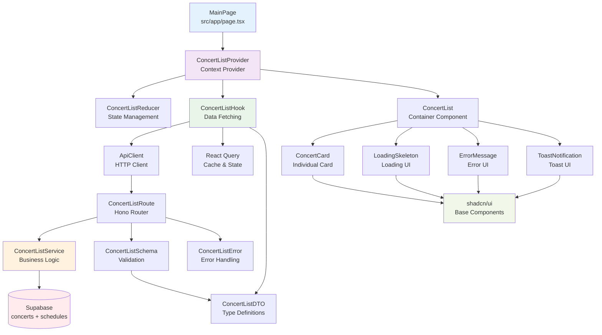

# 유저플로우 001: 메인 페이지 - 콘서트 목록 조회 구현 계획

## 개요

### 구현 목표
- 90초 목표 달성을 위한 첫 번째 단계로서 빠른 콘서트 목록 조회 기능 구현
- Context + useReducer를 사용한 중앙집중식 상태 관리
- 예매 가능한 콘서트만 표시하는 비즈니스 로직 구현
- 반응형 디자인과 접근성을 고려한 UI 컴포넌트

### 모듈 목록

| 모듈명 | 위치 | 타입 | 설명 |
|--------|------|------|------|
| **ConcertListContext** | `src/features/concerts/context/concert-list-context.tsx` | Context | 콘서트 목록 상태 관리 Context Provider |
| **ConcertListReducer** | `src/features/concerts/hooks/use-concert-list-reducer.ts` | Hook | useReducer 기반 상태 관리 로직 |
| **ConcertListService** | `src/features/concerts/backend/service.ts` | Service | 콘서트 목록 조회 비즈니스 로직 |
| **ConcertListRoute** | `src/features/concerts/backend/route.ts` | Route | Hono 라우터 정의 |
| **ConcertListSchema** | `src/features/concerts/backend/schema.ts` | Schema | Zod 스키마 정의 |
| **ConcertListError** | `src/features/concerts/backend/error.ts` | Error | 에러 코드 정의 |
| **ConcertListHook** | `src/features/concerts/hooks/use-concert-list.ts` | Hook | React Query 기반 데이터 페칭 |
| **ConcertListPage** | `src/app/page.tsx` | Page | 메인 페이지 컴포넌트 |
| **ConcertCard** | `src/features/concerts/components/concert-card.tsx` | Component | 개별 콘서트 카드 컴포넌트 |
| **ConcertList** | `src/features/concerts/components/concert-list.tsx` | Component | 콘서트 목록 컨테이너 |
| **LoadingSkeleton** | `src/features/concerts/components/loading-skeleton.tsx` | Component | 로딩 상태 UI |
| **ErrorMessage** | `src/features/concerts/components/error-message.tsx` | Component | 에러 상태 UI |
| **ToastNotification** | `src/components/ui/toast-notification.tsx` | Shared | 토스트 알림 공통 컴포넌트 |
| **ConcertListDTO** | `src/features/concerts/lib/dto.ts` | DTO | 클라이언트 측 타입 재노출 |

---

## Diagram



---

## Implementation Plan

### 1. Backend Layer (우선순위: 높음)

#### 1.1 ConcertListSchema (`src/features/concerts/backend/schema.ts`)
**목적**: API 요청/응답 스키마 정의
```typescript
// 주요 스키마
- ConcertListResponseSchema: 콘서트 목록 응답
- ConcertItemSchema: 개별 콘서트 정보
- ConcertAvailabilitySchema: 예매 가능 여부 응답
```

**Unit Test 포함사항**:
- 유효한 콘서트 데이터 파싱 테스트
- 필수 필드 누락 시 에러 처리 테스트
- 잘못된 데이터 타입 처리 테스트

#### 1.2 ConcertListError (`src/features/concerts/backend/error.ts`)
**목적**: 콘서트 관련 에러 코드 정의
```typescript
// 에러 코드
- CONCERTS_FETCH_ERROR: 목록 조회 실패
- CONCERT_NOT_FOUND: 콘서트 없음
- AVAILABILITY_CHECK_ERROR: 예매 가능 여부 확인 실패
```

#### 1.3 ConcertListService (`src/features/concerts/backend/service.ts`)
**목적**: 콘서트 목록 조회 비즈니스 로직
```typescript
// 주요 함수
- getConcertList(): 예매 가능한 콘서트 목록 조회
- checkConcertAvailability(concertId): 특정 콘서트 예매 가능 여부 확인
```

**Unit Test 포함사항**:
- 정상적인 콘서트 목록 조회 테스트
- 빈 목록 처리 테스트
- 데이터베이스 에러 처리 테스트
- 예매 가능 여부 확인 로직 테스트

#### 1.4 ConcertListRoute (`src/features/concerts/backend/route.ts`)
**목적**: Hono 라우터 정의
```typescript
// 엔드포인트
- GET /api/concerts: 콘서트 목록 조회
- GET /api/concerts/:id/availability: 예매 가능 여부 확인
```

### 2. Frontend State Management (우선순위: 높음)

#### 2.1 ConcertListReducer (`src/features/concerts/hooks/use-concert-list-reducer.ts`)
**목적**: useReducer 기반 상태 관리
```typescript
// 상태 관리
- ConcertListState: 전체 상태 타입
- ConcertListAction: 액션 타입들
- concertListReducer: 리듀서 함수
```

#### 2.2 ConcertListContext (`src/features/concerts/context/concert-list-context.tsx`)
**목적**: Context Provider 구현
```typescript
// Context 제공
- ConcertListContextValue: Context 값 타입
- ConcertListProvider: Provider 컴포넌트
- useConcertListContext: Context 사용 훅
```

#### 2.3 ConcertListHook (`src/features/concerts/hooks/use-concert-list.ts`)
**목적**: React Query 기반 데이터 페칭
```typescript
// 데이터 페칭
- useConcertListQuery: 콘서트 목록 조회
- useConcertAvailabilityQuery: 예매 가능 여부 확인
```

### 3. UI Components (우선순위: 중간)

#### 3.1 ConcertCard (`src/features/concerts/components/concert-card.tsx`)
**목적**: 개별 콘서트 카드 컴포넌트

**QA Sheet**:
| 테스트 케이스 | 예상 결과 | 확인 방법 |
|---------------|-----------|-----------|
| 콘서트 정보 표시 | 제목, 포스터 이미지 정확 표시 | 시각적 확인 |
| 예매하기 버튼 클릭 | 해당 콘서트 예매 페이지로 이동 | URL 변경 확인 |
| 로딩 상태 | 버튼에 스피너 표시 | 시각적 확인 |
| 호버 효과 | 카드 상승 애니메이션 | 마우스 호버 테스트 |
| 접근성 | 키보드 네비게이션 지원 | Tab 키 테스트 |

#### 3.2 ConcertList (`src/features/concerts/components/concert-list.tsx`)
**목적**: 콘서트 목록 컨테이너 컴포넌트

**QA Sheet**:
| 테스트 케이스 | 예상 결과 | 확인 방법 |
|---------------|-----------|-----------|
| 목록 표시 | 콘서트 카드들이 그리드로 표시 | 시각적 확인 |
| 반응형 레이아웃 | 화면 크기별 적절한 열 수 | 브라우저 크기 조정 |
| 빈 목록 처리 | 안내 메시지 표시 | 빈 데이터 테스트 |
| 스크롤 성능 | 부드러운 스크롤링 | 스크롤 테스트 |

#### 3.3 LoadingSkeleton (`src/features/concerts/components/loading-skeleton.tsx`)
**목적**: 로딩 상태 UI

**QA Sheet**:
| 테스트 케이스 | 예상 결과 | 확인 방법 |
|---------------|-----------|-----------|
| 스켈레톤 표시 | 카드 모양의 스켈레톤 UI | 시각적 확인 |
| 애니메이션 | 부드러운 펄스 효과 | 시각적 확인 |
| 반응형 | 화면 크기별 적절한 배치 | 브라우저 크기 조정 |

#### 3.4 ErrorMessage (`src/features/concerts/components/error-message.tsx`)
**목적**: 에러 상태 UI

**QA Sheet**:
| 테스트 케이스 | 예상 결과 | 확인 방법 |
|---------------|-----------|-----------|
| 에러 메시지 표시 | 사용자 친화적 메시지 | 시각적 확인 |
| 재시도 버튼 | 클릭 시 데이터 재요청 | 버튼 클릭 테스트 |
| 에러 타입별 메시지 | 상황별 적절한 안내 | 다양한 에러 시나리오 |

### 4. Page Implementation (우선순위: 중간)

#### 4.1 MainPage (`src/app/page.tsx`)
**목적**: 메인 페이지 구현

**QA Sheet**:
| 테스트 케이스 | 예상 결과 | 확인 방법 |
|---------------|-----------|-----------|
| 페이지 로딩 | 3초 이내 초기 로딩 완료 | 성능 측정 |
| SEO 최적화 | 적절한 메타 태그 설정 | 개발자 도구 확인 |
| 접근성 | ARIA 라벨 및 시맨틱 HTML | 접근성 도구 검사 |

### 5. Shared Components (우선순위: 낮음)

#### 5.1 ToastNotification (`src/components/ui/toast-notification.tsx`)
**목적**: 토스트 알림 공통 컴포넌트

**QA Sheet**:
| 테스트 케이스 | 예상 결과 | 확인 방법 |
|---------------|-----------|-----------|
| 토스트 표시 | 우상단에 알림 표시 | 시각적 확인 |
| 자동 사라짐 | 4초 후 자동 제거 | 타이머 확인 |
| 수동 닫기 | X 버튼 클릭 시 즉시 제거 | 버튼 클릭 테스트 |
| 타입별 스타일 | success/error/warning 색상 | 시각적 확인 |

### 6. DTO Layer (우선순위: 낮음)

#### 6.1 ConcertListDTO (`src/features/concerts/lib/dto.ts`)
**목적**: 클라이언트 측 타입 재노출
```typescript
// 타입 재노출
- Concert: 콘서트 정보 타입
- ConcertListResponse: 목록 응답 타입
- ConcertAvailabilityResponse: 예매 가능 여부 응답 타입
```

---

## 구현 순서

### Phase 1: Backend Foundation (1-2일)
1. ConcertListSchema 구현
2. ConcertListError 구현  
3. ConcertListService 구현
4. ConcertListRoute 구현
5. Backend 단위 테스트 작성

### Phase 2: State Management (1일)
1. ConcertListReducer 구현
2. ConcertListContext 구현
3. ConcertListHook 구현

### Phase 3: UI Components (2-3일)
1. LoadingSkeleton 구현
2. ErrorMessage 구현
3. ConcertCard 구현
4. ConcertList 구현
5. ToastNotification 구현

### Phase 4: Page Integration (1일)
1. MainPage 구현
2. Context Provider 연결
3. 전체 통합 테스트

### Phase 5: QA & Optimization (1일)
1. 성능 최적화
2. 접근성 검증
3. 반응형 테스트
4. 에러 시나리오 테스트

---

## 기술적 고려사항

### 성능 최적화
- React Query 캐싱 전략 (5분 TTL)
- 이미지 지연 로딩 구현
- 메모이제이션 적용 (useMemo, useCallback)

### 접근성
- ARIA 라벨 적용
- 키보드 네비게이션 지원
- 색상 대비 4.5:1 이상 유지

### 에러 처리
- 네트워크 오류 자동 재시도 (최대 3회)
- 사용자 친화적 에러 메시지
- 로딩 상태 명확한 표시

### 테스트 전략
- Backend: Jest 단위 테스트
- Frontend: React Testing Library
- E2E: Playwright (선택사항)

이 구현 계획은 AGENTS.md의 디렉토리 구조를 준수하며, 기존 example 패턴을 따라 확장 가능한 모듈화된 아키텍처를 제공합니다.
