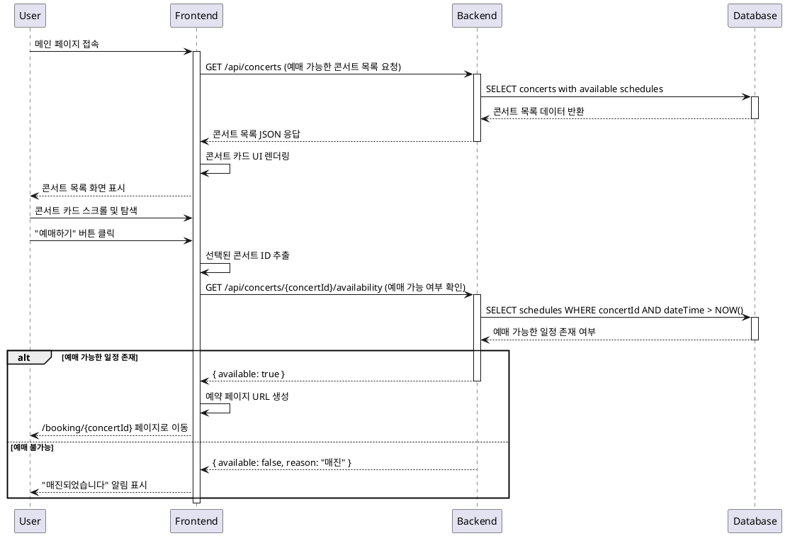

# 
 - 콘서트 목록 조회

## Primary Actor
- **일반 사용자** (콘서트 예매를 원하는 모든 방문자)

## Precondition
- 사용자가 인터넷에 연결된 디바이스를 보유하고 있음
- 웹 브라우저를 통해 콘서트 예매 사이트에 접근 가능함
- 별도의 로그인이나 회원가입 없이 바로 이용 가능함

## Trigger
- 사용자가 콘서트 예매 웹사이트의 메인 URL에 접속
- 다른 페이지에서 "메인으로 돌아가기" 버튼 클릭
- 브라우저 북마크를 통한 직접 접근

## Main Scenario

### 1. 페이지 초기 로드
1. 사용자가 메인 페이지 URL에 접속
2. 시스템이 데이터베이스에서 예매 가능한 콘서트 목록 조회
3. 각 콘서트의 기본 정보(제목, 포스터 이미지, 예매 가능 여부) 로드
4. 콘서트 목록을 카드 형태로 화면에 표시

### 2. 콘서트 목록 탐색
1. 사용자가 페이지를 스크롤하여 콘서트 목록 확인
2. 각 콘서트 카드에서 기본 정보 확인 (제목, 포스터, 예매 상태)
3. 관심 있는 콘서트의 "예매하기" 버튼 식별

### 3. 예매 페이지 이동
1. 사용자가 특정 콘서트의 "예매하기" 버튼 클릭
2. 시스템이 선택된 콘서트 ID 추출 및 유효성 검증
3. 해당 콘서트의 예매 가능 일정 존재 여부 재확인
4. 예약 페이지 URL 생성 및 페이지 이동 (/booking/[concertId])

## Edge Cases

### 데이터 로딩 관련
- **콘서트 목록이 없는 경우**: "현재 예매 가능한 콘서트가 없습니다" 안내 메시지 표시
- **네트워크 오류**: "네트워크 연결을 확인해주세요" 메시지와 함께 재시도 버튼 제공
- **로딩 중**: 스켈레톤 UI 또는 로딩 스피너 표시

### 콘서트 선택 관련
- **예매 불가능한 콘서트 선택**: "예매 기간이 종료되었습니다" 안내 후 메인 페이지 유지
- **서버 오류로 콘서트 정보 조회 실패**: 오류 메시지 표시 및 고객센터 연락처 제공
- **동시 접속자 과부하**: "잠시 후 다시 시도해주세요" 안내 메시지

### 사용자 경험 관련
- **느린 네트워크 환경**: 점진적 로딩으로 기본 정보 우선 표시
- **모바일 디바이스**: 터치 최적화된 카드 레이아웃 제공
- **접근성**: 스크린 리더 지원을 위한 적절한 ARIA 라벨 제공

## Business Rules

### 콘서트 표시 규칙
- 예매 가능한 일정이 하나 이상 있는 콘서트만 표시
- 과거 날짜의 공연은 목록에서 제외
- 콘서트 상태가 'published'인 것만 노출

### 정렬 및 필터링
- 기본 정렬: 공연 날짜 기준 오름차순
- 매진된 콘서트도 표시하되 "매진" 상태 명시
- 최대 20개씩 페이지네이션 적용

### 성능 최적화
- 콘서트 포스터 이미지는 지연 로딩(Lazy Loading) 적용
- 캐싱을 통해 반복 방문 시 빠른 로딩 제공
- CDN을 통한 이미지 최적화 배포

### 데이터 무결성
- 콘서트 정보와 일정 정보의 실시간 동기화
- 예매 가능 여부는 실시간으로 검증
- 잘못된 콘서트 ID 접근 시 404 처리

## Sequence Diagram

## 관련 API 엔드포인트

### GET /api/concerts
- **목적**: 예매 가능한 콘서트 목록 조회
- **응답**: 콘서트 기본 정보 배열 (id, title, posterImageUrl, hasAvailableSchedules)

### GET /api/concerts/{concertId}/availability  
- **목적**: 특정 콘서트의 예매 가능 여부 확인
- **응답**: 예매 가능 여부 및 사유

## 성공 기준
- 페이지 로딩 시간 3초 이내
- 콘서트 목록 정확한 표시
- "예매하기" 버튼 클릭 시 올바른 페이지 이동
- 모든 엣지케이스에 대한 적절한 사용자 안내
