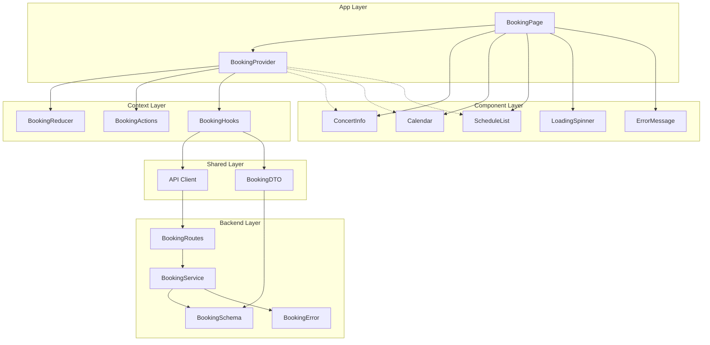
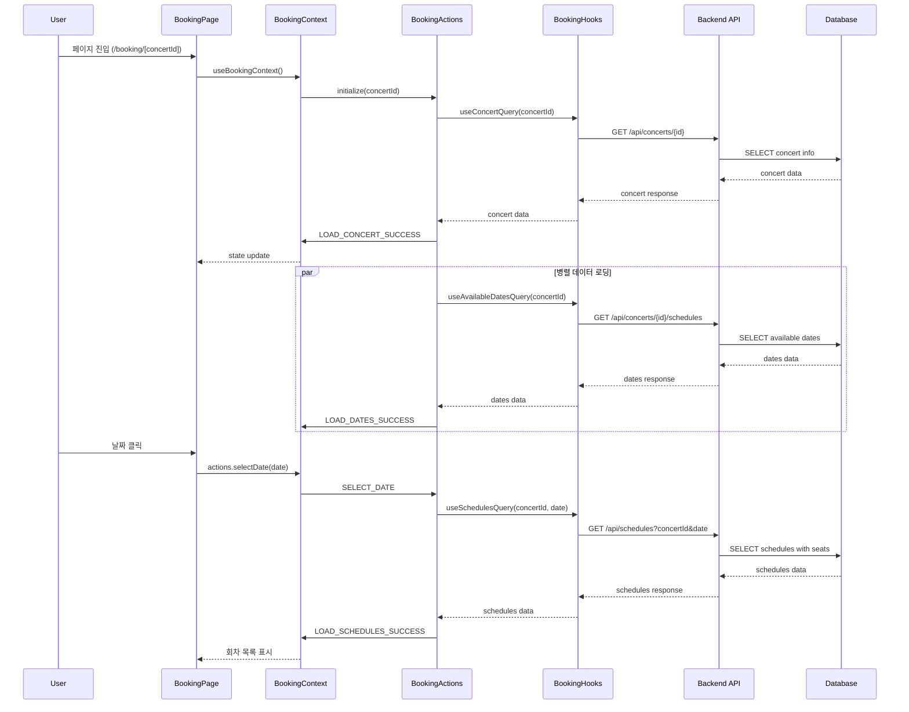
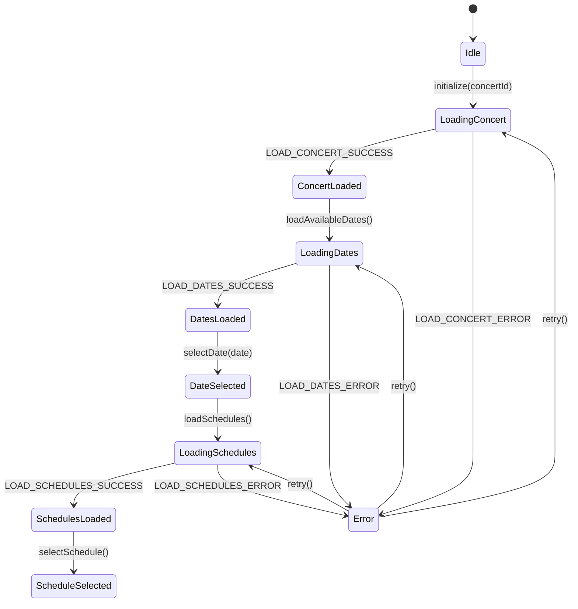

# 구현 계획서: 예약 페이지 - 날짜 선택 기능

## 개요

유저플로우 #2 "예약 페이지 - 날짜 선택" 기능을 구현하기 위한 모듈화 설계입니다. Context + useReducer 패턴을 사용하여 90초 내 예매 완료 목표를 달성하는 효율적이고 직관적인 날짜 선택 기능을 구현합니다.

### 모듈 목록

| 모듈명 | 위치 | 설명 |
|--------|------|------|
| **BookingProvider** | `src/features/booking/context/booking-provider.tsx` | Context + useReducer 기반 상태 관리 |
| **BookingReducer** | `src/features/booking/hooks/use-booking-reducer.ts` | 예약 상태 관리 리듀서 |
| **BookingActions** | `src/features/booking/hooks/use-booking-actions.ts` | 액션 생성자 및 비즈니스 로직 |
| **BookingPage** | `src/app/booking/[concertId]/page.tsx` | 예약 페이지 메인 컴포넌트 |
| **ConcertInfo** | `src/features/booking/components/concert-info.tsx` | 콘서트 기본 정보 표시 |
| **Calendar** | `src/features/booking/components/calendar.tsx` | 날짜 선택 캘린더 |
| **ScheduleList** | `src/features/booking/components/schedule-list.tsx` | 회차 선택 목록 |
| **LoadingSpinner** | `src/components/ui/loading-spinner.tsx` | 공통 로딩 컴포넌트 |
| **ErrorMessage** | `src/components/ui/error-message.tsx` | 공통 에러 메시지 컴포넌트 |
| **BookingService** | `src/features/booking/backend/service.ts` | 예약 관련 비즈니스 로직 |
| **BookingRoutes** | `src/features/booking/backend/route.ts` | Hono API 라우터 |
| **BookingSchema** | `src/features/booking/backend/schema.ts` | Zod 스키마 정의 |
| **BookingError** | `src/features/booking/backend/error.ts` | 에러 코드 정의 |
| **BookingDTO** | `src/features/booking/lib/dto.ts` | 클라이언트 DTO 재노출 |
| **BookingHooks** | `src/features/booking/hooks/use-booking-queries.ts` | React Query 훅 |

---

## Diagram

### 모듈 관계도



### 데이터 플로우



### 상태 관리 구조



---

## Implementation Plan

### 1. Backend Layer

#### 1.1 BookingSchema (`src/features/booking/backend/schema.ts`)
**목적**: API 요청/응답 스키마 정의
```typescript
// 콘서트 정보 스키마
export const ConcertInfoSchema = z.object({
  id: z.string().uuid(),
  title: z.string(),
  description: z.string().nullable(),
  posterImageUrl: z.string().url(),
});

// 예매 가능한 날짜 스키마
export const AvailableDatesSchema = z.object({
  dates: z.array(z.string().date()),
});

// 회차 정보 스키마
export const ScheduleSchema = z.object({
  id: z.string().uuid(),
  dateTime: z.string().datetime(),
  availableSeats: z.number().int().min(0),
  totalSeats: z.number().int().min(0),
});
```

**Unit Tests**:
- 유효한 데이터 파싱 테스트
- 잘못된 형식 데이터 검증 테스트
- 경계값 테스트 (빈 배열, null 값 등)

#### 1.2 BookingService (`src/features/booking/backend/service.ts`)
**목적**: Supabase 데이터 접근 및 비즈니스 로직
```typescript
export const getConcertInfo = async (
  client: SupabaseClient,
  concertId: string
): Promise<HandlerResult<ConcertInfo, BookingServiceError>> => {
  // 콘서트 기본 정보 조회
};

export const getAvailableDates = async (
  client: SupabaseClient,
  concertId: string
): Promise<HandlerResult<AvailableDates, BookingServiceError>> => {
  // 예매 가능한 날짜 조회
};

export const getSchedulesByDate = async (
  client: SupabaseClient,
  concertId: string,
  date: string
): Promise<HandlerResult<Schedule[], BookingServiceError>> => {
  // 특정 날짜의 회차 정보 조회
};
```

**Unit Tests**:
- 정상 데이터 조회 테스트
- 존재하지 않는 ID 처리 테스트
- 데이터베이스 오류 처리 테스트
- 캐시 동작 테스트

#### 1.3 BookingRoutes (`src/features/booking/backend/route.ts`)
**목적**: Hono API 엔드포인트 정의
```typescript
export const registerBookingRoutes = (app: Hono<AppEnv>) => {
  app.get('/api/concerts/:id', getConcertHandler);
  app.get('/api/concerts/:id/schedules', getAvailableDatesHandler);
  app.get('/api/schedules', getSchedulesByDateHandler);
};
```

**Unit Tests**:
- 각 엔드포인트 응답 테스트
- 파라미터 검증 테스트
- 에러 응답 형식 테스트

### 2. Frontend State Management

#### 2.1 BookingReducer (`src/features/booking/hooks/use-booking-reducer.ts`)
**목적**: 예약 상태 관리 리듀서
```typescript
export interface BookingState {
  meta: {
    concertId: string | null;
    isInitialized: boolean;
  };
  loading: {
    concert: boolean;
    dates: boolean;
    schedules: boolean;
  };
  data: {
    concertInfo: ConcertInfo | null;
    availableDates: Date[];
    schedules: Schedule[];
  };
  selection: {
    selectedDate: Date | null;
    selectedSchedule: Schedule | null;
  };
  errors: {
    concert: string | null;
    dates: string | null;
    schedules: string | null;
  };
}

export type BookingAction = 
  | { type: 'INITIALIZE'; payload: { concertId: string } }
  | { type: 'LOAD_CONCERT_SUCCESS'; payload: ConcertInfo }
  | { type: 'SELECT_DATE'; payload: Date }
  // ... 기타 액션들
```

**Unit Tests**:
- 각 액션별 상태 변화 테스트
- 불변성 유지 테스트
- 초기 상태 테스트

#### 2.2 BookingActions (`src/features/booking/hooks/use-booking-actions.ts`)
**목적**: 액션 생성자 및 비동기 로직
```typescript
export const useBookingActions = (dispatch: Dispatch<BookingAction>) => {
  const loadConcert = useCallback(async (concertId: string) => {
    dispatch({ type: 'LOAD_CONCERT_START' });
    try {
      const data = await apiClient.get(`/api/concerts/${concertId}`);
      dispatch({ type: 'LOAD_CONCERT_SUCCESS', payload: data });
    } catch (error) {
      dispatch({ type: 'LOAD_CONCERT_ERROR', payload: error.message });
    }
  }, [dispatch]);

  return { loadConcert, /* ... 기타 액션들 */ };
};
```

**Unit Tests**:
- 성공 시나리오 테스트
- 실패 시나리오 테스트
- 네트워크 오류 처리 테스트

#### 2.3 BookingProvider (`src/features/booking/context/booking-provider.tsx`)
**목적**: Context Provider 구현
```typescript
export const BookingProvider = ({ 
  children, 
  concertId 
}: BookingProviderProps) => {
  const [state, dispatch] = useReducer(bookingReducer, initialState);
  const actions = useBookingActions(dispatch);
  
  useEffect(() => {
    if (concertId) {
      actions.initialize(concertId);
    }
  }, [concertId]);

  return (
    <BookingContext.Provider value={{ state, actions }}>
      {children}
    </BookingContext.Provider>
  );
};
```

### 3. UI Components

#### 3.1 Calendar (`src/features/booking/components/calendar.tsx`)
**목적**: 날짜 선택 캘린더 컴포넌트
```typescript
export const Calendar = () => {
  const { state, actions } = useBookingContext();
  
  return (
    <div className="calendar-container">
      <CalendarHeader />
      <CalendarGrid 
        availableDates={state.data.availableDates}
        selectedDate={state.selection.selectedDate}
        onDateSelect={actions.selectDate}
      />
    </div>
  );
};
```

**QA Sheet**:
- [ ] 예매 가능한 날짜가 Primary Color로 표시되는가?
- [ ] 과거 날짜는 비활성화되어 있는가?
- [ ] 선택된 날짜가 하이라이트되는가?
- [ ] 모바일에서 터치 친화적인가? (최소 44px)
- [ ] 키보드 네비게이션이 작동하는가?
- [ ] 스크린 리더 호환성이 있는가?

#### 3.2 ScheduleList (`src/features/booking/components/schedule-list.tsx`)
**목적**: 회차 선택 목록 컴포넌트
```typescript
export const ScheduleList = () => {
  const { state, actions } = useBookingContext();
  
  if (!state.selection.selectedDate) return null;
  
  return (
    <div className="schedule-list">
      {state.data.schedules.map(schedule => (
        <ScheduleCard 
          key={schedule.id}
          schedule={schedule}
          isSelected={state.selection.selectedSchedule?.id === schedule.id}
          onSelect={actions.selectSchedule}
        />
      ))}
    </div>
  );
};
```

**QA Sheet**:
- [ ] 날짜 선택 후에만 표시되는가?
- [ ] 회차가 시간순으로 정렬되어 있는가?
- [ ] 매진된 회차가 비활성화되어 있는가?
- [ ] 잔여 좌석 수가 정확히 표시되는가?
- [ ] 선택된 회차가 체크 아이콘과 함께 표시되는가?

#### 3.3 ConcertInfo (`src/features/booking/components/concert-info.tsx`)
**목적**: 콘서트 기본 정보 표시
```typescript
export const ConcertInfo = () => {
  const { state } = useBookingContext();
  
  if (state.loading.concert) {
    return <ConcertInfoSkeleton />;
  }
  
  if (!state.data.concertInfo) {
    return <ErrorMessage message="콘서트 정보를 불러올 수 없습니다." />;
  }
  
  return (
    <Card>
      <CardContent>
        
        <h1>{state.data.concertInfo.title}</h1>
        <p>{state.data.concertInfo.description}</p>
      </CardContent>
    </Card>
  );
};
```

**QA Sheet**:
- [ ] 로딩 중 스켈레톤 UI가 표시되는가?
- [ ] 포스터 이미지가 16:9 비율로 표시되는가?
- [ ] 에러 상태가 적절히 처리되는가?
- [ ] 반응형 디자인이 적용되어 있는가?

### 4. Shared Components

#### 4.1 LoadingSpinner (`src/components/ui/loading-spinner.tsx`)
**목적**: 공통 로딩 컴포넌트
```typescript
export const LoadingSpinner = ({ 
  size = 'default',
  className 
}: LoadingSpinnerProps) => {
  return (
    <div className={cn('animate-spin', sizeVariants[size], className)}>
      <Loader2 className="h-full w-full" />
    </div>
  );
};
```

#### 4.2 ErrorMessage (`src/components/ui/error-message.tsx`)
**목적**: 공통 에러 메시지 컴포넌트
```typescript
export const ErrorMessage = ({ 
  message, 
  onRetry,
  className 
}: ErrorMessageProps) => {
  return (
    <Card className={cn('border-destructive', className)}>
      <CardContent className="flex items-center gap-4 p-6">
        <AlertCircle className="h-5 w-5 text-destructive" />
        <div className="flex-1">
          <p className="text-sm text-destructive">{message}</p>
        </div>
        {onRetry && (
          <Button variant="outline" size="sm" onClick={onRetry}>
            재시도
          </Button>
        )}
      </CardContent>
    </Card>
  );
};
```

### 5. Page Component

#### 5.1 BookingPage (`src/app/booking/[concertId]/page.tsx`)
**목적**: 예약 페이지 메인 컴포넌트
```typescript
export default async function BookingPage({ 
  params 
}: { 
  params: Promise<{ concertId: string }> 
}) {
  const { concertId } = await params;
  
  return (
    <BookingProvider concertId={concertId}>
      <div className="booking-page">
        <ConcertInfo />
        <div className="booking-content">
          <Calendar />
          <ScheduleList />
        </div>
      </div>
    </BookingProvider>
  );
}
```

**QA Sheet**:
- [ ] URL 파라미터가 올바르게 전달되는가?
- [ ] 유효하지 않은 concertId 처리가 되는가?
- [ ] 반응형 레이아웃이 적용되어 있는가?
- [ ] 로딩 상태가 적절히 표시되는가?

### 6. React Query Integration

#### 6.1 BookingHooks (`src/features/booking/hooks/use-booking-queries.ts`)
**목적**: React Query 훅 정의
```typescript
export const useConcertQuery = (concertId: string) => {
  return useQuery({
    queryKey: ['concert', concertId],
    queryFn: () => fetchConcert(concertId),
    staleTime: 5 * 60 * 1000, // 5분
    enabled: !!concertId,
  });
};

export const useAvailableDatesQuery = (concertId: string) => {
  return useQuery({
    queryKey: ['availableDates', concertId],
    queryFn: () => fetchAvailableDates(concertId),
    staleTime: 5 * 60 * 1000,
    enabled: !!concertId,
  });
};

export const useSchedulesQuery = (concertId: string, date: string | null) => {
  return useQuery({
    queryKey: ['schedules', concertId, date],
    queryFn: () => fetchSchedules(concertId, date!),
    enabled: !!concertId && !!date,
  });
};
```

---

## 성능 최적화 전략

### 1. 메모이제이션
- `useCallback`으로 액션 함수 메모이제이션
- `useMemo`로 계산된 값 메모이제이션
- `React.memo`로 컴포넌트 리렌더링 최적화

### 2. 데이터 캐싱
- React Query로 API 응답 캐싱 (5분)
- 브라우저 세션 스토리지로 선택 상태 유지

### 3. 코드 스플리팅
- 동적 import로 컴포넌트 지연 로딩
- Next.js 자동 코드 스플리팅 활용

### 4. 이미지 최적화
- Next.js Image 컴포넌트 사용
- 적절한 이미지 크기 및 형식 사용

---

## 테스트 전략

### 1. Unit Tests
- 리듀서 로직 테스트
- 서비스 함수 테스트
- 유틸리티 함수 테스트

### 2. Integration Tests
- Context Provider 테스트
- API 엔드포인트 테스트
- 컴포넌트 상호작용 테스트

### 3. E2E Tests
- 전체 예매 플로우 테스트
- 에러 시나리오 테스트
- 성능 테스트

---

## 구현 순서

1. **Backend Layer** (1-2일)
   - Schema, Service, Routes, Error 구현
   - Unit Tests 작성

2. **State Management** (1일)
   - Reducer, Actions, Provider 구현
   - Unit Tests 작성

3. **Shared Components** (0.5일)
   - LoadingSpinner, ErrorMessage 구현

4. **UI Components** (2-3일)
   - ConcertInfo, Calendar, ScheduleList 구현
   - QA Sheet 검증

5. **Page Integration** (0.5일)
   - BookingPage 구현 및 통합

6. **Testing & Optimization** (1일)
   - Integration Tests 작성
   - 성능 최적화 적용

**총 예상 기간**: 5-7일

이 계획서는 90초 내 예매 완료 목표를 달성하기 위한 효율적이고 확장 가능한 아키텍처를 제공하며, 코드베이스의 기존 패턴과 일관성을 유지합니다.
