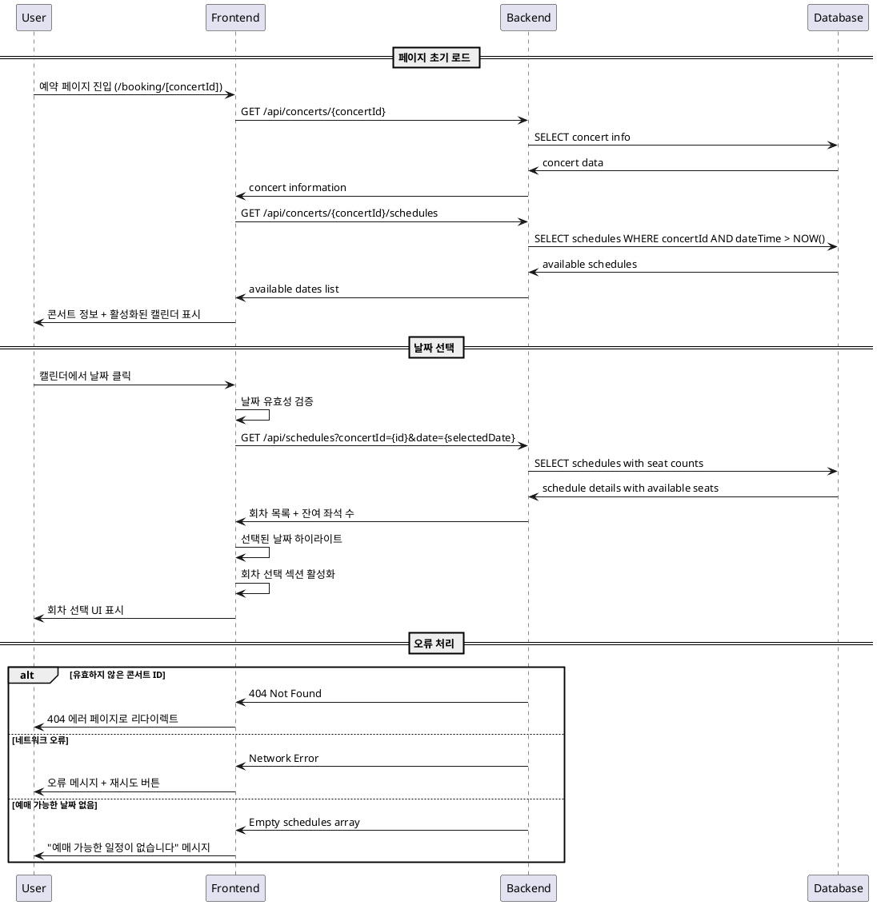

# 유스케이스 명세서: 예약 페이지 - 날짜 선택

## 1. 기본 정보

- **유스케이스 ID**: UC-002
- **유스케이스 명**: 예약 페이지에서 콘서트 날짜 선택
- **작성일**: 2025-10-14
- **버전**: 1.0

## 2. 유스케이스 개요

### Primary Actor
- **일반 사용자**: 콘서트 예매를 원하는 모든 사용자 (회원가입 불필요)

### Precondition
- 사용자가 메인 페이지에서 특정 콘서트의 "예매하기" 버튼을 클릭하여 예약 페이지에 진입한 상태
- 유효한 콘서트 ID가 URL 파라미터로 전달된 상태
- 해당 콘서트에 예매 가능한 일정이 최소 1개 이상 존재

### Trigger
- 사용자가 예약 페이지(`/booking/[concertId]`)에 진입
- 캘린더에서 특정 날짜를 클릭

## 3. Main Scenario

### 3.1 페이지 초기 로드
1. **시스템**이 URL에서 `concertId`를 추출하고 유효성을 검증한다
2. **시스템**이 콘서트 기본 정보(제목, 포스터, 설명)를 데이터베이스에서 조회한다
3. **시스템**이 해당 콘서트의 모든 예매 가능한 일정을 조회한다
   - 현재 날짜 이후의 일정만 필터링
   - 날짜별로 그룹화하여 캘린더 활성 날짜 목록 생성
4. **시스템**이 콘서트 정보와 활성화된 날짜가 표시된 캘린더를 사용자에게 제공한다

### 3.2 날짜 선택
1. **사용자**가 캘린더에서 예매 가능한 날짜를 클릭한다
2. **시스템**이 선택된 날짜의 유효성을 검증한다
   - 과거 날짜가 아닌지 확인
   - 예매 가능한 날짜인지 확인
3. **시스템**이 해당 날짜의 회차 정보를 조회한다
   - Schedule 테이블에서 선택된 날짜의 모든 회차 조회
   - 각 회차별 잔여 좌석 수 계산
4. **시스템**이 선택된 날짜를 하이라이트하고 회차 선택 섹션을 활성화한다
5. **시스템**이 선택된 날짜 정보를 세션에 임시 저장한다

## 4. Edge Cases

### 4.1 데이터 관련 오류
- **유효하지 않은 콘서트 ID**: 404 에러 페이지로 리다이렉트
- **예매 가능한 날짜가 없는 경우**: "현재 예매 가능한 일정이 없습니다" 메시지 표시
- **콘서트 정보 조회 실패**: 오류 메시지와 함께 재시도 버튼 제공

### 4.2 사용자 입력 오류
- **과거 날짜 클릭**: "선택할 수 없는 날짜입니다" 툴팁 표시
- **비활성화된 날짜 클릭**: "해당 날짜는 예매가 불가능합니다" 안내

### 4.3 시스템 오류
- **네트워크 오류**: "네트워크 연결을 확인해주세요" 메시지와 재시도 버튼
- **서버 응답 지연**: 로딩 인디케이터 표시 (3초 이상 시 타임아웃 안내)

## 5. Business Rules

### 5.1 날짜 선택 규칙
- 현재 날짜 이후의 날짜만 선택 가능
- 예매 가능한 회차가 있는 날짜만 활성화
- 매진된 날짜도 표시하되 비활성화 상태로 구분

### 5.2 데이터 표시 규칙
- 콘서트 포스터는 16:9 비율로 표시
- 캘린더는 현재 월부터 최대 6개월까지 표시
- 예매 가능한 날짜는 Primary Color(#5C6BFF)로 하이라이트

### 5.3 성능 규칙
- 페이지 초기 로드는 3초 이내 완료
- 날짜 클릭 후 회차 정보 로드는 1초 이내 완료
- 캘린더 네비게이션은 즉시 반응

## 6. Sequence Diagram

## 7. 후속 액션

### 성공 시
- 회차 선택 섹션이 활성화되어 다음 단계(회차 선택)로 진행 가능
- 선택된 날짜 정보가 세션에 저장되어 페이지 새로고침 시에도 유지

### 실패 시
- 적절한 오류 메시지 표시 후 사용자가 다시 시도할 수 있도록 안내
- 심각한 오류의 경우 메인 페이지로 돌아가기 옵션 제공

## 8. 관련 테이블

- **concerts**: 콘서트 기본 정보 조회
- **schedules**: 예매 가능한 일정 조회
- **seats**: 회차별 잔여 좌석 수 계산용

## 9. API 엔드포인트

- `GET /api/concerts/{concertId}`: 콘서트 기본 정보 조회
- `GET /api/concerts/{concertId}/schedules`: 예매 가능한 날짜 목록 조회
- `GET /api/schedules?concertId={id}&date={date}`: 특정 날짜의 회차 정보 조회
