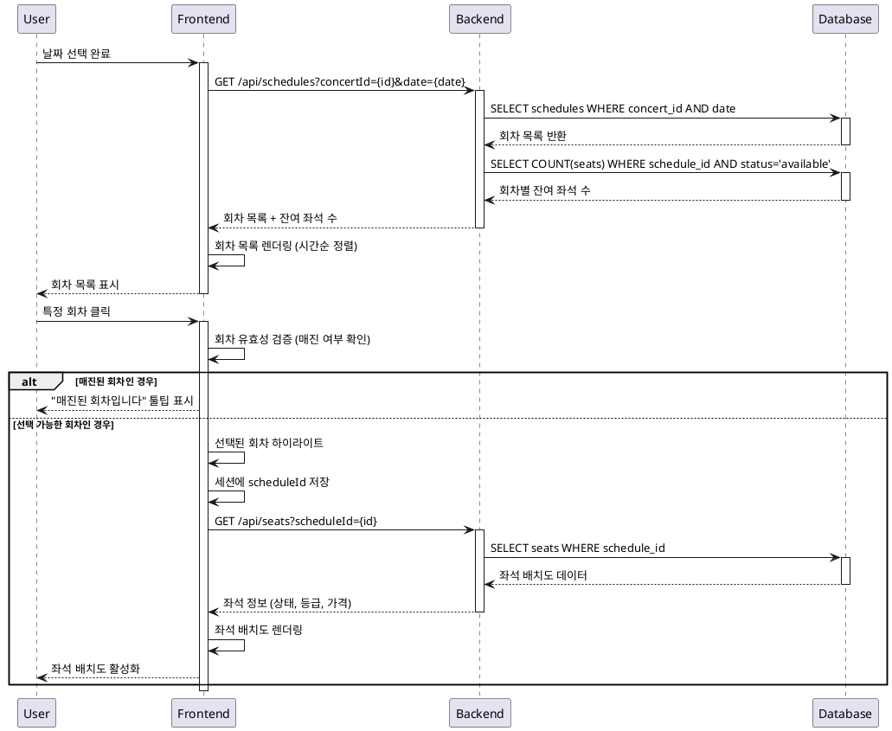

# 유스케이스 명세서 - 회차 선택

## 기본 정보

- **유스케이스 ID**: UC-003
- **유스케이스 명**: 예약 페이지 - 회차 선택
- **Primary Actor**: 콘서트 예매 사용자
- **Secondary Actor**: 시스템 (백엔드 서버, 데이터베이스)

## Precondition (전제 조건)

- 사용자가 예약 페이지에 진입한 상태
- 콘서트 날짜가 이미 선택된 상태
- 선택된 날짜에 예매 가능한 회차가 1개 이상 존재
- 사용자의 브라우저가 정상적으로 작동하는 상태

## Trigger (트리거)

- 사용자가 날짜 선택을 완료한 후 회차 목록이 화면에 표시됨
- 사용자가 특정 회차(시간)를 클릭

## Main Scenario (주요 시나리오)

### 1. 회차 목록 표시
1. 시스템이 선택된 날짜를 기반으로 Schedule 테이블에서 해당 날짜의 모든 회차를 조회
2. 각 회차별 시간 정보를 추출 (dateTime 필드에서 시간 부분)
3. 각 회차별 잔여 좌석 수를 계산 (Seat 테이블과 조인하여 status='available' 카운트)
4. 매진된 회차를 식별 (잔여 좌석 수가 0인 경우)
5. 회차 목록을 시간순으로 정렬하여 화면에 표시

### 2. 회차 선택
1. 사용자가 원하는 회차를 클릭
2. 시스템이 선택된 회차의 유효성을 검증 (매진 여부, 시간 유효성 확인)
3. 해당 회차의 scheduleId를 추출
4. 좌석 배치도 데이터를 조회 (Seat 테이블에서 scheduleId 기준으로 모든 좌석 정보)
5. 좌석별 상태 정보 (available/reserved) 및 등급, 가격 정보를 로드
6. 선택된 회차 정보를 세션/로컬스토리지에 저장
7. 회차가 하이라이트되고 좌석 배치도 섹션이 활성화됨

### 3. 좌석 배치도 활성화
1. 좌석 배치도에 실시간 좌석 현황이 표시됨
2. 좌석 선택 단계로 자동 진행

## Edge Cases (예외 상황)

### E1. 회차 없음
- **상황**: 선택된 날짜에 예매 가능한 회차가 없는 경우
- **처리**: "해당 날짜에 예매 가능한 회차가 없습니다" 안내 메시지 표시

### E2. 전체 회차 매진
- **상황**: 모든 회차가 매진인 경우
- **처리**: 매진 안내 메시지 표시 및 다른 날짜 선택 유도

### E3. 매진 회차 선택 시도
- **상황**: 사용자가 매진된 회차를 클릭한 경우
- **처리**: "매진된 회차입니다" 안내 툴팁 표시 및 선택 불가 처리

### E4. 좌석 데이터 로드 실패
- **상황**: 네트워크 오류로 좌석 정보를 불러올 수 없는 경우
- **처리**: "좌석 정보를 불러올 수 없습니다. 다시 시도해주세요" 메시지와 재시도 버튼 제공

### E5. 날짜 미선택 상태
- **상황**: 날짜가 선택되지 않은 상태에서 회차 섹션에 접근한 경우
- **처리**: "먼저 날짜를 선택해주세요" 안내 메시지 표시

### E6. 로딩 중 상태
- **상황**: 회차 정보를 로딩하는 동안
- **처리**: 로딩 인디케이터 표시 및 사용자 인터랙션 일시 차단

## Business Rules (비즈니스 규칙)

### BR1. 회차 표시 규칙
- 현재 시간 이후의 회차만 표시
- 회차는 시간순으로 정렬하여 표시
- 매진된 회차는 시각적으로 구분하여 표시 (비활성화 상태)

### BR2. 좌석 수 계산 규칙
- 잔여 좌석 수 = 전체 좌석 수 - 예약된 좌석 수 (status='reserved')
- 실시간으로 좌석 상태를 반영하여 정확한 잔여 수량 표시

### BR3. 회차 선택 제한 규칙
- 매진된 회차는 선택 불가
- 과거 시간의 회차는 표시하지 않음
- 한 번에 하나의 회차만 선택 가능

### BR4. 데이터 동기화 규칙
- 회차별 잔여 좌석 수는 실시간으로 업데이트
- 다른 사용자의 예약으로 인한 좌석 수 변동을 즉시 반영

## PlantUML Sequence Diagram

## Post-condition (후속 조건)

- 회차가 성공적으로 선택된 경우 좌석 배치도가 활성화됨
- 선택된 회차 정보가 세션에 저장됨
- 사용자가 좌석 선택 단계로 진행할 수 있는 상태가 됨
- 선택된 회차의 실시간 좌석 현황이 표시됨

## 성능 요구사항

- 회차 목록 로딩 시간: 2초 이내
- 회차 선택 후 좌석 배치도 표시: 3초 이내
- 실시간 좌석 수 업데이트 주기: 5초 간격

## 접근성 요구사항

- 키보드 네비게이션으로 회차 선택 가능
- 스크린 리더를 위한 적절한 ARIA 라벨 제공
- 매진 상태를 색상 외에도 텍스트로 명시
- 충분한 색상 대비 비율 유지 (4.5:1 이상)
