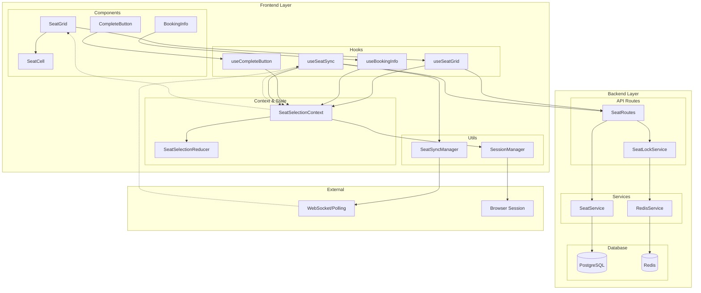

# 유저플로우 #4: 예약 페이지 - 좌석 선택 구현 계획

## 개요

본 문서는 VMC3 콘서트 예매 시스템의 **유저플로우 #4: 예약 페이지 - 좌석 선택** 기능을 구현하기 위한 모듈화 설계 및 구현 계획을 정의합니다.

### 핵심 목표
- **신속성**: 회차 선택 후 2초 이내 좌석 배치도 렌더링
- **직관성**: 좌석 상태를 색상과 아이콘으로 명확히 구분
- **실시간성**: 다른 사용자의 예약으로 인한 좌석 상태 변화 즉시 반영
- **정확성**: 동시 예약 시도 시 충돌 방지 및 데이터 일관성 보장
- **접근성**: 키보드 네비게이션과 스크린 리더 완전 지원

---

## 모듈 개요

| 모듈 | 위치 | 설명 |
|------|------|------|
| **SeatSelectionContext** | `src/features/booking/context/seat-selection-context.tsx` | 좌석 선택 상태 관리 Context Provider |
| **SeatSelectionReducer** | `src/features/booking/hooks/use-seat-selection-reducer.ts` | 좌석 선택 상태 관리 Reducer 및 Actions |
| **SeatGrid** | `src/features/booking/components/seat-grid.tsx` | SVG 기반 좌석 배치도 렌더링 컴포넌트 |
| **SeatCell** | `src/features/booking/components/seat-cell.tsx` | 개별 좌석 셀 컴포넌트 |
| **BookingInfo** | `src/features/booking/components/booking-info.tsx` | 선택된 좌석 정보 및 가격 표시 패널 |
| **CompleteButton** | `src/features/booking/components/complete-button.tsx` | 좌석 선택 완료 버튼 |
| **SeatSyncManager** | `src/features/booking/lib/seat-sync-manager.ts` | 실시간 좌석 상태 동기화 관리 |
| **SeatLockService** | `src/features/booking/backend/seat-lock-service.ts` | Redis 기반 좌석 락 시스템 |
| **SeatAPI** | `src/features/booking/backend/seat-routes.ts` | 좌석 관련 API 엔드포인트 |
| **SeatHooks** | `src/features/booking/hooks/use-seat-*.ts` | 좌석 선택 관련 커스텀 훅들 |

---

## Diagram



---

## Implementation Plan

### 1. Core State Management (우선순위: 높음)

#### 1.1 SeatSelectionContext
**위치**: `src/features/booking/context/seat-selection-context.tsx`

**목적**: 좌석 선택 관련 모든 상태와 액션을 중앙 집중 관리

**구현 내용**:
```typescript
// Context Provider 구현
interface SeatSelectionContextValue {
  // State
  state: SeatSelectionState;
  
  // Core Actions
  actions: {
    loadSeats: (scheduleId: string) => Promise<void>;
    selectSeat: (seat: Seat) => void;
    deselectSeat: (seatId: string) => void;
    clearSelection: () => void;
    toggleSeatSelection: (seat: Seat) => void;
  };
  
  // Sync Actions
  syncActions: {
    startPolling: () => void;
    stopPolling: () => void;
    forceSync: () => Promise<void>;
    handleConflict: (conflictSeats: string[]) => void;
  };
  
  // UI Actions
  uiActions: {
    setFocus: (seatId: string | null) => void;
    showTooltip: (tooltip: TooltipState) => void;
    hideTooltip: () => void;
    showAlert: (alert: AlertState) => void;
    hideAlert: () => void;
  };
  
  // Selectors
  selectors: {
    totalPrice: number;
    selectedSeatCount: number;
    availableSeatCount: number;
    isMaxSeatsSelected: boolean;
    canCompleteSelection: boolean;
  };
}
```

**QA Sheet**:
- [ ] Context Provider가 올바르게 초기화되는가?
- [ ] 하위 컴포넌트에서 Context 값에 접근할 수 있는가?
- [ ] 상태 변경 시 필요한 컴포넌트만 리렌더링되는가?
- [ ] 메모리 누수 없이 정리되는가?

#### 1.2 SeatSelectionReducer
**위치**: `src/features/booking/hooks/use-seat-selection-reducer.ts`

**목적**: 복잡한 좌석 선택 상태 로직을 예측 가능하게 관리

**구현 내용**:
```typescript
// State Interface
interface SeatSelectionState {
  core: {
    selectedSeats: Seat[];
    seatLayoutData: Seat[];
    scheduleId: string;
    isLoading: boolean;
    error: string | null;
  };
  
  ui: {
    focusedSeatId: string | null;
    showTooltip: TooltipState | null;
    showAlert: AlertState | null;
    isCompleteButtonEnabled: boolean;
  };
  
  sync: {
    pollingActive: boolean;
    lastSyncTime: number | null;
    conflictSeats: string[];
    connectionStatus: ConnectionStatus;
    retryCount: number;
  };
  
  session: {
    holdExpiry: number | null;
    sessionId: string;
    lastActivity: number;
    autoSaveEnabled: boolean;
  };
}

// Action Types
type SeatSelectionAction =
  | { type: 'LOAD_SEATS_START'; payload: { scheduleId: string } }
  | { type: 'LOAD_SEATS_SUCCESS'; payload: { seats: Seat[] } }
  | { type: 'SELECT_SEAT'; payload: { seat: Seat } }
  | { type: 'DESELECT_SEAT'; payload: { seatId: string } }
  | { type: 'SYNC_SEATS_SUCCESS'; payload: { seats: Seat[]; timestamp: number } }
  | { type: 'CONFLICT_DETECTED'; payload: { conflictSeats: string[] } }
  // ... 기타 액션들
```

**Unit Tests**:
```typescript
describe('SeatSelectionReducer', () => {
  test('좌석 선택 시 상태가 올바르게 업데이트되는가', () => {
    const initialState = createInitialState();
    const seat = createMockSeat();
    const action = { type: 'SELECT_SEAT', payload: { seat } };
    
    const newState = seatSelectionReducer(initialState, action);
    
    expect(newState.core.selectedSeats).toContain(seat);
    expect(newState.ui.isCompleteButtonEnabled).toBe(true);
  });
  
  test('최대 4석 제한이 올바르게 동작하는가', () => {
    const stateWith4Seats = createStateWithSeats(4);
    const newSeat = createMockSeat();
    const action = { type: 'SELECT_SEAT', payload: { seat: newSeat } };
    
    const newState = seatSelectionReducer(stateWith4Seats, action);
    
    expect(newState.core.selectedSeats).toHaveLength(4);
    expect(newState.ui.showAlert?.message).toContain('최대 4석');
  });
  
  test('충돌 감지 시 선택된 좌석이 해제되는가', () => {
    const stateWithSelectedSeats = createStateWithSelectedSeats(['seat1', 'seat2']);
    const action = { type: 'CONFLICT_DETECTED', payload: { conflictSeats: ['seat1'] } };
    
    const newState = seatSelectionReducer(stateWithSelectedSeats, action);
    
    expect(newState.core.selectedSeats).not.toContain('seat1');
    expect(newState.sync.conflictSeats).toContain('seat1');
  });
});
```

### 2. UI Components (우선순위: 높음)

#### 2.1 SeatGrid
**위치**: `src/features/booking/components/seat-grid.tsx`

**목적**: SVG 기반 좌석 배치도 렌더링 및 사용자 인터랙션 처리

**구현 내용**:
```typescript
interface SeatGridProps {
  seats: Seat[];
  selectedSeats: string[];
  conflictSeats: string[];
  onSeatClick: (seat: Seat) => void;
  onSeatHover: (seat: Seat | null) => void;
  className?: string;
}

export const SeatGrid = memo<SeatGridProps>(({ 
  seats, 
  selectedSeats, 
  conflictSeats,
  onSeatClick,
  onSeatHover,
  className 
}) => {
  // 좌석을 행별로 그룹화
  const seatsByRow = useMemo(() => groupSeatsByRow(seats), [seats]);
  
  // 키보드 네비게이션 처리
  const handleKeyDown = useCallback((event: KeyboardEvent, seat: Seat) => {
    switch (event.key) {
      case 'Enter':
      case ' ':
        event.preventDefault();
        onSeatClick(seat);
        break;
      case 'ArrowUp':
      case 'ArrowDown':
      case 'ArrowLeft':
      case 'ArrowRight':
        event.preventDefault();
        handleArrowNavigation(event.key, seat);
        break;
    }
  }, [onSeatClick]);
  
  return (
    <div className={cn("seat-grid", className)} role="grid" aria-label="좌석 배치도">
      <div className="stage-indicator">
        <div className="stage">STAGE</div>
      </div>
      
      {seatsByRow.map((row) => (
        <SeatRow
          key={row.rowName}
          row={row}
          selectedSeats={selectedSeats}
          conflictSeats={conflictSeats}
          onSeatClick={onSeatClick}
          onSeatHover={onSeatHover}
          onKeyDown={handleKeyDown}
        />
      ))}
      
      <SeatLegend />
    </div>
  );
});
```

**QA Sheet**:
- [ ] 좌석 배치도가 올바르게 렌더링되는가?
- [ ] 좌석 클릭 시 선택/해제가 즉시 반영되는가?
- [ ] 키보드 네비게이션이 올바르게 동작하는가?
- [ ] 스크린 리더에서 좌석 정보가 올바르게 읽히는가?
- [ ] 1000석 규모에서 60fps를 유지하는가?
- [ ] 모바일에서 터치 인터랙션이 원활한가?

#### 2.2 SeatCell
**위치**: `src/features/booking/components/seat-cell.tsx`

**목적**: 개별 좌석의 시각적 표현 및 상태 관리

**구현 내용**:
```typescript
interface SeatCellProps {
  seat: Seat;
  isSelected: boolean;
  isConflict: boolean;
  isFocused: boolean;
  onClick: (seat: Seat) => void;
  onHover: (seat: Seat | null) => void;
  onKeyDown: (event: KeyboardEvent, seat: Seat) => void;
}

export const SeatCell = memo<SeatCellProps>(({
  seat,
  isSelected,
  isConflict,
  isFocused,
  onClick,
  onHover,
  onKeyDown
}) => {
  const seatStatus = getSeatStatus(seat, isSelected, isConflict);
  const seatClassName = getSeatClassName(seatStatus, seat.grade);
  const ariaLabel = getSeatAriaLabel(seat, seatStatus);
  
  return (
    <button
      className={cn("seat-cell", seatClassName, {
        "seat-cell--focused": isFocused,
        "seat-cell--conflict": isConflict,
      })}
      onClick={() => onClick(seat)}
      onMouseEnter={() => onHover(seat)}
      onMouseLeave={() => onHover(null)}
      onKeyDown={(e) => onKeyDown(e, seat)}
      disabled={seat.status === 'reserved'}
      aria-label={ariaLabel}
      aria-pressed={isSelected}
      role="gridcell"
      tabIndex={isFocused ? 0 : -1}
    >
      <span className="seat-number">{seat.seatNumber}</span>
      {isSelected && <CheckIcon className="seat-check" />}
      {isConflict && <AlertIcon className="seat-alert" />}
    </button>
  );
});
```

**QA Sheet**:
- [ ] 좌석 상태별 시각적 구분이 명확한가?
- [ ] 호버 효과가 부드럽게 동작하는가?
- [ ] 접근성 속성이 올바르게 설정되어 있는가?
- [ ] 애니메이션이 성능에 영향을 주지 않는가?

#### 2.3 BookingInfo
**위치**: `src/features/booking/components/booking-info.tsx`

**목적**: 선택된 좌석 정보 및 총 결제 금액 표시

**구현 내용**:
```typescript
interface BookingInfoProps {
  selectedSeats: Seat[];
  totalPrice: number;
  onRemoveSeat: (seatId: string) => void;
  onClearAll: () => void;
  className?: string;
}

export const BookingInfo = memo<BookingInfoProps>(({
  selectedSeats,
  totalPrice,
  onRemoveSeat,
  onClearAll,
  className
}) => {
  const seatsByGrade = useMemo(() => 
    groupSeatsByGrade(selectedSeats), [selectedSeats]
  );
  
  const priceBreakdown = useMemo(() => 
    calculatePriceBreakdown(seatsByGrade), [seatsByGrade]
  );
  
  if (selectedSeats.length === 0) {
    return (
      <div className={cn("booking-info booking-info--empty", className)}>
        <EmptyState message="좌석을 선택해주세요" />
      </div>
    );
  }
  
  return (
    <div className={cn("booking-info", className)}>
      <div className="booking-info__header">
        <h3>선택된 좌석</h3>
        <Button variant="ghost" size="sm" onClick={onClearAll}>
          전체 해제
        </Button>
      </div>
      
      <div className="booking-info__seats">
        {Object.entries(seatsByGrade).map(([grade, seats]) => (
          <SeatGradeGroup
            key={grade}
            grade={grade}
            seats={seats}
            onRemoveSeat={onRemoveSeat}
          />
        ))}
      </div>
      
      <div className="booking-info__price">
        <PriceBreakdown breakdown={priceBreakdown} />
        <div className="total-price">
          <span>총 결제 금액</span>
          <span className="price">{formatPrice(totalPrice)}</span>
        </div>
      </div>
    </div>
  );
});
```

**QA Sheet**:
- [ ] 선택된 좌석이 실시간으로 표시되는가?
- [ ] 가격 계산이 정확한가?
- [ ] 좌석 제거 기능이 올바르게 동작하는가?
- [ ] 모바일에서 Bottom Sheet로 올바르게 표시되는가?

### 3. Real-time Synchronization (우선순위: 중간)

#### 3.1 SeatSyncManager
**위치**: `src/features/booking/lib/seat-sync-manager.ts`

**목적**: 실시간 좌석 상태 동기화 및 충돌 처리

**구현 내용**:
```typescript
export class SeatSyncManager {
  private pollingManager: NetworkAwarePollingManager;
  private scheduleId: string;
  private onUpdate: (seats: Seat[]) => void;
  private onConflict: (conflictSeats: string[]) => void;
  
  constructor(
    scheduleId: string,
    options: {
      onUpdate: (seats: Seat[]) => void;
      onConflict: (conflictSeats: string[]) => void;
      interval?: number;
    }
  ) {
    this.scheduleId = scheduleId;
    this.onUpdate = options.onUpdate;
    this.onConflict = options.onConflict;
    
    this.pollingManager = new NetworkAwarePollingManager(
      this.syncSeats.bind(this),
      {
        interval: options.interval || 3000, // 3초
        maxRetries: 3,
        backoffMultiplier: 2,
        enabled: true,
      },
      {
        onError: this.handleSyncError.bind(this),
        onSuccess: this.handleSyncSuccess.bind(this),
        onNetworkChange: this.handleNetworkChange.bind(this),
      }
    );
  }
  
  private async syncSeats(): Promise<void> {
    try {
      const response = await fetchSeatStatus(this.scheduleId);
      const updatedSeats = response.seats;
      
      // 충돌 감지
      const conflicts = this.detectConflicts(updatedSeats);
      if (conflicts.length > 0) {
        this.onConflict(conflicts);
      }
      
      this.onUpdate(updatedSeats);
    } catch (error) {
      throw new Error(`Seat sync failed: ${error}`);
    }
  }
  
  private detectConflicts(serverSeats: Seat[]): string[] {
    const localSelectedSeats = SessionManager.load()?.selectedSeats || [];
    const conflicts: string[] = [];
    
    for (const seatId of localSelectedSeats) {
      const serverSeat = serverSeats.find(s => s.id === seatId);
      if (serverSeat && serverSeat.status === 'reserved') {
        conflicts.push(seatId);
      }
    }
    
    return conflicts;
  }
  
  start(): void {
    this.pollingManager.start();
  }
  
  stop(): void {
    this.pollingManager.stop();
  }
  
  destroy(): void {
    this.pollingManager.destroy();
  }
}
```

**Unit Tests**:
```typescript
describe('SeatSyncManager', () => {
  test('폴링이 정상적으로 시작되는가', () => {
    const syncManager = new SeatSyncManager('schedule-1', mockOptions);
    const startSpy = jest.spyOn(syncManager['pollingManager'], 'start');
    
    syncManager.start();
    
    expect(startSpy).toHaveBeenCalled();
  });
  
  test('충돌 감지가 올바르게 동작하는가', async () => {
    const onConflict = jest.fn();
    const syncManager = new SeatSyncManager('schedule-1', { ...mockOptions, onConflict });
    
    // Mock server response with conflicted seat
    mockFetchSeatStatus.mockResolvedValue({
      seats: [{ id: 'seat-1', status: 'reserved' }]
    });
    
    // Mock local selected seats
    SessionManager.load = jest.fn().mockReturnValue({
      selectedSeats: ['seat-1']
    });
    
    await syncManager['syncSeats']();
    
    expect(onConflict).toHaveBeenCalledWith(['seat-1']);
  });
});
```

### 4. Backend Services (우선순위: 중간)

#### 4.1 SeatAPI Routes
**위치**: `src/features/booking/backend/seat-routes.ts`

**목적**: 좌석 관련 API 엔드포인트 제공

**구현 내용**:
```typescript
export const registerSeatRoutes = (app: Hono<AppEnv>) => {
  // 좌석 배치도 조회
  app.get('/api/schedules/:scheduleId/seats', async (c) => {
    const scheduleId = c.req.param('scheduleId');
    const supabase = getSupabase(c);
    const logger = getLogger(c);
    
    logger.info(`좌석 배치도 조회: scheduleId=${scheduleId}`);
    
    const result = await getSeatLayout(supabase, scheduleId);
    
    if (!result.ok) {
      logger.error('좌석 배치도 조회 실패', result.error);
      return respond(c, result);
    }
    
    return respond(c, result);
  });
  
  // 실시간 좌석 상태 조회
  app.get('/api/schedules/:scheduleId/seats/status', async (c) => {
    const scheduleId = c.req.param('scheduleId');
    const supabase = getSupabase(c);
    
    const result = await getSeatStatus(supabase, scheduleId);
    return respond(c, result);
  });
  
  // 좌석 임시 홀드
  app.post('/api/seats/hold', async (c) => {
    const body = await c.req.json();
    const { scheduleId, seatIds, holdDuration } = body;
    
    const supabase = getSupabase(c);
    const redis = getRedis(c);
    
    const result = await holdSeats(redis, supabase, {
      scheduleId,
      seatIds,
      holdDuration,
      userId: generateSessionId()
    });
    
    return respond(c, result);
  });
  
  // 좌석 홀드 해제
  app.delete('/api/seats/hold/:holdId', async (c) => {
    const holdId = c.req.param('holdId');
    const redis = getRedis(c);
    
    const result = await releaseHold(redis, holdId);
    return respond(c, result);
  });
};
```

**Unit Tests**:
```typescript
describe('SeatAPI Routes', () => {
  test('좌석 배치도 조회 API가 올바르게 동작하는가', async () => {
    const mockSeats = createMockSeats();
    getSeatLayout.mockResolvedValue(success(mockSeats));
    
    const response = await request(app)
      .get('/api/schedules/schedule-1/seats')
      .expect(200);
    
    expect(response.body.data).toEqual(mockSeats);
  });
  
  test('좌석 홀드 API가 충돌을 올바르게 처리하는가', async () => {
    holdSeats.mockResolvedValue(failure(409, 'SEAT_CONFLICT', 'Seat already held'));
    
    const response = await request(app)
      .post('/api/seats/hold')
      .send({
        scheduleId: 'schedule-1',
        seatIds: ['seat-1'],
        holdDuration: 300
      })
      .expect(409);
    
    expect(response.body.error.code).toBe('SEAT_CONFLICT');
  });
});
```

#### 4.2 SeatLockService
**위치**: `src/features/booking/backend/seat-lock-service.ts`

**목적**: Redis 기반 좌석 락 시스템 구현

**구현 내용**:
```typescript
export class SeatLockService {
  private redis: RedisClient;
  private lockTTL: number;
  
  constructor(redis: RedisClient, lockTTL = 300) { // 5분
    this.redis = redis;
    this.lockTTL = lockTTL;
  }
  
  /**
   * 좌석 락 획득 시도
   */
  async acquireLock(
    scheduleId: string, 
    seatId: string, 
    userId: string
  ): Promise<{ success: boolean; holdId?: string }> {
    const lockKey = `seat_lock:${scheduleId}:${seatId}`;
    const holdId = `${userId}:${Date.now()}`;
    
    try {
      // SETNX로 원자적 락 획득
      const result = await this.redis.set(
        lockKey, 
        holdId, 
        'EX', 
        this.lockTTL, 
        'NX'
      );
      
      if (result === 'OK') {
        return { success: true, holdId };
      } else {
        return { success: false };
      }
    } catch (error) {
      console.error('Lock acquisition failed:', error);
      return { success: false };
    }
  }
  
  /**
   * 여러 좌석 락 획득 (트랜잭션)
   */
  async acquireMultipleLocks(
    scheduleId: string,
    seatIds: string[],
    userId: string
  ): Promise<{ success: boolean; holdIds: string[]; conflicts: string[] }> {
    const multi = this.redis.multi();
    const holdIds: string[] = [];
    const lockKeys: string[] = [];
    
    // 모든 좌석에 대해 락 획득 시도
    for (const seatId of seatIds) {
      const lockKey = `seat_lock:${scheduleId}:${seatId}`;
      const holdId = `${userId}:${Date.now()}:${seatId}`;
      
      lockKeys.push(lockKey);
      holdIds.push(holdId);
      
      multi.set(lockKey, holdId, 'EX', this.lockTTL, 'NX');
    }
    
    try {
      const results = await multi.exec();
      const conflicts: string[] = [];
      
      // 결과 확인
      for (let i = 0; i < results.length; i++) {
        if (results[i][1] !== 'OK') {
          conflicts.push(seatIds[i]);
        }
      }
      
      // 부분 실패 시 모든 락 해제
      if (conflicts.length > 0) {
        await this.releaseMultipleLocks(lockKeys.filter((_, i) => 
          results[i][1] === 'OK'
        ));
        return { success: false, holdIds: [], conflicts };
      }
      
      return { success: true, holdIds, conflicts: [] };
    } catch (error) {
      console.error('Multiple lock acquisition failed:', error);
      return { success: false, holdIds: [], conflicts: seatIds };
    }
  }
  
  /**
   * 락 해제
   */
  async releaseLock(scheduleId: string, seatId: string): Promise<boolean> {
    const lockKey = `seat_lock:${scheduleId}:${seatId}`;
    
    try {
      const result = await this.redis.del(lockKey);
      return result > 0;
    } catch (error) {
      console.error('Lock release failed:', error);
      return false;
    }
  }
  
  /**
   * 여러 락 해제
   */
  async releaseMultipleLocks(lockKeys: string[]): Promise<number> {
    if (lockKeys.length === 0) return 0;
    
    try {
      return await this.redis.del(...lockKeys);
    } catch (error) {
      console.error('Multiple lock release failed:', error);
      return 0;
    }
  }
  
  /**
   * 락 상태 확인
   */
  async checkLock(scheduleId: string, seatId: string): Promise<{
    isLocked: boolean;
    holdId?: string;
    ttl?: number;
  }> {
    const lockKey = `seat_lock:${scheduleId}:${seatId}`;
    
    try {
      const holdId = await this.redis.get(lockKey);
      
      if (!holdId) {
        return { isLocked: false };
      }
      
      const ttl = await this.redis.ttl(lockKey);
      return { isLocked: true, holdId, ttl };
    } catch (error) {
      console.error('Lock check failed:', error);
      return { isLocked: false };
    }
  }
}
```

**Unit Tests**:
```typescript
describe('SeatLockService', () => {
  test('단일 좌석 락 획득이 성공하는가', async () => {
    const lockService = new SeatLockService(mockRedis);
    mockRedis.set.mockResolvedValue('OK');
    
    const result = await lockService.acquireLock('schedule-1', 'seat-1', 'user-1');
    
    expect(result.success).toBe(true);
    expect(result.holdId).toBeDefined();
    expect(mockRedis.set).toHaveBeenCalledWith(
      'seat_lock:schedule-1:seat-1',
      expect.any(String),
      'EX',
      300,
      'NX'
    );
  });
  
  test('이미 락이 있는 좌석에 대해 실패하는가', async () => {
    const lockService = new SeatLockService(mockRedis);
    mockRedis.set.mockResolvedValue(null); // SETNX 실패
    
    const result = await lockService.acquireLock('schedule-1', 'seat-1', 'user-1');
    
    expect(result.success).toBe(false);
    expect(result.holdId).toBeUndefined();
  });
  
  test('여러 좌석 락 획득 시 부분 실패 처리가 올바른가', async () => {
    const lockService = new SeatLockService(mockRedis);
    
    // 첫 번째는 성공, 두 번째는 실패
    mockRedis.multi.mockReturnValue({
      set: jest.fn().mockReturnThis(),
      exec: jest.fn().mockResolvedValue([
        [null, 'OK'],    // 성공
        [null, null]     // 실패
      ])
    });
    
    mockRedis.del = jest.fn().mockResolvedValue(1);
    
    const result = await lockService.acquireMultipleLocks(
      'schedule-1', 
      ['seat-1', 'seat-2'], 
      'user-1'
    );
    
    expect(result.success).toBe(false);
    expect(result.conflicts).toContain('seat-2');
    expect(mockRedis.del).toHaveBeenCalled(); // 롤백 확인
  });
});
```

### 5. Custom Hooks (우선순위: 중간)

#### 5.1 useSeatGrid
**위치**: `src/features/booking/hooks/use-seat-grid.ts`

**목적**: SeatGrid 컴포넌트를 위한 로직 분리

**구현 내용**:
```typescript
export interface SeatGridHookReturn {
  // State
  seats: Seat[];
  selectedSeats: Seat[];
  conflictSeats: string[];
  focusedSeatId: string | null;
  isLoading: boolean;
  
  // Actions
  onSeatClick: (seat: Seat) => void;
  onSeatHover: (seat: Seat | null) => void;
  onSeatFocus: (seatId: string | null) => void;
  onSeatKeyDown: (event: KeyboardEvent, seat: Seat) => void;
  
  // Computed
  seatStatusMap: Record<string, SeatStatus>;
  gradeColorMap: Record<string, string>;
  
  // Utils
  getSeatAriaLabel: (seat: Seat) => string;
  getSeatClassName: (seat: Seat) => string;
  isSeatSelectable: (seat: Seat) => boolean;
}

export const useSeatGrid = (): SeatGridHookReturn => {
  const {
    state,
    actions,
    uiActions,
    selectors
  } = useSeatSelection();
  
  // 좌석 클릭 핸들러
  const onSeatClick = useCallback((seat: Seat) => {
    if (!isSeatSelectable(seat)) {
      uiActions.showTooltip({
        visible: true,
        message: getSeatUnavailableMessage(seat),
        type: 'warning',
        position: { x: 0, y: 0 } // 실제로는 마우스 위치 계산
      });
      return;
    }
    
    const isCurrentlySelected = state.core.selectedSeats.some(s => s.id === seat.id);
    
    if (isCurrentlySelected) {
      actions.deselectSeat(seat.id);
    } else {
      if (selectors.isMaxSeatsSelected) {
        uiActions.showAlert({
          message: '최대 4석까지만 선택할 수 있습니다',
          type: 'warning',
          duration: 3000
        });
        return;
      }
      
      actions.selectSeat(seat);
    }
  }, [state.core.selectedSeats, actions, uiActions, selectors.isMaxSeatsSelected]);
  
  // 키보드 네비게이션
  const onSeatKeyDown = useCallback((event: KeyboardEvent, seat: Seat) => {
    switch (event.key) {
      case 'Enter':
      case ' ':
        event.preventDefault();
        onSeatClick(seat);
        break;
      case 'ArrowUp':
      case 'ArrowDown':
      case 'ArrowLeft':
      case 'ArrowRight':
        event.preventDefault();
        handleArrowNavigation(event.key, seat, state.core.seatLayoutData);
        break;
      case 'Escape':
        uiActions.setFocus(null);
        break;
    }
  }, [onSeatClick, state.core.seatLayoutData, uiActions]);
  
  // 계산된 값들
  const seatStatusMap = useMemo(() => {
    const map: Record<string, SeatStatus> = {};
    
    state.core.seatLayoutData.forEach(seat => {
      const isSelected = state.core.selectedSeats.some(s => s.id === seat.id);
      const isConflict = state.sync.conflictSeats.includes(seat.id);
      
      if (isConflict) {
        map[seat.id] = 'conflict';
      } else if (isSelected) {
        map[seat.id] = 'selected';
      } else if (seat.status === 'reserved') {
        map[seat.id] = 'reserved';
      } else if (seat.status === 'held') {
        map[seat.id] = 'held';
      } else {
        map[seat.id] = 'available';
      }
    });
    
    return map;
  }, [state.core.seatLayoutData, state.core.selectedSeats, state.sync.conflictSeats]);
  
  return {
    seats: state.core.seatLayoutData,
    selectedSeats: state.core.selectedSeats,
    conflictSeats: state.sync.conflictSeats,
    focusedSeatId: state.ui.focusedSeatId,
    isLoading: state.core.isLoading,
    
    onSeatClick,
    onSeatHover: uiActions.setHoveredSeat,
    onSeatFocus: uiActions.setFocus,
    onSeatKeyDown,
    
    seatStatusMap,
    gradeColorMap: SEAT_GRADE_COLORS,
    
    getSeatAriaLabel,
    getSeatClassName,
    isSeatSelectable
  };
};
```

**Unit Tests**:
```typescript
describe('useSeatGrid', () => {
  test('좌석 클릭 시 선택/해제가 올바르게 동작하는가', () => {
    const { result } = renderHook(() => useSeatGrid(), {
      wrapper: SeatSelectionProvider
    });
    
    const availableSeat = createMockSeat({ status: 'available' });
    
    act(() => {
      result.current.onSeatClick(availableSeat);
    });
    
    expect(result.current.selectedSeats).toContainEqual(availableSeat);
  });
  
  test('예약된 좌석 클릭 시 툴팁이 표시되는가', () => {
    const { result } = renderHook(() => useSeatGrid(), {
      wrapper: SeatSelectionProvider
    });
    
    const reservedSeat = createMockSeat({ status: 'reserved' });
    
    act(() => {
      result.current.onSeatClick(reservedSeat);
    });
    
    // Context의 showTooltip이 호출되었는지 확인
    expect(mockShowTooltip).toHaveBeenCalledWith(
      expect.objectContaining({
        message: expect.stringContaining('예약된 좌석')
      })
    );
  });
});
```

### 6. Shared Utilities (우선순위: 낮음)

#### 6.1 Seat Utils
**위치**: `src/features/booking/lib/seat-utils.ts`

**목적**: 좌석 관련 공통 유틸리티 함수

**구현 내용**:
```typescript
// 좌석 상태 관련
export const getSeatStatus = (
  seat: Seat, 
  isSelected: boolean, 
  isConflict: boolean
): SeatStatus => {
  if (isConflict) return 'conflict';
  if (isSelected) return 'selected';
  if (seat.status === 'reserved') return 'reserved';
  if (seat.status === 'held') return 'held';
  return 'available';
};

// 좌석 그룹화
export const groupSeatsByRow = (seats: Seat[]): SeatRow[] => {
  const rowMap = new Map<string, Seat[]>();
  
  seats.forEach(seat => {
    const rowName = seat.rowName;
    if (!rowMap.has(rowName)) {
      rowMap.set(rowName, []);
    }
    rowMap.get(rowName)!.push(seat);
  });
  
  return Array.from(rowMap.entries())
    .map(([rowName, seats]) => ({
      rowName,
      seats: seats.sort((a, b) => a.seatIndex - b.seatIndex)
    }))
    .sort((a, b) => a.rowName.localeCompare(b.rowName));
};

// 가격 계산
export const calculateTotalPrice = (seats: Seat[]): number => {
  return seats.reduce((total, seat) => total + seat.price, 0);
};

// 접근성 라벨
export const getSeatAriaLabel = (seat: Seat, status: SeatStatus): string => {
  const baseLabel = `${seat.rowName}열 ${seat.seatIndex}번 좌석, ${seat.grade}석, ${formatPrice(seat.price)}`;
  
  switch (status) {
    case 'available':
      return `${baseLabel}, 선택 가능`;
    case 'selected':
      return `${baseLabel}, 선택됨`;
    case 'reserved':
      return `${baseLabel}, 예약됨`;
    case 'held':
      return `${baseLabel}, 다른 사용자가 선택 중`;
    case 'conflict':
      return `${baseLabel}, 충돌 발생`;
    default:
      return baseLabel;
  }
};

// 키보드 네비게이션
export const handleArrowNavigation = (
  key: string,
  currentSeat: Seat,
  allSeats: Seat[]
): Seat | null => {
  const currentRow = allSeats.filter(s => s.rowName === currentSeat.rowName);
  const allRows = Array.from(new Set(allSeats.map(s => s.rowName))).sort();
  
  switch (key) {
    case 'ArrowLeft':
      return findAdjacentSeat(currentSeat, currentRow, -1);
    case 'ArrowRight':
      return findAdjacentSeat(currentSeat, currentRow, 1);
    case 'ArrowUp':
      return findSeatInRow(currentSeat, allSeats, allRows, -1);
    case 'ArrowDown':
      return findSeatInRow(currentSeat, allSeats, allRows, 1);
    default:
      return null;
  }
};
```

**Unit Tests**:
```typescript
describe('Seat Utils', () => {
  test('좌석 행별 그룹화가 올바르게 동작하는가', () => {
    const seats = [
      createMockSeat({ rowName: 'B', seatIndex: 2 }),
      createMockSeat({ rowName: 'A', seatIndex: 1 }),
      createMockSeat({ rowName: 'A', seatIndex: 3 }),
    ];
    
    const grouped = groupSeatsByRow(seats);
    
    expect(grouped).toHaveLength(2);
    expect(grouped[0].rowName).toBe('A');
    expect(grouped[0].seats).toHaveLength(2);
    expect(grouped[0].seats[0].seatIndex).toBe(1); // 정렬 확인
  });
  
  test('총 가격 계산이 정확한가', () => {
    const seats = [
      createMockSeat({ price: 100000 }),
      createMockSeat({ price: 150000 }),
    ];
    
    const total = calculateTotalPrice(seats);
    
    expect(total).toBe(250000);
  });
  
  test('접근성 라벨이 올바르게 생성되는가', () => {
    const seat = createMockSeat({
      rowName: 'A',
      seatIndex: 10,
      grade: 'R',
      price: 150000
    });
    
    const label = getSeatAriaLabel(seat, 'available');
    
    expect(label).toContain('A열 10번 좌석');
    expect(label).toContain('R석');
    expect(label).toContain('150,000원');
    expect(label).toContain('선택 가능');
  });
});
```

---

## 구현 우선순위

### Phase 1: Core Foundation (1-2주)
1. **SeatSelectionContext & Reducer** - 상태 관리 기반 구축
2. **Basic SeatGrid & SeatCell** - 기본 좌석 배치도 렌더링
3. **BookingInfo** - 선택된 좌석 정보 표시
4. **Backend API Routes** - 좌석 데이터 조회 API

### Phase 2: Real-time Features (1주)
1. **SeatSyncManager** - 실시간 동기화 구현
2. **SeatLockService** - Redis 기반 락 시스템
3. **Conflict Detection** - 충돌 감지 및 처리

### Phase 3: UX Enhancement (1주)
1. **Keyboard Navigation** - 접근성 개선
2. **Mobile Optimization** - 모바일 최적화
3. **Performance Optimization** - 성능 최적화
4. **Error Handling** - 에러 처리 강화

### Phase 4: Testing & Polish (1주)
1. **Unit Tests** - 모든 모듈 단위 테스트
2. **Integration Tests** - 통합 테스트
3. **E2E Tests** - 전체 플로우 테스트
4. **Performance Testing** - 성능 테스트

---

## 성공 지표

### 기술적 지표
- [ ] 좌석 배치도 렌더링: 2초 이내
- [ ] 좌석 선택 응답성: 100ms 이내
- [ ] 실시간 동기화: 3초 주기, 1초 이내 반영
- [ ] 1000석 규모에서 60fps 유지
- [ ] 메모리 사용량: 50MB 이하
- [ ] 테스트 커버리지: 90% 이상

### 사용성 지표
- [ ] 좌석 선택 완료율: 95% 이상
- [ ] 평균 좌석 선택 시간: 30초 이내
- [ ] 충돌 발생률: 2% 이하
- [ ] 접근성 준수: WCAG 2.1 AA 기준 100%

### 비즈니스 지표
- [ ] 예매 전환율: 92% 이상 (좌석 선택 → 고객 정보 입력)
- [ ] 이탈률: 3% 이하
- [ ] 사용자 만족도: 4.6/5.0 이상

이 구현 계획을 통해 90초 내 예매 완료 목표를 달성하는 직관적이고 안정적인 좌석 선택 기능을 구현할 수 있습니다.
