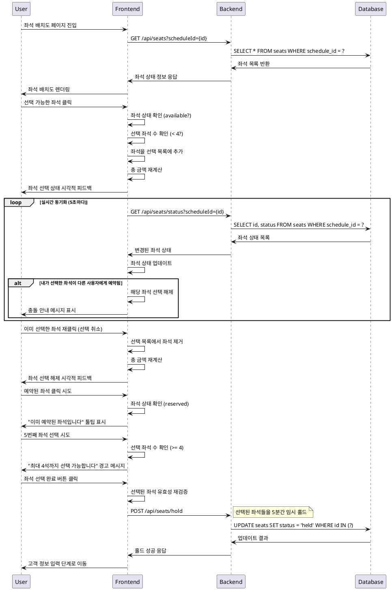

# 유스케이스 004: 예약 페이지 - 좌석 선택

## Primary Actor
- **사용자 (콘서트 예매자)**

## Precondition
- 사용자가 콘서트 예약 페이지에 접근한 상태
- 날짜와 회차가 이미 선택된 상태
- 선택된 회차에 예매 가능한 좌석이 존재하는 상태
- 좌석 배치도가 정상적으로 로드된 상태

## Trigger
- 사용자가 좌석 배치도에서 선택 가능한 좌석을 클릭

## Main Scenario

### 1. 좌석 배치도 표시
1. 시스템은 선택된 회차(scheduleId)를 기반으로 모든 좌석 정보를 조회
2. 좌석별 상태를 분류 (available/reserved)
3. 좌석 등급별 색상 및 가격 정보를 매핑
4. 좌석 배치도 UI에 상태별 시각적 표현으로 렌더링

### 2. 좌석 선택 처리
1. 사용자가 선택 가능한 좌석을 클릭
2. 시스템은 클릭된 좌석의 상태를 확인 (available 여부)
3. 현재 선택된 좌석 수를 확인 (최대 4석 제한 검증)
4. 좌석 상태를 '내 선택'으로 변경 (클라이언트 사이드)
5. 선택된 좌석 목록에 추가 (seatId, seatNumber, grade, price)
6. 총 결제 금액을 실시간 계산 및 업데이트
7. 예매 정보 섹션에 선택된 좌석 정보 표시

### 3. 좌석 선택 취소 처리
1. 사용자가 이미 선택한 좌석을 재클릭
2. 시스템은 선택된 좌석 목록에서 해당 좌석을 제거
3. 좌석 상태를 '선택 가능'으로 복원
4. 총 결제 금액을 재계산 및 업데이트

### 4. 실시간 좌석 상태 동기화
1. WebSocket 또는 주기적 폴링을 통해 서버에서 좌석 상태 실시간 업데이트
2. 다른 사용자가 예약 완료한 좌석을 즉시 'reserved' 상태로 변경하여 비활성화
3. 내가 선택한 좌석이 다른 사용자에 의해 예약된 경우 충돌 처리 및 선택 해제

### 5. 좌석 선택 완료
1. 1석 이상 선택 시 '좌석 선택 완료' 버튼 활성화
2. 사용자가 버튼 클릭 시 다음 단계(고객 정보 입력)로 진행

## Edge Cases

### 1. 이미 예약된 좌석 클릭
- **상황**: 사용자가 reserved 상태인 좌석을 클릭
- **처리**: 클릭 이벤트 무시 및 "이미 예약된 좌석입니다" 툴팁 표시

### 2. 최대 선택 가능 좌석 수 초과
- **상황**: 사용자가 4석을 초과하여 좌석 선택 시도
- **처리**: 경고 메시지 표시 및 추가 선택 방지

### 3. 실시간 좌석 충돌
- **상황**: 선택 중인 좌석이 다른 사용자에게 예약됨
- **처리**: 즉시 선택 해제 및 "다른 사용자가 선택한 좌석입니다" 안내 메시지

### 4. 네트워크 오류
- **상황**: 좌석 상태 업데이트 실패
- **처리**: 재시도 옵션 제공 및 오류 메시지 표시

### 5. 회차 미선택 상태 접근
- **상황**: 회차가 선택되지 않은 상태에서 좌석 선택 시도
- **처리**: 회차 선택 유도 메시지 표시

### 6. 좌석 데이터 로딩 실패
- **상황**: 서버에서 좌석 정보 조회 실패
- **처리**: 오류 메시지 및 이전 단계로 돌아가기 옵션 제공

## Business Rules

### 1. 좌석 선택 제한
- 한 번에 최대 4석까지만 선택 가능
- 이미 예약된 좌석(reserved)은 선택 불가
- 선택 가능한 좌석(available)만 클릭 가능

### 2. 실시간 동기화
- 좌석 상태는 실시간으로 동기화되어야 함
- 다른 사용자의 예약 완료 시 즉시 해당 좌석 비활성화
- Redis 기반 좌석 락(Lock) 시스템으로 동시 예약 시도 방지

### 3. 가격 계산
- 선택된 좌석의 등급별 가격을 합산하여 총 결제 금액 계산
- 좌석 선택/해제 시 실시간으로 금액 업데이트

### 4. 상태 관리
- 선택된 좌석 정보는 세션/로컬스토리지에 임시 저장
- 페이지 새로고침 시에도 선택 상태 유지

### 5. 접근성
- 키보드 네비게이션 지원 (방향키로 좌석 이동)
- 스크린 리더를 위한 ARIA 라벨 제공
- 색상 외에도 아이콘, 텍스트로 좌석 상태 구분

## Sequence Diagram

