# Context + useReducer 상태 관리 설계

## 1. 아키텍처 개요

Context API와 useReducer를 결합하여 예약 완료 처리의 상태를 전역적으로 관리합니다.

```
Context Provider (데이터 소유)
    ↓ (provides)
Reducer (상태 변경 로직)
    ↓ (exposes)
Consumer Components (UI 렌더링)
```

---

## 2. 전체 데이터 흐름 (Mermaid)

### 2.1. Context Provider 계층 구조

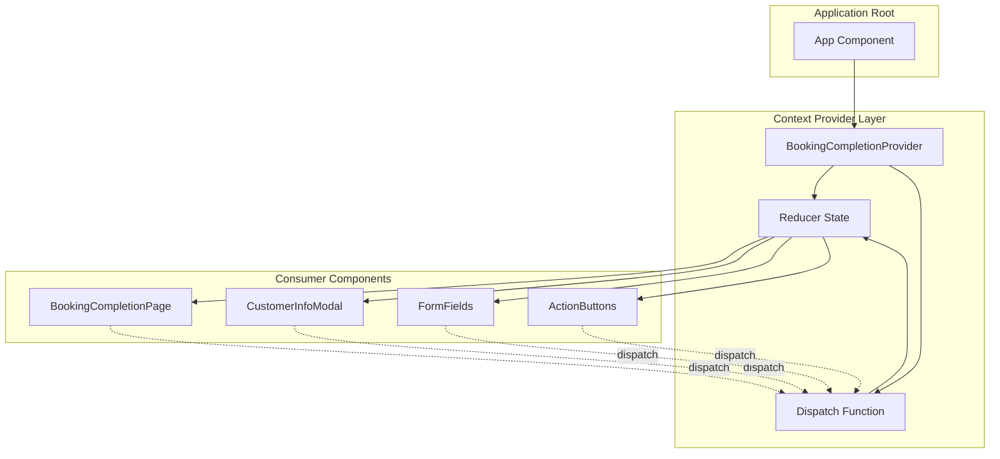

### 2.2. 데이터 불러오기 및 관리 흐름

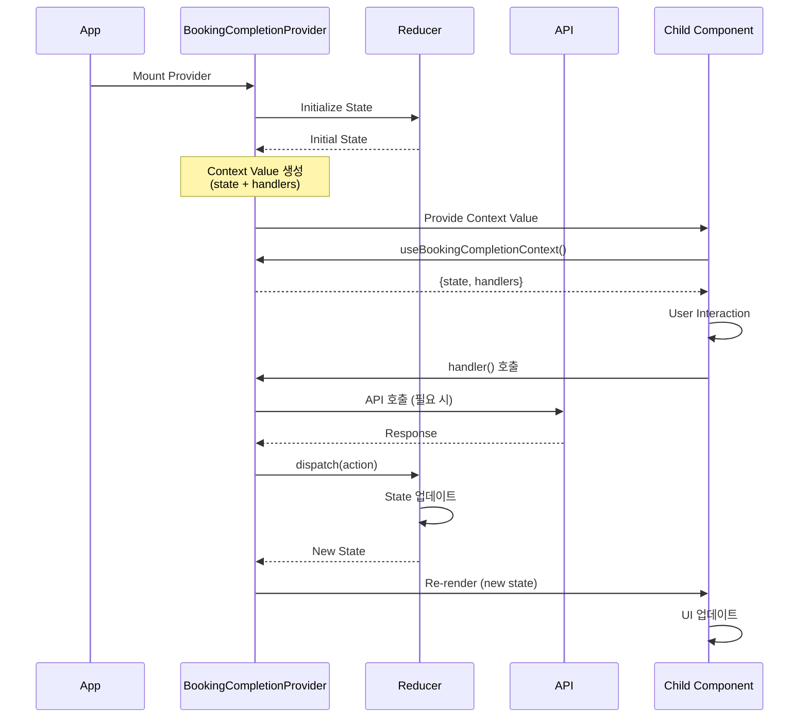

### 2.3. 좌석 검증 플로우

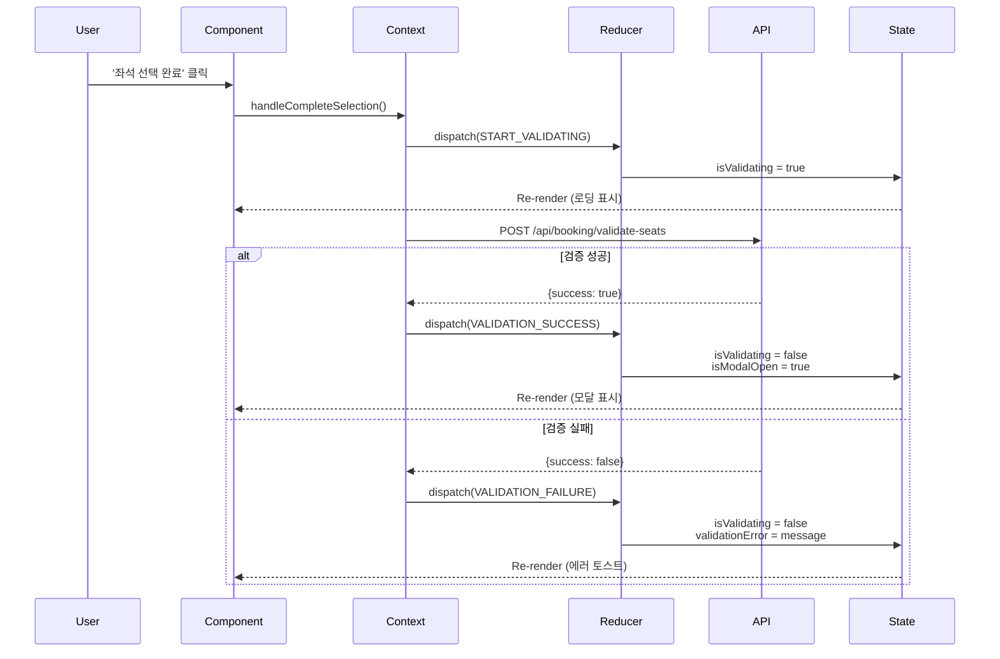

### 2.4. 예약 확정 플로우

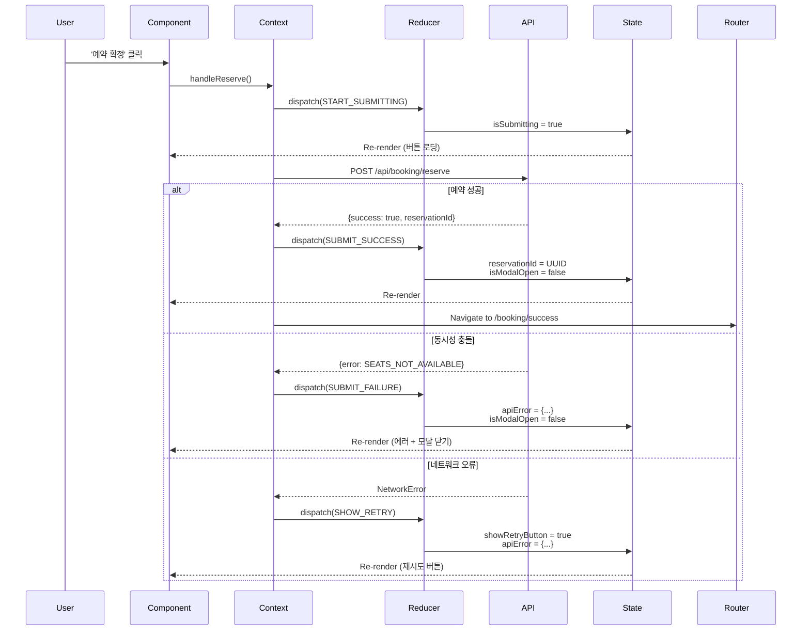

---

## 3. Context 인터페이스 설계

### 3.1. State Interface

```typescript
/**
 * 예약 완료 처리의 전체 상태를 정의하는 인터페이스
 */
interface BookingCompletionState {
  // === UI 상태 ===
  /** 고객 정보 입력 모달 표시 여부 */
  isModalOpen: boolean;
  
  /** 좌석 유효성 검증 진행 중 여부 */
  isValidating: boolean;
  
  /** 예약 확정 처리 진행 중 여부 */
  isSubmitting: boolean;
  
  /** 네트워크 오류 시 재시도 버튼 표시 여부 */
  showRetryButton: boolean;
  
  // === 폼 입력 상태 ===
  /** 예약자 이름 */
  customerName: string;
  
  /** 예약자 휴대폰 번호 (010-XXXX-XXXX 형식) */
  phoneNumber: string;
  
  /** 예약자 이메일 (선택 입력) */
  email: string;
  
  // === 폼 검증 상태 ===
  /** 이름 필드 오류 메시지 */
  nameError: string | null;
  
  /** 휴대폰 번호 필드 오류 메시지 */
  phoneError: string | null;
  
  /** 이메일 필드 오류 메시지 */
  emailError: string | null;
  
  /** 이름 유효성 검증 통과 여부 */
  isNameValid: boolean;
  
  /** 휴대폰 번호 유효성 검증 통과 여부 */
  isPhoneValid: boolean;
  
  /** 이메일 유효성 검증 통과 여부 (선택이므로 기본 true) */
  isEmailValid: boolean;
  
  // === 오류 상태 ===
  /** API 오류 정보 */
  apiError: {
    code: string;
    message: string;
  } | null;
  
  /** 좌석 유효성 검증 오류 메시지 */
  validationError: string | null;
  
  // === 예약 결과 ===
  /** 생성된 예약 ID (UUID) */
  reservationId: string | null;
}
```

### 3.2. Context Value Interface

```typescript
/**
 * Context를 통해 하위 컴포넌트에 노출되는 값의 인터페이스
 */
interface BookingCompletionContextValue {
  // === 상태 (읽기 전용) ===
  /** 현재 상태 */
  state: BookingCompletionState;
  
  // === 파생 값 (Computed Values) ===
  /** '예약 확정' 버튼 활성화 여부 */
  isReserveButtonEnabled: boolean;
  
  /** '좌석 선택 완료' 버튼 활성화 여부 (외부에서 seatCount 전달 필요) */
  isCompleteButtonEnabled: (seatCount: number) => boolean;
  
  // === 모달 제어 ===
  /** 모달 열기 (직접 호출은 드물음, 주로 검증 성공 시 자동) */
  openModal: () => void;
  
  /** 모달 닫기 (취소 버튼, ESC 키) */
  closeModal: () => void;
  
  // === 좌석 검증 ===
  /**
   * 좌석 선택 완료 처리 (좌석 유효성 검증)
   * @param scheduleId 선택된 회차 ID
   * @param seatIds 선택된 좌석 ID 배열
   */
  handleCompleteSelection: (
    scheduleId: string,
    seatIds: string[]
  ) => Promise<void>;
  
  // === 폼 입력 핸들러 ===
  /**
   * 이름 입력 처리 (실시간 검증 포함)
   * @param value 입력된 이름
   */
  handleNameChange: (value: string) => void;
  
  /**
   * 휴대폰 번호 입력 처리 (자동 포맷팅 + 실시간 검증)
   * @param value 입력된 휴대폰 번호
   */
  handlePhoneChange: (value: string) => void;
  
  /**
   * 이메일 입력 처리 (실시간 검증 포함)
   * @param value 입력된 이메일
   */
  handleEmailChange: (value: string) => void;
  
  // === 예약 확정 ===
  /**
   * 예약 확정 처리 (트랜잭션 기반)
   * @param scheduleId 선택된 회차 ID
   * @param seatIds 선택된 좌석 ID 배열
   */
  handleReserve: (
    scheduleId: string,
    seatIds: string[]
  ) => Promise<void>;
  
  /**
   * 재시도 (네트워크 오류 시)
   * @param scheduleId 선택된 회차 ID
   * @param seatIds 선택된 좌석 ID 배열
   */
  handleRetry: (
    scheduleId: string,
    seatIds: string[]
  ) => Promise<void>;
  
  // === 오류 처리 ===
  /** 오류 메시지 클리어 */
  clearError: () => void;
  
  // === 폼 초기화 ===
  /** 폼 데이터 초기화 (모달 닫을 때 자동 호출) */
  resetForm: () => void;
}
```

### 3.3. Provider Props Interface

```typescript
/**
 * BookingCompletionProvider 컴포넌트의 Props
 */
interface BookingCompletionProviderProps {
  /** 자식 컴포넌트들 */
  children: React.ReactNode;
  
  /** 
   * 초기 상태 (선택사항)
   * 테스트나 특수한 경우에 사용
   */
  initialState?: Partial<BookingCompletionState>;
  
  /**
   * 예약 성공 시 호출될 콜백 (선택사항)
   * @param reservationId 생성된 예약 ID
   */
  onReservationSuccess?: (reservationId: string) => void;
  
  /**
   * 예약 실패 시 호출될 콜백 (선택사항)
   * @param error 오류 정보
   */
  onReservationFailure?: (error: { code: string; message: string }) => void;
}
```

---

## 4. 노출되는 변수 및 함수 목록

### 4.1. 상태 변수 (State Variables) - 총 16개

#### 4.1.1. UI 상태 (4개)

| 변수명 | 타입 | 초기값 | 용도 |
|--------|------|--------|------|
| `state.isModalOpen` | boolean | false | 고객 정보 입력 모달 표시 제어 |
| `state.isValidating` | boolean | false | 좌석 검증 중 로딩 표시 제어 |
| `state.isSubmitting` | boolean | false | 예약 확정 중 버튼 로딩 제어 |
| `state.showRetryButton` | boolean | false | 네트워크 오류 시 재시도 버튼 표시 |

#### 4.1.2. 폼 입력 상태 (3개)

| 변수명 | 타입 | 초기값 | 용도 |
|--------|------|--------|------|
| `state.customerName` | string | "" | 예약자 이름 값 |
| `state.phoneNumber` | string | "" | 예약자 휴대폰 번호 값 (포맷팅됨) |
| `state.email` | string | "" | 예약자 이메일 값 (선택) |

#### 4.1.3. 폼 검증 상태 (6개)

| 변수명 | 타입 | 초기값 | 용도 |
|--------|------|--------|------|
| `state.nameError` | string \| null | null | 이름 필드 오류 메시지 |
| `state.phoneError` | string \| null | null | 휴대폰 번호 필드 오류 메시지 |
| `state.emailError` | string \| null | null | 이메일 필드 오류 메시지 |
| `state.isNameValid` | boolean | false | 이름 검증 통과 여부 |
| `state.isPhoneValid` | boolean | false | 휴대폰 번호 검증 통과 여부 |
| `state.isEmailValid` | boolean | true | 이메일 검증 통과 여부 |

#### 4.1.4. 오류 상태 (2개)

| 변수명 | 타입 | 초기값 | 용도 |
|--------|------|--------|------|
| `state.apiError` | object \| null | null | API 오류 정보 (code, message) |
| `state.validationError` | string \| null | null | 좌석 검증 오류 메시지 |

#### 4.1.5. 예약 결과 (1개)

| 변수명 | 타입 | 초기값 | 용도 |
|--------|------|--------|------|
| `state.reservationId` | string \| null | null | 생성된 예약 ID (성공 시) |

### 4.2. 파생 값 (Computed Values) - 총 2개

| 변수명 | 타입 | 계산 방법 | 용도 |
|--------|------|----------|------|
| `isReserveButtonEnabled` | boolean | `isNameValid && isPhoneValid && isEmailValid && !isSubmitting` | '예약 확정' 버튼 활성화 여부 |
| `isCompleteButtonEnabled` | function | `(seatCount) => seatCount > 0` | '좌석 선택 완료' 버튼 활성화 여부 |

### 4.3. 핸들러 함수 (Handler Functions) - 총 10개

#### 4.3.1. 모달 제어 (2개)

| 함수명 | 시그니처 | 설명 | 디스패치 액션 |
|--------|---------|------|--------------|
| `openModal` | `() => void` | 모달 열기 (수동, 드물게 사용) | `OPEN_MODAL` |
| `closeModal` | `() => void` | 모달 닫기 (취소/ESC) | `CLOSE_MODAL` + `RESET_FORM` |

#### 4.3.2. 좌석 검증 (1개)

| 함수명 | 시그니처 | 설명 | 디스패치 액션 |
|--------|---------|------|--------------|
| `handleCompleteSelection` | `(scheduleId: string, seatIds: string[]) => Promise<void>` | 좌석 선택 완료 (검증 시작) | `START_VALIDATING` → `VALIDATION_SUCCESS` 또는 `VALIDATION_FAILURE` |

#### 4.3.3. 폼 입력 (3개)

| 함수명 | 시그니처 | 설명 | 디스패치 액션 |
|--------|---------|------|--------------|
| `handleNameChange` | `(value: string) => void` | 이름 입력 (실시간 검증) | `UPDATE_NAME` |
| `handlePhoneChange` | `(value: string) => void` | 휴대폰 번호 입력 (자동 포맷팅 + 검증) | `UPDATE_PHONE` |
| `handleEmailChange` | `(value: string) => void` | 이메일 입력 (실시간 검증) | `UPDATE_EMAIL` |

#### 4.3.4. 예약 확정 (2개)

| 함수명 | 시그니처 | 설명 | 디스패치 액션 |
|--------|---------|------|--------------|
| `handleReserve` | `(scheduleId: string, seatIds: string[]) => Promise<void>` | 예약 확정 처리 | `START_SUBMITTING` → `SUBMIT_SUCCESS` 또는 `SUBMIT_FAILURE` 또는 `SHOW_RETRY` |
| `handleRetry` | `(scheduleId: string, seatIds: string[]) => Promise<void>` | 재시도 (네트워크 오류 시) | 내부적으로 `handleReserve` 호출 |

#### 4.3.5. 유틸리티 (2개)

| 함수명 | 시그니처 | 설명 | 디스패치 액션 |
|--------|---------|------|--------------|
| `clearError` | `() => void` | 오류 메시지 클리어 | `CLEAR_ERROR` |
| `resetForm` | `() => void` | 폼 데이터 초기화 | `RESET_FORM` |

---

## 5. Context Provider 구조

### 5.1. Provider 계층

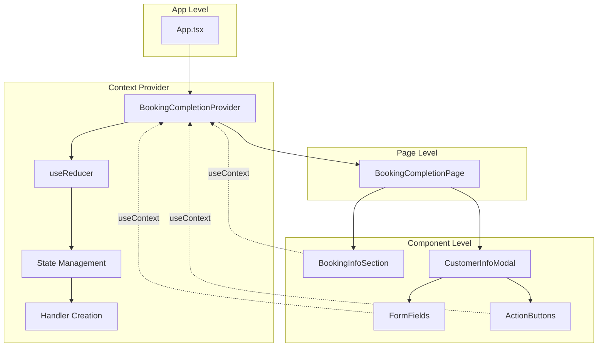

### 5.2. Provider 내부 데이터 흐름

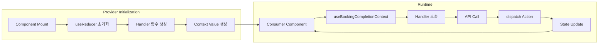

---

## 6. 하위 컴포넌트 사용 패턴

### 6.1. Consumer Hook 사용법

```typescript
/**
 * Context를 사용하는 Custom Hook
 * Provider 외부에서 사용 시 에러 발생
 */
function useBookingCompletionContext(): BookingCompletionContextValue {
  const context = useContext(BookingCompletionContext);
  
  if (!context) {
    throw new Error(
      'useBookingCompletionContext must be used within BookingCompletionProvider'
    );
  }
  
  return context;
}
```

### 6.2. 컴포넌트별 사용 예시

#### 6.2.1. BookingInfoSection (예매 정보 섹션)

**사용하는 것들**:
- `state.isValidating` - 로딩 상태 표시
- `state.validationError` - 검증 오류 토스트
- `handleCompleteSelection` - 좌석 선택 완료 버튼 클릭
- `isCompleteButtonEnabled` - 버튼 활성화 체크

```typescript
function BookingInfoSection({ selectedSeats, scheduleId }) {
  const { 
    state, 
    handleCompleteSelection, 
    isCompleteButtonEnabled 
  } = useBookingCompletionContext();
  
  const seatIds = selectedSeats.map(s => s.id);
  const seatCount = selectedSeats.length;
  
  return (
    <div>
      {/* 좌석 목록 표시 */}
      <button
        onClick={() => handleCompleteSelection(scheduleId, seatIds)}
        disabled={!isCompleteButtonEnabled(seatCount) || state.isValidating}
      >
        {state.isValidating ? '좌석 확인 중...' : '좌석 선택 완료'}
      </button>
    </div>
  );
}
```

#### 6.2.2. CustomerInfoModal (고객 정보 입력 모달)

**사용하는 것들**:
- `state.isModalOpen` - 모달 표시 제어
- `state.isSubmitting` - 버튼 로딩 상태
- `state.showRetryButton` - 재시도 버튼 표시
- `state.apiError` - 오류 토스트
- `closeModal` - 모달 닫기
- `handleReserve` - 예약 확정
- `handleRetry` - 재시도

```typescript
function CustomerInfoModal({ selectedSeats, scheduleId }) {
  const { 
    state, 
    closeModal, 
    handleReserve, 
    handleRetry,
    isReserveButtonEnabled 
  } = useBookingCompletionContext();
  
  const seatIds = selectedSeats.map(s => s.id);
  
  return (
    <Modal open={state.isModalOpen} onClose={closeModal}>
      {/* 폼 필드들 */}
      <button
        onClick={() => handleReserve(scheduleId, seatIds)}
        disabled={!isReserveButtonEnabled}
      >
        {state.isSubmitting ? '처리 중...' : '예약 확정'}
      </button>
      
      {state.showRetryButton && (
        <button onClick={() => handleRetry(scheduleId, seatIds)}>
          재시도
        </button>
      )}
    </Modal>
  );
}
```

#### 6.2.3. FormFields (입력 필드들)

**사용하는 것들**:
- `state.customerName`, `state.phoneNumber`, `state.email` - 입력값
- `state.nameError`, `state.phoneError`, `state.emailError` - 오류 메시지
- `state.isNameValid`, `state.isPhoneValid`, `state.isEmailValid` - 검증 상태
- `state.isSubmitting` - 필드 비활성화
- `handleNameChange`, `handlePhoneChange`, `handleEmailChange` - 입력 핸들러

```typescript
function NameField() {
  const { 
    state, 
    handleNameChange 
  } = useBookingCompletionContext();
  
  return (
    <div>
      <input
        value={state.customerName}
        onChange={(e) => handleNameChange(e.target.value)}
        disabled={state.isSubmitting}
        className={state.nameError ? 'error' : state.isNameValid ? 'success' : ''}
      />
      {state.nameError && <span>{state.nameError}</span>}
    </div>
  );
}
```

#### 6.2.4. ErrorToast (오류 토스트)

**사용하는 것들**:
- `state.apiError` - API 오류 정보
- `state.validationError` - 검증 오류 메시지
- `clearError` - 오류 클리어

```typescript
function ErrorToast() {
  const { 
    state, 
    clearError 
  } = useBookingCompletionContext();
  
  if (!state.apiError && !state.validationError) {
    return null;
  }
  
  const error = state.apiError || { message: state.validationError };
  
  return (
    <Toast
      type="error"
      message={error.message}
      onClose={clearError}
    />
  );
}
```

---

## 7. Provider 생성 및 마운트 전략

### 7.1. Provider 위치 결정

```mermaid
graph TB
    subgraph "Option 1: App Level (전역)"
        App1[App.tsx]
        BCP1[BookingCompletionProvider]
        AllPages[모든 페이지]
        
        App1 --> BCP1
        BCP1 --> AllPages
    end
    
    subgraph "Option 2: Layout Level (권장)"
        Layout[Layout.tsx]
        BCP2[BookingCompletionProvider]
        BookingPages[예약 관련 페이지들만]
        
        Layout --> BCP2
        BCP2 --> BookingPages
    end
    
    subgraph "Option 3: Page Level (지역)"
        Page[BookingPage.tsx]
        BCP3[BookingCompletionProvider]
        Components[해당 페이지 컴포넌트들]
        
        Page --> BCP3
        BCP3 --> Components
    end
    
    style Option2 fill:#e1f5e1
```

**권장: Option 2 (Layout Level)**
- 예약 플로우에만 제한적으로 제공
- 불필요한 전역 상태 방지
- 페이지 이동 시 상태 자동 초기화

### 7.2. Provider 마운트 구조

```typescript
// app/booking/layout.tsx (권장 위치)
function BookingLayout({ children }) {
  return (
    <BookingCompletionProvider>
      {children}
    </BookingCompletionProvider>
  );
}

// app/booking/[concertId]/customer-info/page.tsx
function CustomerInfoPage() {
  // Provider가 상위에 있으므로 Context 사용 가능
  const { state, handleReserve } = useBookingCompletionContext();
  
  return (
    <div>
      {/* ... */}
    </div>
  );
}
```

---

## 8. Context 초기화 및 정리

### 8.1. 초기화 시점

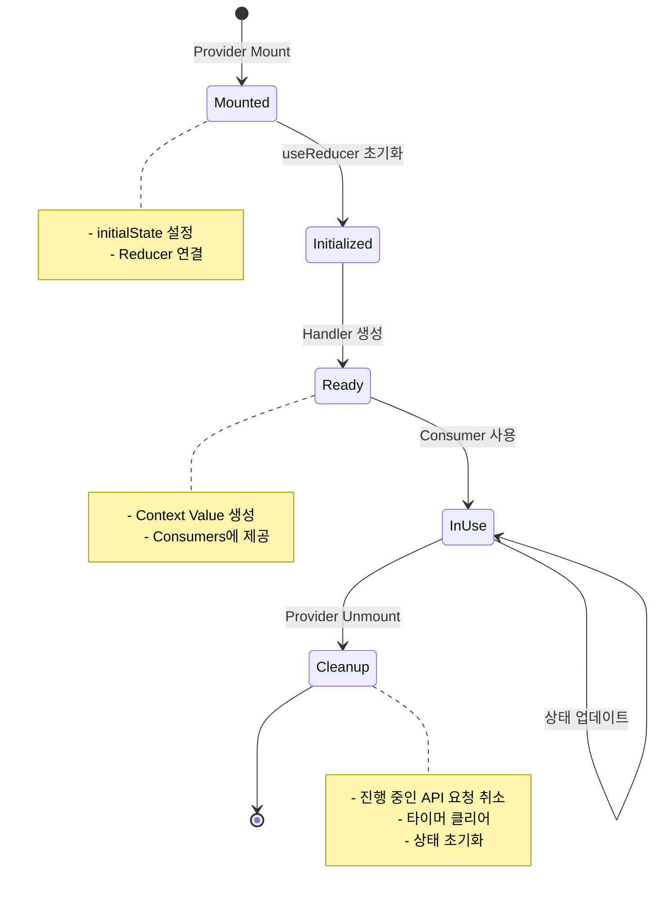

### 8.2. 정리 시점 및 방법

```typescript
interface ProviderCleanupStrategy {
  /** 
   * Provider Unmount 시 정리 작업
   * - API 요청 취소 (AbortController)
   * - setTimeout/setInterval 클리어
   * - 이벤트 리스너 제거
   */
  onUnmount: () => void;
  
  /**
   * 페이지 이동 시 정리 작업
   * - 폼 데이터 초기화
   * - 오류 상태 클리어
   */
  onNavigate: () => void;
  
  /**
   * 예약 완료 후 정리 작업
   * - 모달 닫기
   * - 상태 초기화
   */
  onReservationComplete: () => void;
}
```

---

## 9. 성능 최적화 전략

### 9.1. Context 분리 고려사항

현재는 단일 Context로 충분하지만, 성능 이슈 발생 시 분리 가능:

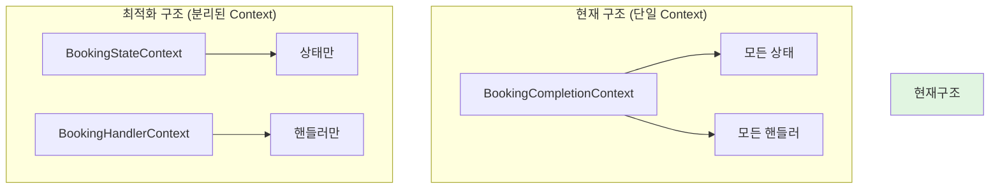

**분리 기준**:
- 상태 변경이 빈번한 경우
- 많은 컴포넌트가 Context를 구독하는 경우
- 성능 프로파일링 결과 불필요한 리렌더링이 많은 경우

### 9.2. 메모이제이션 전략

```typescript
interface MemoizationStrategy {
  /** 
   * Context Value 메모이제이션
   * - state와 handlers가 변경될 때만 새 객체 생성
   */
  contextValue: 'useMemo';
  
  /**
   * Handler 함수 메모이제이션
   * - useCallback으로 래핑
   * - 의존성 배열 최소화
   */
  handlers: 'useCallback';
  
  /**
   * 파생 값 메모이제이션
   * - isReserveButtonEnabled 등
   */
  computedValues: 'useMemo';
}
```

---

## 10. 에러 바운더리 통합

### 10.1. 에러 처리 계층

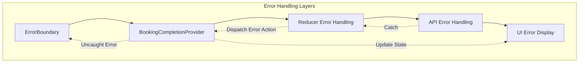

### 10.2. 에러 타입별 처리

| 에러 타입 | 처리 위치 | 처리 방법 |
|----------|----------|----------|
| **API 에러** | Context Handler | dispatch(SUBMIT_FAILURE) |
| **네트워크 에러** | Context Handler | dispatch(SHOW_RETRY) |
| **검증 에러** | Reducer | 상태 업데이트 (nameError 등) |
| **예외 발생** | Error Boundary | 에러 페이지 표시 |

---

## 11. 디버깅 및 DevTools 통합

### 11.1. 디버깅 인터페이스

```typescript
interface DebugInfo {
  /** 현재 상태 스냅샷 */
  currentState: BookingCompletionState;
  
  /** 액션 히스토리 (개발 모드에서만) */
  actionHistory?: Array<{
    type: string;
    payload?: any;
    timestamp: number;
  }>;
  
  /** 상태 변경 히스토리 (개발 모드에서만) */
  stateHistory?: BookingCompletionState[];
}
```

### 11.2. DevTools 연동

```typescript
interface DevToolsIntegration {
  /**
   * Redux DevTools Extension 지원
   * - 액션 추적
   * - 상태 히스토리
   * - 타임 트래블 디버깅
   */
  reduxDevTools: boolean;
  
  /**
   * React DevTools Profiler 지원
   * - 리렌더링 추적
   * - 성능 분석
   */
  reactProfiler: boolean;
}
```

---

## 12. 테스트 전략

### 12.1. Provider 테스트

```typescript
interface ProviderTestStrategy {
  /**
   * Context 제공 테스트
   * - Provider가 올바른 값을 제공하는지 확인
   */
  contextProvision: {
    test: '상태 및 핸들러 제공';
    method: 'render Provider + Consumer';
  };
  
  /**
   * 상태 변경 테스트
   * - 액션 디스패치 시 상태 변경 확인
   */
  stateUpdates: {
    test: '액션별 상태 업데이트';
    method: 'dispatch actions + assert state';
  };
  
  /**
   * 핸들러 동작 테스트
   * - 핸들러 호출 시 올바른 액션 디스패치 확인
   */
  handlerBehavior: {
    test: '핸들러 함수 동작';
    method: 'call handlers + assert dispatch';
  };
}
```

### 12.2. Consumer 테스트

```typescript
interface ConsumerTestStrategy {
  /**
   * Hook 사용 테스트
   * - useBookingCompletionContext 동작 확인
   */
  hookUsage: {
    test: 'Hook으로 Context 접근';
    method: 'renderHook within Provider';
  };
  
  /**
   * Provider 외부 사용 에러 테스트
   * - Provider 없이 Hook 사용 시 에러 발생 확인
   */
  outsideProviderError: {
    test: 'Provider 외부 사용 시 에러';
    method: 'renderHook without Provider + expect error';
  };
}
```

---

## 13. 마이그레이션 가이드

기존 로컬 상태에서 Context로 마이그레이션 시:

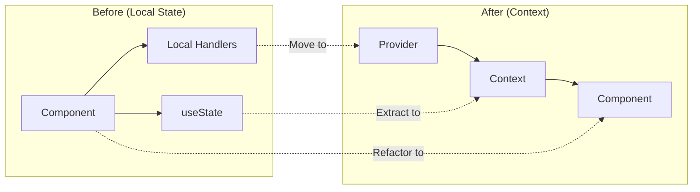

### 13.1. 마이그레이션 체크리스트

- [ ] 로컬 상태를 Context State 인터페이스로 변환
- [ ] useState를 useReducer로 변경
- [ ] 핸들러 함수를 Provider로 이동
- [ ] 컴포넌트에서 useContext Hook 사용
- [ ] Props drilling 제거
- [ ] 테스트 업데이트

---

이 설계를 기반으로 구현 시, 예측 가능하고 확장 가능하며 테스트 가능한 상태 관리 시스템을 구축할 수 있습니다.

