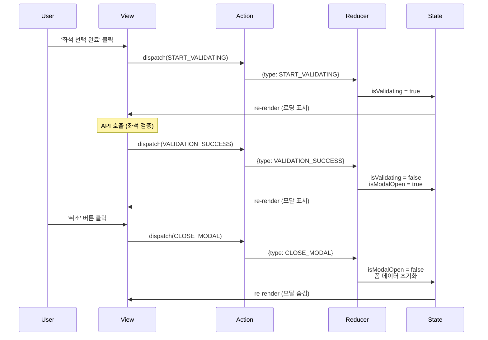
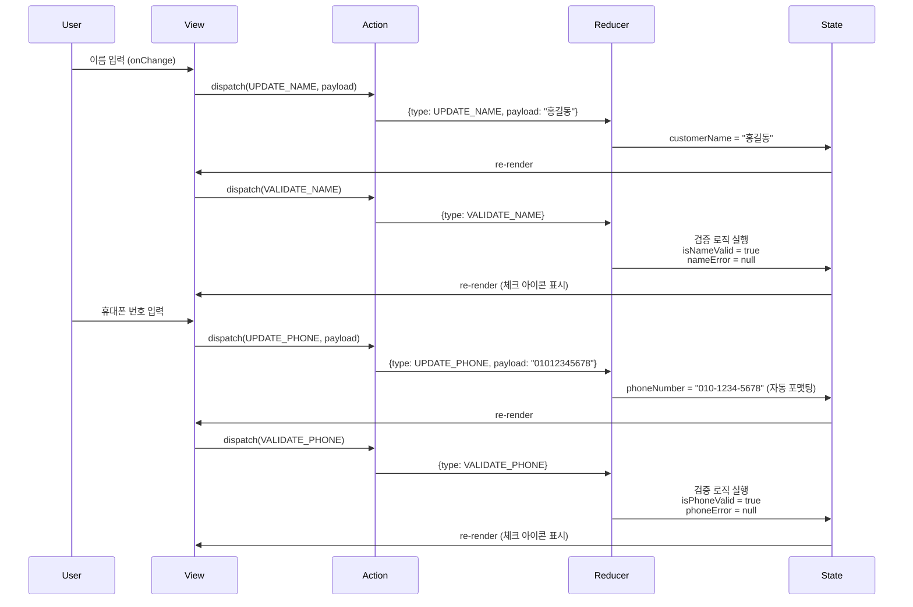
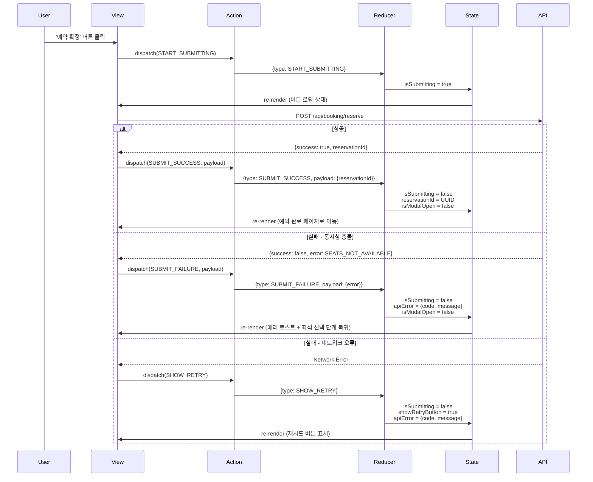
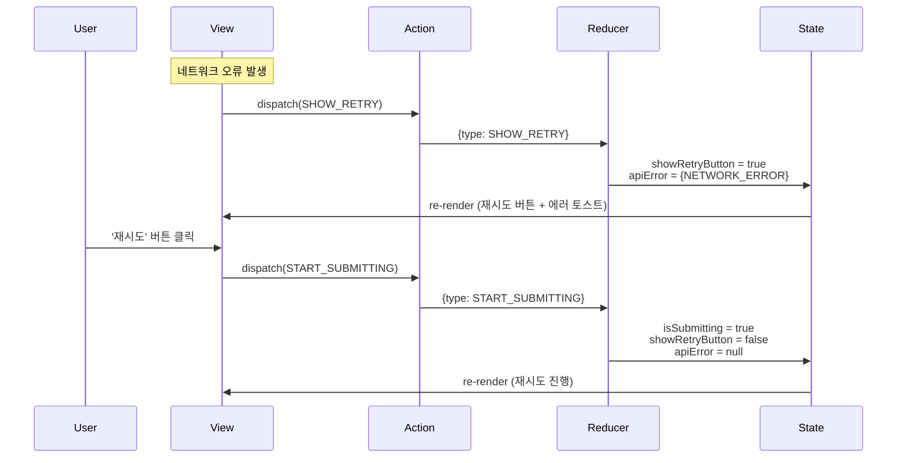

# Flux 패턴: 예약 완료 처리 상태 관리

## 1. Flux 패턴 개요

Flux 패턴은 단방향 데이터 흐름을 통해 예측 가능한 상태 관리를 제공합니다.

```
Action → Dispatcher → Store → View → Action (순환)
```

본 문서에서는 React의 `useReducer`를 활용하여 Flux 패턴을 구현합니다.

---

## 2. 전체 상태 흐름 (Mermaid)

```mermaid
graph TB
    subgraph "View Layer"
        View[React Component]
        UI[UI Elements]
    end
    
    subgraph "Action Layer"
        A1[OPEN_MODAL]
        A2[CLOSE_MODAL]
        A3[START_VALIDATING]
        A4[VALIDATION_SUCCESS]
        A5[VALIDATION_FAILURE]
        A6[UPDATE_NAME]
        A7[UPDATE_PHONE]
        A8[UPDATE_EMAIL]
        A9[VALIDATE_NAME]
        A10[VALIDATE_PHONE]
        A11[VALIDATE_EMAIL]
        A12[START_SUBMITTING]
        A13[SUBMIT_SUCCESS]
        A14[SUBMIT_FAILURE]
        A15[SHOW_RETRY]
        A16[RESET_FORM]
    end
    
    subgraph "Store Layer"
        Store[Booking Completion Store]
        State[State Object]
    end
    
    View -->|dispatch| A1
    View -->|dispatch| A2
    View -->|dispatch| A3
    View -->|dispatch| A6
    View -->|dispatch| A7
    View -->|dispatch| A8
    View -->|dispatch| A12
    
    A1 --> Store
    A2 --> Store
    A3 --> Store
    A4 --> Store
    A5 --> Store
    A6 --> Store
    A7 --> Store
    A8 --> Store
    A9 --> Store
    A10 --> Store
    A11 --> Store
    A12 --> Store
    A13 --> Store
    A14 --> Store
    A15 --> Store
    A16 --> Store
    
    Store --> State
    State -->|re-render| View
    View --> UI
```



---

## 3. 주요 액션별 상태 흐름

### 3.1. 모달 열기/닫기 흐름



### 3.2. 폼 입력 및 검증 흐름



### 3.3. 예약 확정 흐름



### 3.4. 오류 처리 흐름



---

## 4. Action 정의

### 4.1. Action Types

```typescript
// Action Type 상수 정의
const ActionTypes = {
  // 모달 관련
  OPEN_MODAL: 'OPEN_MODAL',
  CLOSE_MODAL: 'CLOSE_MODAL',
  
  // 좌석 검증 관련
  START_VALIDATING: 'START_VALIDATING',
  VALIDATION_SUCCESS: 'VALIDATION_SUCCESS',
  VALIDATION_FAILURE: 'VALIDATION_FAILURE',
  
  // 폼 입력 관련
  UPDATE_NAME: 'UPDATE_NAME',
  UPDATE_PHONE: 'UPDATE_PHONE',
  UPDATE_EMAIL: 'UPDATE_EMAIL',
  
  // 폼 검증 관련
  VALIDATE_NAME: 'VALIDATE_NAME',
  VALIDATE_PHONE: 'VALIDATE_PHONE',
  VALIDATE_EMAIL: 'VALIDATE_EMAIL',
  
  // 예약 확정 관련
  START_SUBMITTING: 'START_SUBMITTING',
  SUBMIT_SUCCESS: 'SUBMIT_SUCCESS',
  SUBMIT_FAILURE: 'SUBMIT_FAILURE',
  
  // 오류 처리 관련
  SHOW_RETRY: 'SHOW_RETRY',
  CLEAR_ERROR: 'CLEAR_ERROR',
  
  // 폼 초기화
  RESET_FORM: 'RESET_FORM',
} as const;

type ActionType = typeof ActionTypes[keyof typeof ActionTypes];
```

### 4.2. Action Interfaces

```typescript
// 기본 Action 인터페이스
interface BaseAction {
  type: ActionType;
}

// Payload를 가진 Action 인터페이스
interface ActionWithPayload<T> extends BaseAction {
  payload: T;
}

// 각 Action 타입 정의
type OpenModalAction = BaseAction & { type: typeof ActionTypes.OPEN_MODAL };
type CloseModalAction = BaseAction & { type: typeof ActionTypes.CLOSE_MODAL };

type StartValidatingAction = BaseAction & { type: typeof ActionTypes.START_VALIDATING };
type ValidationSuccessAction = BaseAction & { type: typeof ActionTypes.VALIDATION_SUCCESS };
type ValidationFailureAction = ActionWithPayload<{ message: string }> & {
  type: typeof ActionTypes.VALIDATION_FAILURE;
};

type UpdateNameAction = ActionWithPayload<{ value: string }> & {
  type: typeof ActionTypes.UPDATE_NAME;
};
type UpdatePhoneAction = ActionWithPayload<{ value: string }> & {
  type: typeof ActionTypes.UPDATE_PHONE;
};
type UpdateEmailAction = ActionWithPayload<{ value: string }> & {
  type: typeof ActionTypes.UPDATE_EMAIL;
};

type ValidateNameAction = BaseAction & { type: typeof ActionTypes.VALIDATE_NAME };
type ValidatePhoneAction = BaseAction & { type: typeof ActionTypes.VALIDATE_PHONE };
type ValidateEmailAction = BaseAction & { type: typeof ActionTypes.VALIDATE_EMAIL };

type StartSubmittingAction = BaseAction & { type: typeof ActionTypes.START_SUBMITTING };
type SubmitSuccessAction = ActionWithPayload<{ reservationId: string }> & {
  type: typeof ActionTypes.SUBMIT_SUCCESS;
};
type SubmitFailureAction = ActionWithPayload<{
  error: { code: string; message: string };
}> & {
  type: typeof ActionTypes.SUBMIT_FAILURE;
};

type ShowRetryAction = BaseAction & { type: typeof ActionTypes.SHOW_RETRY };
type ClearErrorAction = BaseAction & { type: typeof ActionTypes.CLEAR_ERROR };
type ResetFormAction = BaseAction & { type: typeof ActionTypes.RESET_FORM };

// 모든 Action의 Union 타입
type BookingCompletionAction =
  | OpenModalAction
  | CloseModalAction
  | StartValidatingAction
  | ValidationSuccessAction
  | ValidationFailureAction
  | UpdateNameAction
  | UpdatePhoneAction
  | UpdateEmailAction
  | ValidateNameAction
  | ValidatePhoneAction
  | ValidateEmailAction
  | StartSubmittingAction
  | SubmitSuccessAction
  | SubmitFailureAction
  | ShowRetryAction
  | ClearErrorAction
  | ResetFormAction;
```

### 4.3. Action Creators

```typescript
// Action Creator 함수들
const actionCreators = {
  // 모달 관련
  openModal: (): OpenModalAction => ({
    type: ActionTypes.OPEN_MODAL,
  }),
  
  closeModal: (): CloseModalAction => ({
    type: ActionTypes.CLOSE_MODAL,
  }),
  
  // 좌석 검증 관련
  startValidating: (): StartValidatingAction => ({
    type: ActionTypes.START_VALIDATING,
  }),
  
  validationSuccess: (): ValidationSuccessAction => ({
    type: ActionTypes.VALIDATION_SUCCESS,
  }),
  
  validationFailure: (message: string): ValidationFailureAction => ({
    type: ActionTypes.VALIDATION_FAILURE,
    payload: { message },
  }),
  
  // 폼 입력 관련
  updateName: (value: string): UpdateNameAction => ({
    type: ActionTypes.UPDATE_NAME,
    payload: { value },
  }),
  
  updatePhone: (value: string): UpdatePhoneAction => ({
    type: ActionTypes.UPDATE_PHONE,
    payload: { value },
  }),
  
  updateEmail: (value: string): UpdateEmailAction => ({
    type: ActionTypes.UPDATE_EMAIL,
    payload: { value },
  }),
  
  // 폼 검증 관련
  validateName: (): ValidateNameAction => ({
    type: ActionTypes.VALIDATE_NAME,
  }),
  
  validatePhone: (): ValidatePhoneAction => ({
    type: ActionTypes.VALIDATE_PHONE,
  }),
  
  validateEmail: (): ValidateEmailAction => ({
    type: ActionTypes.VALIDATE_EMAIL,
  }),
  
  // 예약 확정 관련
  startSubmitting: (): StartSubmittingAction => ({
    type: ActionTypes.START_SUBMITTING,
  }),
  
  submitSuccess: (reservationId: string): SubmitSuccessAction => ({
    type: ActionTypes.SUBMIT_SUCCESS,
    payload: { reservationId },
  }),
  
  submitFailure: (error: { code: string; message: string }): SubmitFailureAction => ({
    type: ActionTypes.SUBMIT_FAILURE,
    payload: { error },
  }),
  
  // 오류 처리 관련
  showRetry: (): ShowRetryAction => ({
    type: ActionTypes.SHOW_RETRY,
  }),
  
  clearError: (): ClearErrorAction => ({
    type: ActionTypes.CLEAR_ERROR,
  }),
  
  // 폼 초기화
  resetForm: (): ResetFormAction => ({
    type: ActionTypes.RESET_FORM,
  }),
};
```

---

## 5. State 정의

```typescript
// 전체 State 인터페이스
interface BookingCompletionState {
  // UI 상태
  isModalOpen: boolean;
  isValidating: boolean;
  isSubmitting: boolean;
  showRetryButton: boolean;
  
  // 폼 입력 상태
  customerName: string;
  phoneNumber: string;
  email: string;
  
  // 폼 검증 상태
  nameError: string | null;
  phoneError: string | null;
  emailError: string | null;
  isNameValid: boolean;
  isPhoneValid: boolean;
  isEmailValid: boolean;
  
  // 오류 상태
  apiError: { code: string; message: string } | null;
  validationError: string | null;
  
  // 예약 결과
  reservationId: string | null;
}

// 초기 상태
const initialState: BookingCompletionState = {
  // UI 상태
  isModalOpen: false,
  isValidating: false,
  isSubmitting: false,
  showRetryButton: false,
  
  // 폼 입력 상태
  customerName: '',
  phoneNumber: '',
  email: '',
  
  // 폼 검증 상태
  nameError: null,
  phoneError: null,
  emailError: null,
  isNameValid: false,
  isPhoneValid: false,
  isEmailValid: true, // 선택 입력이므로 기본 true
  
  // 오류 상태
  apiError: null,
  validationError: null,
  
  // 예약 결과
  reservationId: null,
};
```

---

## 6. Reducer 구현

```typescript
// 검증 유틸리티 함수들
const validators = {
  // 이름 검증 (2-50자, 한글/영문/공백만)
  validateName: (name: string): { isValid: boolean; error: string | null } => {
    if (name.length < 2) {
      return { isValid: false, error: '이름은 최소 2자 이상 입력해주세요' };
    }
    if (name.length > 50) {
      return { isValid: false, error: '이름은 최대 50자까지 입력 가능합니다' };
    }
    if (!/^[가-힣a-zA-Z\s]+$/.test(name)) {
      return { isValid: false, error: '이름은 한글, 영문, 공백만 입력 가능합니다' };
    }
    return { isValid: true, error: null };
  },
  
  // 휴대폰 번호 검증 (010-XXXX-XXXX)
  validatePhone: (phone: string): { isValid: boolean; error: string | null } => {
    if (!/^010-\d{4}-\d{4}$/.test(phone)) {
      return { isValid: false, error: '휴대폰 번호는 010-1234-5678 형식으로 입력해주세요' };
    }
    return { isValid: true, error: null };
  },
  
  // 이메일 검증
  validateEmail: (email: string): { isValid: boolean; error: string | null } => {
    if (email === '') {
      return { isValid: true, error: null }; // 선택 입력
    }
    if (!/^[^\s@]+@[^\s@]+\.[^\s@]+$/.test(email)) {
      return { isValid: false, error: '올바른 이메일 형식이 아닙니다 (예: example@domain.com)' };
    }
    return { isValid: true, error: null };
  },
  
  // 휴대폰 번호 자동 포맷팅
  formatPhone: (value: string): string => {
    const numbers = value.replace(/\D/g, '');
    if (numbers.length <= 3) return numbers;
    if (numbers.length <= 7) return `${numbers.slice(0, 3)}-${numbers.slice(3)}`;
    return `${numbers.slice(0, 3)}-${numbers.slice(3, 7)}-${numbers.slice(7, 11)}`;
  },
};

// Reducer 함수
function bookingCompletionReducer(
  state: BookingCompletionState,
  action: BookingCompletionAction
): BookingCompletionState {
  switch (action.type) {
    // === 모달 관련 ===
    case ActionTypes.OPEN_MODAL:
      return {
        ...state,
        isModalOpen: true,
      };
    
    case ActionTypes.CLOSE_MODAL:
      return {
        ...initialState, // 모든 상태 초기화
      };
    
    // === 좌석 검증 관련 ===
    case ActionTypes.START_VALIDATING:
      return {
        ...state,
        isValidating: true,
        validationError: null,
      };
    
    case ActionTypes.VALIDATION_SUCCESS:
      return {
        ...state,
        isValidating: false,
        isModalOpen: true,
        validationError: null,
      };
    
    case ActionTypes.VALIDATION_FAILURE:
      return {
        ...state,
        isValidating: false,
        validationError: action.payload.message,
      };
    
    // === 폼 입력 관련 ===
    case ActionTypes.UPDATE_NAME: {
      const { value } = action.payload;
      const validation = validators.validateName(value);
      return {
        ...state,
        customerName: value,
        nameError: validation.error,
        isNameValid: validation.isValid,
      };
    }
    
    case ActionTypes.UPDATE_PHONE: {
      const { value } = action.payload;
      const formattedValue = validators.formatPhone(value);
      const validation = validators.validatePhone(formattedValue);
      return {
        ...state,
        phoneNumber: formattedValue,
        phoneError: validation.error,
        isPhoneValid: validation.isValid,
      };
    }
    
    case ActionTypes.UPDATE_EMAIL: {
      const { value } = action.payload;
      const validation = validators.validateEmail(value);
      return {
        ...state,
        email: value,
        emailError: validation.error,
        isEmailValid: validation.isValid,
      };
    }
    
    // === 폼 검증 관련 ===
    case ActionTypes.VALIDATE_NAME: {
      const validation = validators.validateName(state.customerName);
      return {
        ...state,
        nameError: validation.error,
        isNameValid: validation.isValid,
      };
    }
    
    case ActionTypes.VALIDATE_PHONE: {
      const validation = validators.validatePhone(state.phoneNumber);
      return {
        ...state,
        phoneError: validation.error,
        isPhoneValid: validation.isValid,
      };
    }
    
    case ActionTypes.VALIDATE_EMAIL: {
      const validation = validators.validateEmail(state.email);
      return {
        ...state,
        emailError: validation.error,
        isEmailValid: validation.isValid,
      };
    }
    
    // === 예약 확정 관련 ===
    case ActionTypes.START_SUBMITTING:
      return {
        ...state,
        isSubmitting: true,
        apiError: null,
        showRetryButton: false,
      };
    
    case ActionTypes.SUBMIT_SUCCESS:
      return {
        ...state,
        isSubmitting: false,
        reservationId: action.payload.reservationId,
        isModalOpen: false,
        apiError: null,
      };
    
    case ActionTypes.SUBMIT_FAILURE:
      return {
        ...state,
        isSubmitting: false,
        apiError: action.payload.error,
        // 동시성 충돌인 경우 모달 닫기
        isModalOpen: action.payload.error.code === 'SEATS_NOT_AVAILABLE' ? false : state.isModalOpen,
      };
    
    // === 오류 처리 관련 ===
    case ActionTypes.SHOW_RETRY:
      return {
        ...state,
        isSubmitting: false,
        showRetryButton: true,
        apiError: {
          code: 'NETWORK_ERROR',
          message: '예약 처리 중 오류가 발생했습니다. 다시 시도해주세요',
        },
      };
    
    case ActionTypes.CLEAR_ERROR:
      return {
        ...state,
        apiError: null,
        validationError: null,
        showRetryButton: false,
      };
    
    // === 폼 초기화 ===
    case ActionTypes.RESET_FORM:
      return {
        ...initialState,
      };
    
    default:
      return state;
  }
}
```

---

## 7. Hook 구현

```typescript
// Custom Hook: useBookingCompletion
function useBookingCompletion() {
  const [state, dispatch] = useReducer(bookingCompletionReducer, initialState);
  
  // Derived 값들 (계산된 값)
  const isReserveButtonEnabled = 
    state.isNameValid && 
    state.isPhoneValid && 
    state.isEmailValid && 
    !state.isSubmitting;
  
  // 액션 핸들러들
  const handlers = {
    // 모달 관련
    openModal: useCallback(() => {
      dispatch(actionCreators.openModal());
    }, []),
    
    closeModal: useCallback(() => {
      dispatch(actionCreators.closeModal());
    }, []),
    
    // 좌석 선택 완료 (좌석 검증 시작)
    handleCompleteSelection: useCallback(async (
      scheduleId: string,
      seatIds: string[]
    ) => {
      dispatch(actionCreators.startValidating());
      
      try {
        const response = await validateSeats({ scheduleId, seatIds });
        
        if (response.success) {
          dispatch(actionCreators.validationSuccess());
        } else {
          dispatch(actionCreators.validationFailure(response.error.message));
        }
      } catch (error) {
        dispatch(actionCreators.validationFailure('좌석 확인 중 오류가 발생했습니다'));
      }
    }, []),
    
    // 폼 입력 핸들러
    handleNameChange: useCallback((value: string) => {
      dispatch(actionCreators.updateName(value));
    }, []),
    
    handlePhoneChange: useCallback((value: string) => {
      dispatch(actionCreators.updatePhone(value));
    }, []),
    
    handleEmailChange: useCallback((value: string) => {
      dispatch(actionCreators.updateEmail(value));
    }, []),
    
    // 예약 확정
    handleReserve: useCallback(async (
      scheduleId: string,
      seatIds: string[]
    ) => {
      dispatch(actionCreators.startSubmitting());
      
      try {
        const response = await reserveSeats({
          scheduleId,
          seatIds,
          customerName: state.customerName,
          phoneNumber: state.phoneNumber,
          email: state.email,
        });
        
        if (response.success) {
          dispatch(actionCreators.submitSuccess(response.data.reservationId));
          // 예약 완료 페이지로 이동
          window.location.href = `/booking/success?reservationId=${response.data.reservationId}`;
        } else {
          dispatch(actionCreators.submitFailure(response.error));
        }
      } catch (error) {
        if (error instanceof NetworkError) {
          dispatch(actionCreators.showRetry());
        } else {
          dispatch(actionCreators.submitFailure({
            code: 'INTERNAL_SERVER_ERROR',
            message: '예약 처리에 실패했습니다. 잠시 후 다시 시도해주세요',
          }));
        }
      }
    }, [state.customerName, state.phoneNumber, state.email]),
    
    // 재시도
    handleRetry: useCallback((
      scheduleId: string,
      seatIds: string[]
    ) => {
      handlers.handleReserve(scheduleId, seatIds);
    }, []),
    
    // 오류 클리어
    clearError: useCallback(() => {
      dispatch(actionCreators.clearError());
    }, []),
  };
  
  return {
    // 상태
    state,
    // 파생 값
    isReserveButtonEnabled,
    // 핸들러
    ...handlers,
  };
}
```

---

## 8. 컴포넌트 사용 예시

```typescript
// BookingCompletionPage.tsx
function BookingCompletionPage() {
  // Context나 Props로부터 받아온 데이터
  const { selectedSeats, scheduleId, concertInfo } = useBookingContext();
  
  // Custom Hook 사용
  const {
    state,
    isReserveButtonEnabled,
    handleCompleteSelection,
    handleNameChange,
    handlePhoneChange,
    handleEmailChange,
    handleReserve,
    handleRetry,
    closeModal,
    clearError,
  } = useBookingCompletion();
  
  // Derived 값들
  const seatIds = selectedSeats.map(seat => seat.id);
  const totalPrice = selectedSeats.reduce((sum, seat) => sum + seat.price, 0);
  const seatCount = selectedSeats.length;
  
  return (
    <div className="booking-completion-page">
      {/* 예매 정보 섹션 */}
      <div className="booking-info">
        <h2>선택된 좌석</h2>
        <ul>
          {selectedSeats.map(seat => (
            <li key={seat.id}>
              {seat.seatNumber} ({seat.grade}석) - {seat.price.toLocaleString()}원
            </li>
          ))}
        </ul>
        <p className="total-price">총 결제 금액: {totalPrice.toLocaleString()}원</p>
        
        <button
          onClick={() => handleCompleteSelection(scheduleId, seatIds)}
          disabled={seatCount === 0 || state.isValidating}
          className="complete-button"
        >
          {state.isValidating ? '좌석 확인 중...' : '좌석 선택 완료'}
        </button>
      </div>
      
      {/* 로딩 오버레이 */}
      {state.isValidating && (
        <div className="loading-overlay">
          <Spinner />
          <p>좌석 확인 중...</p>
        </div>
      )}
      
      {/* 고객 정보 입력 모달 */}
      <Modal open={state.isModalOpen} onClose={closeModal}>
        <h2>예약자 정보 입력</h2>
        
        <div className="selected-seats-summary">
          <p>좌석: {selectedSeats.map(s => s.seatNumber).join(', ')}</p>
          <p className="total">총 {totalPrice.toLocaleString()}원</p>
        </div>
        
        {/* 이름 입력 */}
        <div className="form-field">
          <label>
            이름 <span className="required">*</span>
          </label>
          <input
            type="text"
            value={state.customerName}
            onChange={(e) => handleNameChange(e.target.value)}
            placeholder="홍길동"
            disabled={state.isSubmitting}
            className={state.nameError ? 'error' : state.isNameValid ? 'success' : ''}
          />
          {state.nameError && (
            <span className="error-message">{state.nameError}</span>
          )}
          {state.isNameValid && <CheckIcon className="success-icon" />}
        </div>
        
        {/* 휴대폰 번호 입력 */}
        <div className="form-field">
          <label>
            휴대폰 번호 <span className="required">*</span>
          </label>
          <input
            type="tel"
            value={state.phoneNumber}
            onChange={(e) => handlePhoneChange(e.target.value)}
            placeholder="010-1234-5678"
            disabled={state.isSubmitting}
            className={state.phoneError ? 'error' : state.isPhoneValid ? 'success' : ''}
          />
          {state.phoneError && (
            <span className="error-message">{state.phoneError}</span>
          )}
          {state.isPhoneValid && <CheckIcon className="success-icon" />}
        </div>
        
        {/* 이메일 입력 */}
        <div className="form-field">
          <label>
            이메일 <span className="optional">(선택)</span>
          </label>
          <input
            type="email"
            value={state.email}
            onChange={(e) => handleEmailChange(e.target.value)}
            placeholder="example@domain.com"
            disabled={state.isSubmitting}
            className={state.emailError ? 'error' : (state.email && state.isEmailValid) ? 'success' : ''}
          />
          {state.emailError && (
            <span className="error-message">{state.emailError}</span>
          )}
          {state.email && state.isEmailValid && <CheckIcon className="success-icon" />}
        </div>
        
        {/* 버튼 영역 */}
        <div className="button-group">
          <button
            type="button"
            onClick={closeModal}
            disabled={state.isSubmitting}
            className="cancel-button"
          >
            취소
          </button>
          
          <button
            type="button"
            onClick={() => handleReserve(scheduleId, seatIds)}
            disabled={!isReserveButtonEnabled}
            className="reserve-button"
          >
            {state.isSubmitting ? (
              <>
                <Spinner size="small" />
                처리 중...
              </>
            ) : (
              '예약 확정'
            )}
          </button>
        </div>
        
        {/* 재시도 버튼 */}
        {state.showRetryButton && (
          <button
            onClick={() => handleRetry(scheduleId, seatIds)}
            className="retry-button"
          >
            재시도
          </button>
        )}
      </Modal>
      
      {/* 에러 토스트 */}
      {state.apiError && (
        <Toast
          type="error"
          message={state.apiError.message}
          onClose={clearError}
          duration={state.apiError.code === 'NETWORK_ERROR' ? null : 6000}
        />
      )}
      
      {state.validationError && (
        <Toast
          type="error"
          message={state.validationError}
          onClose={clearError}
          duration={6000}
        />
      )}
    </div>
  );
}
```

---

## 9. 상태 흐름 요약

### 9.1. 정상 흐름

1. **좌석 선택 완료 클릭**
   - Action: `START_VALIDATING`
   - State: `isValidating = true`
   - View: 로딩 오버레이 표시

2. **좌석 검증 성공**
   - Action: `VALIDATION_SUCCESS`
   - State: `isValidating = false`, `isModalOpen = true`
   - View: 모달 표시

3. **사용자 정보 입력**
   - Action: `UPDATE_NAME`, `UPDATE_PHONE`, `UPDATE_EMAIL` (각각)
   - State: 각 필드 값 업데이트 + 실시간 검증
   - View: 입력값 반영 + 검증 결과 표시

4. **예약 확정 클릭**
   - Action: `START_SUBMITTING`
   - State: `isSubmitting = true`
   - View: 버튼 로딩 상태

5. **예약 성공**
   - Action: `SUBMIT_SUCCESS`
   - State: `reservationId = UUID`, `isModalOpen = false`
   - View: 예약 완료 페이지로 이동

### 9.2. 오류 흐름

1. **좌석 검증 실패**
   - Action: `VALIDATION_FAILURE`
   - State: `validationError = "메시지"`
   - View: 에러 토스트 + 좌석 선택 단계 복귀

2. **예약 확정 실패 (동시성 충돌)**
   - Action: `SUBMIT_FAILURE`
   - State: `apiError = {...}`, `isModalOpen = false`
   - View: 에러 토스트 + 모달 닫기

3. **네트워크 오류**
   - Action: `SHOW_RETRY`
   - State: `showRetryButton = true`, `apiError = {...}`
   - View: 재시도 버튼 + 에러 토스트

---

## 10. 테스트 가이드

### 10.1. Reducer 단위 테스트

```typescript
describe('bookingCompletionReducer', () => {
  it('should open modal on VALIDATION_SUCCESS', () => {
    const state = initialState;
    const action = actionCreators.validationSuccess();
    const newState = bookingCompletionReducer(state, action);
    
    expect(newState.isModalOpen).toBe(true);
    expect(newState.isValidating).toBe(false);
  });
  
  it('should update name and validate on UPDATE_NAME', () => {
    const state = initialState;
    const action = actionCreators.updateName('홍길동');
    const newState = bookingCompletionReducer(state, action);
    
    expect(newState.customerName).toBe('홍길동');
    expect(newState.isNameValid).toBe(true);
    expect(newState.nameError).toBeNull();
  });
  
  it('should set nameError on invalid name', () => {
    const state = initialState;
    const action = actionCreators.updateName('a'); // 2자 미만
    const newState = bookingCompletionReducer(state, action);
    
    expect(newState.customerName).toBe('a');
    expect(newState.isNameValid).toBe(false);
    expect(newState.nameError).toBe('이름은 최소 2자 이상 입력해주세요');
  });
  
  // 더 많은 테스트 케이스...
});
```

### 10.2. Hook 통합 테스트

```typescript
import { renderHook, act } from '@testing-library/react-hooks';

describe('useBookingCompletion', () => {
  it('should handle complete selection flow', async () => {
    const { result } = renderHook(() => useBookingCompletion());
    
    // 좌석 선택 완료 클릭
    await act(async () => {
      await result.current.handleCompleteSelection('schedule-id', ['seat-1']);
    });
    
    expect(result.current.state.isModalOpen).toBe(true);
    expect(result.current.state.isValidating).toBe(false);
  });
  
  // 더 많은 테스트 케이스...
});
```

---

이 Flux 패턴 구현은 업계 표준인 `useReducer`를 사용하여 예측 가능하고 테스트 가능한 상태 관리를 제공합니다. 모든 상태 변경은 명시적인 Action을 통해서만 이루어지며, 단방향 데이터 흐름을 따릅니다.

