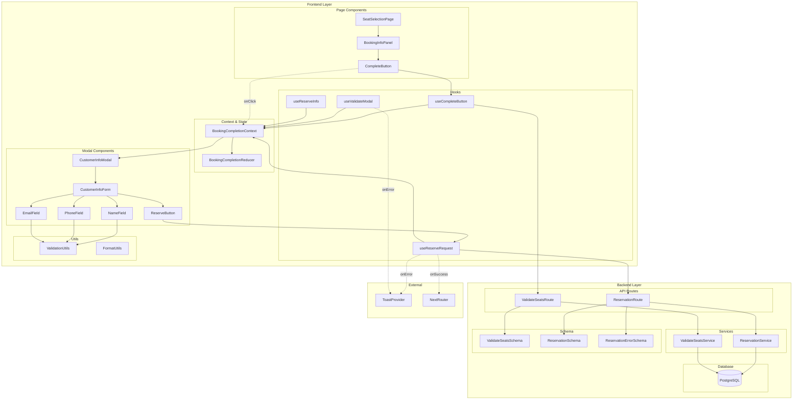

# 유저플로우 #5: 예약 완료 처리 (고객 정보 입력 및 예약 확정) 구현 계획

## 개요

본 문서는 VMC3 콘서트 예매 시스템의 **유저플로우 #5: 예약 완료 처리** 기능을 구현하기 위한 모듈화 설계 및 구현 계획을 정의합니다.

### 핵심 목표
- **신속성**: 좌석 선택 완료 후 1초 이내 모달 렌더링, 예약 확정 후 2초 이내 완료 페이지 전환
- **정확성**: 실시간 좌석 유효성 검증으로 동시성 충돌 방지 및 데이터 일관성 보장
- **사용성**: 실시간 입력 검증 및 명확한 오류 피드백으로 사용자 경험 향상
- **안정성**: 트랜잭션 기반 예약 생성으로 데이터 무결성 보장
- **접근성**: 키보드 네비게이션, 스크린 리더, WCAG 2.1 AA 준수

---

## 모듈 개요

| 모듈 | 위치 | 설명 |
|------|------|------|
| **BookingCompletionContext** | `src/features/booking/context/booking-completion-context.tsx` | 예약 완료 처리 상태 관리 Context Provider |
| **BookingCompletionReducer** | `src/features/booking/hooks/use-booking-completion-reducer.ts` | 예약 완료 상태 관리 Reducer 및 Actions |
| **CustomerInfoModal** | `src/features/booking/components/customer-info-modal.tsx` | 고객 정보 입력 모달 컴포넌트 |
| **CustomerInfoForm** | `src/features/booking/components/customer-info-form.tsx` | 고객 정보 입력 폼 컴포넌트 |
| **FormField** | `src/features/booking/components/form-field.tsx` | 개별 폼 필드 컴포넌트 (재사용) |
| **ReserveButton** | `src/features/booking/components/reserve-button.tsx` | 예약 확정 버튼 컴포넌트 |
| **ValidationUtils** | `src/features/booking/lib/validation-utils.ts` | 입력 검증 유틸리티 함수 |
| **ReservationService** | `src/features/reservations/backend/service.ts` | 예약 생성 비즈니스 로직 |
| **ReservationAPI** | `src/features/reservations/backend/route.ts` | 예약 관련 API 엔드포인트 |
| **ReservationSchema** | `src/features/reservations/backend/schema.ts` | 예약 요청/응답 Zod 스키마 |
| **ReservationHooks** | `src/features/booking/hooks/use-reservation-*.ts` | 예약 관련 커스텀 훅들 |

---

## Diagram



---

## Implementation Plan

### 1. Core State Management (우선순위: 높음)

#### 1.1 BookingCompletionContext
**위치**: `src/features/booking/context/booking-completion-context.tsx`

**목적**: 예약 완료 처리 관련 모든 상태와 액션을 중앙 집중 관리

**구현 내용**:
```typescript
// Context Provider 구현
interface BookingCompletionContextValue {
  // State
  state: BookingCompletionState;
  
  // Modal Actions
  modalActions: {
    openModal: () => void;
    closeModal: () => void;
  };
  
  // Validation Actions
  validationActions: {
    handleCompleteSelection: (scheduleId: string, seatIds: string[]) => Promise<void>;
    validateName: (name: string) => void;
    validatePhone: (phone: string) => void;
    validateEmail: (email: string) => void;
  };
  
  // Input Actions
  inputActions: {
    handleNameChange: (name: string) => void;
    handlePhoneChange: (phone: string) => void;
    handleEmailChange: (email: string) => void;
  };
  
  // Reservation Actions
  reservationActions: {
    handleReserve: (scheduleId: string, seatIds: string[]) => Promise<void>;
    handleRetry: (scheduleId: string, seatIds: string[]) => Promise<void>;
  };
  
  // Utility Actions
  utilityActions: {
    clearError: () => void;
    resetForm: () => void;
  };
  
  // Selectors
  selectors: {
    isReserveButtonEnabled: boolean;
    isCompleteButtonEnabled: (seatCount: number) => boolean;
    formattedPhoneNumber: string;
  };
}
```

**QA Sheet**:
- [ ] Context Provider가 올바르게 초기화되는가?
- [ ] 하위 컴포넌트에서 Context 값에 접근할 수 있는가?
- [ ] 상태 변경 시 필요한 컴포넌트만 리렌더링되는가?
- [ ] 메모리 누수 없이 정리되는가?
- [ ] 모달이 열릴 때 body 스크롤이 비활성화되는가?

#### 1.2 BookingCompletionReducer
**위치**: `src/features/booking/hooks/use-booking-completion-reducer.ts`

**목적**: 복잡한 예약 완료 상태 로직을 예측 가능하게 관리

**구현 내용**:
```typescript
// State Interface
interface BookingCompletionState {
  ui: {
    isModalOpen: boolean;
    isValidating: boolean;
    isSubmitting: boolean;
    showRetryButton: boolean;
  };
  
  form: {
    customerName: string;
    phoneNumber: string;
    email: string;
  };
  
  validation: {
    nameError: string | null;
    phoneError: string | null;
    emailError: string | null;
    isNameValid: boolean;
    isPhoneValid: boolean;
    isEmailValid: boolean;
  };
  
  error: {
    apiError: { code: string; message: string } | null;
    validationError: string | null;
  };
  
  result: {
    reservationId: string | null;
  };
}

// Action Types
type BookingCompletionAction =
  | { type: 'OPEN_MODAL' }
  | { type: 'CLOSE_MODAL' }
  | { type: 'START_VALIDATING' }
  | { type: 'VALIDATION_SUCCESS' }
  | { type: 'VALIDATION_FAILURE'; payload: { message: string } }
  | { type: 'UPDATE_NAME'; payload: { name: string } }
  | { type: 'UPDATE_PHONE'; payload: { phone: string } }
  | { type: 'UPDATE_EMAIL'; payload: { email: string } }
  | { type: 'VALIDATE_NAME'; payload: { isValid: boolean; error: string | null } }
  | { type: 'VALIDATE_PHONE'; payload: { isValid: boolean; error: string | null } }
  | { type: 'VALIDATE_EMAIL'; payload: { isValid: boolean; error: string | null } }
  | { type: 'START_SUBMITTING' }
  | { type: 'SUBMIT_SUCCESS'; payload: { reservationId: string } }
  | { type: 'SUBMIT_FAILURE'; payload: { code: string; message: string } }
  | { type: 'SHOW_RETRY' }
  | { type: 'CLEAR_ERROR' }
  | { type: 'RESET_FORM' };
```

**Unit Tests**:
```typescript
describe('BookingCompletionReducer', () => {
  test('이름 입력 시 상태가 올바르게 업데이트되는가', () => {
    const initialState = createInitialState();
    const action = { 
      type: 'UPDATE_NAME', 
      payload: { name: '홍길동' } 
    };
    
    const newState = bookingCompletionReducer(initialState, action);
    
    expect(newState.form.customerName).toBe('홍길동');
    expect(newState.validation.isNameValid).toBe(true);
    expect(newState.validation.nameError).toBeNull();
  });
  
  test('휴대폰 번호 자동 포맷팅이 올바르게 동작하는가', () => {
    const initialState = createInitialState();
    const action = { 
      type: 'UPDATE_PHONE', 
      payload: { phone: '01012345678' } 
    };
    
    const newState = bookingCompletionReducer(initialState, action);
    
    expect(newState.form.phoneNumber).toBe('010-1234-5678');
    expect(newState.validation.isPhoneValid).toBe(true);
  });
  
  test('좌석 검증 실패 시 에러 메시지가 표시되는가', () => {
    const initialState = { ...createInitialState(), ui: { ...createInitialState().ui, isValidating: true } };
    const action = { 
      type: 'VALIDATION_FAILURE', 
      payload: { message: '선택하신 좌석이 이미 예약되었습니다' } 
    };
    
    const newState = bookingCompletionReducer(initialState, action);
    
    expect(newState.ui.isValidating).toBe(false);
    expect(newState.error.validationError).toBe('선택하신 좌석이 이미 예약되었습니다');
    expect(newState.ui.isModalOpen).toBe(false);
  });
  
  test('예약 성공 시 reservationId가 저장되는가', () => {
    const initialState = createInitialState();
    const action = { 
      type: 'SUBMIT_SUCCESS', 
      payload: { reservationId: 'uuid-1234' } 
    };
    
    const newState = bookingCompletionReducer(initialState, action);
    
    expect(newState.result.reservationId).toBe('uuid-1234');
    expect(newState.ui.isSubmitting).toBe(false);
    expect(newState.ui.isModalOpen).toBe(false);
  });
  
  test('네트워크 오류 시 재시도 버튼이 표시되는가', () => {
    const initialState = createInitialState();
    const action = { type: 'SHOW_RETRY' };
    
    const newState = bookingCompletionReducer(initialState, action);
    
    expect(newState.ui.showRetryButton).toBe(true);
    expect(newState.error.apiError?.code).toBe('NETWORK_ERROR');
  });
});
```

### 2. UI Components (우선순위: 높음)

#### 2.1 CustomerInfoModal
**위치**: `src/features/booking/components/customer-info-modal.tsx`

**목적**: 고객 정보 입력 모달 UI 및 레이아웃 관리

**구현 내용**:
```typescript
interface CustomerInfoModalProps {
  open: boolean;
  selectedSeats: Seat[];
  totalPrice: number;
  onClose: () => void;
  onSubmit: (data: CustomerInfo) => Promise<void>;
  isSubmitting: boolean;
  showRetryButton: boolean;
  apiError: { code: string; message: string } | null;
}

export const CustomerInfoModal = memo<CustomerInfoModalProps>(({
  open,
  selectedSeats,
  totalPrice,
  onClose,
  onSubmit,
  isSubmitting,
  showRetryButton,
  apiError
}) => {
  const { 
    state, 
    inputActions, 
    validationActions,
    utilityActions 
  } = useBookingCompletionContext();
  
  const handleSubmit = useCallback(async (e: FormEvent) => {
    e.preventDefault();
    
    await onSubmit({
      customerName: state.form.customerName,
      phoneNumber: state.form.phoneNumber,
      email: state.form.email
    });
  }, [state.form, onSubmit]);
  
  return (
    <Dialog open={open} onOpenChange={onClose}>
      <DialogContent className="max-w-[560px]">
        <DialogHeader>
          <DialogTitle>예약자 정보 입력</DialogTitle>
          <DialogDescription>
            선택하신 좌석의 예약을 완료하기 위해 정보를 입력해주세요
          </DialogDescription>
        </DialogHeader>
        
        {/* 선택된 좌석 요약 */}
        <SelectedSeatsSummary 
          seats={selectedSeats} 
          totalPrice={totalPrice} 
        />
        
        {/* 고객 정보 입력 폼 */}
        <CustomerInfoForm
          form={state.form}
          validation={state.validation}
          inputActions={inputActions}
          validationActions={validationActions}
          onSubmit={handleSubmit}
          isSubmitting={isSubmitting}
        />
        
        {/* 에러 메시지 */}
        {apiError && (
          <ErrorAlert 
            message={apiError.message}
            onClose={utilityActions.clearError}
          />
        )}
        
        {/* 예약 확정 버튼 */}
        <DialogFooter className="flex-col sm:flex-row gap-2">
          {showRetryButton && (
            <Button 
              variant="outline" 
              onClick={handleSubmit}
              disabled={isSubmitting}
            >
              재시도
            </Button>
          )}
          
          <Button
            type="submit"
            disabled={!state.selectors.isReserveButtonEnabled || isSubmitting}
            onClick={handleSubmit}
            className="w-full"
          >
            {isSubmitting ? (
              <>
                <Loader2 className="mr-2 h-4 w-4 animate-spin" />
                처리 중...
              </>
            ) : (
              '예약 확정'
            )}
          </Button>
        </DialogFooter>
      </DialogContent>
    </Dialog>
  );
});
```

**QA Sheet**:
- [ ] 모달이 올바르게 열리고 닫히는가?
- [ ] 선택된 좌석 정보가 정확하게 표시되는가?
- [ ] ESC 키로 모달이 닫히는가?
- [ ] 모달 외부 클릭 시 닫힘 동작이 올바른가?
- [ ] 모달이 열릴 때 첫 번째 입력 필드에 포커스가 이동하는가?
- [ ] 스크린 리더에서 모달 제목이 올바르게 읽히는가?

#### 2.2 CustomerInfoForm
**위치**: `src/features/booking/components/customer-info-form.tsx`

**목적**: 고객 정보 입력 필드 및 검증 로직 관리

**구현 내용**:
```typescript
interface CustomerInfoFormProps {
  form: {
    customerName: string;
    phoneNumber: string;
    email: string;
  };
  validation: {
    nameError: string | null;
    phoneError: string | null;
    emailError: string | null;
    isNameValid: boolean;
    isPhoneValid: boolean;
    isEmailValid: boolean;
  };
  inputActions: {
    handleNameChange: (name: string) => void;
    handlePhoneChange: (phone: string) => void;
    handleEmailChange: (email: string) => void;
  };
  validationActions: {
    validateName: (name: string) => void;
    validatePhone: (phone: string) => void;
    validateEmail: (email: string) => void;
  };
  onSubmit: (e: FormEvent) => void;
  isSubmitting: boolean;
}

export const CustomerInfoForm = memo<CustomerInfoFormProps>(({
  form,
  validation,
  inputActions,
  validationActions,
  onSubmit,
  isSubmitting
}) => {
  return (
    <form onSubmit={onSubmit} className="space-y-4">
      {/* 이름 필드 */}
      <FormField
        label="이름"
        required
        name="customerName"
        value={form.customerName}
        error={validation.nameError}
        isValid={validation.isNameValid}
        disabled={isSubmitting}
        placeholder="홍길동"
        onChange={(e) => inputActions.handleNameChange(e.target.value)}
        onBlur={() => validationActions.validateName(form.customerName)}
        autoComplete="name"
        autoFocus
        maxLength={50}
        aria-describedby="name-error name-hint"
      />
      
      {/* 휴대폰 번호 필드 */}
      <FormField
        label="휴대폰 번호"
        required
        name="phoneNumber"
        type="tel"
        value={form.phoneNumber}
        error={validation.phoneError}
        isValid={validation.isPhoneValid}
        disabled={isSubmitting}
        placeholder="010-1234-5678"
        onChange={(e) => inputActions.handlePhoneChange(e.target.value)}
        onBlur={() => validationActions.validatePhone(form.phoneNumber)}
        autoComplete="tel"
        maxLength={13}
        aria-describedby="phone-error phone-hint"
      />
      
      {/* 이메일 필드 (선택) */}
      <FormField
        label="이메일"
        required={false}
        name="email"
        type="email"
        value={form.email}
        error={validation.emailError}
        isValid={validation.isEmailValid}
        disabled={isSubmitting}
        placeholder="example@domain.com"
        onChange={(e) => inputActions.handleEmailChange(e.target.value)}
        onBlur={() => validationActions.validateEmail(form.email)}
        autoComplete="email"
        aria-describedby="email-error email-hint"
      />
    </form>
  );
});
```

**QA Sheet**:
- [ ] 실시간 검증이 올바르게 동작하는가?
- [ ] 에러 메시지가 적절하게 표시되는가?
- [ ] 자동 포맷팅 (휴대폰 번호)이 올바르게 동작하는가?
- [ ] Tab 키로 필드 간 이동이 원활한가?
- [ ] Enter 키로 폼 제출이 가능한가?
- [ ] 제출 중 입력 필드가 비활성화되는가?

#### 2.3 FormField (재사용 컴포넌트)
**위치**: `src/features/booking/components/form-field.tsx`

**목적**: 재사용 가능한 폼 필드 컴포넌트

**구현 내용**:
```typescript
interface FormFieldProps extends InputHTMLAttributes<HTMLInputElement> {
  label: string;
  required?: boolean;
  error?: string | null;
  isValid?: boolean;
  hint?: string;
}

export const FormField = memo<FormFieldProps>(({
  label,
  required = false,
  error,
  isValid,
  hint,
  className,
  ...inputProps
}) => {
  const inputId = `field-${inputProps.name}`;
  const errorId = `${inputId}-error`;
  const hintId = `${inputId}-hint`;
  
  return (
    <div className="space-y-2">
      <Label htmlFor={inputId} className="flex items-center gap-1">
        {label}
        {required && <span className="text-destructive">*</span>}
      </Label>
      
      <div className="relative">
        <Input
          id={inputId}
          className={cn(
            className,
            error && "border-destructive focus-visible:ring-destructive",
            isValid && "border-success focus-visible:ring-success"
          )}
          aria-invalid={!!error}
          aria-describedby={cn(
            error && errorId,
            hint && hintId
          )}
          {...inputProps}
        />
        
        {/* 검증 아이콘 */}
        {isValid && (
          <CheckCircle2 
            className="absolute right-3 top-1/2 -translate-y-1/2 h-4 w-4 text-success" 
            aria-label="입력 유효"
          />
        )}
        
        {error && (
          <XCircle 
            className="absolute right-3 top-1/2 -translate-y-1/2 h-4 w-4 text-destructive" 
            aria-label="입력 오류"
          />
        )}
      </div>
      
      {/* 힌트 메시지 */}
      {hint && !error && (
        <p id={hintId} className="text-sm text-muted-foreground">
          {hint}
        </p>
      )}
      
      {/* 에러 메시지 */}
      {error && (
        <p id={errorId} className="text-sm text-destructive" role="alert">
          {error}
        </p>
      )}
    </div>
  );
});
```

**QA Sheet**:
- [ ] 레이블과 입력 필드가 올바르게 연결되는가?
- [ ] 필수 표시(*)가 올바르게 표시되는가?
- [ ] 검증 상태별 시각적 피드백이 명확한가?
- [ ] 에러 메시지가 스크린 리더에서 올바르게 읽히는가?

### 3. Validation & Utilities (우선순위: 높음)

#### 3.1 ValidationUtils
**위치**: `src/features/booking/lib/validation-utils.ts`

**목적**: 입력 검증 로직을 순수 함수로 분리

**구현 내용**:
```typescript
// 검증 결과 타입
interface ValidationResult {
  isValid: boolean;
  error: string | null;
}

// 이름 검증 (2-50자, 한글/영문/공백만)
export const validateName = (name: string): ValidationResult => {
  if (!name || name.trim().length === 0) {
    return { isValid: false, error: '이름을 입력해주세요' };
  }
  
  if (name.length < 2) {
    return { isValid: false, error: '이름은 최소 2자 이상 입력해주세요' };
  }
  
  if (name.length > 50) {
    return { isValid: false, error: '이름은 최대 50자까지 입력 가능합니다' };
  }
  
  if (!/^[가-힣a-zA-Z\s]+$/.test(name)) {
    return { isValid: false, error: '이름은 한글, 영문, 공백만 입력 가능합니다' };
  }
  
  return { isValid: true, error: null };
};

// 휴대폰 번호 검증 (010-XXXX-XXXX)
export const validatePhone = (phone: string): ValidationResult => {
  if (!phone || phone.trim().length === 0) {
    return { isValid: false, error: '휴대폰 번호를 입력해주세요' };
  }
  
  if (!/^010-\d{4}-\d{4}$/.test(phone)) {
    return { isValid: false, error: '휴대폰 번호는 010-1234-5678 형식으로 입력해주세요' };
  }
  
  return { isValid: true, error: null };
};

// 이메일 검증 (선택)
export const validateEmail = (email: string): ValidationResult => {
  // 빈 값은 허용 (선택 입력)
  if (!email || email.trim().length === 0) {
    return { isValid: true, error: null };
  }
  
  if (!/^[^\s@]+@[^\s@]+\.[^\s@]+$/.test(email)) {
    return { isValid: false, error: '올바른 이메일 형식이 아닙니다' };
  }
  
  return { isValid: true, error: null };
};

// 휴대폰 번호 자동 포맷팅 (010-XXXX-XXXX)
export const formatPhoneNumber = (value: string): string => {
  // 숫자만 추출
  const numbers = value.replace(/\D/g, '');
  
  // 11자리 초과 방지
  const truncated = numbers.slice(0, 11);
  
  // 자동 하이픈 삽입
  if (truncated.length <= 3) return truncated;
  if (truncated.length <= 7) return `${truncated.slice(0, 3)}-${truncated.slice(3)}`;
  return `${truncated.slice(0, 3)}-${truncated.slice(3, 7)}-${truncated.slice(7, 11)}`;
};

// 가격 포맷팅 (1,000,000원)
export const formatPrice = (price: number): string => {
  return `${price.toLocaleString('ko-KR')}원`;
};
```

**Unit Tests**:
```typescript
describe('ValidationUtils', () => {
  describe('validateName', () => {
    test('유효한 이름을 통과시키는가', () => {
      expect(validateName('홍길동')).toEqual({ isValid: true, error: null });
      expect(validateName('John Doe')).toEqual({ isValid: true, error: null });
    });
    
    test('2자 미만을 거부하는가', () => {
      expect(validateName('홍').isValid).toBe(false);
    });
    
    test('50자 초과를 거부하는가', () => {
      const longName = 'a'.repeat(51);
      expect(validateName(longName).isValid).toBe(false);
    });
    
    test('특수문자를 거부하는가', () => {
      expect(validateName('홍길동123').isValid).toBe(false);
      expect(validateName('홍길동!').isValid).toBe(false);
    });
  });
  
  describe('validatePhone', () => {
    test('유효한 휴대폰 번호를 통과시키는가', () => {
      expect(validatePhone('010-1234-5678')).toEqual({ isValid: true, error: null });
    });
    
    test('잘못된 형식을 거부하는가', () => {
      expect(validatePhone('01012345678').isValid).toBe(false);
      expect(validatePhone('010-123-4567').isValid).toBe(false);
      expect(validatePhone('011-1234-5678').isValid).toBe(false);
    });
  });
  
  describe('formatPhoneNumber', () => {
    test('자동 하이픈 삽입이 올바른가', () => {
      expect(formatPhoneNumber('010')).toBe('010');
      expect(formatPhoneNumber('01012')).toBe('010-12');
      expect(formatPhoneNumber('01012345')).toBe('010-1234-5');
      expect(formatPhoneNumber('01012345678')).toBe('010-1234-5678');
    });
    
    test('11자리 초과를 방지하는가', () => {
      expect(formatPhoneNumber('010123456789')).toBe('010-1234-5678');
    });
    
    test('숫자가 아닌 문자를 제거하는가', () => {
      expect(formatPhoneNumber('010-1234-5678')).toBe('010-1234-5678');
      expect(formatPhoneNumber('010 1234 5678')).toBe('010-1234-5678');
    });
  });
});
```

### 4. Backend Services (우선순위: 높음)

#### 4.1 ReservationSchema
**위치**: `src/features/reservations/backend/schema.ts`

**목적**: 예약 요청/응답 Zod 스키마 정의

**구현 내용**:
```typescript
import { z } from 'zod';

// 좌석 검증 요청 스키마
export const ValidateSeatsRequestSchema = z.object({
  scheduleId: z.string().uuid('유효한 회차 ID가 필요합니다'),
  seatIds: z.array(z.string().uuid()).min(1, '최소 1개의 좌석을 선택해야 합니다').max(4, '최대 4개의 좌석까지 선택할 수 있습니다'),
});

// 좌석 검증 응답 스키마
export const ValidateSeatsResponseSchema = z.object({
  valid: z.boolean(),
  invalidSeats: z.array(z.string().uuid()).optional(),
  message: z.string().optional(),
});

// 예약 생성 요청 스키마
export const CreateReservationRequestSchema = z.object({
  scheduleId: z.string().uuid('유효한 회차 ID가 필요합니다'),
  seatIds: z.array(z.string().uuid()).min(1).max(4),
  customerName: z.string().min(2, '이름은 최소 2자 이상이어야 합니다').max(50, '이름은 최대 50자까지 입력 가능합니다'),
  customerPhone: z.string().regex(/^010-\d{4}-\d{4}$/, '휴대폰 번호는 010-1234-5678 형식이어야 합니다'),
  customerEmail: z.string().email('올바른 이메일 형식이 아닙니다').optional().or(z.literal('')),
  totalPrice: z.number().min(0),
});

// 예약 생성 응답 스키마
export const CreateReservationResponseSchema = z.object({
  reservationId: z.string().uuid(),
  customerName: z.string(),
  totalPrice: z.number(),
  seatCount: z.number(),
  concertTitle: z.string(),
  scheduleDateTime: z.string(),
  seatNumbers: z.array(z.string()),
  createdAt: z.string(),
});

// 타입 추론
export type ValidateSeatsRequest = z.infer<typeof ValidateSeatsRequestSchema>;
export type ValidateSeatsResponse = z.infer<typeof ValidateSeatsResponseSchema>;
export type CreateReservationRequest = z.infer<typeof CreateReservationRequestSchema>;
export type CreateReservationResponse = z.infer<typeof CreateReservationResponseSchema>;
```

**Unit Tests**:
```typescript
describe('ReservationSchema', () => {
  test('유효한 예약 요청을 파싱하는가', () => {
    const validRequest = {
      scheduleId: 'uuid-1',
      seatIds: ['seat-1', 'seat-2'],
      customerName: '홍길동',
      customerPhone: '010-1234-5678',
      customerEmail: 'test@example.com',
      totalPrice: 200000
    };
    
    const result = CreateReservationRequestSchema.safeParse(validRequest);
    expect(result.success).toBe(true);
  });
  
  test('잘못된 휴대폰 번호를 거부하는가', () => {
    const invalidRequest = {
      scheduleId: 'uuid-1',
      seatIds: ['seat-1'],
      customerName: '홍길동',
      customerPhone: '01012345678', // 하이픈 없음
      totalPrice: 100000
    };
    
    const result = CreateReservationRequestSchema.safeParse(invalidRequest);
    expect(result.success).toBe(false);
  });
});
```

#### 4.2 ReservationService
**위치**: `src/features/reservations/backend/service.ts`

**목적**: 예약 생성 비즈니스 로직

**구현 내용**:
```typescript
import type { SupabaseClient } from '@supabase/supabase-js';
import { success, failure, type HandlerResult } from '@/backend/http/response';
import type { ReservationServiceError } from './error';

// 좌석 유효성 검증
export const validateSeats = async (
  client: SupabaseClient,
  scheduleId: string,
  seatIds: string[]
): Promise<HandlerResult<{ valid: boolean; invalidSeats?: string[] }, ReservationServiceError, unknown>> => {
  try {
    // 좌석 상태 확인
    const { data: seats, error: seatsError } = await client
      .from('seats')
      .select('id, status')
      .eq('schedule_id', scheduleId)
      .in('id', seatIds);
    
    if (seatsError) {
      return failure(500, 'SEAT_VALIDATION_ERROR', '좌석 검증 중 오류가 발생했습니다');
    }
    
    // 모든 좌석이 존재하고 available 상태인지 확인
    const invalidSeats = seatIds.filter(seatId => {
      const seat = seats.find(s => s.id === seatId);
      return !seat || seat.status !== 'available';
    });
    
    if (invalidSeats.length > 0) {
      return success({
        valid: false,
        invalidSeats
      });
    }
    
    return success({ valid: true });
  } catch (error) {
    console.error('Seat validation error:', error);
    return failure(500, 'INTERNAL_ERROR', '서버 내부 오류가 발생했습니다');
  }
};

// 예약 생성 (트랜잭션)
export const createReservation = async (
  client: SupabaseClient,
  request: {
    scheduleId: string;
    seatIds: string[];
    customerName: string;
    customerPhone: string;
    customerEmail?: string;
    totalPrice: number;
  }
): Promise<HandlerResult<{ reservationId: string }, ReservationServiceError, unknown>> => {
  try {
    // 1. 중복 예약 확인
    const { data: existingReservation, error: checkError } = await client
      .from('reservations')
      .select('id')
      .eq('schedule_id', request.scheduleId)
      .eq('customer_phone', request.customerPhone)
      .eq('status', 'confirmed')
      .maybeSingle();
    
    if (checkError) {
      return failure(500, 'DUPLICATE_CHECK_ERROR', '중복 예약 확인 중 오류가 발생했습니다');
    }
    
    if (existingReservation) {
      return failure(409, 'DUPLICATE_RESERVATION', '이미 해당 공연에 대한 예약이 존재합니다');
    }
    
    // 2. 트랜잭션 시작 (RPC 함수 사용)
    const { data: result, error: reservationError } = await client.rpc(
      'create_reservation_with_seats',
      {
        p_schedule_id: request.scheduleId,
        p_seat_ids: request.seatIds,
        p_customer_name: request.customerName,
        p_customer_phone: request.customerPhone,
        p_customer_email: request.customerEmail || null,
        p_total_price: request.totalPrice
      }
    );
    
    if (reservationError) {
      // 동시성 충돌 처리
      if (reservationError.code === 'SEATS_NOT_AVAILABLE') {
        return failure(409, 'SEATS_NOT_AVAILABLE', '선택하신 좌석이 이미 예약되었습니다');
      }
      
      return failure(500, 'RESERVATION_CREATION_ERROR', '예약 생성 중 오류가 발생했습니다');
    }
    
    return success({ reservationId: result.reservation_id });
  } catch (error) {
    console.error('Reservation creation error:', error);
    return failure(500, 'INTERNAL_ERROR', '서버 내부 오류가 발생했습니다');
  }
};

// 예약 상세 조회 (완료 페이지용)
export const getReservationDetail = async (
  client: SupabaseClient,
  reservationId: string
): Promise<HandlerResult<any, ReservationServiceError, unknown>> => {
  try {
    const { data, error } = await client
      .from('reservations')
      .select(`
        id,
        schedule_id,
        seat_ids,
        total_price,
        customer_name,
        customer_phone,
        customer_email,
        status,
        created_at,
        schedules (
          date_time,
          concerts (
            title
          )
        )
      `)
      .eq('id', reservationId)
      .single();
    
    if (error || !data) {
      return failure(404, 'RESERVATION_NOT_FOUND', '예약을 찾을 수 없습니다');
    }
    
    // 좌석 정보 조회
    const { data: seats, error: seatsError } = await client
      .from('seats')
      .select('seat_number, grade, price')
      .in('id', data.seat_ids);
    
    if (seatsError) {
      return failure(500, 'SEAT_FETCH_ERROR', '좌석 정보 조회 중 오류가 발생했습니다');
    }
    
    return success({
      reservationId: data.id,
      customerName: data.customer_name,
      totalPrice: data.total_price,
      seatCount: data.seat_ids.length,
      concertTitle: data.schedules.concerts.title,
      scheduleDateTime: data.schedules.date_time,
      seatNumbers: seats.map(s => s.seat_number),
      seats: seats,
      createdAt: data.created_at
    });
  } catch (error) {
    console.error('Reservation detail fetch error:', error);
    return failure(500, 'INTERNAL_ERROR', '서버 내부 오류가 발생했습니다');
  }
};
```

**Unit Tests**:
```typescript
describe('ReservationService', () => {
  test('유효한 좌석을 통과시키는가', async () => {
    const mockClient = createMockSupabaseClient();
    mockClient.from('seats').select.mockResolvedValue({
      data: [
        { id: 'seat-1', status: 'available' },
        { id: 'seat-2', status: 'available' }
      ],
      error: null
    });
    
    const result = await validateSeats(mockClient, 'schedule-1', ['seat-1', 'seat-2']);
    
    expect(result.ok).toBe(true);
    expect(result.data.valid).toBe(true);
  });
  
  test('예약된 좌석을 거부하는가', async () => {
    const mockClient = createMockSupabaseClient();
    mockClient.from('seats').select.mockResolvedValue({
      data: [
        { id: 'seat-1', status: 'available' },
        { id: 'seat-2', status: 'reserved' }
      ],
      error: null
    });
    
    const result = await validateSeats(mockClient, 'schedule-1', ['seat-1', 'seat-2']);
    
    expect(result.ok).toBe(true);
    expect(result.data.valid).toBe(false);
    expect(result.data.invalidSeats).toContain('seat-2');
  });
  
  test('중복 예약을 방지하는가', async () => {
    const mockClient = createMockSupabaseClient();
    mockClient.from('reservations').select.mockResolvedValue({
      data: { id: 'existing-reservation' },
      error: null
    });
    
    const result = await createReservation(mockClient, {
      scheduleId: 'schedule-1',
      seatIds: ['seat-1'],
      customerName: '홍길동',
      customerPhone: '010-1234-5678',
      totalPrice: 100000
    });
    
    expect(result.ok).toBe(false);
    expect(result.error.code).toBe('DUPLICATE_RESERVATION');
  });
});
```

#### 4.3 ReservationRoute
**위치**: `src/features/reservations/backend/route.ts`

**목적**: 예약 관련 API 엔드포인트 제공

**구현 내용**:
```typescript
import type { Hono } from 'hono';
import { respond, failure } from '@/backend/http/response';
import { getLogger, getSupabase, type AppEnv } from '@/backend/hono/context';
import {
  ValidateSeatsRequestSchema,
  CreateReservationRequestSchema
} from './schema';
import {
  validateSeats,
  createReservation,
  getReservationDetail
} from './service';

export const registerReservationRoutes = (app: Hono<AppEnv>) => {
  // 좌석 유효성 검증
  app.post('/api/booking/validate-seats', async (c) => {
    let requestBody;
    try {
      requestBody = await c.req.json();
    } catch (error) {
      return respond(c, failure(400, 'INVALID_JSON', '유효하지 않은 JSON 형식입니다'));
    }
    
    const parsedBody = ValidateSeatsRequestSchema.safeParse(requestBody);
    
    if (!parsedBody.success) {
      return respond(
        c,
        failure(400, 'VALIDATION_ERROR', '유효하지 않은 요청 데이터입니다', parsedBody.error.format())
      );
    }
    
    const supabase = getSupabase(c);
    const logger = getLogger(c);
    
    const { scheduleId, seatIds } = parsedBody.data;
    
    logger.info(`좌석 유효성 검증 요청: scheduleId=${scheduleId}, seatIds=${seatIds.join(',')}`);
    
    const result = await validateSeats(supabase, scheduleId, seatIds);
    
    if (!result.ok) {
      logger.error('좌석 유효성 검증 실패', result.error);
    } else {
      logger.info(`좌석 유효성 검증 성공: valid=${result.data.valid}`);
    }
    
    return respond(c, result);
  });
  
  // 예약 생성
  app.post('/api/booking/reserve', async (c) => {
    let requestBody;
    try {
      requestBody = await c.req.json();
    } catch (error) {
      return respond(c, failure(400, 'INVALID_JSON', '유효하지 않은 JSON 형식입니다'));
    }
    
    const parsedBody = CreateReservationRequestSchema.safeParse(requestBody);
    
    if (!parsedBody.success) {
      return respond(
        c,
        failure(400, 'VALIDATION_ERROR', '유효하지 않은 요청 데이터입니다', parsedBody.error.format())
      );
    }
    
    const supabase = getSupabase(c);
    const logger = getLogger(c);
    
    const request = parsedBody.data;
    
    logger.info(`예약 생성 요청: scheduleId=${request.scheduleId}, customer=${request.customerName}`);
    
    const result = await createReservation(supabase, request);
    
    if (!result.ok) {
      logger.error('예약 생성 실패', result.error);
    } else {
      logger.info(`예약 생성 성공: reservationId=${result.data.reservationId}`);
    }
    
    return respond(c, result);
  });
  
  // 예약 상세 조회
  app.get('/api/reservations/:reservationId', async (c) => {
    const reservationId = c.req.param('reservationId');
    
    const supabase = getSupabase(c);
    const logger = getLogger(c);
    
    logger.info(`예약 상세 조회 요청: reservationId=${reservationId}`);
    
    const result = await getReservationDetail(supabase, reservationId);
    
    if (!result.ok) {
      logger.error('예약 상세 조회 실패', result.error);
    } else {
      logger.info(`예약 상세 조회 성공: ${result.data.concertTitle}`);
    }
    
    return respond(c, result);
  });
};
```

### 5. Custom Hooks (우선순위: 중간)

#### 5.1 useCompleteButton
**위치**: `src/features/booking/hooks/use-complete-button.ts`

**목적**: '좌석 선택 완료' 버튼 로직 분리

**구현 내용**:
```typescript
import { useCallback } from 'react';
import { useBookingCompletionContext } from '../context/booking-completion-context';
import { apiClient } from '@/lib/remote/api-client';
import { toast } from '@/hooks/use-toast';

export const useCompleteButton = () => {
  const { state, modalActions } = useBookingCompletionContext();
  
  const handleCompleteSelection = useCallback(async (
    scheduleId: string,
    seatIds: string[]
  ) => {
    if (seatIds.length === 0) {
      toast({
        title: '좌석 선택 필요',
        description: '최소 1개 이상의 좌석을 선택해주세요',
        variant: 'warning'
      });
      return;
    }
    
    // 좌석 검증 시작
    modalActions.startValidating();
    
    try {
      const response = await apiClient.post('/api/booking/validate-seats', {
        scheduleId,
        seatIds
      });
      
      if (response.data.ok && response.data.data.valid) {
        // 검증 성공 → 모달 열기
        modalActions.validationSuccess();
      } else {
        // 검증 실패 → 에러 표시
        modalActions.validationFailure(
          response.data.data.invalidSeats?.length > 0
            ? '선택하신 좌석이 이미 예약되었습니다'
            : '좌석 검증에 실패했습니다'
        );
        
        toast({
          title: '좌석 선택 실패',
          description: '선택하신 좌석이 이미 예약되었습니다. 다시 선택해주세요',
          variant: 'destructive'
        });
      }
    } catch (error) {
      modalActions.validationFailure('네트워크 오류가 발생했습니다');
      toast({
        title: '연결 오류',
        description: '네트워크 오류가 발생했습니다. 다시 시도해주세요',
        variant: 'destructive'
      });
    }
  }, [modalActions]);
  
  return {
    handleCompleteSelection,
    isValidating: state.ui.isValidating,
    validationError: state.error.validationError
  };
};
```

#### 5.2 useReserveRequest
**위치**: `src/features/booking/hooks/use-reserve-request.ts`

**목적**: 예약 확정 API 요청 로직 분리

**구현 내용**:
```typescript
import { useCallback } from 'react';
import { useRouter } from 'next/navigation';
import { useBookingCompletionContext } from '../context/booking-completion-context';
import { apiClient } from '@/lib/remote/api-client';
import { toast } from '@/hooks/use-toast';

export const useReserveRequest = () => {
  const router = useRouter();
  const { state, reservationActions } = useBookingCompletionContext();
  
  const handleReserve = useCallback(async (
    scheduleId: string,
    seatIds: string[],
    totalPrice: number
  ) => {
    // 예약 요청 시작
    reservationActions.startSubmitting();
    
    try {
      const response = await apiClient.post('/api/booking/reserve', {
        scheduleId,
        seatIds,
        customerName: state.form.customerName,
        customerPhone: state.form.phoneNumber,
        customerEmail: state.form.email || undefined,
        totalPrice
      });
      
      if (response.data.ok) {
        // 예약 성공
        const reservationId = response.data.data.reservationId;
        reservationActions.submitSuccess(reservationId);
        
        // 완료 페이지로 이동
        router.push(`/booking/success?reservationId=${reservationId}`);
      } else {
        // 예약 실패
        const errorCode = response.data.error.code;
        const errorMessage = response.data.error.message;
        
        reservationActions.submitFailure(errorCode, errorMessage);
        
        // 동시성 충돌 처리
        if (errorCode === 'SEATS_NOT_AVAILABLE') {
          toast({
            title: '좌석 예약 불가',
            description: '선택하신 좌석이 이미 예약되었습니다. 다른 좌석을 선택해주세요',
            variant: 'destructive'
          });
          
          // 모달 닫기
          reservationActions.closeModal();
        } else if (errorCode === 'DUPLICATE_RESERVATION') {
          toast({
            title: '중복 예약',
            description: '이미 해당 공연에 대한 예약이 존재합니다',
            variant: 'warning'
          });
        } else {
          toast({
            title: '예약 실패',
            description: errorMessage,
            variant: 'destructive'
          });
        }
      }
    } catch (error) {
      // 네트워크 오류
      reservationActions.showRetry();
      
      toast({
        title: '네트워크 오류',
        description: '예약 처리 중 오류가 발생했습니다. 다시 시도해주세요',
        variant: 'destructive'
      });
    }
  }, [state.form, reservationActions, router]);
  
  const handleRetry = useCallback(async (
    scheduleId: string,
    seatIds: string[],
    totalPrice: number
  ) => {
    // 재시도 시 오류 클리어
    reservationActions.clearError();
    
    // 재시도
    await handleReserve(scheduleId, seatIds, totalPrice);
  }, [handleReserve, reservationActions]);
  
  return {
    handleReserve,
    handleRetry,
    isSubmitting: state.ui.isSubmitting,
    showRetryButton: state.ui.showRetryButton,
    apiError: state.error.apiError
  };
};
```

### 6. Database Migration (우선순위: 높음)

#### 6.1 예약 생성 RPC 함수
**위치**: `supabase/migrations/0015_create_reservation_rpc.sql`

**목적**: 트랜잭션 기반 예약 생성 함수

**구현 내용**:
```sql
-- 예약 생성 RPC 함수 (트랜잭션)
CREATE OR REPLACE FUNCTION create_reservation_with_seats(
  p_schedule_id UUID,
  p_seat_ids UUID[],
  p_customer_name VARCHAR(100),
  p_customer_phone VARCHAR(20),
  p_customer_email VARCHAR(255),
  p_total_price INTEGER
)
RETURNS JSON
LANGUAGE plpgsql
AS $$
DECLARE
  v_reservation_id UUID;
  v_available_count INTEGER;
BEGIN
  -- 1. 좌석 상태 확인 (FOR UPDATE로 락 획득)
  SELECT COUNT(*)
  INTO v_available_count
  FROM seats
  WHERE id = ANY(p_seat_ids)
    AND schedule_id = p_schedule_id
    AND status = 'available'
  FOR UPDATE;
  
  -- 2. 모든 좌석이 예약 가능한지 확인
  IF v_available_count != array_length(p_seat_ids, 1) THEN
    RAISE EXCEPTION 'SEATS_NOT_AVAILABLE'
      USING HINT = 'One or more seats are not available';
  END IF;
  
  -- 3. 예약 레코드 생성
  INSERT INTO reservations (
    schedule_id,
    seat_ids,
    total_price,
    customer_name,
    customer_phone,
    customer_email,
    status,
    created_at,
    updated_at
  )
  VALUES (
    p_schedule_id,
    p_seat_ids,
    p_total_price,
    p_customer_name,
    p_customer_phone,
    p_customer_email,
    'confirmed',
    NOW(),
    NOW()
  )
  RETURNING id INTO v_reservation_id;
  
  -- 4. 좌석 상태 업데이트
  UPDATE seats
  SET status = 'reserved', updated_at = NOW()
  WHERE id = ANY(p_seat_ids);
  
  -- 5. 결과 반환
  RETURN json_build_object(
    'reservation_id', v_reservation_id,
    'success', true
  );
  
EXCEPTION
  WHEN OTHERS THEN
    -- 에러 발생 시 롤백
    RAISE;
END;
$$;

-- 함수 실행 권한 부여
GRANT EXECUTE ON FUNCTION create_reservation_with_seats TO authenticated, anon;

-- 코멘트
COMMENT ON FUNCTION create_reservation_with_seats IS '트랜잭션 기반 예약 생성 함수 (좌석 락 및 상태 업데이트 포함)';
```

---

## 구현 우선순위

### Phase 1: Backend Foundation (3-4일)
1. **ReservationSchema** - Zod 스키마 정의
2. **ReservationService** - 비즈니스 로직 구현
3. **Database Migration** - RPC 함수 생성
4. **ReservationRoute** - API 엔드포인트 구현
5. **Backend 단위 테스트** - 90% 커버리지 목표

### Phase 2: State Management (2-3일)
1. **BookingCompletionReducer** - Reducer 및 Actions 구현
2. **BookingCompletionContext** - Context Provider 구현
3. **ValidationUtils** - 검증 유틸리티 구현
4. **Unit Tests** - Reducer 및 Utils 테스트

### Phase 3: UI Components (3-4일)
1. **FormField** - 재사용 가능한 폼 필드 컴포넌트
2. **CustomerInfoForm** - 고객 정보 입력 폼
3. **CustomerInfoModal** - 모달 컴포넌트
4. **Component Tests** - 컴포넌트 테스트

### Phase 4: Integration (2-3일)
1. **Custom Hooks** - useCompleteButton, useReserveRequest
2. **CompleteButton** - 좌석 선택 완료 버튼 통합
3. **End-to-End Flow** - 전체 플로우 통합 테스트

### Phase 5: QA & Polish (2-3일)
1. **접근성 검증** - WCAG 2.1 AA 준수
2. **성능 최적화** - 렌더링 최적화, 메모이제이션
3. **에러 시나리오 테스트** - 동시성 충돌, 네트워크 오류 등
4. **사용성 테스트** - 실제 사용자 시나리오 검증

---

## 성공 지표

### 기술적 지표
- [ ] 모달 렌더링: 1초 이내
- [ ] 실시간 검증 응답성: 50ms 이내
- [ ] 예약 확정 처리: 2초 이내
- [ ] 완료 페이지 전환: 1초 이내
- [ ] 테스트 커버리지: 90% 이상
- [ ] 메모리 누수: 없음

### 사용성 지표
- [ ] 예약 완료율: 95% 이상 (좌석 선택 → 예약 확정)
- [ ] 평균 정보 입력 시간: 20초 이내
- [ ] 동시성 충돌율: 1% 이하
- [ ] 입력 오류율: 3% 이하
- [ ] 접근성 준수: WCAG 2.1 AA 100%

### 비즈니스 지표
- [ ] 전환율: 97% 이상 (모달 열기 → 예약 확정)
- [ ] 이탈률: 1% 이하
- [ ] 사용자 만족도: 4.7/5.0 이상
- [ ] 재시도 성공률: 90% 이상

---

## 에러 처리 전략

### 클라이언트 측 에러
| 에러 타입 | 처리 방법 | 사용자 피드백 |
|-----------|----------|--------------|
| **입력 검증 오류** | 실시간 필드별 에러 메시지 표시 | 필드 하단에 빨간색 텍스트 |
| **좌석 검증 실패** | 모달 닫기, 토스트 알림 | "선택하신 좌석이 이미 예약되었습니다" |
| **네트워크 오류** | 재시도 버튼 표시, 입력 데이터 보존 | "네트워크 오류가 발생했습니다. 다시 시도해주세요" |

### 서버 측 에러
| 에러 코드 | HTTP Status | 사용자 피드백 | 조치 |
|-----------|-------------|--------------|------|
| **SEATS_NOT_AVAILABLE** | 409 | "선택하신 좌석이 이미 예약되었습니다" | 모달 닫기, 좌석 선택 단계로 복귀 |
| **DUPLICATE_RESERVATION** | 409 | "이미 해당 공연에 대한 예약이 존재합니다" | 모달 닫기, 경고 토스트 |
| **VALIDATION_ERROR** | 400 | "입력 정보를 확인해주세요" | 필드별 에러 표시 |
| **INTERNAL_ERROR** | 500 | "서버 오류가 발생했습니다. 잠시 후 다시 시도해주세요" | 재시도 버튼, 고객센터 연락처 |

---

## 접근성 체크리스트

- [ ] 모든 입력 필드에 적절한 `label` 연결
- [ ] 필수 입력 항목에 `aria-required="true"` 설정
- [ ] 에러 메시지에 `role="alert"` 설정
- [ ] 모달에 `aria-labelledby`, `aria-describedby` 설정
- [ ] 포커스 트랩 구현 (모달 내부에서만 이동)
- [ ] ESC 키로 모달 닫기 가능
- [ ] 키보드만으로 모든 기능 사용 가능
- [ ] 색상 대비비 4.5:1 이상 유지
- [ ] 스크린 리더에서 모든 정보 접근 가능
- [ ] 입력 필드 힌트 제공 (`aria-describedby`)

---

이 구현 계획을 통해 90초 내 예매 완료 목표를 달성하는 직관적이고 안정적인 예약 완료 처리 기능을 구현할 수 있습니다.

