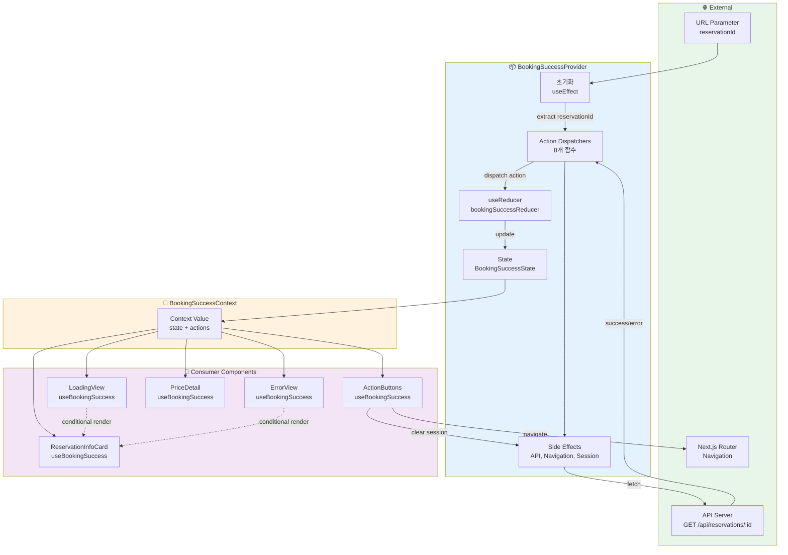
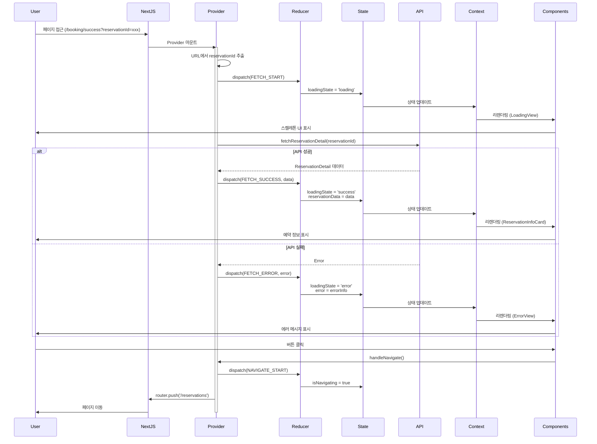
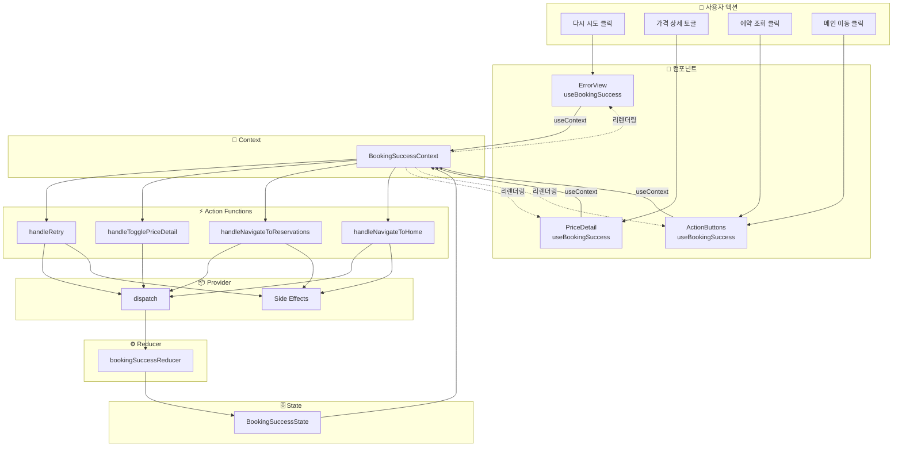
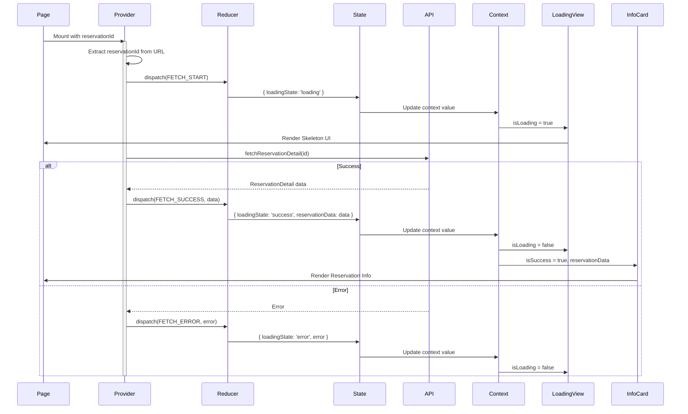
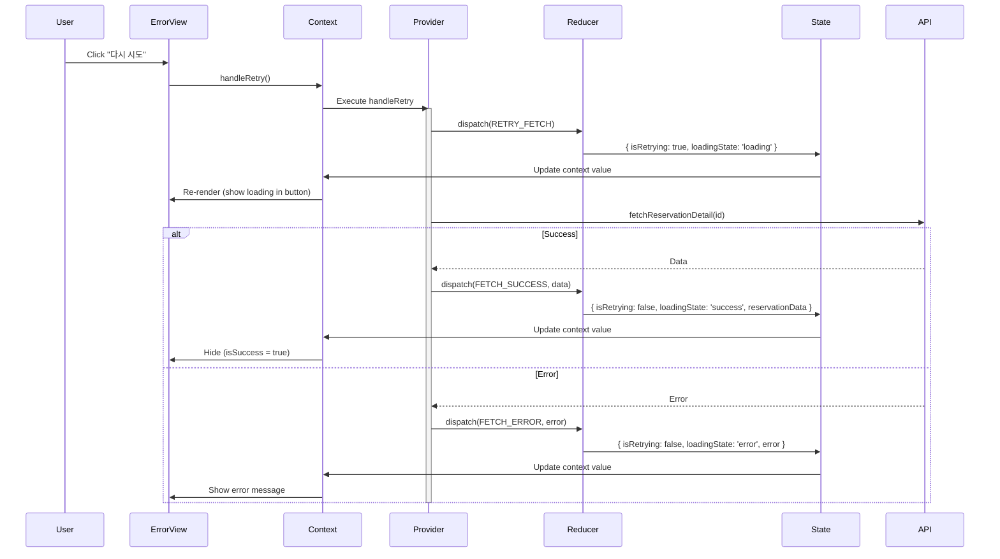
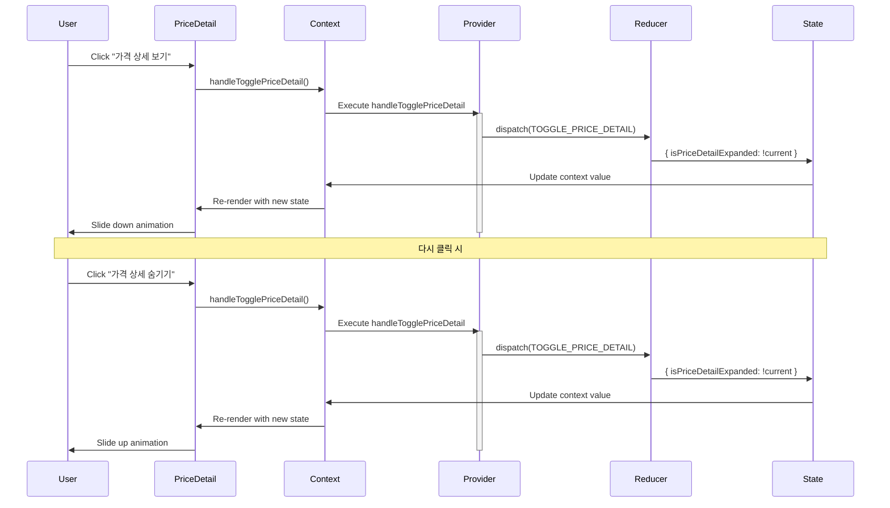
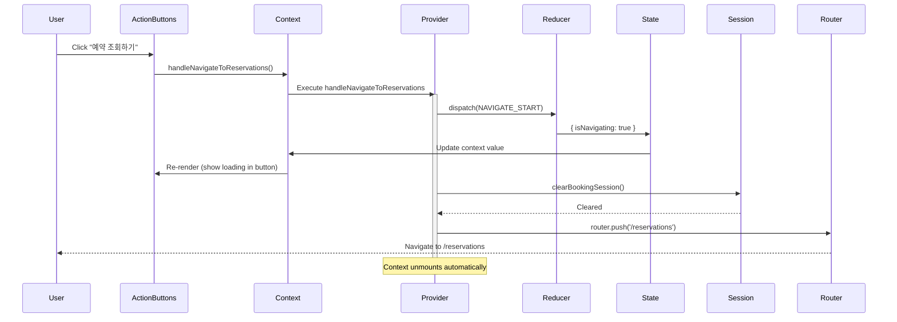
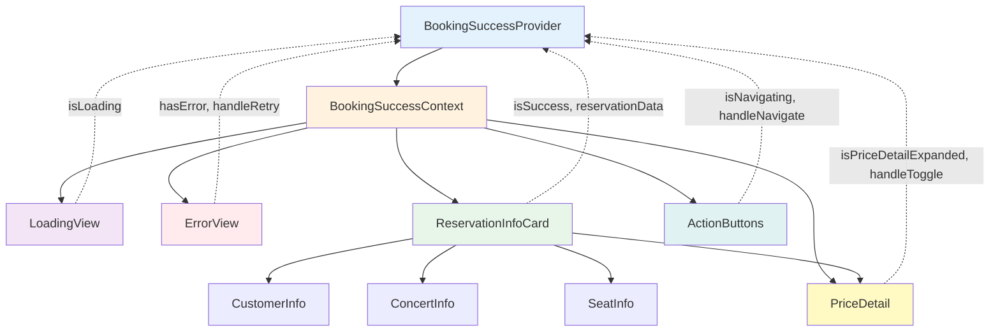

# 예약 완료 페이지 Context 설계

## 문서 정보
- **기능 ID**: F-006
- **기능명**: 예약 완료 페이지 - Context + useReducer 설계
- **작성일**: 2025-10-15
- **버전**: 1.0

---

## 1. Context 아키텍처 개요

### 1.1 Context 구조
```
BookingSuccessProvider (최상위)
    ├─ State (useReducer)
    ├─ Actions (dispatch 함수들)
    └─ Side Effects (useEffect)
         │
         └─> Context.Provider
              ├─ LoadingView
              ├─ ErrorView
              └─ ReservationInfoCard
                   ├─ Header
                   ├─ CustomerInfo
                   ├─ ConcertInfo
                   ├─ SeatInfo
                   ├─ PriceDetail
                   └─ ActionButtons
```

### 1.2 단방향 데이터 흐름
```
URL Parameter → Provider Mount → API Call → Reducer Update → Context Update → Component Re-render
     ↓                                                                              ↓
     └──────────────────────────────────────────────────────────────────────────────┘
                            User Interaction → Action Dispatch
```

---

## 2. Context 데이터 흐름 시각화

### 2.1 전체 데이터 흐름도



---

### 2.2 Provider 생명주기 흐름



---

### 2.3 사용자 인터랙션 흐름



---

## 3. Context Value 인터페이스

### 3.1 노출할 State (읽기 전용)

```typescript
/**
 * Context를 통해 하위 컴포넌트에 노출되는 State
 */
interface BookingSuccessContextState {
  // 로딩 상태
  loadingState: 'idle' | 'loading' | 'success' | 'error';
  isRetrying: boolean;
  
  // 데이터
  reservationData: ReservationDetail | null;
  
  // 에러
  error: ErrorInfo | null;
  
  // UI 상태
  isPriceDetailExpanded: boolean;
  isNavigating: boolean;
}
```

### 3.2 노출할 Actions (함수)

```typescript
/**
 * Context를 통해 하위 컴포넌트에 노출되는 Actions
 */
interface BookingSuccessContextActions {
  /**
   * 예약 정보 재시도
   * 
   * 사용처: ErrorView의 "다시 시도" 버튼
   * 
   * @returns void
   */
  handleRetry: () => void;
  
  /**
   * 가격 상세 토글
   * 
   * 사용처: PriceDetail의 "가격 상세 보기/숨기기" 버튼
   * 
   * @returns void
   */
  handleTogglePriceDetail: () => void;
  
  /**
   * 예약 조회 페이지로 이동
   * 
   * 사용처: ActionButtons의 "예약 조회하기" 버튼
   * 
   * @returns void
   */
  handleNavigateToReservations: () => void;
  
  /**
   * 메인 페이지로 이동
   * 
   * 사용처: ActionButtons의 "메인으로 돌아가기" 버튼
   *         ErrorView의 "메인으로 돌아가기" 버튼
   * 
   * @returns void
   */
  handleNavigateToHome: () => void;
}
```

### 3.3 노출할 Derived Data (계산된 값)

```typescript
/**
 * Context를 통해 하위 컴포넌트에 노출되는 파생 데이터
 * 
 * State로부터 계산되는 읽기 전용 값들
 */
interface BookingSuccessContextDerived {
  /**
   * 로딩 중 여부
   * 
   * 계산: loadingState === 'loading' || isRetrying
   * 사용처: LoadingView, 버튼 비활성화
   */
  isLoading: boolean;
  
  /**
   * 에러 발생 여부
   * 
   * 계산: loadingState === 'error' && error !== null
   * 사용처: ErrorView 조건부 렌더링
   */
  hasError: boolean;
  
  /**
   * 성공 상태 여부
   * 
   * 계산: loadingState === 'success' && reservationData !== null
   * 사용처: ReservationInfoCard 조건부 렌더링
   */
  isSuccess: boolean;
  
  /**
   * 재시도 버튼 표시 여부
   * 
   * 계산: hasError && error.retryable
   * 사용처: ErrorView의 "다시 시도" 버튼
   */
  showRetryButton: boolean;
  
  /**
   * 취소된 예약 여부
   * 
   * 계산: reservationData?.status === 'cancelled'
   * 사용처: 예약 상태 배지 표시
   */
  isCancelled: boolean;
  
  /**
   * 이메일 입력 여부
   * 
   * 계산: reservationData?.customerEmail != null
   * 사용처: 이메일 필드 조건부 렌더링
   */
  hasEmail: boolean;
}
```

### 3.4 전체 Context Value

```typescript
/**
 * BookingSuccessContext의 전체 Value 타입
 * 
 * 하위 컴포넌트에서 useBookingSuccess() Hook으로 접근
 */
type BookingSuccessContextValue = 
  & BookingSuccessContextState 
  & BookingSuccessContextActions 
  & BookingSuccessContextDerived;

/**
 * Context Value 전체 인터페이스 (확장된 형태)
 */
interface BookingSuccessContextValue {
  // ─────────────────────────────────────────────────
  // State (읽기 전용)
  // ─────────────────────────────────────────────────
  loadingState: 'idle' | 'loading' | 'success' | 'error';
  isRetrying: boolean;
  reservationData: ReservationDetail | null;
  error: ErrorInfo | null;
  isPriceDetailExpanded: boolean;
  isNavigating: boolean;
  
  // ─────────────────────────────────────────────────
  // Actions (함수)
  // ─────────────────────────────────────────────────
  handleRetry: () => void;
  handleTogglePriceDetail: () => void;
  handleNavigateToReservations: () => void;
  handleNavigateToHome: () => void;
  
  // ─────────────────────────────────────────────────
  // Derived Data (계산된 값, 읽기 전용)
  // ─────────────────────────────────────────────────
  isLoading: boolean;
  hasError: boolean;
  isSuccess: boolean;
  showRetryButton: boolean;
  isCancelled: boolean;
  hasEmail: boolean;
}
```

---

## 4. Provider 내부 구조 설계

### 4.1 Provider 구성 요소

```typescript
/**
 * Provider 내부 구성 요소
 */
interface BookingSuccessProviderInternals {
  // ─────────────────────────────────────────────────
  // 1. State 관리 (useReducer)
  // ─────────────────────────────────────────────────
  reducer: typeof bookingSuccessReducer;
  initialState: BookingSuccessState;
  state: BookingSuccessState;
  dispatch: React.Dispatch<BookingSuccessAction>;
  
  // ─────────────────────────────────────────────────
  // 2. URL 파라미터 추출
  // ─────────────────────────────────────────────────
  searchParams: URLSearchParams;
  reservationId: string | null;
  
  // ─────────────────────────────────────────────────
  // 3. 라우터
  // ─────────────────────────────────────────────────
  router: NextRouter;
  
  // ─────────────────────────────────────────────────
  // 4. Side Effect 함수들
  // ─────────────────────────────────────────────────
  loadReservation: (id: string) => Promise<void>;
  clearSession: () => void;
  navigateTo: (path: string) => void;
  
  // ─────────────────────────────────────────────────
  // 5. Action Handler 함수들 (useCallback)
  // ─────────────────────────────────────────────────
  handleRetry: () => void;
  handleTogglePriceDetail: () => void;
  handleNavigateToReservations: () => void;
  handleNavigateToHome: () => void;
  
  // ─────────────────────────────────────────────────
  // 6. Derived Data 계산 (useMemo)
  // ─────────────────────────────────────────────────
  isLoading: boolean;
  hasError: boolean;
  isSuccess: boolean;
  showRetryButton: boolean;
  isCancelled: boolean;
  hasEmail: boolean;
  
  // ─────────────────────────────────────────────────
  // 7. Context Value 조합
  // ─────────────────────────────────────────────────
  contextValue: BookingSuccessContextValue;
}
```

### 4.2 Provider Props

```typescript
/**
 * Provider Props
 */
interface BookingSuccessProviderProps {
  /**
   * 자식 컴포넌트들
   */
  children: React.ReactNode;
  
  /**
   * 초기 예약 ID (옵션, 테스트용)
   */
  initialReservationId?: string;
  
  /**
   * 초기 상태 (옵션, 테스트용)
   */
  initialState?: Partial<BookingSuccessState>;
}
```

---

## 5. Context 생성 및 Hook 인터페이스

### 5.1 Context 생성

```typescript
/**
 * BookingSuccessContext 정의
 * 
 * undefined를 기본값으로 하여 Provider 외부 사용 방지
 */
const BookingSuccessContext = createContext<BookingSuccessContextValue | undefined>(
  undefined
);

/**
 * Context Display Name (디버깅용)
 */
BookingSuccessContext.displayName = 'BookingSuccessContext';
```

### 5.2 Consumer Hook

```typescript
/**
 * useBookingSuccess Hook
 * 
 * BookingSuccessContext를 소비하는 커스텀 Hook
 * Provider 외부에서 사용 시 에러 발생
 * 
 * @returns BookingSuccessContextValue
 * @throws Error if used outside BookingSuccessProvider
 * 
 * @example
 * ```tsx
 * function ReservationInfoCard() {
 *   const { reservationData, isSuccess } = useBookingSuccess();
 *   
 *   if (!isSuccess || !reservationData) return null;
 *   
 *   return <div>{reservationData.reservationId}</div>;
 * }
 * ```
 */
function useBookingSuccess(): BookingSuccessContextValue;
```

---

## 6. 컴포넌트별 사용 인터페이스

### 6.1 LoadingView

```typescript
/**
 * LoadingView에서 사용하는 Context 값
 */
interface LoadingViewContext {
  // State
  isRetrying: boolean;
  
  // Derived
  isLoading: boolean;
}

/**
 * LoadingView 컴포넌트
 */
function LoadingView() {
  const { isRetrying, isLoading } = useBookingSuccess();
  
  // 조건부 렌더링 로직
  if (!isLoading) return null;
  
  // 렌더링
  // ...
}
```

### 6.2 ErrorView

```typescript
/**
 * ErrorView에서 사용하는 Context 값
 */
interface ErrorViewContext {
  // State
  error: ErrorInfo | null;
  
  // Derived
  hasError: boolean;
  showRetryButton: boolean;
  
  // Actions
  handleRetry: () => void;
  handleNavigateToHome: () => void;
}

/**
 * ErrorView 컴포넌트
 */
function ErrorView() {
  const { 
    error, 
    hasError, 
    showRetryButton,
    handleRetry,
    handleNavigateToHome 
  } = useBookingSuccess();
  
  // 조건부 렌더링 로직
  if (!hasError || !error) return null;
  
  // 렌더링
  // ...
}
```

### 6.3 ReservationInfoCard

```typescript
/**
 * ReservationInfoCard에서 사용하는 Context 값
 */
interface ReservationInfoCardContext {
  // State
  reservationData: ReservationDetail | null;
  
  // Derived
  isSuccess: boolean;
  isCancelled: boolean;
  hasEmail: boolean;
}

/**
 * ReservationInfoCard 컴포넌트
 */
function ReservationInfoCard() {
  const { 
    reservationData, 
    isSuccess, 
    isCancelled,
    hasEmail 
  } = useBookingSuccess();
  
  // 조건부 렌더링 로직
  if (!isSuccess || !reservationData) return null;
  
  // 렌더링
  // ...
}
```

### 6.4 PriceDetail

```typescript
/**
 * PriceDetail에서 사용하는 Context 값
 */
interface PriceDetailContext {
  // State
  reservationData: ReservationDetail | null;
  isPriceDetailExpanded: boolean;
  
  // Actions
  handleTogglePriceDetail: () => void;
}

/**
 * PriceDetail 컴포넌트
 */
function PriceDetail() {
  const { 
    reservationData,
    isPriceDetailExpanded,
    handleTogglePriceDetail 
  } = useBookingSuccess();
  
  if (!reservationData) return null;
  
  // 렌더링
  // ...
}
```

### 6.5 ActionButtons

```typescript
/**
 * ActionButtons에서 사용하는 Context 값
 */
interface ActionButtonsContext {
  // State
  isNavigating: boolean;
  
  // Actions
  handleNavigateToReservations: () => void;
  handleNavigateToHome: () => void;
}

/**
 * ActionButtons 컴포넌트
 */
function ActionButtons() {
  const { 
    isNavigating,
    handleNavigateToReservations,
    handleNavigateToHome 
  } = useBookingSuccess();
  
  // 렌더링
  // ...
}
```

---

## 7. Context 데이터 흐름 상세

### 7.1 초기 로딩 플로우



---

### 7.2 재시도 플로우



---

### 7.3 가격 상세 토글 플로우



---

### 7.4 페이지 네비게이션 플로우



---

## 8. Context 최적화 전략

### 8.1 리렌더링 최적화

```typescript
/**
 * Context Value 최적화
 * 
 * 1. useMemo로 Context Value 메모이제이션
 * 2. useCallback으로 함수 메모이제이션
 * 3. Derived Data는 useMemo로 계산
 */
interface OptimizationStrategy {
  // Context Value를 useMemo로 감싸기
  contextValue: ReturnType<typeof useMemo<BookingSuccessContextValue>>;
  
  // 모든 핸들러 함수를 useCallback으로 감싸기
  handlers: {
    handleRetry: ReturnType<typeof useCallback>;
    handleTogglePriceDetail: ReturnType<typeof useCallback>;
    handleNavigateToReservations: ReturnType<typeof useCallback>;
    handleNavigateToHome: ReturnType<typeof useCallback>;
  };
  
  // Derived Data를 useMemo로 계산
  derivedData: {
    isLoading: ReturnType<typeof useMemo<boolean>>;
    hasError: ReturnType<typeof useMemo<boolean>>;
    isSuccess: ReturnType<typeof useMemo<boolean>>;
    showRetryButton: ReturnType<typeof useMemo<boolean>>;
    isCancelled: ReturnType<typeof useMemo<boolean>>;
    hasEmail: ReturnType<typeof useMemo<boolean>>;
  };
}
```

### 8.2 Context 분리 전략 (옵션)

필요시 Context를 State와 Actions로 분리할 수 있습니다.

```typescript
/**
 * State Context (자주 변경)
 */
const BookingSuccessStateContext = createContext<BookingSuccessContextState | undefined>(
  undefined
);

/**
 * Actions Context (변경 없음)
 */
const BookingSuccessActionsContext = createContext<BookingSuccessContextActions | undefined>(
  undefined
);

/**
 * Derived Context (State에 의존)
 */
const BookingSuccessDerivedContext = createContext<BookingSuccessContextDerived | undefined>(
  undefined
);
```

**장점:**
- State 변경 시 Actions를 사용하는 컴포넌트는 리렌더링 안 됨
- 성능 최적화

**단점:**
- 복잡도 증가
- 3개 Context 관리 필요

**권장:**
- 현재 페이지는 단순하므로 단일 Context 사용
- 성능 문제 발생 시에만 분리 고려

---

## 9. 에러 처리 전략

### 9.1 Provider 레벨 에러 처리

```typescript
/**
 * Provider 내부 에러 처리
 */
interface ErrorHandlingStrategy {
  /**
   * API 에러 처리
   * 
   * - 404: NOT_FOUND → 재시도 불가
   * - 500: SERVER_ERROR → 재시도 가능
   * - Network: NETWORK_ERROR → 재시도 가능
   */
  handleAPIError: (error: unknown) => ErrorInfo;
  
  /**
   * URL 파라미터 에러 처리
   * 
   * - 없음: MISSING_ID → 리다이렉트
   * - 유효하지 않음: INVALID_ID → 리다이렉트
   */
  handleURLError: (reservationId: string | null) => ErrorInfo | null;
  
  /**
   * 예외 상황 에러 처리
   * 
   * - 네트워크 오프라인
   * - 세션 만료
   * - 권한 없음
   */
  handleExceptionError: (error: unknown) => ErrorInfo;
}
```

### 9.2 에러 경계 (Error Boundary)

```typescript
/**
 * Provider를 감싸는 Error Boundary
 * 
 * Provider 내부에서 발생한 예외를 잡아서 처리
 */
interface ErrorBoundaryProps {
  children: React.ReactNode;
  fallback?: React.ReactNode;
  onError?: (error: Error, errorInfo: React.ErrorInfo) => void;
}

/**
 * BookingSuccessErrorBoundary 컴포넌트
 */
function BookingSuccessErrorBoundary(props: ErrorBoundaryProps): React.ReactElement;
```

---

## 10. 테스트 전략

### 10.1 Provider 테스트

```typescript
/**
 * Provider 테스트 헬퍼
 */
interface ProviderTestHelper {
  /**
   * Provider를 테스트 환경에서 렌더링
   */
  renderWithProvider: (
    ui: React.ReactElement,
    options?: {
      initialState?: Partial<BookingSuccessState>;
      initialReservationId?: string;
    }
  ) => RenderResult;
  
  /**
   * Mock API 응답 설정
   */
  mockAPIResponse: (
    reservationId: string,
    response: ReservationDetail | Error
  ) => void;
  
  /**
   * Mock Router 설정
   */
  mockRouter: (router: Partial<NextRouter>) => void;
}
```

### 10.2 Context Hook 테스트

```typescript
/**
 * useBookingSuccess Hook 테스트
 */
describe('useBookingSuccess', () => {
  it('Provider 외부에서 사용 시 에러 발생', () => {
    expect(() => {
      renderHook(() => useBookingSuccess());
    }).toThrow('useBookingSuccess must be used within BookingSuccessProvider');
  });
  
  it('Provider 내부에서 정상 동작', () => {
    const { result } = renderHook(() => useBookingSuccess(), {
      wrapper: BookingSuccessProvider,
    });
    
    expect(result.current).toBeDefined();
    expect(result.current.loadingState).toBe('idle');
  });
});
```

---

## 11. 하위 컴포넌트별 Context 사용 요약

### 11.1 컴포넌트별 사용 테이블

| 컴포넌트 | 사용 State | 사용 Derived | 사용 Actions | 렌더링 조건 |
|----------|-----------|--------------|--------------|-------------|
| **LoadingView** | `isRetrying` | `isLoading` | - | `isLoading === true` |
| **ErrorView** | `error` | `hasError`<br/>`showRetryButton` | `handleRetry`<br/>`handleNavigateToHome` | `hasError === true` |
| **ReservationInfoCard** | `reservationData` | `isSuccess`<br/>`isCancelled`<br/>`hasEmail` | - | `isSuccess === true` |
| **CustomerInfo** | `reservationData` | `hasEmail` | - | `reservationData !== null` |
| **ConcertInfo** | `reservationData` | - | - | `reservationData !== null` |
| **SeatInfo** | `reservationData` | - | - | `reservationData !== null` |
| **PriceDetail** | `reservationData`<br/>`isPriceDetailExpanded` | - | `handleTogglePriceDetail` | `reservationData !== null` |
| **ActionButtons** | `isNavigating` | - | `handleNavigateToReservations`<br/>`handleNavigateToHome` | 항상 표시 |

### 11.2 Context 사용 의존성 그래프



---

## 12. Provider 구조 요약

### 12.1 Provider 레이어 구조

```
┌─────────────────────────────────────────────────────────┐
│ BookingSuccessProvider                                  │
│                                                         │
│  ┌───────────────────────────────────────────────────┐ │
│  │ useReducer (State 관리)                           │ │
│  │  - bookingSuccessReducer                          │ │
│  │  - initialState                                   │ │
│  └───────────────────────────────────────────────────┘ │
│                                                         │
│  ┌───────────────────────────────────────────────────┐ │
│  │ URL Parameters (useSearchParams)                  │ │
│  │  - reservationId 추출                             │ │
│  └───────────────────────────────────────────────────┘ │
│                                                         │
│  ┌───────────────────────────────────────────────────┐ │
│  │ Side Effects (useEffect)                          │ │
│  │  - 초기 로딩                                       │ │
│  │  - API 호출                                        │ │
│  │  - 세션 정리                                       │ │
│  └───────────────────────────────────────────────────┘ │
│                                                         │
│  ┌───────────────────────────────────────────────────┐ │
│  │ Actions (useCallback)                             │ │
│  │  - handleRetry                                    │ │
│  │  - handleTogglePriceDetail                        │ │
│  │  - handleNavigateToReservations                   │ │
│  │  - handleNavigateToHome                           │ │
│  └───────────────────────────────────────────────────┘ │
│                                                         │
│  ┌───────────────────────────────────────────────────┐ │
│  │ Derived Data (useMemo)                            │ │
│  │  - isLoading                                      │ │
│  │  - hasError                                       │ │
│  │  - isSuccess                                      │ │
│  │  - showRetryButton                                │ │
│  │  - isCancelled                                    │ │
│  │  - hasEmail                                       │ │
│  └───────────────────────────────────────────────────┘ │
│                                                         │
│  ┌───────────────────────────────────────────────────┐ │
│  │ Context Value (useMemo)                           │ │
│  │  - State + Actions + Derived                      │ │
│  └───────────────────────────────────────────────────┘ │
│                                                         │
│  ┌───────────────────────────────────────────────────┐ │
│  │ Context.Provider                                  │ │
│  │  └─ {children}                                    │ │
│  └───────────────────────────────────────────────────┘ │
└─────────────────────────────────────────────────────────┘
```

### 12.2 데이터 흐름 요약

```
1. Mount → URL 파라미터 추출 → reservationId
2. useEffect → API 호출 → dispatch(FETCH_START)
3. Reducer → State 업데이트 → loadingState: 'loading'
4. Context Value 재계산 → useMemo
5. Provider 리렌더링 → Context.Provider
6. Consumer 리렌더링 → useBookingSuccess()
7. 조건부 렌더링 → LoadingView | ErrorView | ReservationInfoCard
8. User Interaction → Handler 호출 → dispatch(ACTION)
9. Reducer → State 업데이트
10. Context Value 재계산 → 6번으로 순환
```

---

## 13. Context 설계 체크리스트

### 13.1 설계 완료 항목

- [x] Context 생성 인터페이스 정의
- [x] Provider Props 정의
- [x] Context Value 타입 정의
  - [x] State 인터페이스
  - [x] Actions 인터페이스
  - [x] Derived Data 인터페이스
- [x] Provider 내부 구조 설계
- [x] Consumer Hook 인터페이스 정의
- [x] 컴포넌트별 사용 인터페이스 정의
- [x] 데이터 흐름 시각화 (4개 다이어그램)
- [x] 최적화 전략 정의
- [x] 에러 처리 전략 정의
- [x] 테스트 전략 정의

### 13.2 구현 시 주의사항

1. **Provider는 최상위에 한 번만 배치**
   - BookingSuccessPage의 최상위
   - 중첩 Provider 금지

2. **useContext는 커스텀 Hook으로 래핑**
   - `useBookingSuccess()` 사용
   - 직접 `useContext(BookingSuccessContext)` 금지

3. **모든 핸들러는 useCallback으로 메모이제이션**
   - 불필요한 리렌더링 방지

4. **Context Value는 useMemo로 메모이제이션**
   - 의존성 배열 정확히 설정

5. **Derived Data는 useMemo로 계산**
   - State가 변경될 때만 재계산

6. **Side Effect는 useEffect로 분리**
   - 순수 함수 유지

---

## 14. 요약

### 14.1 핵심 설계 포인트

1. **Context + useReducer 조합**
   - Context: 전역 상태 공유
   - useReducer: 복잡한 상태 관리
   - 단방향 데이터 흐름 보장

2. **명확한 인터페이스 분리**
   - State: 읽기 전용
   - Actions: 상태 변경 함수
   - Derived: 계산된 값

3. **최적화된 구조**
   - useMemo로 Context Value 메모이제이션
   - useCallback으로 함수 메모이제이션
   - 조건부 렌더링으로 불필요한 컴포넌트 제거

4. **명확한 데이터 흐름**
   - 4개 Sequence Diagram으로 시각화
   - 각 상호작용별 명확한 흐름 정의

### 14.2 노출 인터페이스 요약

| 카테고리 | 개수 | 항목 |
|----------|------|------|
| **State** | 6개 | `loadingState`, `isRetrying`, `reservationData`, `error`, `isPriceDetailExpanded`, `isNavigating` |
| **Actions** | 4개 | `handleRetry`, `handleTogglePriceDetail`, `handleNavigateToReservations`, `handleNavigateToHome` |
| **Derived** | 6개 | `isLoading`, `hasError`, `isSuccess`, `showRetryButton`, `isCancelled`, `hasEmail` |
| **총계** | **16개** | State 6 + Actions 4 + Derived 6 |

이 문서는 예약 완료 페이지의 Context + useReducer 설계를 완전히 정의하며, 구현 가이드로 사용할 수 있습니다.

