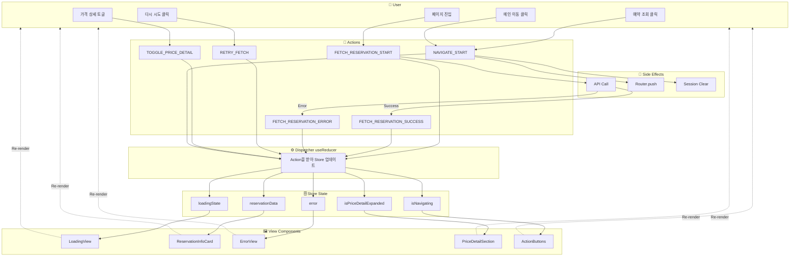
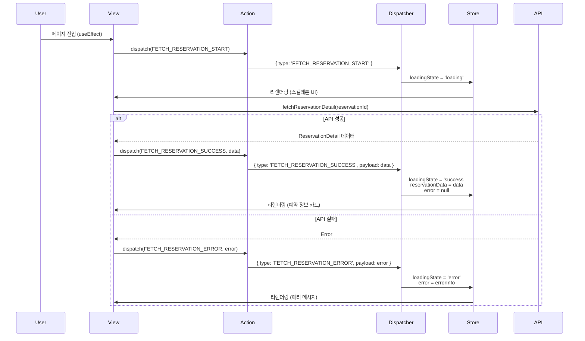
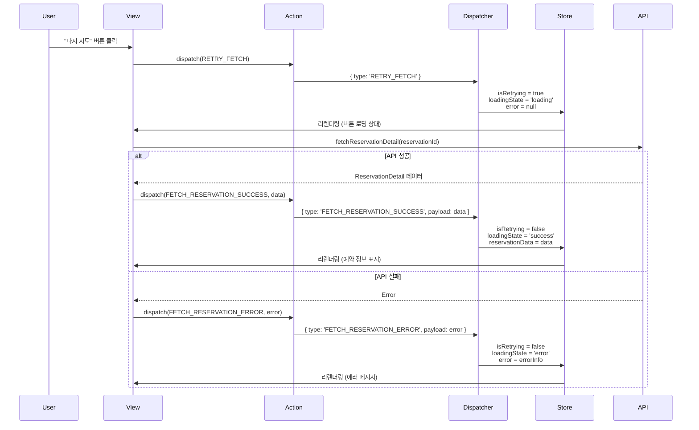
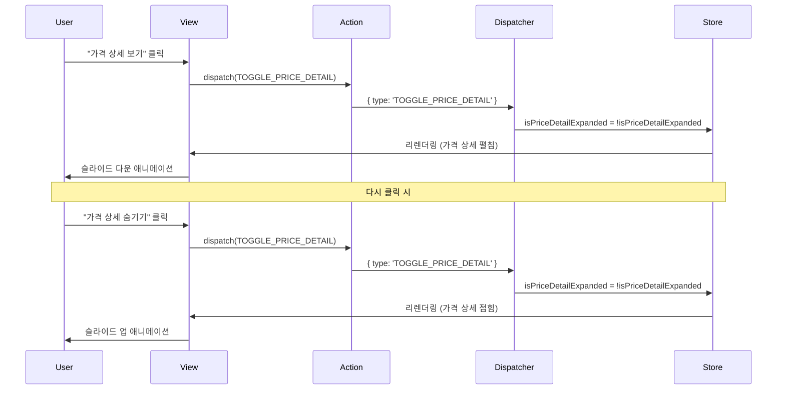
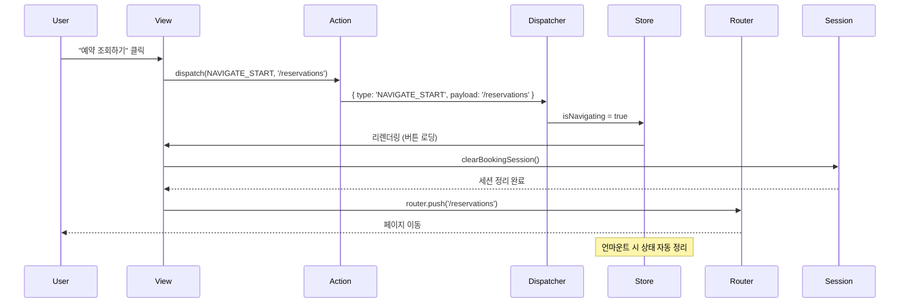
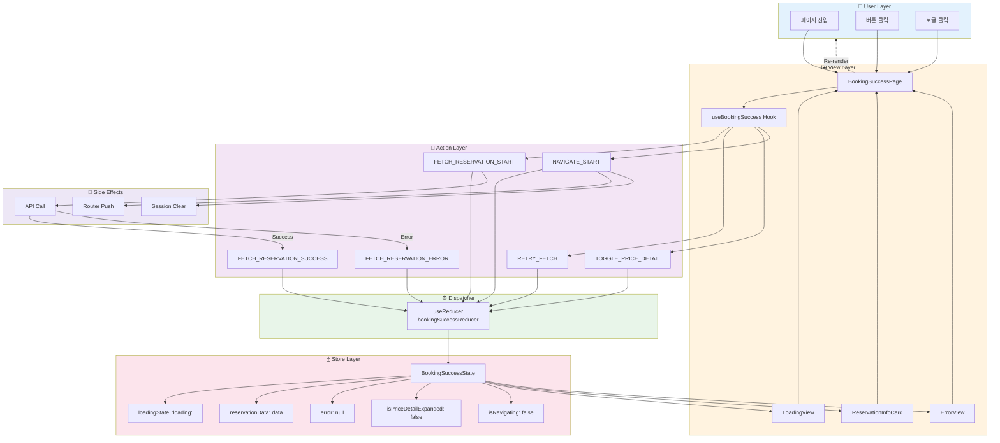

# 예약 완료 페이지 Flux 패턴 설계

## 문서 정보
- **기능 ID**: F-006
- **기능명**: 예약 완료 페이지 - Flux 패턴 구현
- **작성일**: 2025-10-15
- **버전**: 1.0

---

## 1. Flux 패턴 개요

### 1.1 Flux 아키텍처
```
User Interaction → Action → Dispatcher → Store → View → User
                      ↑                                   ↓
                      └───────────────────────────────────┘
```

### 1.2 단방향 데이터 흐름
- **Action**: 사용자 이벤트 또는 시스템 이벤트를 표현하는 객체
- **Dispatcher**: Action을 Store로 전달하는 중앙 허브 (React의 useReducer)
- **Store**: 애플리케이션 상태를 보유하고 업데이트하는 단일 진실 공급원
- **View**: Store의 상태를 구독하고 렌더링하는 React 컴포넌트

---

## 2. 전체 시스템 Flux 흐름도



---

## 3. 상태별 Flux 흐름 상세

### 3.1 예약 정보 로딩 플로우



---

### 3.2 재시도 플로우



---

### 3.3 가격 상세 토글 플로우



---

### 3.4 페이지 네비게이션 플로우



---

## 4. Action 타입 정의

### 4.1 Action Types (TypeScript)

```typescript
// src/features/booking/success/types/actions.ts

/**
 * Action 타입 상수
 */
export const ActionTypes = {
  // 예약 정보 로딩 관련
  FETCH_RESERVATION_START: 'FETCH_RESERVATION_START',
  FETCH_RESERVATION_SUCCESS: 'FETCH_RESERVATION_SUCCESS',
  FETCH_RESERVATION_ERROR: 'FETCH_RESERVATION_ERROR',
  
  // 재시도 관련
  RETRY_FETCH: 'RETRY_FETCH',
  
  // UI 인터랙션 관련
  TOGGLE_PRICE_DETAIL: 'TOGGLE_PRICE_DETAIL',
  
  // 네비게이션 관련
  NAVIGATE_START: 'NAVIGATE_START',
  
  // 초기화 관련
  RESET_STATE: 'RESET_STATE',
} as const;

/**
 * 예약 상세 정보 인터페이스
 */
export interface ReservationDetail {
  reservationId: string;
  customerName: string;
  customerPhone: string;
  customerEmail?: string;
  status: 'confirmed' | 'cancelled';
  createdAt: string;
  cancelledAt?: string;
  concert: {
    id: string;
    title: string;
    posterImageUrl: string;
  };
  schedule: {
    id: string;
    dateTime: string;
  };
  seats: Array<{
    id: string;
    seatNumber: string;
    grade: string;
    price: number;
  }>;
  totalPrice: number;
}

/**
 * 에러 정보 인터페이스
 */
export interface ErrorInfo {
  code: 'NOT_FOUND' | 'SERVER_ERROR' | 'NETWORK_ERROR' | 'INVALID_ID' | 'MISSING_ID';
  message: string;
  retryable: boolean;
}

/**
 * Action 타입 정의
 */
export type BookingSuccessAction =
  | { type: typeof ActionTypes.FETCH_RESERVATION_START }
  | { type: typeof ActionTypes.FETCH_RESERVATION_SUCCESS; payload: ReservationDetail }
  | { type: typeof ActionTypes.FETCH_RESERVATION_ERROR; payload: ErrorInfo }
  | { type: typeof ActionTypes.RETRY_FETCH }
  | { type: typeof ActionTypes.TOGGLE_PRICE_DETAIL }
  | { type: typeof ActionTypes.NAVIGATE_START; payload: string }
  | { type: typeof ActionTypes.RESET_STATE };
```

---

## 5. Store (State) 정의

### 5.1 State 인터페이스

```typescript
// src/features/booking/success/types/state.ts

import { ReservationDetail, ErrorInfo } from './actions';

/**
 * 로딩 상태 타입
 */
export type LoadingState = 'idle' | 'loading' | 'success' | 'error';

/**
 * 예약 완료 페이지 전체 상태
 */
export interface BookingSuccessState {
  // 로딩 상태
  loadingState: LoadingState;
  isRetrying: boolean;
  
  // 데이터
  reservationData: ReservationDetail | null;
  
  // 에러
  error: ErrorInfo | null;
  
  // UI 상태
  isPriceDetailExpanded: boolean;
  isNavigating: boolean;
}

/**
 * 초기 상태
 */
export const initialState: BookingSuccessState = {
  loadingState: 'idle',
  isRetrying: false,
  reservationData: null,
  error: null,
  isPriceDetailExpanded: false,
  isNavigating: false,
};
```

---

## 6. Reducer 구현 (최신 표준)

### 6.1 Reducer 함수

```typescript
// src/features/booking/success/store/reducer.ts

import { BookingSuccessState, initialState } from '../types/state';
import { BookingSuccessAction, ActionTypes } from '../types/actions';

/**
 * 예약 완료 페이지 Reducer
 * 
 * Flux 패턴의 Store 역할을 수행합니다.
 * 모든 상태 변경은 이 Reducer를 통해서만 이루어집니다.
 */
export function bookingSuccessReducer(
  state: BookingSuccessState,
  action: BookingSuccessAction
): BookingSuccessState {
  switch (action.type) {
    /**
     * 예약 정보 로딩 시작
     */
    case ActionTypes.FETCH_RESERVATION_START:
      return {
        ...state,
        loadingState: 'loading',
        error: null,
      };

    /**
     * 예약 정보 로딩 성공
     */
    case ActionTypes.FETCH_RESERVATION_SUCCESS:
      return {
        ...state,
        loadingState: 'success',
        isRetrying: false,
        reservationData: action.payload,
        error: null,
      };

    /**
     * 예약 정보 로딩 실패
     */
    case ActionTypes.FETCH_RESERVATION_ERROR:
      return {
        ...state,
        loadingState: 'error',
        isRetrying: false,
        error: action.payload,
      };

    /**
     * 재시도 시작
     */
    case ActionTypes.RETRY_FETCH:
      return {
        ...state,
        loadingState: 'loading',
        isRetrying: true,
        error: null,
      };

    /**
     * 가격 상세 토글
     */
    case ActionTypes.TOGGLE_PRICE_DETAIL:
      return {
        ...state,
        isPriceDetailExpanded: !state.isPriceDetailExpanded,
      };

    /**
     * 페이지 네비게이션 시작
     */
    case ActionTypes.NAVIGATE_START:
      return {
        ...state,
        isNavigating: true,
      };

    /**
     * 상태 초기화
     */
    case ActionTypes.RESET_STATE:
      return initialState;

    /**
     * 알 수 없는 액션 타입 (무시)
     */
    default:
      return state;
  }
}
```

---

## 7. Action Creators (옵션)

### 7.1 Action Creator 함수

```typescript
// src/features/booking/success/store/actions.ts

import { BookingSuccessAction, ActionTypes, ReservationDetail, ErrorInfo } from '../types/actions';

/**
 * Action Creator 함수들
 * 
 * Action 객체 생성을 캡슐화하여 타입 안정성을 보장합니다.
 */
export const actionCreators = {
  /**
   * 예약 정보 로딩 시작
   */
  fetchReservationStart: (): BookingSuccessAction => ({
    type: ActionTypes.FETCH_RESERVATION_START,
  }),

  /**
   * 예약 정보 로딩 성공
   */
  fetchReservationSuccess: (data: ReservationDetail): BookingSuccessAction => ({
    type: ActionTypes.FETCH_RESERVATION_SUCCESS,
    payload: data,
  }),

  /**
   * 예약 정보 로딩 실패
   */
  fetchReservationError: (error: ErrorInfo): BookingSuccessAction => ({
    type: ActionTypes.FETCH_RESERVATION_ERROR,
    payload: error,
  }),

  /**
   * 재시도
   */
  retryFetch: (): BookingSuccessAction => ({
    type: ActionTypes.RETRY_FETCH,
  }),

  /**
   * 가격 상세 토글
   */
  togglePriceDetail: (): BookingSuccessAction => ({
    type: ActionTypes.TOGGLE_PRICE_DETAIL,
  }),

  /**
   * 페이지 네비게이션 시작
   */
  navigateStart: (path: string): BookingSuccessAction => ({
    type: ActionTypes.NAVIGATE_START,
    payload: path,
  }),

  /**
   * 상태 초기화
   */
  resetState: (): BookingSuccessAction => ({
    type: ActionTypes.RESET_STATE,
  }),
};
```

---

## 8. Custom Hook 구현

### 8.1 메인 Hook

```typescript
// src/features/booking/success/hooks/useBookingSuccess.ts

'use client';

import { useReducer, useEffect, useCallback } from 'react';
import { useSearchParams, useRouter } from 'next/navigation';
import { bookingSuccessReducer } from '../store/reducer';
import { initialState } from '../types/state';
import { actionCreators } from '../store/actions';
import { fetchReservationDetail } from '../api/reservation';
import { clearBookingSession } from '../lib/session';

/**
 * 예약 완료 페이지 메인 Hook
 * 
 * Flux 패턴의 View에서 사용하는 Hook입니다.
 * useReducer를 사용하여 단방향 데이터 흐름을 구현합니다.
 */
export function useBookingSuccess() {
  // Store (useReducer)
  const [state, dispatch] = useReducer(bookingSuccessReducer, initialState);
  
  // URL 파라미터에서 예약 ID 추출
  const searchParams = useSearchParams();
  const reservationId = searchParams.get('reservationId');
  
  // 라우터
  const router = useRouter();

  /**
   * 예약 정보 로딩 함수
   */
  const loadReservation = useCallback(async (id: string) => {
    // Action: FETCH_RESERVATION_START
    dispatch(actionCreators.fetchReservationStart());

    try {
      // Side Effect: API 호출
      const data = await fetchReservationDetail(id);
      
      // Action: FETCH_RESERVATION_SUCCESS
      dispatch(actionCreators.fetchReservationSuccess(data));
    } catch (error) {
      // 에러 처리
      const errorInfo = parseError(error);
      
      // Action: FETCH_RESERVATION_ERROR
      dispatch(actionCreators.fetchReservationError(errorInfo));
    }
  }, []);

  /**
   * 재시도 핸들러
   */
  const handleRetry = useCallback(() => {
    if (!reservationId) return;
    
    // Action: RETRY_FETCH
    dispatch(actionCreators.retryFetch());
    
    // Side Effect: API 재호출
    loadReservation(reservationId);
  }, [reservationId, loadReservation]);

  /**
   * 가격 상세 토글 핸들러
   */
  const handleTogglePriceDetail = useCallback(() => {
    // Action: TOGGLE_PRICE_DETAIL
    dispatch(actionCreators.togglePriceDetail());
  }, []);

  /**
   * 예약 조회 페이지로 이동
   */
  const handleNavigateToReservations = useCallback(() => {
    // Action: NAVIGATE_START
    dispatch(actionCreators.navigateStart('/reservations'));
    
    // Side Effect: 세션 정리
    clearBookingSession();
    
    // Side Effect: 페이지 이동
    router.push('/reservations');
  }, [router]);

  /**
   * 메인 페이지로 이동
   */
  const handleNavigateToHome = useCallback(() => {
    // Action: NAVIGATE_START
    dispatch(actionCreators.navigateStart('/'));
    
    // Side Effect: 세션 정리
    clearBookingSession();
    
    // Side Effect: 페이지 이동
    router.push('/');
  }, [router]);

  /**
   * 초기 로딩 (컴포넌트 마운트 시)
   */
  useEffect(() => {
    if (!reservationId) {
      // 예약 ID가 없으면 에러 처리
      dispatch(actionCreators.fetchReservationError({
        code: 'MISSING_ID',
        message: '예약 번호가 필요합니다.',
        retryable: false,
      }));
      
      // 3초 후 리다이렉트
      setTimeout(() => {
        router.push('/reservations');
      }, 3000);
      
      return;
    }

    // 예약 정보 로딩
    loadReservation(reservationId);
  }, [reservationId, loadReservation, router]);

  /**
   * 언마운트 시 정리
   */
  useEffect(() => {
    return () => {
      // Action: RESET_STATE
      dispatch(actionCreators.resetState());
    };
  }, []);

  return {
    // State
    state,
    
    // Handlers
    handleRetry,
    handleTogglePriceDetail,
    handleNavigateToReservations,
    handleNavigateToHome,
  };
}

/**
 * 에러 파싱 헬퍼 함수
 */
function parseError(error: unknown): ErrorInfo {
  if (error instanceof Response) {
    if (error.status === 404) {
      return {
        code: 'NOT_FOUND',
        message: '예약 정보를 찾을 수 없습니다.',
        retryable: false,
      };
    }
    if (error.status >= 500) {
      return {
        code: 'SERVER_ERROR',
        message: '서버 오류가 발생했습니다. 잠시 후 다시 시도해 주세요.',
        retryable: true,
      };
    }
  }
  
  // 네트워크 오류
  return {
    code: 'NETWORK_ERROR',
    message: '네트워크 연결을 확인해 주세요.',
    retryable: true,
  };
}
```

---

## 9. View 컴포넌트 구현

### 9.1 메인 페이지 컴포넌트

```typescript
// src/app/booking/success/page.tsx

'use client';

import { useBookingSuccess } from '@/features/booking/success/hooks/useBookingSuccess';
import { LoadingView } from '@/features/booking/success/components/LoadingView';
import { ErrorView } from '@/features/booking/success/components/ErrorView';
import { ReservationInfoCard } from '@/features/booking/success/components/ReservationInfoCard';
import { ActionButtons } from '@/features/booking/success/components/ActionButtons';

/**
 * 예약 완료 페이지 컴포넌트
 * 
 * Flux 패턴의 View 역할을 합니다.
 * Store의 상태를 구독하고 렌더링합니다.
 */
export default function BookingSuccessPage() {
  // Store 구독 및 Handlers
  const {
    state,
    handleRetry,
    handleTogglePriceDetail,
    handleNavigateToReservations,
    handleNavigateToHome,
  } = useBookingSuccess();

  // 로딩 상태별 렌더링
  if (state.loadingState === 'loading' || state.loadingState === 'idle') {
    return <LoadingView isRetrying={state.isRetrying} />;
  }

  if (state.loadingState === 'error' && state.error) {
    return (
      <ErrorView
        error={state.error}
        onRetry={handleRetry}
        onNavigateHome={handleNavigateToHome}
      />
    );
  }

  if (state.loadingState === 'success' && state.reservationData) {
    return (
      <div className="container mx-auto py-8">
        {/* 성공 메시지 */}
        <div className="text-center mb-8">
          <div className="text-green-500 mb-4">
            <CheckCircleIcon className="w-16 h-16 mx-auto" />
          </div>
          <h1 className="text-3xl font-bold mb-2">예약이 완료되었습니다!</h1>
          <p className="text-gray-600">예약 정보를 확인해 주세요</p>
        </div>

        {/* 예약 정보 카드 */}
        <ReservationInfoCard
          data={state.reservationData}
          isPriceDetailExpanded={state.isPriceDetailExpanded}
          onTogglePriceDetail={handleTogglePriceDetail}
        />

        {/* 액션 버튼 */}
        <ActionButtons
          isNavigating={state.isNavigating}
          onNavigateToReservations={handleNavigateToReservations}
          onNavigateToHome={handleNavigateToHome}
        />
      </div>
    );
  }

  return null;
}
```

### 9.2 로딩 뷰 컴포넌트

```typescript
// src/features/booking/success/components/LoadingView.tsx

'use client';

interface LoadingViewProps {
  isRetrying: boolean;
}

/**
 * 로딩 상태 View 컴포넌트
 */
export function LoadingView({ isRetrying }: LoadingViewProps) {
  return (
    <div className="container mx-auto py-8">
      <div className="max-w-2xl mx-auto">
        {/* 스켈레톤 UI */}
        <div className="animate-pulse">
          <div className="h-16 bg-gray-200 rounded mb-4" />
          <div className="h-64 bg-gray-200 rounded mb-4" />
          <div className="h-32 bg-gray-200 rounded mb-4" />
        </div>
        
        <p className="text-center text-gray-600 mt-4">
          {isRetrying ? '다시 시도 중입니다...' : '예약 정보를 불러오는 중입니다...'}
        </p>
      </div>
    </div>
  );
}
```

### 9.3 에러 뷰 컴포넌트

```typescript
// src/features/booking/success/components/ErrorView.tsx

'use client';

import { ErrorInfo } from '../types/actions';

interface ErrorViewProps {
  error: ErrorInfo;
  onRetry: () => void;
  onNavigateHome: () => void;
}

/**
 * 에러 상태 View 컴포넌트
 */
export function ErrorView({ error, onRetry, onNavigateHome }: ErrorViewProps) {
  return (
    <div className="container mx-auto py-8">
      <div className="max-w-md mx-auto text-center">
        {/* 에러 아이콘 */}
        <div className="text-red-500 mb-4">
          <XCircleIcon className="w-16 h-16 mx-auto" />
        </div>
        
        {/* 에러 메시지 */}
        <h2 className="text-2xl font-bold mb-2">오류가 발생했습니다</h2>
        <p className="text-gray-600 mb-6">{error.message}</p>
        
        {/* 액션 버튼 */}
        <div className="flex gap-4 justify-center">
          {error.retryable && (
            <button
              onClick={onRetry}
              className="px-6 py-2 bg-blue-500 text-white rounded hover:bg-blue-600"
            >
              다시 시도
            </button>
          )}
          <button
            onClick={onNavigateHome}
            className="px-6 py-2 border border-gray-300 rounded hover:bg-gray-50"
          >
            메인으로 돌아가기
          </button>
        </div>
      </div>
    </div>
  );
}
```

---

## 10. Flux 패턴 흐름도 통합 버전



---

## 11. 디버깅 가이드

### 11.1 Redux DevTools 통합 (선택사항)

```typescript
// src/features/booking/success/hooks/useBookingSuccess.ts

import { useReducer, useEffect } from 'react';

export function useBookingSuccess() {
  const [state, dispatch] = useReducer(
    bookingSuccessReducer,
    initialState,
    // Redux DevTools 지원
    process.env.NODE_ENV === 'development'
      ? (initial) => {
          // @ts-ignore
          window.__REDUX_DEVTOOLS_EXTENSION__?.connect({ name: 'BookingSuccess' });
          return initial;
        }
      : undefined
  );

  // DevTools로 액션 전송
  useEffect(() => {
    if (process.env.NODE_ENV === 'development') {
      // @ts-ignore
      window.__REDUX_DEVTOOLS_EXTENSION__?.send('State Updated', state);
    }
  }, [state]);

  // ... 나머지 코드
}
```

### 11.2 로깅 Middleware (커스텀)

```typescript
// src/features/booking/success/middleware/logger.ts

import { BookingSuccessState } from '../types/state';
import { BookingSuccessAction } from '../types/actions';

/**
 * 로깅 Middleware (개발 환경용)
 */
export function loggerMiddleware(
  prevState: BookingSuccessState,
  action: BookingSuccessAction,
  nextState: BookingSuccessState
) {
  if (process.env.NODE_ENV === 'development') {
    console.group(`🔄 Action: ${action.type}`);
    console.log('📥 Previous State:', prevState);
    console.log('📨 Action:', action);
    console.log('📤 Next State:', nextState);
    console.groupEnd();
  }
}

// Reducer에 적용
export function bookingSuccessReducerWithLogger(
  state: BookingSuccessState,
  action: BookingSuccessAction
): BookingSuccessState {
  const nextState = bookingSuccessReducer(state, action);
  loggerMiddleware(state, action, nextState);
  return nextState;
}
```

---

## 12. 테스트 전략

### 12.1 Reducer 단위 테스트

```typescript
// src/features/booking/success/store/__tests__/reducer.test.ts

import { bookingSuccessReducer } from '../reducer';
import { initialState } from '../../types/state';
import { actionCreators } from '../actions';

describe('bookingSuccessReducer', () => {
  it('FETCH_RESERVATION_START 시 loadingState를 loading으로 변경', () => {
    const action = actionCreators.fetchReservationStart();
    const nextState = bookingSuccessReducer(initialState, action);
    
    expect(nextState.loadingState).toBe('loading');
    expect(nextState.error).toBeNull();
  });

  it('FETCH_RESERVATION_SUCCESS 시 데이터 저장', () => {
    const mockData = { /* ... */ };
    const action = actionCreators.fetchReservationSuccess(mockData);
    const nextState = bookingSuccessReducer(initialState, action);
    
    expect(nextState.loadingState).toBe('success');
    expect(nextState.reservationData).toEqual(mockData);
  });

  // ... 더 많은 테스트
});
```

---

## 13. 요약

### 13.1 Flux 패턴의 장점
1. **단방향 데이터 흐름**: 예측 가능한 상태 변화
2. **중앙 집중식 상태 관리**: 디버깅 용이
3. **타입 안정성**: TypeScript와 완벽한 호환
4. **테스트 용이성**: Reducer 순수 함수로 테스트 간편
5. **시간 여행 디버깅**: Redux DevTools 활용 가능

### 13.2 핵심 구현 요소
- **Action Types**: 7개 액션 타입 정의
- **Reducer**: 순수 함수로 상태 업데이트
- **useReducer**: React의 내장 Flux 구현
- **Custom Hook**: View와 Store 연결
- **Side Effects**: useEffect로 외부 작용 처리

### 13.3 파일 구조
```
src/features/booking/success/
├── types/
│   ├── actions.ts          # Action 타입 정의
│   └── state.ts            # State 타입 정의
├── store/
│   ├── reducer.ts          # Reducer 함수
│   └── actions.ts          # Action Creators
├── hooks/
│   └── useBookingSuccess.ts # 메인 Hook
├── components/
│   ├── LoadingView.tsx
│   ├── ErrorView.tsx
│   ├── ReservationInfoCard.tsx
│   └── ActionButtons.tsx
└── api/
    └── reservation.ts      # API 호출
```

이 문서는 예약 완료 페이지의 Flux 패턴 구현을 완전히 설명하며, 최신 React 표준(useReducer, TypeScript)을 준수합니다.

