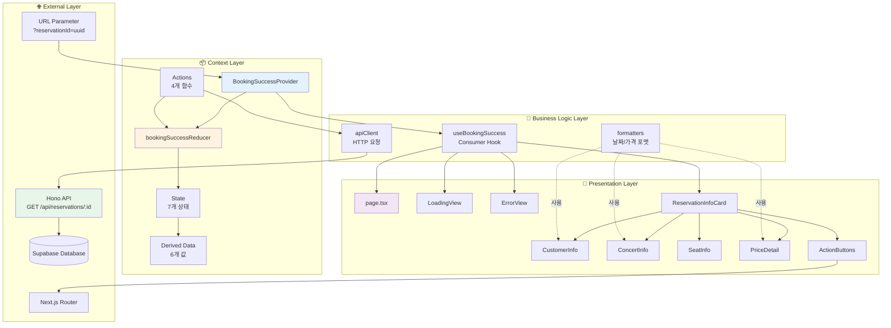
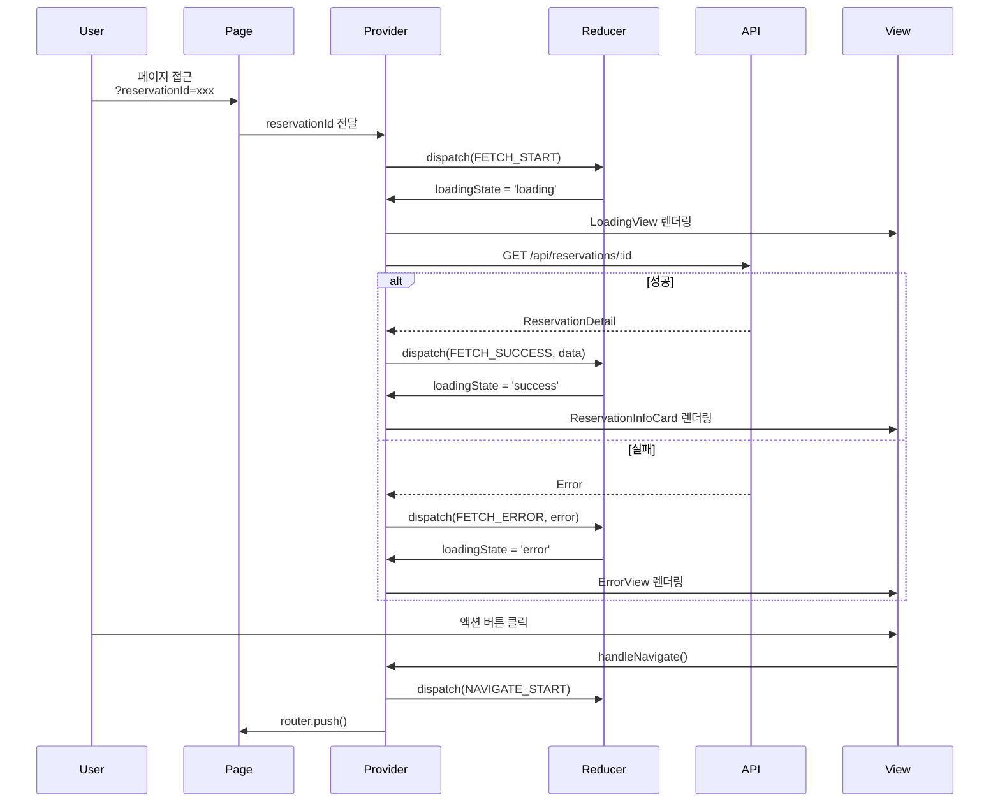
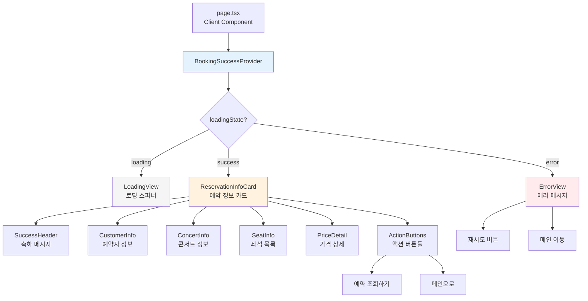

# 예약 완료 페이지 (유저플로우 #6) 모듈화 설계

## 문서 정보
- **기능 ID**: F-006
- **기능명**: 예약 완료 페이지 - 예약 확인
- **작성일**: 2025-10-15
- **버전**: 1.0
- **관련 문서**:
  - [요구사항](./requirement.md)
  - [유스케이스](./spec.md)
  - [상태 관리](./state-management.md)

---

## 목차

1. [개요](#1-개요)
2. [아키텍처 다이어그램](#2-아키텍처-다이어그램)
3. [모듈 목록](#3-모듈-목록)
4. [Implementation Plan](#4-implementation-plan)
5. [테스트 전략](#5-테스트-전략)
6. [구현 순서](#6-구현-순서)

---

## 1. 개요

### 1.1 목적
예약 완료 페이지는 사용자가 예약을 성공적으로 완료한 후 예약 정보를 확인하고, 후속 액션(예약 조회, 메인 이동)을 수행할 수 있는 페이지입니다.

### 1.2 핵심 요구사항
- ✅ URL 파라미터로 예약 ID 전달
- ✅ 예약 정보 API 조회 및 표시
- ✅ 로딩/에러/성공 상태 관리
- ✅ 취소된 예약 구분 표시
- ✅ 가격 상세 펼침/접힘 기능
- ✅ 예약 조회/메인 페이지 이동
- ✅ Context + useReducer 패턴으로 상태 관리

### 1.3 설계 원칙
1. **Context + useReducer**: Flux 패턴 기반 단방향 데이터 흐름
2. **모듈 분리**: 상태 관리, UI 컴포넌트, API 호출 명확히 분리
3. **재사용성**: 컴포넌트는 독립적이고 재사용 가능하게 설계
4. **타입 안정성**: TypeScript로 모든 인터페이스 정의
5. **에러 처리**: 모든 엣지케이스에 대한 명확한 처리

---

## 2. 아키텍처 다이어그램

### 2.1 전체 시스템 아키텍처



---

### 2.2 데이터 흐름 다이어그램



---

### 2.3 컴포넌트 계층 구조



---

## 3. 모듈 목록

### 3.1 모듈 개요

| 레이어 | 모듈명 | 경로 | 설명 |
|--------|--------|------|------|
| **Types** | `state.ts` | `features/booking/success/types/` | State 인터페이스 정의 |
| **Types** | `actions.ts` | `features/booking/success/types/` | Action 타입 정의 |
| **Store** | `reducer.ts` | `features/booking/success/store/` | Reducer 함수 |
| **Store** | `initial-state.ts` | `features/booking/success/store/` | 초기 상태 |
| **Context** | `BookingSuccessContext.tsx` | `features/booking/success/context/` | Context 생성 |
| **Context** | `BookingSuccessProvider.tsx` | `features/booking/success/context/` | Provider 구현 |
| **Hooks** | `useBookingSuccess.ts` | `features/booking/success/hooks/` | Consumer Hook |
| **Hooks** | `useDerivedValues.ts` | `features/booking/success/hooks/` | 파생 값 계산 |
| **Hooks** | `useReservationFetch.ts` | `features/booking/success/hooks/` | API 호출 |
| **Components** | `LoadingView.tsx` | `features/booking/success/components/` | 로딩 뷰 |
| **Components** | `ErrorView.tsx` | `features/booking/success/components/` | 에러 뷰 |
| **Components** | `SuccessHeader.tsx` | `features/booking/success/components/` | 성공 헤더 |
| **Components** | `ReservationInfoCard.tsx` | `features/booking/success/components/` | 예약 정보 카드 |
| **Components** | `CustomerInfo.tsx` | `features/booking/success/components/` | 예약자 정보 |
| **Components** | `ConcertInfo.tsx` | `features/booking/success/components/` | 콘서트 정보 |
| **Components** | `SeatInfo.tsx` | `features/booking/success/components/` | 좌석 정보 |
| **Components** | `PriceDetail.tsx` | `features/booking/success/components/` | 가격 상세 |
| **Components** | `ActionButtons.tsx` | `features/booking/success/components/` | 액션 버튼들 |
| **Lib** | `formatters.ts` | `features/booking/success/lib/` | 포맷팅 유틸 |
| **Lib** | `error-mapper.ts` | `features/booking/success/lib/` | 에러 매핑 |
| **Page** | `page.tsx` | `app/booking/success/` | 페이지 진입점 |

**총 모듈 수: 21개**

---

## 4. Implementation Plan

### 4.1 Types Layer (2개 모듈)

#### 📄 `src/features/booking/success/types/state.ts`

**목적**: 전체 상태 인터페이스 정의

**인터페이스**:
```typescript
// 예약 상세 정보
interface ReservationDetail {
  reservationId: string;
  customerName: string;
  customerPhone: string;
  customerEmail?: string;
  status: 'confirmed' | 'cancelled';
  createdAt: string;
  cancelledAt?: string;
  concert: {
    id: string;
    title: string;
    posterImageUrl: string;
  };
  schedule: {
    id: string;
    dateTime: string;
  };
  seats: Array<{
    id: string;
    seatNumber: string;
    grade: string;
    price: number;
  }>;
  totalPrice: number;
}

// 에러 정보
interface ErrorInfo {
  code: 'NOT_FOUND' | 'SERVER_ERROR' | 'NETWORK_ERROR' | 'INVALID_ID' | 'MISSING_ID';
  message: string;
  retryable: boolean;
}

// 전체 상태
interface BookingSuccessState {
  loadingState: 'idle' | 'loading' | 'success' | 'error';
  isRetrying: boolean;
  reservationData: ReservationDetail | null;
  error: ErrorInfo | null;
  isPriceDetailExpanded: boolean;
  isNavigating: boolean;
}
```

**QA Sheet**:
- [ ] 모든 인터페이스가 명확히 정의되었는가?
- [ ] 타입이 nullable/optional 처리가 정확한가?
- [ ] 백엔드 스키마와 일치하는가?

---

#### 📄 `src/features/booking/success/types/actions.ts`

**목적**: Action 타입 정의

**타입 정의**:
```typescript
const ActionTypes = {
  FETCH_RESERVATION_START: 'FETCH_RESERVATION_START',
  FETCH_RESERVATION_SUCCESS: 'FETCH_RESERVATION_SUCCESS',
  FETCH_RESERVATION_ERROR: 'FETCH_RESERVATION_ERROR',
  RETRY_FETCH: 'RETRY_FETCH',
  TOGGLE_PRICE_DETAIL: 'TOGGLE_PRICE_DETAIL',
  NAVIGATE_START: 'NAVIGATE_START',
  RESET_STATE: 'RESET_STATE',
} as const;

type BookingSuccessAction =
  | { type: typeof ActionTypes.FETCH_RESERVATION_START }
  | { type: typeof ActionTypes.FETCH_RESERVATION_SUCCESS; payload: ReservationDetail }
  | { type: typeof ActionTypes.FETCH_RESERVATION_ERROR; payload: ErrorInfo }
  | { type: typeof ActionTypes.RETRY_FETCH }
  | { type: typeof ActionTypes.TOGGLE_PRICE_DETAIL }
  | { type: typeof ActionTypes.NAVIGATE_START; payload: string }
  | { type: typeof ActionTypes.RESET_STATE };
```

**QA Sheet**:
- [ ] 모든 Action이 정의되었는가?
- [ ] Payload 타입이 정확한가?
- [ ] Union 타입이 완전한가?

---

### 4.2 Store Layer (2개 모듈)

#### 📄 `src/features/booking/success/store/initial-state.ts`

**목적**: 초기 상태 정의

```typescript
export const initialState: BookingSuccessState = {
  loadingState: 'idle',
  isRetrying: false,
  reservationData: null,
  error: null,
  isPriceDetailExpanded: false,
  isNavigating: false,
};
```

**Unit Tests**:
```typescript
describe('initialState', () => {
  it('모든 필드가 초기화되어 있어야 함', () => {
    expect(initialState.loadingState).toBe('idle');
    expect(initialState.reservationData).toBeNull();
    expect(initialState.error).toBeNull();
    expect(initialState.isPriceDetailExpanded).toBe(false);
  });
});
```

---

#### 📄 `src/features/booking/success/store/reducer.ts`

**목적**: 순수 Reducer 함수

**핵심 로직**:
```typescript
export function bookingSuccessReducer(
  state: BookingSuccessState,
  action: BookingSuccessAction
): BookingSuccessState {
  switch (action.type) {
    case ActionTypes.FETCH_RESERVATION_START:
      return { ...state, loadingState: 'loading', error: null };

    case ActionTypes.FETCH_RESERVATION_SUCCESS:
      return {
        ...state,
        loadingState: 'success',
        isRetrying: false,
        reservationData: action.payload,
        error: null,
      };

    case ActionTypes.FETCH_RESERVATION_ERROR:
      return {
        ...state,
        loadingState: 'error',
        isRetrying: false,
        error: action.payload,
      };

    case ActionTypes.RETRY_FETCH:
      return { ...state, loadingState: 'loading', isRetrying: true, error: null };

    case ActionTypes.TOGGLE_PRICE_DETAIL:
      return { ...state, isPriceDetailExpanded: !state.isPriceDetailExpanded };

    case ActionTypes.NAVIGATE_START:
      return { ...state, isNavigating: true };

    case ActionTypes.RESET_STATE:
      return initialState;

    default:
      return state;
  }
}
```

**Unit Tests**:
```typescript
describe('bookingSuccessReducer', () => {
  it('FETCH_START 시 loadingState를 loading으로 변경', () => {
    const nextState = bookingSuccessReducer(initialState, {
      type: ActionTypes.FETCH_RESERVATION_START,
    });
    expect(nextState.loadingState).toBe('loading');
    expect(nextState.error).toBeNull();
  });

  it('FETCH_SUCCESS 시 데이터 저장 및 상태 변경', () => {
    const mockData: ReservationDetail = {
      reservationId: 'test-id',
      customerName: '홍길동',
      // ... 나머지 필드
    };
    const nextState = bookingSuccessReducer(initialState, {
      type: ActionTypes.FETCH_RESERVATION_SUCCESS,
      payload: mockData,
    });
    expect(nextState.loadingState).toBe('success');
    expect(nextState.reservationData).toEqual(mockData);
    expect(nextState.isRetrying).toBe(false);
  });

  it('FETCH_ERROR 시 에러 저장 및 상태 변경', () => {
    const mockError: ErrorInfo = {
      code: 'NOT_FOUND',
      message: '예약을 찾을 수 없습니다',
      retryable: false,
    };
    const nextState = bookingSuccessReducer(initialState, {
      type: ActionTypes.FETCH_RESERVATION_ERROR,
      payload: mockError,
    });
    expect(nextState.loadingState).toBe('error');
    expect(nextState.error).toEqual(mockError);
  });

  it('TOGGLE_PRICE_DETAIL 시 펼침 상태 토글', () => {
    const state = { ...initialState, isPriceDetailExpanded: false };
    const nextState = bookingSuccessReducer(state, {
      type: ActionTypes.TOGGLE_PRICE_DETAIL,
    });
    expect(nextState.isPriceDetailExpanded).toBe(true);
  });

  it('불변성을 유지해야 함', () => {
    const nextState = bookingSuccessReducer(initialState, {
      type: ActionTypes.FETCH_RESERVATION_START,
    });
    expect(nextState).not.toBe(initialState);
  });
});
```

**QA Sheet**:
- [ ] 모든 Action이 처리되는가?
- [ ] 순수 함수인가? (side effect 없음)
- [ ] 불변성이 유지되는가?
- [ ] 엣지케이스가 처리되는가?

---

### 4.3 Context Layer (2개 모듈)

#### 📄 `src/features/booking/success/context/BookingSuccessContext.tsx`

**목적**: Context 생성 및 타입 정의

```typescript
'use client';

import { createContext } from 'react';
import type { BookingSuccessState } from '../types/state';

export interface BookingSuccessContextValue {
  // State (6개)
  loadingState: 'idle' | 'loading' | 'success' | 'error';
  isRetrying: boolean;
  reservationData: ReservationDetail | null;
  error: ErrorInfo | null;
  isPriceDetailExpanded: boolean;
  isNavigating: boolean;
  
  // Actions (4개)
  handleRetry: () => void;
  handleTogglePriceDetail: () => void;
  handleNavigateToReservations: () => void;
  handleNavigateToHome: () => void;
  
  // Derived (6개)
  isLoading: boolean;
  hasError: boolean;
  isSuccess: boolean;
  showRetryButton: boolean;
  isCancelled: boolean;
  hasEmail: boolean;
}

export const BookingSuccessContext = createContext<BookingSuccessContextValue | undefined>(
  undefined
);
```

**QA Sheet**:
- [ ] Context Value 타입이 완전한가?
- [ ] 16개 노출 항목이 모두 포함되었는가?
- [ ] 타입이 정확한가?

---

#### 📄 `src/features/booking/success/context/BookingSuccessProvider.tsx`

**목적**: Provider 구현 (핵심 로직)

**구현 계획**:

1. **useReducer로 상태 관리**
2. **useSearchParams로 URL 파라미터 추출**
3. **useEffect로 초기 데이터 로딩**
4. **useCallback으로 Actions 정의**
5. **useMemo로 Derived Data 계산**
6. **useMemo로 Context Value 조합**

```typescript
'use client';

import React, { useReducer, useMemo, useCallback, useEffect } from 'react';
import { useRouter, useSearchParams } from 'next/navigation';
import { bookingSuccessReducer, initialState } from '../store';
import { ActionTypes } from '../types/actions';
import { apiClient } from '@/lib/remote/api-client';
import { mapApiErrorToErrorInfo } from '../lib/error-mapper';
import { BookingSuccessContext } from './BookingSuccessContext';

export function BookingSuccessProvider({ children }: { children: React.ReactNode }) {
  const [state, dispatch] = useReducer(bookingSuccessReducer, initialState);
  const router = useRouter();
  const searchParams = useSearchParams();

  // URL에서 예약 ID 추출
  const reservationId = searchParams.get('reservationId');

  // 예약 정보 조회
  const fetchReservation = useCallback((id: string, isRetry = false) => {
    if (isRetry) {
      dispatch({ type: ActionTypes.RETRY_FETCH });
    } else {
      dispatch({ type: ActionTypes.FETCH_RESERVATION_START });
    }

    apiClient
      .get(`/api/reservations/${id}`)
      .then((response) => {
        if (response.data?.ok && response.data?.data) {
          dispatch({
            type: ActionTypes.FETCH_RESERVATION_SUCCESS,
            payload: response.data.data,
          });
        } else {
          const error = mapApiErrorToErrorInfo('NOT_FOUND');
          dispatch({ type: ActionTypes.FETCH_RESERVATION_ERROR, payload: error });
        }
      })
      .catch((err) => {
        const error = mapApiErrorToErrorInfo(err?.response?.status);
        dispatch({ type: ActionTypes.FETCH_RESERVATION_ERROR, payload: error });
      });
  }, []);

  // 초기 로딩
  useEffect(() => {
    if (!reservationId) {
      const error = mapApiErrorToErrorInfo('MISSING_ID');
      dispatch({ type: ActionTypes.FETCH_RESERVATION_ERROR, payload: error });
      return;
    }

    fetchReservation(reservationId);
  }, [reservationId, fetchReservation]);

  // Actions
  const handleRetry = useCallback(() => {
    if (reservationId) {
      fetchReservation(reservationId, true);
    }
  }, [reservationId, fetchReservation]);

  const handleTogglePriceDetail = useCallback(() => {
    dispatch({ type: ActionTypes.TOGGLE_PRICE_DETAIL });
  }, []);

  const handleNavigateToReservations = useCallback(() => {
    dispatch({ type: ActionTypes.NAVIGATE_START, payload: '/reservations' });
    router.push('/reservations');
  }, [router]);

  const handleNavigateToHome = useCallback(() => {
    dispatch({ type: ActionTypes.NAVIGATE_START, payload: '/' });
    router.push('/');
  }, [router]);

  // Derived Data
  const isLoading = useMemo(
    () => state.loadingState === 'loading' || state.isRetrying,
    [state.loadingState, state.isRetrying]
  );

  const hasError = useMemo(
    () => state.loadingState === 'error' && state.error !== null,
    [state.loadingState, state.error]
  );

  const isSuccess = useMemo(
    () => state.loadingState === 'success' && state.reservationData !== null,
    [state.loadingState, state.reservationData]
  );

  const showRetryButton = useMemo(
    () => hasError && state.error?.retryable === true,
    [hasError, state.error]
  );

  const isCancelled = useMemo(
    () => state.reservationData?.status === 'cancelled',
    [state.reservationData]
  );

  const hasEmail = useMemo(
    () => state.reservationData?.customerEmail != null,
    [state.reservationData]
  );

  // Context Value
  const contextValue = useMemo(
    () => ({
      // State
      loadingState: state.loadingState,
      isRetrying: state.isRetrying,
      reservationData: state.reservationData,
      error: state.error,
      isPriceDetailExpanded: state.isPriceDetailExpanded,
      isNavigating: state.isNavigating,
      // Actions
      handleRetry,
      handleTogglePriceDetail,
      handleNavigateToReservations,
      handleNavigateToHome,
      // Derived
      isLoading,
      hasError,
      isSuccess,
      showRetryButton,
      isCancelled,
      hasEmail,
    }),
    [
      state,
      handleRetry,
      handleTogglePriceDetail,
      handleNavigateToReservations,
      handleNavigateToHome,
      isLoading,
      hasError,
      isSuccess,
      showRetryButton,
      isCancelled,
      hasEmail,
    ]
  );

  return (
    <BookingSuccessContext.Provider value={contextValue}>
      {children}
    </BookingSuccessContext.Provider>
  );
}
```

**QA Sheet**:
- [ ] useReducer가 정확히 사용되었는가?
- [ ] useCallback으로 모든 함수가 메모이제이션되었는가?
- [ ] useMemo로 파생 값이 계산되었는가?
- [ ] Context Value가 useMemo로 감싸졌는가?
- [ ] 의존성 배열이 정확한가?
- [ ] API 호출 시 에러 처리가 완전한가?
- [ ] null/undefined 체크가 충분한가?

---

### 4.4 Hooks Layer (3개 모듈)

#### 📄 `src/features/booking/success/hooks/useBookingSuccess.ts`

**목적**: Consumer Hook (Context 사용)

```typescript
'use client';

import { useContext } from 'react';
import { BookingSuccessContext } from '../context/BookingSuccessContext';

export function useBookingSuccess() {
  const context = useContext(BookingSuccessContext);

  if (context === undefined) {
    throw new Error('useBookingSuccess must be used within BookingSuccessProvider');
  }

  return context;
}
```

**Unit Tests**:
```typescript
describe('useBookingSuccess', () => {
  it('Provider 내부에서 정상 동작', () => {
    const { result } = renderHook(() => useBookingSuccess(), {
      wrapper: BookingSuccessProvider,
    });
    expect(result.current).toBeDefined();
  });

  it('Provider 외부에서 에러 발생', () => {
    expect(() => {
      renderHook(() => useBookingSuccess());
    }).toThrow('useBookingSuccess must be used within BookingSuccessProvider');
  });
});
```

---

#### 📄 `src/features/booking/success/hooks/useDerivedValues.ts`

**목적**: 파생 값 계산 유틸리티 (필요시)

```typescript
// 현재는 Provider에서 직접 계산하므로 생략 가능
// 추후 복잡한 계산이 필요할 경우 분리
```

---

#### 📄 `src/features/booking/success/hooks/useReservationFetch.ts`

**목적**: API 호출 로직 분리 (선택사항)

```typescript
// Provider에서 직접 처리하므로 생략 가능
// 추후 React Query로 전환 시 사용
```

---

### 4.5 Components Layer (9개 모듈)

#### 📄 `src/features/booking/success/components/LoadingView.tsx`

**목적**: 로딩 상태 뷰

```typescript
'use client';

import { Loader2 } from 'lucide-react';
import { useBookingSuccess } from '../hooks/useBookingSuccess';

export function LoadingView() {
  const { isRetrying, isLoading } = useBookingSuccess();

  if (!isLoading) return null;

  return (
    <div className="flex flex-col items-center justify-center min-h-screen">
      <Loader2 className="w-12 h-12 animate-spin text-primary mb-4" />
      <p className="text-gray-600">
        {isRetrying ? '다시 시도 중...' : '예약 정보를 불러오는 중...'}
      </p>
    </div>
  );
}
```

**QA Sheet**:
- [ ] 로딩 상태에서만 표시되는가?
- [ ] 재시도 메시지가 구분되는가?
- [ ] 접근성(ARIA)이 고려되었는가?

---

#### 📄 `src/features/booking/success/components/ErrorView.tsx`

**목적**: 에러 상태 뷰

```typescript
'use client';

import { AlertCircle } from 'lucide-react';
import { Button } from '@/components/ui/button';
import { Card } from '@/components/ui/card';
import { useBookingSuccess } from '../hooks/useBookingSuccess';

export function ErrorView() {
  const { 
    error, 
    hasError, 
    showRetryButton,
    handleRetry,
    handleNavigateToHome 
  } = useBookingSuccess();

  if (!hasError || !error) return null;

  return (
    <div className="flex items-center justify-center min-h-screen p-4">
      <Card className="max-w-md p-8 text-center">
        <AlertCircle className="w-16 h-16 text-red-500 mx-auto mb-4" />
        <h2 className="text-2xl font-bold mb-2">오류가 발생했습니다</h2>
        <p className="text-gray-600 mb-6">{error.message}</p>
        <div className="flex gap-3 justify-center">
          {showRetryButton && (
            <Button onClick={handleRetry} variant="default">
              다시 시도
            </Button>
          )}
          <Button onClick={handleNavigateToHome} variant="outline">
            메인으로 돌아가기
          </Button>
        </div>
      </Card>
    </div>
  );
}
```

**QA Sheet**:
- [ ] 에러 상태에서만 표시되는가?
- [ ] 재시도 버튼이 조건부로 표시되는가?
- [ ] 에러 메시지가 명확한가?

---

#### 📄 `src/features/booking/success/components/SuccessHeader.tsx`

**목적**: 성공 메시지 헤더

```typescript
'use client';

import { CheckCircle } from 'lucide-react';

export function SuccessHeader() {
  return (
    <div className="text-center mb-8">
      <div className="inline-flex items-center justify-center w-20 h-20 bg-green-100 rounded-full mb-4">
        <CheckCircle className="w-12 h-12 text-green-600" />
      </div>
      <h1 className="text-3xl font-bold text-gray-900 mb-2">
        예약이 완료되었습니다!
      </h1>
      <p className="text-gray-600">예약 내역을 확인해주세요</p>
    </div>
  );
}
```

**QA Sheet**:
- [ ] 시각적으로 명확한가?
- [ ] 반응형인가?

---

#### 📄 `src/features/booking/success/components/ReservationInfoCard.tsx`

**목적**: 예약 정보 카드 (컨테이너)

```typescript
'use client';

import { Card } from '@/components/ui/card';
import { useBookingSuccess } from '../hooks/useBookingSuccess';
import { SuccessHeader } from './SuccessHeader';
import { CustomerInfo } from './CustomerInfo';
import { ConcertInfo } from './ConcertInfo';
import { SeatInfo } from './SeatInfo';
import { PriceDetail } from './PriceDetail';
import { ActionButtons } from './ActionButtons';

export function ReservationInfoCard() {
  const { isSuccess, reservationData, isCancelled } = useBookingSuccess();

  if (!isSuccess || !reservationData) return null;

  return (
    <div className="container mx-auto px-4 py-12 max-w-3xl">
      <SuccessHeader />
      
      <Card className="p-6 mb-6">
        {isCancelled && (
          <div className="bg-red-50 border border-red-200 rounded-lg p-4 mb-6">
            <p className="text-red-700 font-medium">이 예약은 취소되었습니다</p>
          </div>
        )}
        
        <CustomerInfo />
        <ConcertInfo />
        <SeatInfo />
        <PriceDetail />
      </Card>
      
      <ActionButtons />
    </div>
  );
}
```

**QA Sheet**:
- [ ] 성공 상태에서만 표시되는가?
- [ ] 취소 상태가 명확히 표시되는가?
- [ ] 레이아웃이 깔끔한가?

---

#### 📄 `src/features/booking/success/components/CustomerInfo.tsx`

**목적**: 예약자 정보 표시

```typescript
'use client';

import { User, Phone, Mail } from 'lucide-react';
import { Separator } from '@/components/ui/separator';
import { useBookingSuccess } from '../hooks/useBookingSuccess';

export function CustomerInfo() {
  const { reservationData, hasEmail } = useBookingSuccess();

  if (!reservationData) return null;

  return (
    <div className="mb-6">
      <h3 className="text-lg font-semibold mb-4 flex items-center gap-2">
        <User className="w-5 h-5" />
        예약자 정보
      </h3>
      <div className="space-y-3">
        <div className="flex items-center gap-2">
          <User className="w-4 h-4 text-gray-500" />
          <span className="text-gray-700">{reservationData.customerName}</span>
        </div>
        <div className="flex items-center gap-2">
          <Phone className="w-4 h-4 text-gray-500" />
          <span className="text-gray-700">{reservationData.customerPhone}</span>
        </div>
        {hasEmail && (
          <div className="flex items-center gap-2">
            <Mail className="w-4 h-4 text-gray-500" />
            <span className="text-gray-700">{reservationData.customerEmail}</span>
          </div>
        )}
      </div>
      <Separator className="mt-6" />
    </div>
  );
}
```

**QA Sheet**:
- [ ] 이메일이 조건부로 표시되는가?
- [ ] 아이콘이 일관적인가?

---

#### 📄 `src/features/booking/success/components/ConcertInfo.tsx`

**목적**: 콘서트 정보 표시

```typescript
'use client';

import { Calendar, MapPin } from 'lucide-react';
import { Separator } from '@/components/ui/separator';
import { useBookingSuccess } from '../hooks/useBookingSuccess';
import { formatScheduleDateTime } from '../lib/formatters';

export function ConcertInfo() {
  const { reservationData } = useBookingSuccess();

  if (!reservationData) return null;

  const formattedDate = formatScheduleDateTime(reservationData.schedule.dateTime);

  return (
    <div className="mb-6">
      <h3 className="text-lg font-semibold mb-4">콘서트 정보</h3>
      <div className="flex gap-4 mb-4">
        
        <div className="flex-1">
          <h4 className="text-xl font-bold mb-2">{reservationData.concert.title}</h4>
          <div className="space-y-2">
            <div className="flex items-center gap-2 text-gray-600">
              <Calendar className="w-4 h-4" />
              <span>{formattedDate}</span>
            </div>
          </div>
        </div>
      </div>
      <Separator className="mt-6" />
    </div>
  );
}
```

**QA Sheet**:
- [ ] 포스터 이미지가 적절한가?
- [ ] 날짜 포맷이 정확한가?

---

#### 📄 `src/features/booking/success/components/SeatInfo.tsx`

**목적**: 좌석 정보 표시

```typescript
'use client';

import { Ticket } from 'lucide-react';
import { Separator } from '@/components/ui/separator';
import { Badge } from '@/components/ui/badge';
import { useBookingSuccess } from '../hooks/useBookingSuccess';
import { groupSeatsByGrade } from '../lib/formatters';

export function SeatInfo() {
  const { reservationData } = useBookingSuccess();

  if (!reservationData) return null;

  const groupedSeats = groupSeatsByGrade(reservationData.seats);

  return (
    <div className="mb-6">
      <h3 className="text-lg font-semibold mb-4 flex items-center gap-2">
        <Ticket className="w-5 h-5" />
        좌석 정보
      </h3>
      <div className="space-y-3">
        {Object.entries(groupedSeats).map(([grade, seats]) => (
          <div key={grade} className="flex items-start gap-2">
            <Badge variant="outline">{grade}석</Badge>
            <div className="flex-1">
              {seats.map((seat) => (
                <span key={seat.seatNumber} className="mr-2">
                  {seat.seatNumber}
                </span>
              ))}
            </div>
          </div>
        ))}
      </div>
      <Separator className="mt-6" />
    </div>
  );
}
```

**QA Sheet**:
- [ ] 좌석이 등급별로 그룹화되는가?
- [ ] 배지가 적절한가?

---

#### 📄 `src/features/booking/success/components/PriceDetail.tsx`

**목적**: 가격 상세 표시

```typescript
'use client';

import { ChevronDown, ChevronUp } from 'lucide-react';
import { Button } from '@/components/ui/button';
import { Separator } from '@/components/ui/separator';
import { useBookingSuccess } from '../hooks/useBookingSuccess';
import { formatPrice } from '../lib/formatters';

export function PriceDetail() {
  const {
    reservationData,
    isPriceDetailExpanded,
    handleTogglePriceDetail,
  } = useBookingSuccess();

  if (!reservationData) return null;

  return (
    <div>
      <div className="flex items-center justify-between mb-4">
        <h3 className="text-lg font-semibold">결제 정보</h3>
        <Button
          variant="ghost"
          size="sm"
          onClick={handleTogglePriceDetail}
          className="text-primary"
        >
          {isPriceDetailExpanded ? (
            <>
              숨기기 <ChevronUp className="w-4 h-4 ml-1" />
            </>
          ) : (
            <>
              상세 보기 <ChevronDown className="w-4 h-4 ml-1" />
            </>
          )}
        </Button>
      </div>

      {isPriceDetailExpanded && (
        <div className="space-y-2 mb-4">
          {reservationData.seats.map((seat) => (
            <div key={seat.seatNumber} className="flex justify-between text-sm">
              <span className="text-gray-600">
                {seat.grade}석 {seat.seatNumber}
              </span>
              <span className="font-medium">{formatPrice(seat.price)}</span>
            </div>
          ))}
          <Separator className="my-2" />
        </div>
      )}

      <div className="flex justify-between items-center text-xl font-bold">
        <span>총 결제 금액</span>
        <span className="text-primary">{formatPrice(reservationData.totalPrice)}</span>
      </div>
    </div>
  );
}
```

**QA Sheet**:
- [ ] 펼침/접힘이 정상 동작하는가?
- [ ] 가격 포맷이 정확한가?

---

#### 📄 `src/features/booking/success/components/ActionButtons.tsx`

**목적**: 액션 버튼들

```typescript
'use client';

import { Button } from '@/components/ui/button';
import { useBookingSuccess } from '../hooks/useBookingSuccess';

export function ActionButtons() {
  const {
    isNavigating,
    handleNavigateToReservations,
    handleNavigateToHome,
  } = useBookingSuccess();

  return (
    <div className="flex gap-4 justify-center">
      <Button
        onClick={handleNavigateToReservations}
        disabled={isNavigating}
        variant="default"
        size="lg"
      >
        예약 조회하기
      </Button>
      <Button
        onClick={handleNavigateToHome}
        disabled={isNavigating}
        variant="outline"
        size="lg"
      >
        메인으로 돌아가기
      </Button>
    </div>
  );
}
```

**QA Sheet**:
- [ ] 버튼이 정상 동작하는가?
- [ ] 이동 중 비활성화되는가?

---

### 4.6 Lib Layer (2개 모듈)

#### 📄 `src/features/booking/success/lib/formatters.ts`

**목적**: 포맷팅 유틸리티

```typescript
import { format } from 'date-fns';
import { ko } from 'date-fns/locale';

// 날짜 포맷팅
export function formatScheduleDateTime(dateTime: string): string {
  const date = new Date(dateTime);
  return format(date, 'yyyy년 MM월 dd일 (E) HH:mm', { locale: ko });
}

// 가격 포맷팅
export function formatPrice(price: number): string {
  return `₩${price.toLocaleString('ko-KR')}`;
}

// 좌석 등급별 그룹화
export function groupSeatsByGrade(seats: Array<{ seatNumber: string; grade: string; price: number }>) {
  return seats.reduce((acc, seat) => {
    if (!acc[seat.grade]) {
      acc[seat.grade] = [];
    }
    acc[seat.grade].push(seat);
    return acc;
  }, {} as Record<string, typeof seats>);
}
```

**Unit Tests**:
```typescript
describe('formatters', () => {
  it('날짜를 올바르게 포맷팅', () => {
    const result = formatScheduleDateTime('2025-12-25T19:00:00Z');
    expect(result).toMatch(/2025년 12월 25일/);
  });

  it('가격을 올바르게 포맷팅', () => {
    expect(formatPrice(150000)).toBe('₩150,000');
  });

  it('좌석을 등급별로 그룹화', () => {
    const seats = [
      { seatNumber: 'A01', grade: 'R', price: 150000 },
      { seatNumber: 'B01', grade: 'S', price: 120000 },
      { seatNumber: 'A02', grade: 'R', price: 150000 },
    ];
    const grouped = groupSeatsByGrade(seats);
    expect(grouped.R).toHaveLength(2);
    expect(grouped.S).toHaveLength(1);
  });
});
```

---

#### 📄 `src/features/booking/success/lib/error-mapper.ts`

**목적**: API 에러를 ErrorInfo로 매핑

```typescript
import type { ErrorInfo } from '../types/state';

export function mapApiErrorToErrorInfo(
  errorCode: 'NOT_FOUND' | 'SERVER_ERROR' | 'NETWORK_ERROR' | 'INVALID_ID' | 'MISSING_ID' | number | undefined
): ErrorInfo {
  if (typeof errorCode === 'number') {
    if (errorCode === 404) {
      return {
        code: 'NOT_FOUND',
        message: '예약 정보를 찾을 수 없습니다. 예약 번호를 확인해주세요.',
        retryable: false,
      };
    }
    if (errorCode >= 500) {
      return {
        code: 'SERVER_ERROR',
        message: '서버 오류가 발생했습니다. 잠시 후 다시 시도해주세요.',
        retryable: true,
      };
    }
  }

  if (errorCode === 'MISSING_ID') {
    return {
      code: 'MISSING_ID',
      message: '예약 번호가 없습니다. 올바른 경로로 접근해주세요.',
      retryable: false,
    };
  }

  if (errorCode === 'NOT_FOUND') {
    return {
      code: 'NOT_FOUND',
      message: '예약 정보를 찾을 수 없습니다.',
      retryable: false,
    };
  }

  // 기본 네트워크 오류
  return {
    code: 'NETWORK_ERROR',
    message: '네트워크 오류가 발생했습니다. 다시 시도해주세요.',
    retryable: true,
  };
}
```

**Unit Tests**:
```typescript
describe('mapApiErrorToErrorInfo', () => {
  it('404를 NOT_FOUND로 매핑', () => {
    const error = mapApiErrorToErrorInfo(404);
    expect(error.code).toBe('NOT_FOUND');
    expect(error.retryable).toBe(false);
  });

  it('500을 SERVER_ERROR로 매핑', () => {
    const error = mapApiErrorToErrorInfo(500);
    expect(error.code).toBe('SERVER_ERROR');
    expect(error.retryable).toBe(true);
  });

  it('MISSING_ID를 매핑', () => {
    const error = mapApiErrorToErrorInfo('MISSING_ID');
    expect(error.code).toBe('MISSING_ID');
  });
});
```

---

### 4.7 Page Layer (1개 모듈)

#### 📄 `src/app/booking/success/page.tsx`

**목적**: 페이지 진입점

```typescript
'use client';

import { BookingSuccessProvider } from '@/features/booking/success/context/BookingSuccessProvider';
import { LoadingView } from '@/features/booking/success/components/LoadingView';
import { ErrorView } from '@/features/booking/success/components/ErrorView';
import { ReservationInfoCard } from '@/features/booking/success/components/ReservationInfoCard';
import { useBookingSuccess } from '@/features/booking/success/hooks/useBookingSuccess';

function BookingSuccessContent() {
  const { isLoading, hasError } = useBookingSuccess();

  if (isLoading) {
    return <LoadingView />;
  }

  if (hasError) {
    return <ErrorView />;
  }

  return <ReservationInfoCard />;
}

export default function BookingSuccessPage() {
  return (
    <BookingSuccessProvider>
      <BookingSuccessContent />
    </BookingSuccessProvider>
  );
}
```

**QA Sheet**:
- [ ] Provider로 감싸져 있는가?
- [ ] 조건부 렌더링이 정확한가?
- [ ] Client Component인가?

---

## 5. 테스트 전략

### 5.1 Unit Tests

**대상 모듈**:
- `reducer.ts`: 모든 Action 처리
- `formatters.ts`: 모든 유틸 함수
- `error-mapper.ts`: 에러 매핑 로직

**테스트 커버리지 목표**: 80% 이상

---

### 5.2 Integration Tests

**대상**:
- Provider + Hook 통합
- API 호출 + Reducer 업데이트

```typescript
describe('BookingSuccessProvider 통합 테스트', () => {
  it('Provider 내부에서 Hook 정상 동작', () => {
    const { result } = renderHook(() => useBookingSuccess(), {
      wrapper: ({ children }) => (
        <BookingSuccessProvider>{children}</BookingSuccessProvider>
      ),
    });
    expect(result.current).toBeDefined();
  });

  it('초기 로딩 → 성공 시나리오', async () => {
    // Mock API
    apiClient.get = jest.fn().mockResolvedValue({
      data: { ok: true, data: mockReservationData },
    });

    const { result, waitForNextUpdate } = renderHook(() => useBookingSuccess(), {
      wrapper: ({ children }) => (
        <BookingSuccessProvider>{children}</BookingSuccessProvider>
      ),
    });

    expect(result.current.isLoading).toBe(true);
    await waitForNextUpdate();
    expect(result.current.isSuccess).toBe(true);
    expect(result.current.reservationData).toEqual(mockReservationData);
  });
});
```

---

### 5.3 E2E Tests (선택사항)

**시나리오**:
1. 정상 예약 완료 페이지 진입
2. 에러 페이지 → 재시도
3. 가격 상세 펼치기/접기
4. 예약 조회 페이지 이동

---

## 6. 구현 순서

### Phase 1: 기반 구조 (1-2시간)
1. ✅ Types 정의 (`state.ts`, `actions.ts`)
2. ✅ Store 구현 (`reducer.ts`, `initial-state.ts`)
3. ✅ Context 생성 (`BookingSuccessContext.tsx`)

### Phase 2: 상태 관리 (2-3시간)
4. ✅ Provider 구현 (`BookingSuccessProvider.tsx`)
5. ✅ Consumer Hook (`useBookingSuccess.ts`)
6. ✅ Lib 유틸 (`formatters.ts`, `error-mapper.ts`)

### Phase 3: UI 컴포넌트 (3-4시간)
7. ✅ Loading/Error 뷰 (`LoadingView.tsx`, `ErrorView.tsx`)
8. ✅ 성공 헤더 (`SuccessHeader.tsx`)
9. ✅ 정보 컴포넌트들 (`CustomerInfo.tsx`, `ConcertInfo.tsx`, `SeatInfo.tsx`)
10. ✅ 가격 상세 (`PriceDetail.tsx`)
11. ✅ 액션 버튼 (`ActionButtons.tsx`)
12. ✅ 카드 컨테이너 (`ReservationInfoCard.tsx`)

### Phase 4: 페이지 통합 (1시간)
13. ✅ 페이지 구현 (`app/booking/success/page.tsx`)

### Phase 5: 테스트 (2-3시간)
14. ✅ Unit Tests 작성
15. ✅ Integration Tests 작성
16. ✅ QA Sheet 검증

**총 예상 시간: 9-13시간**

---

## 7. 체크리스트

### 7.1 구현 체크리스트

**Types**
- [ ] State 인터페이스 정의
- [ ] Action 타입 정의
- [ ] Context Value 인터페이스 정의

**Store**
- [ ] Reducer 함수 구현
- [ ] 초기 상태 정의
- [ ] 순수 함수 보장

**Context**
- [ ] Context 생성
- [ ] Provider 구현
- [ ] useReducer 사용
- [ ] useCallback으로 Actions 메모이제이션
- [ ] useMemo로 Derived 계산
- [ ] useMemo로 Context Value 조합

**Hooks**
- [ ] Consumer Hook 구현
- [ ] 에러 처리

**Components**
- [ ] LoadingView 구현
- [ ] ErrorView 구현
- [ ] SuccessHeader 구현
- [ ] CustomerInfo 구현
- [ ] ConcertInfo 구현
- [ ] SeatInfo 구현
- [ ] PriceDetail 구현
- [ ] ActionButtons 구현
- [ ] ReservationInfoCard 구현

**Lib**
- [ ] formatters 구현
- [ ] error-mapper 구현

**Page**
- [ ] page.tsx 구현
- [ ] Provider로 감싸기

**Tests**
- [ ] Reducer 단위 테스트
- [ ] Formatters 단위 테스트
- [ ] Error Mapper 단위 테스트
- [ ] Provider 통합 테스트

---

### 7.2 QA 체크리스트

**기능**
- [ ] URL 파라미터 추출 정상 동작
- [ ] API 호출 정상 동작
- [ ] 로딩 상태 표시
- [ ] 에러 상태 표시
- [ ] 성공 상태 표시
- [ ] 취소된 예약 구분 표시
- [ ] 가격 상세 펼침/접힘
- [ ] 예약 조회 이동
- [ ] 메인 이동

**성능**
- [ ] 불필요한 리렌더링 없음
- [ ] Context Value 메모이제이션
- [ ] Actions 메모이제이션
- [ ] Derived 메모이제이션

**접근성**
- [ ] 키보드 네비게이션 가능
- [ ] ARIA 라벨 적용
- [ ] 색상 대비 적절

**반응형**
- [ ] 모바일 레이아웃
- [ ] 태블릿 레이아웃
- [ ] 데스크톱 레이아웃

---

## 8. 참고 사항

### 8.1 기존 패턴 참조

**Context 패턴**:
- `src/features/booking/context/seat-selection-context.tsx` 참조
- `src/features/concerts/context/concert-list-context.tsx` 참조

**Component 패턴**:
- `src/features/booking/components/customer-info-page.tsx` 참조
- `src/features/concerts/components/concert-card.tsx` 참조

**API 호출**:
- `@/lib/remote/api-client` 사용
- Promise 체인 (`.then().catch()`) 사용

---

### 8.2 스타일 가이드

**Tailwind Classes**:
- Container: `container mx-auto px-4`
- Card: `Card` 컴포넌트 사용
- Spacing: 4px 단위 (`gap-4`, `mb-6`)
- Colors: Design Guide 참조

**Icons**:
- `lucide-react` 사용
- 16px (small), 20px (medium), 24px (large)

---

### 8.3 에러 코드

| 코드 | HTTP Status | 메시지 | Retryable |
|------|-------------|--------|-----------|
| `NOT_FOUND` | 404 | 예약 정보를 찾을 수 없습니다 | false |
| `SERVER_ERROR` | 500 | 서버 오류가 발생했습니다 | true |
| `NETWORK_ERROR` | - | 네트워크 오류가 발생했습니다 | true |
| `MISSING_ID` | - | 예약 번호가 없습니다 | false |
| `INVALID_ID` | 400 | 유효하지 않은 예약 번호입니다 | false |

---

## 9. 결론

이 설계는 예약 완료 페이지를 **Context + useReducer 패턴**으로 완전히 구현하기 위한 모든 모듈과 인터페이스를 정의합니다. 총 21개 모듈로 구성되며, 각 모듈은 명확한 책임과 역할을 가집니다.

**핵심 원칙**:
1. **단방향 데이터 흐름** (Flux 패턴)
2. **모듈 분리** (Separation of Concerns)
3. **타입 안정성** (TypeScript)
4. **재사용성** (Reusable Components)
5. **테스트 가능성** (Unit/Integration Tests)

구현 시 이 문서를 참조하여 단계별로 진행하면 일관성 있고 유지보수 가능한 코드를 작성할 수 있습니다.

---

**문서 버전**: 1.0  
**최종 업데이트**: 2025-10-15  
**작성자**: Senior Developer  
**검토자**: -  
**승인자**: -

