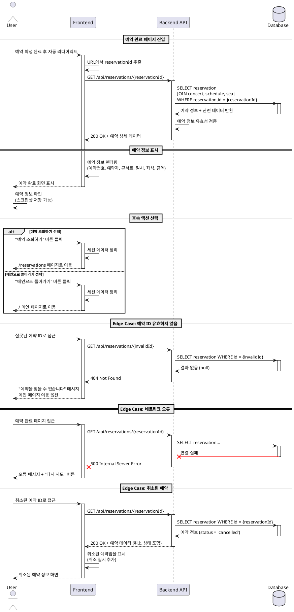

# 유스케이스 #006: 예약 완료 페이지 - 예약 확인

## 메타 정보

- **Use Case ID**: UC-006
- **Use Case Name**: 예약 완료 확인 및 후속 액션
- **Version**: 1.0
- **Created**: 2025-10-15

---

## 기본 정보

### Primary Actor
- **예매 완료한 사용자**

### Precondition
- 사용자가 좌석 선택 및 고객 정보 입력을 완료하여 예약이 성공적으로 처리됨
- 예약 레코드가 데이터베이스에 저장되고 예약 번호가 발급됨
- 선택한 좌석들이 'reserved' 상태로 변경됨

### Trigger
- 예약 확정 처리가 성공적으로 완료된 직후 예약 완료 페이지로 자동 리다이렉트

---

## Main Scenario

### 단계 1: 예약 완료 페이지 진입
1. 사용자가 예약 확정 처리 완료 후 예약 완료 페이지(`/booking/success?reservationId={id}`)로 자동 이동
2. 시스템이 URL 파라미터에서 예약 ID를 추출
3. 시스템이 해당 예약 정보를 데이터베이스에서 조회
   - `Reservation` 테이블에서 예약 기본 정보
   - `Concert` 테이블과 조인하여 콘서트 정보(제목, 포스터)
   - `Schedule` 테이블과 조인하여 관람 일시 정보
   - `Seat` 테이블과 조인하여 좌석 번호 목록 및 가격 정보

### 단계 2: 예약 정보 표시
4. 시스템이 조회한 데이터를 기반으로 예약 완료 화면 렌더링
   - 예약 완료 축하 메시지
   - 예약 번호 (고유 ID)
   - 예약자 이름 및 연락처
   - 콘서트 제목 및 포스터 이미지
   - 관람 일시 (날짜 + 시간)
   - 선택한 좌석 번호 목록
   - 좌석 등급별 가격 및 최종 결제 금액
5. 사용자가 예약 정보를 확인하고 스크린샷을 저장하거나 출력 가능

### 단계 3: 후속 액션 선택
6. 사용자가 다음 액션 중 하나를 선택:
   - **'예약 조회하기' 버튼 클릭**: `/reservations` 페이지로 이동
   - **'메인으로 돌아가기' 버튼 클릭**: `/` 메인 페이지로 이동
7. 시스템이 선택한 경로로 네비게이션 처리
8. 페이지 이동 시 예약 프로세스 관련 세션 데이터 정리

---

## Edge Cases

### EC-1: 예약 ID가 유효하지 않음
- **조건**: URL 파라미터의 예약 ID가 데이터베이스에 존재하지 않음
- **처리**: 404 에러 페이지로 리다이렉트 또는 메인 페이지로 이동하며 "예약 정보를 찾을 수 없습니다" 안내

### EC-2: 예약 정보 조회 실패
- **조건**: 네트워크 오류 또는 데이터베이스 연결 실패로 예약 정보 로드 불가
- **처리**: 오류 메시지 표시 및 "다시 시도" 버튼 제공, 또는 예약 조회 페이지로 안내

### EC-3: 예약이 이미 취소된 상태
- **조건**: 조회한 예약의 상태가 'cancelled'
- **처리**: 취소된 예약임을 명시하고 예약 상태를 '취소됨'으로 표시, 취소 일시 추가 표시

### EC-4: 직접 URL 접근 (컨텍스트 없음)
- **조건**: 사용자가 예약 프로세스를 거치지 않고 URL을 직접 입력하여 접근
- **처리**: 
  - 예약 ID가 유효하면 정상적으로 정보 표시
  - 예약 ID가 없으면 예약 조회 페이지로 리다이렉트

### EC-5: 브라우저 뒤로가기 시도
- **조건**: 사용자가 예약 완료 페이지에서 브라우저 뒤로가기 버튼 클릭
- **처리**: 중복 예약 방지를 위해 메인 페이지로 강제 리다이렉트 또는 히스토리 조작으로 뒤로가기 방지

### EC-6: 데이터 로딩 중
- **조건**: 예약 정보가 아직 로딩 중인 상태
- **처리**: 스켈레톤 UI 또는 로딩 스피너 표시, 버튼 비활성화

### EC-7: 조인 데이터 누락
- **조건**: 예약 정보는 있으나 연관 데이터(콘서트, 스케줄, 좌석)가 누락됨
- **처리**: 사용 가능한 정보만 표시하고 누락된 정보는 "정보 없음" 처리, 고객센터 안내

---

## Business Rules

### BR-1: 예약 완료 페이지 자동 이동
- 예약 확정 처리가 성공하면 반드시 예약 완료 페이지로 자동 리다이렉트
- 리다이렉트 시 예약 ID를 URL 파라미터로 전달

### BR-2: 예약 정보 조회 권한
- 예약 완료 페이지는 인증 없이 예약 ID만으로 조회 가능
- 단, 예약 ID는 추측 불가능한 UUID 형식으로 보안 유지

### BR-3: 예약 정보 표시 항목
- 필수 표시 항목:
  - 예약 번호
  - 예약자 이름
  - 예약자 연락처 (휴대폰 번호, 이메일 중 입력된 항목)
  - 콘서트 제목 및 포스터 이미지
  - 관람 일시 (YYYY년 MM월 DD일 HH:mm 형식)
  - 좌석 번호 목록 (등급별 구분)
  - 최종 결제 금액

### BR-4: 세션 데이터 정리
- 예약 완료 페이지 이탈 시 예약 프로세스와 관련된 세션 데이터 모두 삭제
- 새로운 예약을 위한 깨끗한 상태 유지

### BR-5: 후속 액션 경로
- 예약 조회하기: `/reservations` 페이지로 이동
- 메인으로 돌아가기: `/` 메인 페이지로 이동
- 두 버튼 모두 항상 활성화 상태 유지

### BR-6: 취소된 예약 표시
- 예약 상태가 'cancelled'인 경우에도 정보는 표시
- 예약 상태를 명확히 '취소됨'으로 표시하고 취소 일시 추가 표시

---

## Sequence Diagram

---

## 구현 시 고려사항

### 프론트엔드
- 예약 완료 페이지는 명확한 시각적 피드백(축하 메시지, 체크 아이콘)으로 성공 경험 강화
- 예약 정보는 인쇄 및 스크린샷에 최적화된 레이아웃으로 구성
- 로딩 상태에서는 스켈레톤 UI로 사용자 대기 경험 개선
- 뒤로가기 방지를 위해 히스토리 조작 또는 리다이렉트 처리

### 백엔드
- 예약 조회 API는 단일 쿼리로 모든 관련 데이터를 조인하여 반환 (N+1 쿼리 방지)
- 예약 ID 기반 조회는 인덱스를 활용하여 빠른 응답 보장
- 예약 상태에 관계없이 정보를 반환하되, 상태 필드를 포함하여 클라이언트에서 구분 가능하도록 함
- 에러 핸들링: 유효하지 않은 ID, 데이터 조회 실패 등 명확한 에러 코드 반환

### 데이터베이스
- `Reservation` 테이블의 `id` 필드에 인덱스 설정 (Primary Key)
- 조인 성능 최적화를 위해 외래 키 인덱스 확인 (`concert_id`, `schedule_id`)
- 예약 정보 조회 쿼리는 자주 실행되므로 쿼리 플랜 최적화

---

## 테스트 시나리오

### TS-1: 정상 예약 완료 확인
- **Given**: 사용자가 예약을 성공적으로 완료함
- **When**: 예약 완료 페이지에 진입
- **Then**: 예약 번호, 콘서트 정보, 좌석 정보, 결제 금액이 정확히 표시됨

### TS-2: 잘못된 예약 ID로 접근
- **Given**: 존재하지 않는 예약 ID
- **When**: 해당 ID로 예약 완료 페이지 접근
- **Then**: "예약을 찾을 수 없습니다" 메시지 표시 및 메인 페이지 이동 옵션 제공

### TS-3: 취소된 예약 조회
- **Given**: 취소 상태인 예약 ID
- **When**: 해당 ID로 예약 완료 페이지 접근
- **Then**: 예약 정보는 표시되지만 '취소됨' 상태가 명확히 표시됨

### TS-4: 네트워크 오류 시 재시도
- **Given**: 네트워크 연결이 불안정한 상태
- **When**: 예약 정보 로드 실패
- **Then**: 오류 메시지와 함께 "다시 시도" 버튼이 표시되고, 클릭 시 재요청

### TS-5: 후속 액션 네비게이션
- **Given**: 예약 완료 페이지에 있는 상태
- **When**: "예약 조회하기" 또는 "메인으로 돌아가기" 버튼 클릭
- **Then**: 각각 `/reservations` 또는 `/` 페이지로 정확히 이동하고 세션 데이터 정리됨

