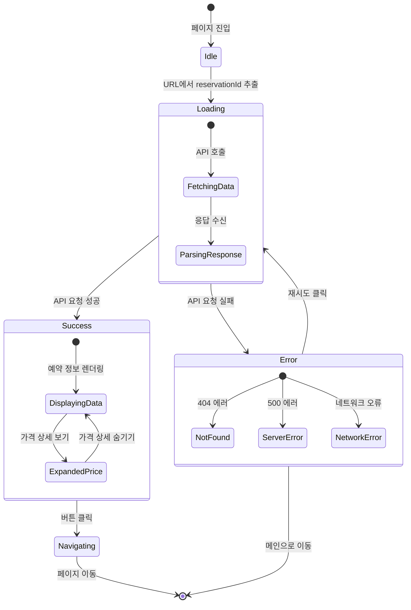

# 예약 완료 페이지 상태 정의

## 문서 정보
- **기능 ID**: F-006
- **기능명**: 예약 완료 페이지 - 상태 관리
- **작성일**: 2025-10-15
- **버전**: 1.0

---

## 1. 관리해야 할 상태 데이터 목록

### 1.1 페이지 로딩 상태
| 상태명 | 타입 | 초기값 | 설명 |
|--------|------|--------|------|
| `loadingState` | `'idle' \| 'loading' \| 'success' \| 'error'` | `'idle'` | 예약 정보 로딩 상태 |
| `isRetrying` | `boolean` | `false` | 재시도 중 여부 |

### 1.2 예약 데이터 상태
| 상태명 | 타입 | 초기값 | 설명 |
|--------|------|--------|------|
| `reservationData` | `ReservationDetail \| null` | `null` | 조회된 예약 전체 정보 |

```typescript
interface ReservationDetail {
  reservationId: string;
  customerName: string;
  customerPhone: string;
  customerEmail?: string;
  status: 'confirmed' | 'cancelled';
  createdAt: string;
  cancelledAt?: string;
  concert: {
    id: string;
    title: string;
    posterImageUrl: string;
  };
  schedule: {
    id: string;
    dateTime: string;
  };
  seats: Array<{
    id: string;
    seatNumber: string;
    grade: string;
    price: number;
  }>;
  totalPrice: number;
}
```

### 1.3 에러 상태
| 상태명 | 타입 | 초기값 | 설명 |
|--------|------|--------|------|
| `error` | `ErrorInfo \| null` | `null` | 에러 정보 |

```typescript
interface ErrorInfo {
  code: string;
  message: string;
  retryable: boolean;
}
```

### 1.4 UI 인터랙션 상태
| 상태명 | 타입 | 초기값 | 설명 |
|--------|------|--------|------|
| `isPriceDetailExpanded` | `boolean` | `false` | 가격 상세 펼침/접힘 상태 |
| `isNavigating` | `boolean` | `false` | 페이지 이동 중 여부 |

### 1.5 URL 파라미터 (라우터 상태)
| 상태명 | 타입 | 초기값 | 설명 |
|--------|------|--------|------|
| `reservationId` | `string \| null` | `null` | URL에서 추출한 예약 ID |

---

## 2. 화면에 보이지만 상태가 아닌 것 (파생/계산 데이터)

### 2.1 파생 데이터 목록
| 데이터명 | 계산 방법 | 설명 |
|----------|-----------|------|
| `formattedDateTime` | `reservationData.schedule.dateTime` 파싱 및 포맷팅 | "YYYY년 MM월 DD일 (요일) HH:mm" 형식 |
| `formattedDate` | `formattedDateTime`에서 날짜 부분만 추출 | "YYYY년 MM월 DD일 (요일)" |
| `formattedTime` | `formattedDateTime`에서 시간 부분만 추출 | "HH:mm" |
| `formattedPrice` | `reservationData.totalPrice`를 통화 형식으로 변환 | "₩300,000" |
| `totalSeatsCount` | `reservationData.seats.length` | "총 N석" |
| `groupedSeats` | `reservationData.seats`를 `grade`별로 그룹화 | { 'R': [...], 'S': [...] } |
| `seatsByGrade` | `groupedSeats`를 문자열로 포맷 | "R석: A01, A02 / S석: B01" |
| `dayOfWeek` | `reservationData.schedule.dateTime`에서 요일 추출 | "월", "화", ... |
| `isCancelled` | `reservationData.status === 'cancelled'` | 취소 여부 (boolean) |
| `formattedCancelledAt` | `reservationData.cancelledAt` 파싱 및 포맷팅 | "YYYY년 MM월 DD일 HH:mm에 취소됨" |
| `hasEmail` | `reservationData.customerEmail != null` | 이메일 입력 여부 |
| `isLoading` | `loadingState === 'loading' || isRetrying` | 로딩 중 여부 |
| `hasError` | `loadingState === 'error' && error != null` | 에러 발생 여부 |
| `isSuccess` | `loadingState === 'success' && reservationData != null` | 성공 상태 여부 |
| `showRetryButton` | `hasError && error.retryable` | 재시도 버튼 표시 여부 |
| `priceDetails` | `reservationData.seats.map(s => ({ ...s }))` | 좌석별 가격 상세 배열 |

### 2.2 정적 데이터 (상수)
| 데이터명 | 값 | 설명 |
|----------|-----|------|
| `successIcon` | `<CheckCircleIcon />` | 성공 아이콘 컴포넌트 |
| `mainMessage` | "예약이 완료되었습니다!" | 성공 메시지 |
| `subMessage` | "예약 정보를 확인해 주세요" | 서브 메시지 |
| `infoMessage` | "예약 내역은 예약 조회 페이지에서 확인하실 수 있습니다." | 안내 문구 |
| `cancelPolicyMessage` | "예약 취소는 공연 2시간 전까지 가능합니다." | 주의 사항 |
| `reservationsPath` | "/reservations" | 예약 조회 페이지 경로 |
| `homePath` | "/" | 메인 페이지 경로 |

---

## 3. 상태 변경 조건 및 화면 변화

### 3.1 loadingState 상태 변화

| 현재 상태 | 변경 조건 | 다음 상태 | 화면 변화 |
|-----------|-----------|-----------|-----------|
| `'idle'` | 컴포넌트 마운트 시 | `'loading'` | 스켈레톤 UI 표시 시작 |
| `'loading'` | API 요청 성공 | `'success'` | 스켈레톤 UI 숨김 → 예약 정보 카드 표시 |
| `'loading'` | API 요청 실패 | `'error'` | 스켈레톤 UI 숨김 → 에러 메시지 표시 |
| `'error'` | "다시 시도" 버튼 클릭 | `'loading'` | 에러 메시지 숨김 → 스켈레톤 UI 표시 |
| `'success'` | 페이지 새로고침 | `'loading'` | 기존 데이터 유지 → 로딩 오버레이 표시 |
| `'error'` | 페이지 새로고침 | `'loading'` | 에러 메시지 숨김 → 스켈레톤 UI 표시 |

**화면 변화 상세:**
- `'idle'`: 빈 화면 (순간적)
- `'loading'`: 
  - 스켈레톤 UI 표시 (예약 카드 레이아웃 흉내)
  - "예약 정보를 불러오는 중입니다..." 메시지
  - 버튼 모두 비활성화
- `'success'`: 
  - 스켈레톤 UI 숨김
  - 체크마크 아이콘 애니메이션 (500ms)
  - 예약 정보 카드 페이드 인 (300ms)
  - 버튼 활성화
- `'error'`: 
  - 에러 아이콘 표시 (X 마크 또는 경고 아이콘)
  - 에러 메시지 표시
  - "다시 시도" 버튼 표시 (retryable인 경우)
  - "메인으로 돌아가기" 버튼 표시

---

### 3.2 isRetrying 상태 변화

| 현재 상태 | 변경 조건 | 다음 상태 | 화면 변화 |
|-----------|-----------|-----------|-----------|
| `false` | "다시 시도" 버튼 클릭 | `true` | "다시 시도" 버튼에 로딩 스피너 표시 |
| `true` | API 요청 완료 (성공/실패) | `false` | 로딩 스피너 숨김 |

**화면 변화 상세:**
- `false`: 일반 버튼 상태
- `true`: 
  - "다시 시도" 버튼에 스피너 아이콘
  - 버튼 텍스트: "다시 시도 중..."
  - 버튼 비활성화

---

### 3.3 reservationData 상태 변화

| 현재 상태 | 변경 조건 | 다음 상태 | 화면 변화 |
|-----------|-----------|-----------|-----------|
| `null` | API 요청 성공 | `ReservationDetail` 객체 | 예약 정보 전체 렌더링 |
| `ReservationDetail` | API 재요청 성공 (새로고침) | 새로운 `ReservationDetail` | 예약 정보 업데이트 (일반적으로 동일) |
| `ReservationDetail` | 페이지 언마운트 | `null` (cleanup) | - |

**화면 변화 상세:**
- `null`: 데이터 없음 (로딩 또는 에러 상태)
- `ReservationDetail`:
  - **예약 번호 섹션**: `reservationId` 표시
  - **예약자 정보 섹션**: 
    - 이름: `customerName`
    - 연락처: `customerPhone` (하이픈 포맷팅)
    - 이메일: `customerEmail` (있는 경우만)
  - **콘서트 정보 섹션**:
    - 포스터: `concert.posterImageUrl`
    - 제목: `concert.title`
    - 날짜: `formattedDate`
    - 시간: `formattedTime`
  - **좌석 정보 섹션**:
    - 좌석 목록: `seatsByGrade`
    - 총 좌석 수: `totalSeatsCount`
  - **결제 정보 섹션**:
    - 총 금액: `formattedPrice`
  - **상태 배지** (status === 'cancelled'인 경우):
    - "취소됨" 배지 표시 (빨간색)
    - 취소 일시: `formattedCancelledAt`

---

### 3.4 error 상태 변화

| 현재 상태 | 변경 조건 | 다음 상태 | 화면 변화 |
|-----------|-----------|-----------|-----------|
| `null` | API 요청 실패 (404) | `{ code: 'NOT_FOUND', message: '...', retryable: false }` | 에러 메시지 + 메인 이동 버튼만 |
| `null` | API 요청 실패 (500) | `{ code: 'SERVER_ERROR', message: '...', retryable: true }` | 에러 메시지 + 재시도 버튼 |
| `null` | 네트워크 오류 | `{ code: 'NETWORK_ERROR', message: '...', retryable: true }` | 에러 메시지 + 재시도 버튼 |
| `ErrorInfo` | "다시 시도" 클릭 | `null` | 에러 메시지 숨김 → 로딩 시작 |
| `ErrorInfo` | API 재요청 성공 | `null` | 에러 메시지 숨김 → 성공 화면 |

**화면 변화 상세:**
- `null`: 에러 메시지 없음
- `ErrorInfo`:
  - 에러 아이콘 표시
  - 에러 메시지 표시: `error.message`
  - 에러 코드별 분기:
    - `'NOT_FOUND'`: 
      - "예약 정보를 찾을 수 없습니다."
      - "메인으로 돌아가기" 버튼만
      - 3초 후 자동 리다이렉트
    - `'SERVER_ERROR'`: 
      - "서버 오류가 발생했습니다."
      - "다시 시도" + "메인으로 돌아가기" 버튼
    - `'NETWORK_ERROR'`: 
      - "네트워크 연결을 확인해 주세요."
      - "다시 시도" + "메인으로 돌아가기" 버튼
    - `'DATABASE_ERROR'`:
      - "일시적인 오류가 발생했습니다."
      - "다시 시도" + "고객센터 문의" 버튼

---

### 3.5 isPriceDetailExpanded 상태 변화

| 현재 상태 | 변경 조건 | 다음 상태 | 화면 변화 |
|-----------|-----------|-----------|-----------|
| `false` | "가격 상세 보기" 버튼 클릭 | `true` | 좌석별 가격 목록 펼쳐짐 (슬라이드 다운) |
| `true` | "가격 상세 숨기기" 버튼 클릭 | `false` | 좌석별 가격 목록 접힘 (슬라이드 업) |

**화면 변화 상세:**
- `false`: 
  - 총 금액만 표시
  - "▼ 가격 상세 보기" 버튼
- `true`: 
  - 총 금액 표시
  - 좌석별 가격 목록 표시:
    ```
    R석 A01: ₩150,000
    R석 A02: ₩150,000
    ──────────────────
    합계: ₩300,000
    ```
  - "▲ 가격 상세 숨기기" 버튼

---

### 3.6 isNavigating 상태 변화

| 현재 상태 | 변경 조건 | 다음 상태 | 화면 변화 |
|-----------|-----------|-----------|-----------|
| `false` | "예약 조회하기" 버튼 클릭 | `true` | 버튼에 로딩 스피너, 페이지 이동 시작 |
| `false` | "메인으로 돌아가기" 버튼 클릭 | `true` | 버튼에 로딩 스피너, 페이지 이동 시작 |
| `true` | 페이지 이동 완료 | `false` (cleanup) | - |

**화면 변화 상세:**
- `false`: 버튼 정상 상태
- `true`: 
  - 클릭한 버튼에 로딩 스피너
  - 버튼 비활성화
  - 다른 버튼도 비활성화
  - 페이지 전환 애니메이션 (선택사항)

---

### 3.7 reservationId 상태 변화 (URL 파라미터)

| 현재 상태 | 변경 조건 | 다음 상태 | 화면 변화 |
|-----------|-----------|-----------|-----------|
| `null` | 컴포넌트 마운트 시 URL 파싱 | `string` (UUID) | API 요청 시작 |
| `null` | URL에 ID 없음 | `null` | 에러 페이지 또는 예약 조회 페이지로 리다이렉트 |
| `string` | URL 변경 (동적 라우팅) | 새로운 `string` | 새로운 예약 정보 로드 |
| `string` | 유효하지 않은 UUID | `null` | 에러 표시 → 메인 페이지 리다이렉트 |

**화면 변화 상세:**
- `null`: 
  - URL에 예약 ID가 없는 경우
  - "예약 번호가 필요합니다" 메시지
  - 3초 후 `/reservations` 페이지로 리다이렉트
- `string` (유효한 UUID): 
  - API 요청 시작
  - 로딩 상태로 전환
- `string` (유효하지 않은 UUID): 
  - "잘못된 예약 번호입니다" 메시지
  - 메인 페이지로 이동 버튼

---

## 4. 상태 머신 다이어그램 (Mermaid)



---

## 5. 상태 변경 트리거 및 액션 매핑

### 5.1 사용자 액션 → 상태 변경

| 사용자 액션 | 트리거 이벤트 | 상태 변경 | 부가 액션 |
|-------------|---------------|-----------|-----------|
| 페이지 진입 | `onMount` | `loadingState: 'loading'` | API 요청 |
| "다시 시도" 클릭 | `onClick` | `isRetrying: true` → `loadingState: 'loading'` | API 재요청 |
| "예약 조회하기" 클릭 | `onClick` | `isNavigating: true` | 세션 정리 → `/reservations` 이동 |
| "메인으로 돌아가기" 클릭 | `onClick` | `isNavigating: true` | 세션 정리 → `/` 이동 |
| "가격 상세 보기" 클릭 | `onClick` | `isPriceDetailExpanded: !isPriceDetailExpanded` | 토글 애니메이션 |
| 페이지 새로고침 | `onMount` | `loadingState: 'loading'` | API 재요청 |
| 브라우저 뒤로가기 | `onPopState` | - | 메인 페이지로 강제 리다이렉트 |

### 5.2 시스템 이벤트 → 상태 변경

| 시스템 이벤트 | 조건 | 상태 변경 | 화면 변화 |
|---------------|------|-----------|-----------|
| API 응답 성공 | `response.ok === true` | `loadingState: 'success'`, `reservationData: response.data` | 예약 정보 렌더링 |
| API 응답 실패 (404) | `response.status === 404` | `loadingState: 'error'`, `error: { code: 'NOT_FOUND', ... }` | 에러 메시지 + 리다이렉트 |
| API 응답 실패 (500) | `response.status === 500` | `loadingState: 'error'`, `error: { code: 'SERVER_ERROR', ... }` | 에러 메시지 + 재시도 버튼 |
| 네트워크 오류 | `catch` 블록 | `loadingState: 'error'`, `error: { code: 'NETWORK_ERROR', ... }` | 에러 메시지 + 재시도 버튼 |
| URL 파라미터 없음 | `reservationId === null` | `error: { code: 'MISSING_ID', ... }` | 에러 메시지 + 리다이렉트 |
| 유효하지 않은 UUID | `!isValidUUID(reservationId)` | `error: { code: 'INVALID_ID', ... }` | 에러 메시지 + 리다이렉트 |
| 페이지 언마운트 | `onUnmount` | 모든 상태 초기화 | - |

---

## 6. 전역 상태 vs 로컬 상태

### 6.1 로컬 상태 (컴포넌트 내부)
**권장: 모든 상태를 로컬 상태로 관리**

이유:
- 예약 완료 페이지는 독립적인 페이지
- 다른 페이지와 상태 공유 불필요
- 페이지 이탈 시 상태 자동 정리
- React Query 또는 SWR로 서버 상태 관리

**로컬 상태 목록:**
- `loadingState`
- `isRetrying`
- `reservationData`
- `error`
- `isPriceDetailExpanded`
- `isNavigating`
- `reservationId`

### 6.2 전역 상태 (필요 없음)
예약 완료 페이지는 전역 상태를 사용하지 않습니다.

### 6.3 서버 상태 (React Query)
**권장: React Query로 서버 상태 관리**

```typescript
const { data, isLoading, isError, error, refetch } = useQuery({
  queryKey: ['reservation', reservationId],
  queryFn: () => fetchReservationDetail(reservationId),
  enabled: !!reservationId,
  retry: false,
  staleTime: 5 * 60 * 1000, // 5분
});
```

**장점:**
- 자동 로딩/에러 상태 관리
- 캐싱 및 재사용
- 재시도 로직 내장
- 옵티미스틱 업데이트 가능

---

## 7. 상태 초기화 시점

### 7.1 컴포넌트 마운트 시
```typescript
// 초기 상태
{
  loadingState: 'idle',
  isRetrying: false,
  reservationData: null,
  error: null,
  isPriceDetailExpanded: false,
  isNavigating: false,
  reservationId: null,
}
```

### 7.2 컴포넌트 언마운트 시
- 모든 로컬 상태 자동 정리
- React Query 캐시는 유지 (staleTime 동안)

### 7.3 페이지 새로고침 시
- 모든 상태 초기화
- URL에서 `reservationId` 재추출
- API 재요청

### 7.4 페이지 이동 시
- 세션 스토리지 정리:
  - 예약 프로세스 관련 임시 데이터 삭제
  - 선택한 좌석 정보 삭제
  - 회차 정보 삭제

---

## 8. 상태 관리 구현 예시 (TypeScript)

### 8.1 타입 정의
```typescript
// types.ts
export type LoadingState = 'idle' | 'loading' | 'success' | 'error';

export interface ReservationDetail {
  reservationId: string;
  customerName: string;
  customerPhone: string;
  customerEmail?: string;
  status: 'confirmed' | 'cancelled';
  createdAt: string;
  cancelledAt?: string;
  concert: {
    id: string;
    title: string;
    posterImageUrl: string;
  };
  schedule: {
    id: string;
    dateTime: string;
  };
  seats: Array<{
    id: string;
    seatNumber: string;
    grade: string;
    price: number;
  }>;
  totalPrice: number;
}

export interface ErrorInfo {
  code: 'NOT_FOUND' | 'SERVER_ERROR' | 'NETWORK_ERROR' | 'INVALID_ID' | 'MISSING_ID';
  message: string;
  retryable: boolean;
}
```

### 8.2 상태 Hook (React Query 사용)
```typescript
// useReservationDetail.ts
import { useQuery } from '@tanstack/react-query';
import { useSearchParams } from 'next/navigation';

export function useReservationDetail() {
  const searchParams = useSearchParams();
  const reservationId = searchParams.get('reservationId');

  const {
    data: reservationData,
    isLoading,
    isError,
    error,
    refetch,
  } = useQuery({
    queryKey: ['reservation', reservationId],
    queryFn: () => fetchReservationDetail(reservationId!),
    enabled: !!reservationId,
    retry: false,
    staleTime: 5 * 60 * 1000,
  });

  return {
    reservationId,
    reservationData,
    isLoading,
    isError,
    error,
    refetch,
  };
}
```

### 8.3 로컬 UI 상태 Hook
```typescript
// useBookingSuccessUI.ts
import { useState } from 'react';

export function useBookingSuccessUI() {
  const [isPriceDetailExpanded, setIsPriceDetailExpanded] = useState(false);
  const [isNavigating, setIsNavigating] = useState(false);

  const togglePriceDetail = () => {
    setIsPriceDetailExpanded(prev => !prev);
  };

  const navigateToReservations = () => {
    setIsNavigating(true);
    // 세션 정리 로직
    clearBookingSession();
    // 페이지 이동
    router.push('/reservations');
  };

  const navigateToHome = () => {
    setIsNavigating(true);
    // 세션 정리 로직
    clearBookingSession();
    // 페이지 이동
    router.push('/');
  };

  return {
    isPriceDetailExpanded,
    togglePriceDetail,
    isNavigating,
    navigateToReservations,
    navigateToHome,
  };
}
```

---

## 9. 상태 디버깅 체크리스트

### 9.1 개발 중 확인사항
- [ ] URL 파라미터가 올바르게 추출되는가?
- [ ] 로딩 상태가 올바르게 전환되는가?
- [ ] 에러 발생 시 적절한 메시지가 표시되는가?
- [ ] 재시도 기능이 정상 작동하는가?
- [ ] 버튼 클릭 시 페이지 이동이 정상 작동하는가?
- [ ] 가격 상세 펼침/접힘이 부드럽게 동작하는가?
- [ ] 취소된 예약이 올바르게 표시되는가?
- [ ] 페이지 새로고침 시 상태가 유지되는가?
- [ ] 브라우저 뒤로가기 시 의도한 대로 동작하는가?
- [ ] 세션 데이터가 정리되는가?

### 9.2 테스트 시나리오
1. **정상 플로우**: 예약 완료 → 정보 확인 → 페이지 이동
2. **에러 플로우**: 잘못된 ID → 에러 표시 → 재시도 또는 이동
3. **취소된 예약**: 취소 상태 예약 → 취소 표시 확인
4. **네트워크 오류**: 오프라인 → 재시도 → 성공
5. **페이지 새로고침**: 정보 유지 확인
6. **브라우저 뒤로가기**: 리다이렉트 확인

---

## 10. 요약

### 10.1 핵심 상태 (7개)
1. `loadingState` - 페이지 로딩 상태
2. `isRetrying` - 재시도 중 여부
3. `reservationData` - 예약 전체 정보
4. `error` - 에러 정보
5. `isPriceDetailExpanded` - 가격 상세 펼침 여부
6. `isNavigating` - 페이지 이동 중 여부
7. `reservationId` - URL 파라미터 예약 ID

### 10.2 파생 데이터 (14개)
날짜/시간 포맷팅, 좌석 그룹화, 가격 포맷팅, 상태 체크 등

### 10.3 상태 관리 전략
- **로컬 상태**: 모든 UI 상태
- **서버 상태**: React Query로 관리
- **전역 상태**: 사용하지 않음
- **세션 스토리지**: 예약 프로세스 임시 데이터 (이탈 시 정리)

### 10.4 주요 상태 전환
1. `idle` → `loading` → `success` (정상)
2. `idle` → `loading` → `error` → `loading` → `success` (재시도)
3. `success` → `navigating` → 페이지 이동 (완료)

이 문서는 예약 완료 페이지의 모든 상태를 정의하고, 상태 변경 조건과 화면 변화를 명확히 매핑합니다.

