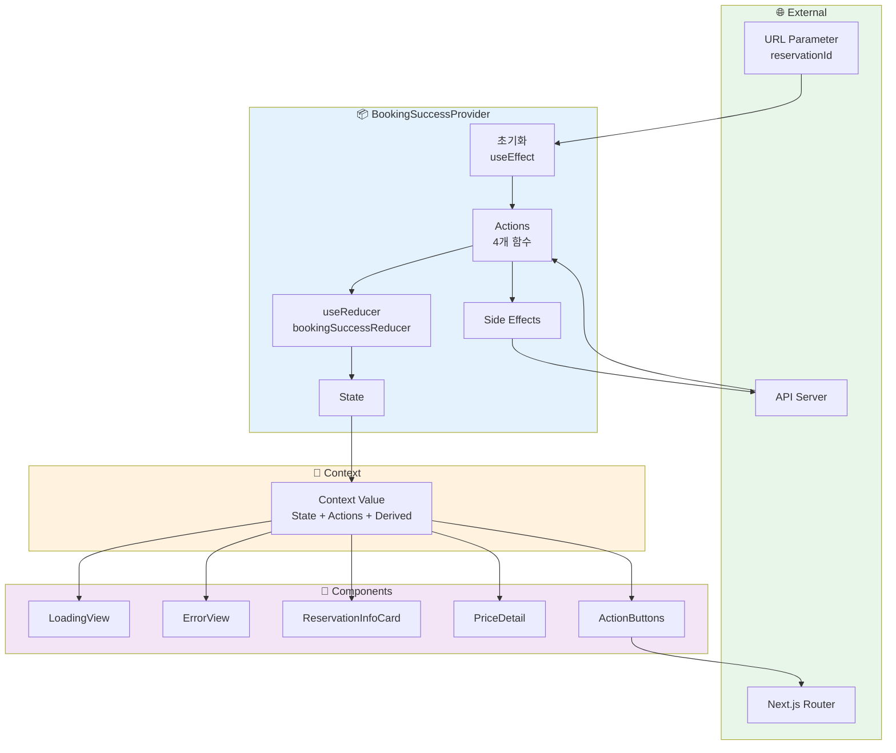
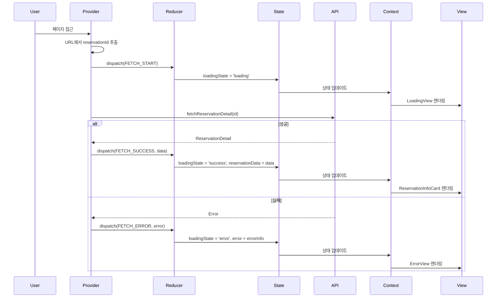
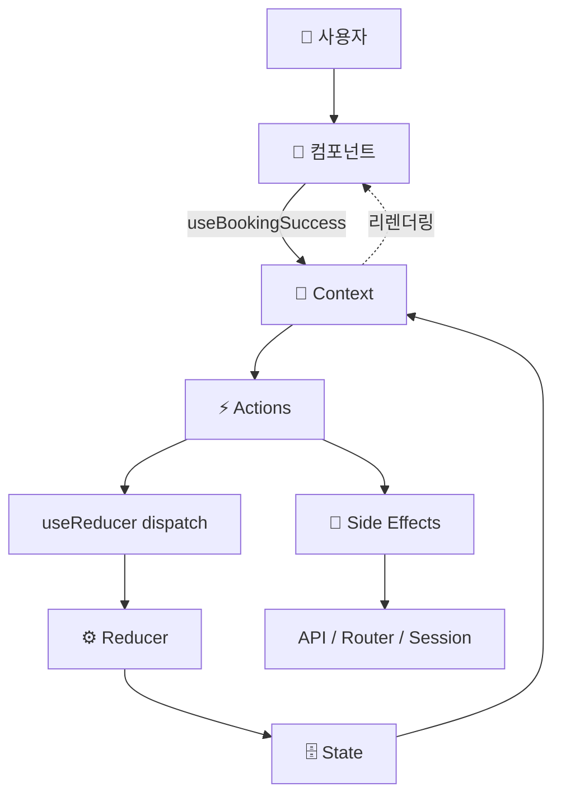
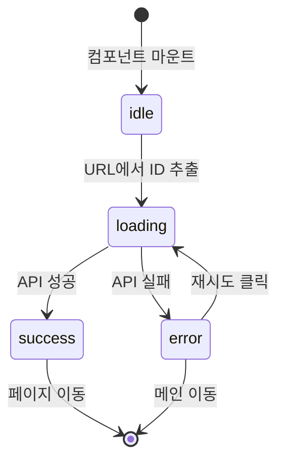

# 예약 완료 페이지 상태 관리 설계 (통합)

## 문서 정보
- **기능 ID**: F-006
- **기능명**: 예약 완료 페이지 - 상태 관리 완전 설계
- **작성일**: 2025-10-15
- **버전**: 1.0
- **설계 패턴**: Context + useReducer (Flux 패턴 기반)

---

## 목차

1. [상태 정의](#1-상태-정의)
2. [Flux 패턴 아키텍처](#2-flux-패턴-아키텍처)
3. [Context 설계](#3-context-설계)
4. [데이터 흐름 시각화](#4-데이터-흐름-시각화)
5. [인터페이스 정의](#5-인터페이스-정의)
6. [컴포넌트별 사용 가이드](#6-컴포넌트별-사용-가이드)
7. [최적화 전략](#7-최적화-전략)
8. [구현 가이드](#8-구현-가이드)

---

## 1. 상태 정의

### 1.1 관리해야 할 상태 (7개)

#### 페이지 로딩 상태 (2개)
| 상태명 | 타입 | 초기값 | 설명 |
|--------|------|--------|------|
| `loadingState` | `'idle' \| 'loading' \| 'success' \| 'error'` | `'idle'` | 예약 정보 로딩 상태 |
| `isRetrying` | `boolean` | `false` | 재시도 중 여부 |

#### 예약 데이터 상태 (1개)
| 상태명 | 타입 | 초기값 | 설명 |
|--------|------|--------|------|
| `reservationData` | `ReservationDetail \| null` | `null` | 조회된 예약 전체 정보 |

#### 에러 상태 (1개)
| 상태명 | 타입 | 초기값 | 설명 |
|--------|------|--------|------|
| `error` | `ErrorInfo \| null` | `null` | 에러 정보 |

#### UI 인터랙션 상태 (2개)
| 상태명 | 타입 | 초기값 | 설명 |
|--------|------|--------|------|
| `isPriceDetailExpanded` | `boolean` | `false` | 가격 상세 펼침/접힘 상태 |
| `isNavigating` | `boolean` | `false` | 페이지 이동 중 여부 |

#### URL 파라미터 (1개)
| 상태명 | 타입 | 초기값 | 설명 |
|--------|------|--------|------|
| `reservationId` | `string \| null` | `null` | URL에서 추출한 예약 ID |

---

### 1.2 파생 데이터 (상태가 아닌 계산된 값, 6개)

| 데이터명 | 계산 방법 | 설명 |
|----------|-----------|------|
| `isLoading` | `loadingState === 'loading' \|\| isRetrying` | 로딩 중 여부 |
| `hasError` | `loadingState === 'error' && error != null` | 에러 발생 여부 |
| `isSuccess` | `loadingState === 'success' && reservationData != null` | 성공 상태 여부 |
| `showRetryButton` | `hasError && error.retryable` | 재시도 버튼 표시 여부 |
| `isCancelled` | `reservationData?.status === 'cancelled'` | 취소된 예약 여부 |
| `hasEmail` | `reservationData?.customerEmail != null` | 이메일 입력 여부 |

---

### 1.3 타입 정의

```typescript
/**
 * 예약 상세 정보
 */
interface ReservationDetail {
  reservationId: string;
  customerName: string;
  customerPhone: string;
  customerEmail?: string;
  status: 'confirmed' | 'cancelled';
  createdAt: string;
  cancelledAt?: string;
  concert: {
    id: string;
    title: string;
    posterImageUrl: string;
  };
  schedule: {
    id: string;
    dateTime: string;
  };
  seats: Array<{
    id: string;
    seatNumber: string;
    grade: string;
    price: number;
  }>;
  totalPrice: number;
}

/**
 * 에러 정보
 */
interface ErrorInfo {
  code: 'NOT_FOUND' | 'SERVER_ERROR' | 'NETWORK_ERROR' | 'INVALID_ID' | 'MISSING_ID';
  message: string;
  retryable: boolean;
}

/**
 * 전체 상태
 */
interface BookingSuccessState {
  loadingState: 'idle' | 'loading' | 'success' | 'error';
  isRetrying: boolean;
  reservationData: ReservationDetail | null;
  error: ErrorInfo | null;
  isPriceDetailExpanded: boolean;
  isNavigating: boolean;
}
```

---

## 2. Flux 패턴 아키텍처

### 2.1 Flux 단방향 데이터 흐름

```
User Interaction → Action → Dispatcher (useReducer) → Store (State) → View → User
                      ↑                                                      ↓
                      └──────────────────────────────────────────────────────┘
```

### 2.2 Action Types (7개)

```typescript
const ActionTypes = {
  FETCH_RESERVATION_START: 'FETCH_RESERVATION_START',
  FETCH_RESERVATION_SUCCESS: 'FETCH_RESERVATION_SUCCESS',
  FETCH_RESERVATION_ERROR: 'FETCH_RESERVATION_ERROR',
  RETRY_FETCH: 'RETRY_FETCH',
  TOGGLE_PRICE_DETAIL: 'TOGGLE_PRICE_DETAIL',
  NAVIGATE_START: 'NAVIGATE_START',
  RESET_STATE: 'RESET_STATE',
} as const;

type BookingSuccessAction =
  | { type: typeof ActionTypes.FETCH_RESERVATION_START }
  | { type: typeof ActionTypes.FETCH_RESERVATION_SUCCESS; payload: ReservationDetail }
  | { type: typeof ActionTypes.FETCH_RESERVATION_ERROR; payload: ErrorInfo }
  | { type: typeof ActionTypes.RETRY_FETCH }
  | { type: typeof ActionTypes.TOGGLE_PRICE_DETAIL }
  | { type: typeof ActionTypes.NAVIGATE_START; payload: string }
  | { type: typeof ActionTypes.RESET_STATE };
```

### 2.3 Reducer (순수 함수)

```typescript
function bookingSuccessReducer(
  state: BookingSuccessState,
  action: BookingSuccessAction
): BookingSuccessState {
  switch (action.type) {
    case ActionTypes.FETCH_RESERVATION_START:
      return { ...state, loadingState: 'loading', error: null };

    case ActionTypes.FETCH_RESERVATION_SUCCESS:
      return {
        ...state,
        loadingState: 'success',
        isRetrying: false,
        reservationData: action.payload,
        error: null,
      };

    case ActionTypes.FETCH_RESERVATION_ERROR:
      return {
        ...state,
        loadingState: 'error',
        isRetrying: false,
        error: action.payload,
      };

    case ActionTypes.RETRY_FETCH:
      return { ...state, loadingState: 'loading', isRetrying: true, error: null };

    case ActionTypes.TOGGLE_PRICE_DETAIL:
      return { ...state, isPriceDetailExpanded: !state.isPriceDetailExpanded };

    case ActionTypes.NAVIGATE_START:
      return { ...state, isNavigating: true };

    case ActionTypes.RESET_STATE:
      return initialState;

    default:
      return state;
  }
}
```

---

## 3. Context 설계

### 3.1 Context 아키텍처

```
BookingSuccessProvider (최상위)
    ├─ useReducer (State 관리)
    ├─ useSearchParams (URL 파라미터)
    ├─ useRouter (네비게이션)
    ├─ useEffect (Side Effects)
    ├─ useCallback (Actions)
    ├─ useMemo (Derived Data)
    └─ Context.Provider
         ├─ LoadingView
         ├─ ErrorView
         └─ ReservationInfoCard
              ├─ CustomerInfo
              ├─ ConcertInfo
              ├─ SeatInfo
              ├─ PriceDetail
              └─ ActionButtons
```

### 3.2 Context Value (16개 노출)

```typescript
interface BookingSuccessContextValue {
  // ─────────────────────────────────────────────────
  // State (읽기 전용, 6개)
  // ─────────────────────────────────────────────────
  loadingState: 'idle' | 'loading' | 'success' | 'error';
  isRetrying: boolean;
  reservationData: ReservationDetail | null;
  error: ErrorInfo | null;
  isPriceDetailExpanded: boolean;
  isNavigating: boolean;
  
  // ─────────────────────────────────────────────────
  // Actions (함수, 4개)
  // ─────────────────────────────────────────────────
  handleRetry: () => void;
  handleTogglePriceDetail: () => void;
  handleNavigateToReservations: () => void;
  handleNavigateToHome: () => void;
  
  // ─────────────────────────────────────────────────
  // Derived Data (계산된 값, 6개)
  // ─────────────────────────────────────────────────
  isLoading: boolean;
  hasError: boolean;
  isSuccess: boolean;
  showRetryButton: boolean;
  isCancelled: boolean;
  hasEmail: boolean;
}
```

### 3.3 Provider & Consumer Hook

```typescript
/**
 * Context 생성
 */
const BookingSuccessContext = createContext<BookingSuccessContextValue | undefined>(
  undefined
);

/**
 * Provider Props
 */
interface BookingSuccessProviderProps {
  children: React.ReactNode;
  initialReservationId?: string;  // 테스트용
  initialState?: Partial<BookingSuccessState>;  // 테스트용
}

/**
 * Consumer Hook
 * Provider 외부에서 사용 시 에러 발생
 */
function useBookingSuccess(): BookingSuccessContextValue {
  const context = useContext(BookingSuccessContext);
  
  if (context === undefined) {
    throw new Error('useBookingSuccess must be used within BookingSuccessProvider');
  }
  
  return context;
}
```

---

## 4. 데이터 흐름 시각화

### 4.1 전체 시스템 데이터 흐름



---

### 4.2 초기 로딩 플로우



---

### 4.3 사용자 인터랙션 플로우



---

## 5. 인터페이스 정의

### 5.1 State 인터페이스 (6개 속성)

```typescript
interface BookingSuccessContextState {
  loadingState: 'idle' | 'loading' | 'success' | 'error';
  isRetrying: boolean;
  reservationData: ReservationDetail | null;
  error: ErrorInfo | null;
  isPriceDetailExpanded: boolean;
  isNavigating: boolean;
}
```

---

### 5.2 Actions 인터페이스 (4개 함수)

```typescript
interface BookingSuccessContextActions {
  /**
   * 예약 정보 재시도
   * @usage ErrorView의 "다시 시도" 버튼
   */
  handleRetry: () => void;
  
  /**
   * 가격 상세 토글
   * @usage PriceDetail의 "가격 상세 보기/숨기기" 버튼
   */
  handleTogglePriceDetail: () => void;
  
  /**
   * 예약 조회 페이지로 이동
   * @usage ActionButtons의 "예약 조회하기" 버튼
   */
  handleNavigateToReservations: () => void;
  
  /**
   * 메인 페이지로 이동
   * @usage ActionButtons, ErrorView의 "메인으로 돌아가기" 버튼
   */
  handleNavigateToHome: () => void;
}
```

---

### 5.3 Derived Data 인터페이스 (6개 값)

```typescript
interface BookingSuccessContextDerived {
  /**
   * 로딩 중 여부
   * @computed loadingState === 'loading' || isRetrying
   * @usage LoadingView 조건부 렌더링, 버튼 비활성화
   */
  isLoading: boolean;
  
  /**
   * 에러 발생 여부
   * @computed loadingState === 'error' && error !== null
   * @usage ErrorView 조건부 렌더링
   */
  hasError: boolean;
  
  /**
   * 성공 상태 여부
   * @computed loadingState === 'success' && reservationData !== null
   * @usage ReservationInfoCard 조건부 렌더링
   */
  isSuccess: boolean;
  
  /**
   * 재시도 버튼 표시 여부
   * @computed hasError && error.retryable
   * @usage ErrorView의 "다시 시도" 버튼 표시
   */
  showRetryButton: boolean;
  
  /**
   * 취소된 예약 여부
   * @computed reservationData?.status === 'cancelled'
   * @usage 예약 상태 배지 표시
   */
  isCancelled: boolean;
  
  /**
   * 이메일 입력 여부
   * @computed reservationData?.customerEmail != null
   * @usage 이메일 필드 조건부 렌더링
   */
  hasEmail: boolean;
}
```

---

## 6. 컴포넌트별 사용 가이드

### 6.1 컴포넌트별 Context 사용 요약 테이블

| 컴포넌트 | State 사용 | Derived 사용 | Actions 사용 | 렌더링 조건 |
|----------|-----------|--------------|--------------|-------------|
| **LoadingView** | `isRetrying` | `isLoading` | - | `isLoading === true` |
| **ErrorView** | `error` | `hasError`<br/>`showRetryButton` | `handleRetry`<br/>`handleNavigateToHome` | `hasError === true` |
| **ReservationInfoCard** | `reservationData` | `isSuccess`<br/>`isCancelled`<br/>`hasEmail` | - | `isSuccess === true` |
| **CustomerInfo** | `reservationData` | `hasEmail` | - | `reservationData !== null` |
| **ConcertInfo** | `reservationData` | - | - | `reservationData !== null` |
| **SeatInfo** | `reservationData` | - | - | `reservationData !== null` |
| **PriceDetail** | `reservationData`<br/>`isPriceDetailExpanded` | - | `handleTogglePriceDetail` | `reservationData !== null` |
| **ActionButtons** | `isNavigating` | - | `handleNavigateToReservations`<br/>`handleNavigateToHome` | 항상 표시 |

---

### 6.2 컴포넌트 구현 예시

#### LoadingView
```typescript
function LoadingView() {
  const { isRetrying, isLoading } = useBookingSuccess();
  
  if (!isLoading) return null;
  
  return (
    <div className="loading-container">
      <Skeleton />
      <p>{isRetrying ? '다시 시도 중...' : '로딩 중...'}</p>
    </div>
  );
}
```

#### ErrorView
```typescript
function ErrorView() {
  const { 
    error, 
    hasError, 
    showRetryButton,
    handleRetry,
    handleNavigateToHome 
  } = useBookingSuccess();
  
  if (!hasError || !error) return null;
  
  return (
    <div className="error-container">
      <h2>오류가 발생했습니다</h2>
      <p>{error.message}</p>
      {showRetryButton && (
        <button onClick={handleRetry}>다시 시도</button>
      )}
      <button onClick={handleNavigateToHome}>메인으로</button>
    </div>
  );
}
```

#### ReservationInfoCard
```typescript
function ReservationInfoCard() {
  const { 
    reservationData, 
    isSuccess, 
    isCancelled,
    hasEmail 
  } = useBookingSuccess();
  
  if (!isSuccess || !reservationData) return null;
  
  return (
    <div className="reservation-card">
      {isCancelled && <Badge>취소됨</Badge>}
      <h2>{reservationData.reservationId}</h2>
      <p>{reservationData.customerName}</p>
      {hasEmail && <p>{reservationData.customerEmail}</p>}
      {/* ... */}
    </div>
  );
}
```

---

## 7. 최적화 전략

### 7.1 리렌더링 최적화

```typescript
function BookingSuccessProvider({ children }: BookingSuccessProviderProps) {
  const [state, dispatch] = useReducer(bookingSuccessReducer, initialState);
  
  // 1. 모든 핸들러 함수를 useCallback으로 메모이제이션
  const handleRetry = useCallback(() => {
    dispatch({ type: ActionTypes.RETRY_FETCH });
    // API 호출
  }, []);
  
  const handleTogglePriceDetail = useCallback(() => {
    dispatch({ type: ActionTypes.TOGGLE_PRICE_DETAIL });
  }, []);
  
  // 2. Derived Data를 useMemo로 계산
  const isLoading = useMemo(
    () => state.loadingState === 'loading' || state.isRetrying,
    [state.loadingState, state.isRetrying]
  );
  
  const hasError = useMemo(
    () => state.loadingState === 'error' && state.error !== null,
    [state.loadingState, state.error]
  );
  
  // 3. Context Value를 useMemo로 메모이제이션
  const contextValue = useMemo<BookingSuccessContextValue>(
    () => ({
      // State
      ...state,
      // Actions
      handleRetry,
      handleTogglePriceDetail,
      handleNavigateToReservations,
      handleNavigateToHome,
      // Derived
      isLoading,
      hasError,
      isSuccess,
      showRetryButton,
      isCancelled,
      hasEmail,
    }),
    [
      state,
      handleRetry,
      handleTogglePriceDetail,
      handleNavigateToReservations,
      handleNavigateToHome,
      isLoading,
      hasError,
      isSuccess,
      showRetryButton,
      isCancelled,
      hasEmail,
    ]
  );
  
  return (
    <BookingSuccessContext.Provider value={contextValue}>
      {children}
    </BookingSuccessContext.Provider>
  );
}
```

---

### 7.2 성능 최적화 체크리스트

- [x] Context Value를 useMemo로 감싸기
- [x] 모든 핸들러 함수를 useCallback으로 감싸기
- [x] Derived Data를 useMemo로 계산하기
- [x] 조건부 렌더링으로 불필요한 컴포넌트 제거
- [x] 의존성 배열 정확히 설정하기
- [x] React DevTools Profiler로 성능 측정

---

## 8. 구현 가이드

### 8.1 파일 구조

```
src/features/booking/success/
├── types/
│   ├── actions.ts          # Action 타입 정의
│   └── state.ts            # State 타입 정의
├── store/
│   ├── reducer.ts          # Reducer 함수
│   └── actions.ts          # Action Creators
├── context/
│   ├── BookingSuccessContext.tsx    # Context 생성
│   └── BookingSuccessProvider.tsx   # Provider 구현
├── hooks/
│   └── useBookingSuccess.ts         # Consumer Hook
├── components/
│   ├── LoadingView.tsx
│   ├── ErrorView.tsx
│   ├── ReservationInfoCard.tsx
│   ├── CustomerInfo.tsx
│   ├── ConcertInfo.tsx
│   ├── SeatInfo.tsx
│   ├── PriceDetail.tsx
│   └── ActionButtons.tsx
└── api/
    └── reservation.ts               # API 호출
```

---

### 8.2 구현 단계

#### Step 1: 타입 정의
1. `types/state.ts`: State 인터페이스 정의
2. `types/actions.ts`: Action 타입 정의

#### Step 2: Reducer 구현
1. `store/reducer.ts`: Reducer 함수 작성
2. `store/actions.ts`: Action Creator 작성 (선택사항)

#### Step 3: Context 생성
1. `context/BookingSuccessContext.tsx`: Context 생성
2. `hooks/useBookingSuccess.ts`: Consumer Hook 작성

#### Step 4: Provider 구현
1. `context/BookingSuccessProvider.tsx`:
   - useReducer로 State 관리
   - useEffect로 초기 로딩
   - useCallback으로 Actions 생성
   - useMemo로 Derived Data 계산
   - useMemo로 Context Value 조합

#### Step 5: 컴포넌트 구현
1. 각 컴포넌트에서 `useBookingSuccess()` 사용
2. 필요한 값만 구조 분해 할당
3. 조건부 렌더링 적용

#### Step 6: 페이지 통합
1. `app/booking/success/page.tsx`:
   - BookingSuccessProvider로 감싸기
   - 하위 컴포넌트 배치

---

### 8.3 테스트 전략

#### Unit Tests
```typescript
describe('bookingSuccessReducer', () => {
  it('FETCH_START 시 loadingState를 loading으로 변경', () => {
    const nextState = bookingSuccessReducer(initialState, {
      type: ActionTypes.FETCH_RESERVATION_START,
    });
    expect(nextState.loadingState).toBe('loading');
  });
});
```

#### Integration Tests
```typescript
describe('BookingSuccessProvider', () => {
  it('Provider 내부에서 useBookingSuccess 정상 동작', () => {
    const { result } = renderHook(() => useBookingSuccess(), {
      wrapper: BookingSuccessProvider,
    });
    expect(result.current).toBeDefined();
  });
});
```

---

## 9. 상태 전환 다이어그램

### 9.1 loadingState 상태 머신



---

## 10. 요약

### 10.1 핵심 설계 원칙

1. **단방향 데이터 흐름**: Flux 패턴 기반
2. **명확한 인터페이스 분리**: State, Actions, Derived
3. **Context + useReducer 조합**: 복잡한 상태 관리
4. **최적화된 구조**: useMemo, useCallback 활용
5. **타입 안정성**: TypeScript 완전 지원

### 10.2 노출 인터페이스 (16개)

| 카테고리 | 개수 | 항목 |
|----------|------|------|
| **State** | 6개 | `loadingState`, `isRetrying`, `reservationData`, `error`, `isPriceDetailExpanded`, `isNavigating` |
| **Actions** | 4개 | `handleRetry`, `handleTogglePriceDetail`, `handleNavigateToReservations`, `handleNavigateToHome` |
| **Derived** | 6개 | `isLoading`, `hasError`, `isSuccess`, `showRetryButton`, `isCancelled`, `hasEmail` |

### 10.3 구현 체크리스트

**타입 정의**
- [x] State 인터페이스
- [x] Action 타입
- [x] Context Value 인터페이스

**Reducer 구현**
- [x] 7개 Action 처리
- [x] 순수 함수
- [x] 불변성 유지

**Context 구현**
- [x] Context 생성
- [x] Provider 구현
- [x] Consumer Hook

**최적화**
- [x] useMemo로 Context Value
- [x] useCallback으로 Actions
- [x] useMemo로 Derived Data

**컴포넌트**
- [x] 8개 컴포넌트 인터페이스 정의
- [x] 조건부 렌더링 로직

**테스트**
- [x] Reducer 단위 테스트
- [x] Provider 통합 테스트
- [x] Hook 테스트

---

## 11. 참고 문서

- [요구사항 정의](./requirement.md)
- [유스케이스 명세](./spec.md)
- [상태 정의](./state-definition.md)
- [Context 설계](./context-design.md)
- [Flux 패턴](./flux-pattern.md)

---

## 12. 변경 이력

| 버전 | 날짜 | 변경 내용 | 작성자 |
|------|------|-----------|--------|
| 1.0 | 2025-10-15 | 초안 작성 | Senior Developer |

---

이 문서는 예약 완료 페이지의 상태 관리를 **Context + useReducer 패턴**으로 완전히 설계하며, 구현을 위한 모든 인터페이스와 가이드를 제공합니다.

