# Flux 패턴 설계: 예약 조회 페이지

## 문서 정보
- **기능 ID**: FLUX-007
- **기능 명**: 예약 조회 Flux 아키텍처
- **관련 문서**: 
  - 상태 정의: `/docs/pages/007/state-definition.md`
  - 요구사항: `/docs/pages/007/requirement.md`
- **작성일**: 2025-10-15
- **버전**: 1.0

---

## 1. Flux 패턴 개요

### 1.1. 기본 구조

```
┌──────────┐      ┌──────────┐      ┌───────┐      ┌──────┐
│  Action  │ ───▶ │ Reducer  │ ───▶ │ Store │ ───▶ │ View │
└──────────┘      └──────────┘      └───────┘      └──────┘
     ▲                                                  │
     └──────────────────────────────────────────────────┘
                     (User Interaction)
```

### 1.2. 예약 조회 페이지에서의 적용

- **Action**: 사용자 상호작용 (입력, 버튼 클릭) 및 API 응답
- **Reducer**: 액션 타입에 따른 상태 변경 로직
- **Store**: useReducer로 관리되는 중앙 상태
- **View**: React 컴포넌트 (상태를 구독하고 렌더링)

---

## 2. Action 정의

### 2.1. Action Types

```typescript
// Action 타입 상수 정의
const ActionTypes = {
  // 검색 폼 액션
  SET_RESERVATION_ID: 'SET_RESERVATION_ID',
  SET_CONTACT: 'SET_CONTACT',
  SET_VALIDATION_ERROR: 'SET_VALIDATION_ERROR',
  CLEAR_VALIDATION_ERRORS: 'CLEAR_VALIDATION_ERRORS',
  RESET_FORM: 'RESET_FORM',
  
  // 검색 액션
  SEARCH_START: 'SEARCH_START',
  SEARCH_SUCCESS: 'SEARCH_SUCCESS',
  SEARCH_FAILURE: 'SEARCH_FAILURE',
  
  // 페이지네이션 액션
  SET_CURRENT_PAGE: 'SET_CURRENT_PAGE',
  
  // 전역 액션
  RESET_STATE: 'RESET_STATE',
} as const;
```

---

### 2.2. Action Creators

```typescript
// Action 생성자 함수들

// 검색 폼 액션
export const setReservationId = (value: string) => ({
  type: ActionTypes.SET_RESERVATION_ID,
  payload: value,
});

export const setContact = (value: string) => ({
  type: ActionTypes.SET_CONTACT,
  payload: value,
});

export const setValidationError = (
  field: 'reservationId' | 'contact',
  error: string | null
) => ({
  type: ActionTypes.SET_VALIDATION_ERROR,
  payload: { field, error },
});

export const clearValidationErrors = () => ({
  type: ActionTypes.CLEAR_VALIDATION_ERRORS,
});

export const resetForm = () => ({
  type: ActionTypes.RESET_FORM,
});

// 검색 액션
export const searchStart = () => ({
  type: ActionTypes.SEARCH_START,
});

export const searchSuccess = (results: Reservation[]) => ({
  type: ActionTypes.SEARCH_SUCCESS,
  payload: results,
});

export const searchFailure = (error: string) => ({
  type: ActionTypes.SEARCH_FAILURE,
  payload: error,
});

// 페이지네이션 액션
export const setCurrentPage = (page: number) => ({
  type: ActionTypes.SET_CURRENT_PAGE,
  payload: page,
});

// 전역 액션
export const resetState = () => ({
  type: ActionTypes.RESET_STATE,
});
```

---

### 2.3. Action 타입 정의

```typescript
// Action 유니온 타입
type ReservationSearchAction =
  | { type: 'SET_RESERVATION_ID'; payload: string }
  | { type: 'SET_CONTACT'; payload: string }
  | { type: 'SET_VALIDATION_ERROR'; payload: { field: 'reservationId' | 'contact'; error: string | null } }
  | { type: 'CLEAR_VALIDATION_ERRORS' }
  | { type: 'RESET_FORM' }
  | { type: 'SEARCH_START' }
  | { type: 'SEARCH_SUCCESS'; payload: Reservation[] }
  | { type: 'SEARCH_FAILURE'; payload: string }
  | { type: 'SET_CURRENT_PAGE'; payload: number }
  | { type: 'RESET_STATE' };
```

---

## 3. State 정의

### 3.1. State 타입

```typescript
// 예약 타입
type Reservation = {
  id: string;
  concertTitle: string;
  scheduleDateTime: string;
  customerName: string;
  totalPrice: number;
  status: 'confirmed' | 'cancelled';
  seats: Array<{
    seatNumber: string;
    grade: string;
    price: number;
  }>;
  createdAt: string;
  cancelledAt: string | null;
};

// 전체 상태 타입
type ReservationSearchState = {
  // 검색 폼
  searchForm: {
    reservationId: string;
    contact: string;
  };
  
  // 검증 오류
  validationErrors: {
    reservationId: string | null;
    contact: string | null;
  };
  
  // 검색 결과
  searchResults: Reservation[];
  
  // UI 상태
  isLoading: boolean;
  error: string | null;
  currentPage: number;
};
```

---

### 3.2. Initial State

```typescript
// 초기 상태
const initialState: ReservationSearchState = {
  searchForm: {
    reservationId: '',
    contact: '',
  },
  validationErrors: {
    reservationId: null,
    contact: null,
  },
  searchResults: [],
  isLoading: false,
  error: null,
  currentPage: 1,
};
```

---

## 4. Reducer 정의

### 4.1. Reducer 함수

```typescript
// Reducer 함수 (상태 변경 로직)
function reservationSearchReducer(
  state: ReservationSearchState,
  action: ReservationSearchAction
): ReservationSearchState {
  switch (action.type) {
    // 검색 폼 액션 처리
    case 'SET_RESERVATION_ID':
      return {
        ...state,
        searchForm: {
          ...state.searchForm,
          reservationId: action.payload,
        },
      };
    
    case 'SET_CONTACT':
      return {
        ...state,
        searchForm: {
          ...state.searchForm,
          contact: action.payload,
        },
      };
    
    case 'SET_VALIDATION_ERROR':
      return {
        ...state,
        validationErrors: {
          ...state.validationErrors,
          [action.payload.field]: action.payload.error,
        },
      };
    
    case 'CLEAR_VALIDATION_ERRORS':
      return {
        ...state,
        validationErrors: {
          reservationId: null,
          contact: null,
        },
      };
    
    case 'RESET_FORM':
      return {
        ...state,
        searchForm: {
          reservationId: '',
          contact: '',
        },
        validationErrors: {
          reservationId: null,
          contact: null,
        },
      };
    
    // 검색 액션 처리
    case 'SEARCH_START':
      return {
        ...state,
        isLoading: true,
        error: null,
        currentPage: 1, // 새 검색 시 페이지 리셋
      };
    
    case 'SEARCH_SUCCESS':
      return {
        ...state,
        isLoading: false,
        searchResults: action.payload,
        error: null,
      };
    
    case 'SEARCH_FAILURE':
      return {
        ...state,
        isLoading: false,
        error: action.payload,
      };
    
    // 페이지네이션 액션 처리
    case 'SET_CURRENT_PAGE':
      return {
        ...state,
        currentPage: action.payload,
      };
    
    // 전역 액션 처리
    case 'RESET_STATE':
      return initialState;
    
    default:
      return state;
  }
}
```

---

## 5. Flux 패턴 시각화 (Mermaid)

### 5.1. 전체 흐름도

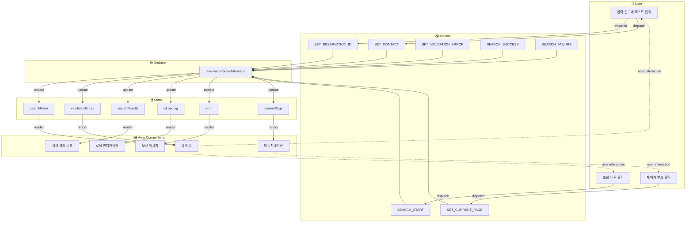

---

### 5.2. 검색 폼 입력 흐름

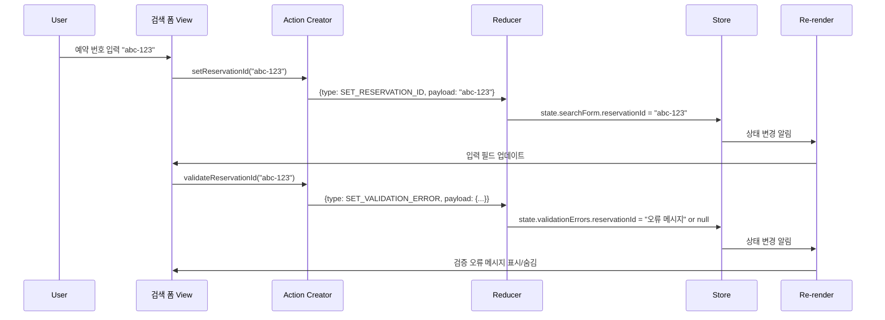

---

### 5.3. 검색 실행 흐름

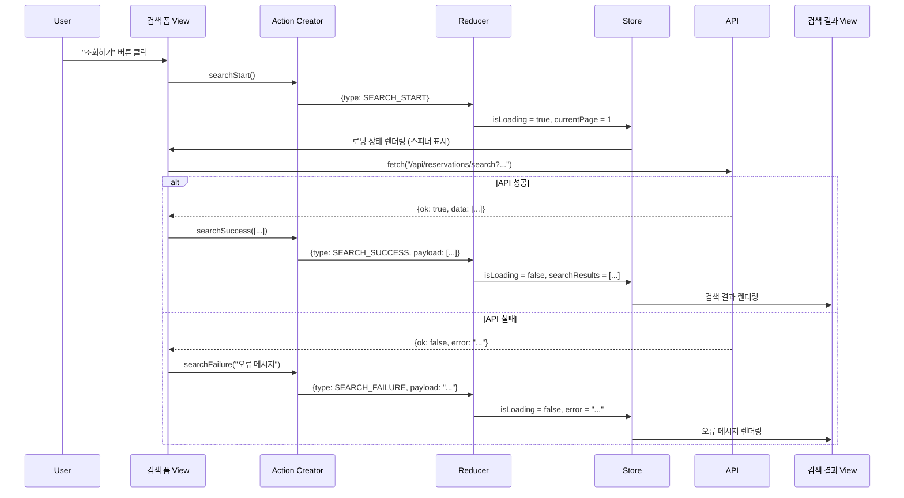

---

### 5.4. 페이지네이션 흐름

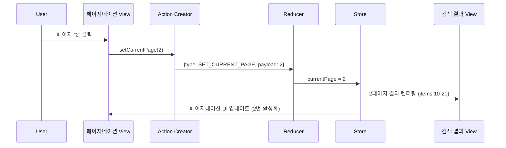

---

### 5.5. 상태별 Flux 흐름 다이어그램

#### 5.5.1. searchForm 상태 흐름

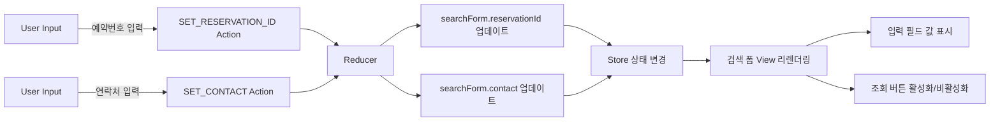

---

#### 5.5.2. validationErrors 상태 흐름

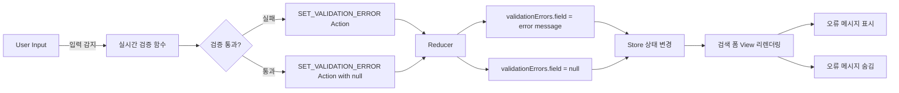

---

#### 5.5.3. searchResults 상태 흐름

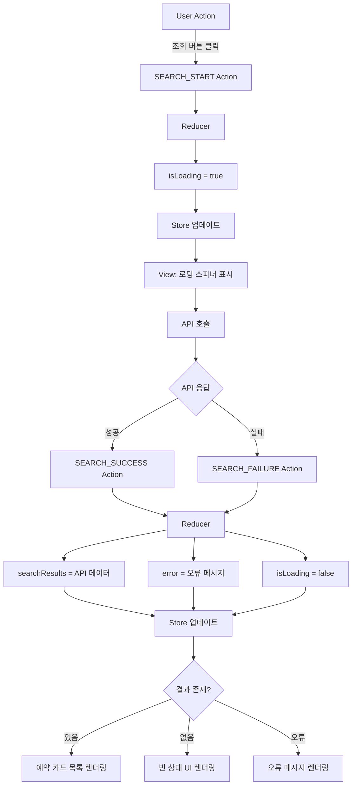

---

#### 5.5.4. isLoading 상태 흐름

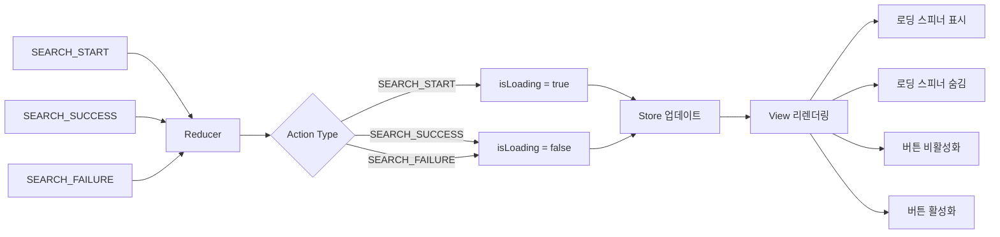

---

#### 5.5.5. error 상태 흐름

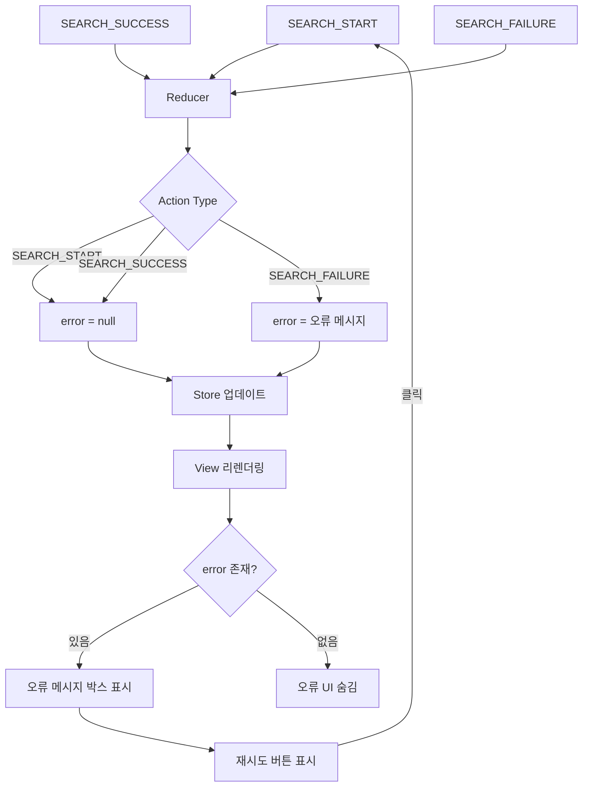

---

#### 5.5.6. currentPage 상태 흐름

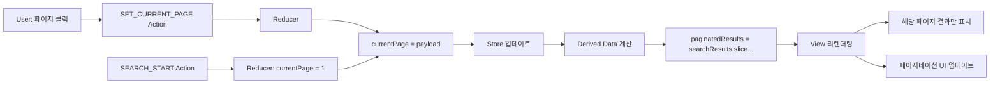

---

## 6. 컴포넌트에서 사용 예시

### 6.1. Custom Hook

```typescript
// useReservationSearch.ts
import { useReducer, useCallback } from 'react';

export function useReservationSearch() {
  const [state, dispatch] = useReducer(reservationSearchReducer, initialState);
  
  // Action Creators를 래핑한 함수들
  const actions = {
    setReservationId: useCallback((value: string) => {
      dispatch(setReservationId(value));
      
      // 실시간 검증
      const error = validateReservationId(value);
      dispatch(setValidationError('reservationId', error));
    }, []),
    
    setContact: useCallback((value: string) => {
      dispatch(setContact(value));
      
      // 실시간 검증
      const error = validateContact(value);
      dispatch(setValidationError('contact', error));
    }, []),
    
    search: useCallback(async () => {
      // 최종 검증
      if (!state.searchForm.reservationId && !state.searchForm.contact) {
        dispatch(setValidationError('reservationId', '예약 번호 또는 연락처를 입력해주세요'));
        return;
      }
      
      // 검색 시작
      dispatch(searchStart());
      
      try {
        const response = await fetch(
          `/api/reservations/search?reservationId=${state.searchForm.reservationId}&contact=${state.searchForm.contact}`
        );
        const data = await response.json();
        
        if (data.ok) {
          dispatch(searchSuccess(data.data));
        } else {
          dispatch(searchFailure(data.error.message));
        }
      } catch (error) {
        dispatch(searchFailure('검색 중 오류가 발생했습니다'));
      }
    }, [state.searchForm]),
    
    setCurrentPage: useCallback((page: number) => {
      dispatch(setCurrentPage(page));
      window.scrollTo({ top: 0, behavior: 'smooth' });
    }, []),
    
    resetForm: useCallback(() => {
      dispatch(resetForm());
    }, []),
  };
  
  return { state, actions };
}
```

---

### 6.2. 컴포넌트에서 사용

```typescript
// ReservationSearchPage.tsx
'use client';

import { useReservationSearch } from '@/features/reservations/hooks/useReservationSearch';

export default function ReservationSearchPage() {
  const { state, actions } = useReservationSearch();
  
  const handleReservationIdChange = (e: React.ChangeEvent<HTMLInputElement>) => {
    actions.setReservationId(e.target.value);
  };
  
  const handleContactChange = (e: React.ChangeEvent<HTMLInputElement>) => {
    actions.setContact(e.target.value);
  };
  
  const handleSubmit = (e: React.FormEvent) => {
    e.preventDefault();
    actions.search();
  };
  
  return (
    <div className="container mx-auto p-4">
      {/* 검색 폼 */}
      <form onSubmit={handleSubmit} className="mb-8">
        <div className="mb-4">
          <label>예약 번호</label>
          <input
            type="text"
            value={state.searchForm.reservationId}
            onChange={handleReservationIdChange}
            placeholder="예약 번호를 입력하세요"
            className={state.validationErrors.reservationId ? 'border-red-500' : ''}
          />
          {state.validationErrors.reservationId && (
            <p className="text-red-500 text-sm">{state.validationErrors.reservationId}</p>
          )}
        </div>
        
        <div className="mb-4">
          <label>연락처</label>
          <input
            type="text"
            value={state.searchForm.contact}
            onChange={handleContactChange}
            placeholder="휴대폰 번호 또는 이메일을 입력하세요"
            className={state.validationErrors.contact ? 'border-red-500' : ''}
          />
          {state.validationErrors.contact && (
            <p className="text-red-500 text-sm">{state.validationErrors.contact}</p>
          )}
        </div>
        
        <button
          type="submit"
          disabled={state.isLoading}
          className="bg-blue-500 text-white px-4 py-2 rounded"
        >
          {state.isLoading ? '조회 중...' : '조회하기'}
        </button>
      </form>
      
      {/* 로딩 상태 */}
      {state.isLoading && <LoadingSpinner />}
      
      {/* 오류 상태 */}
      {state.error && (
        <div className="bg-red-100 border border-red-400 text-red-700 px-4 py-3 rounded">
          <p>{state.error}</p>
          <button onClick={actions.search}>다시 시도</button>
        </div>
      )}
      
      {/* 검색 결과 */}
      {!state.isLoading && state.searchResults.length > 0 && (
        <>
          <ReservationList
            reservations={paginatedResults(state.searchResults, state.currentPage)}
          />
          
          {/* 페이지네이션 */}
          {state.searchResults.length > 10 && (
            <Pagination
              currentPage={state.currentPage}
              totalPages={Math.ceil(state.searchResults.length / 10)}
              onPageChange={actions.setCurrentPage}
            />
          )}
        </>
      )}
      
      {/* 빈 상태 */}
      {!state.isLoading && state.searchResults.length === 0 && !state.error && (
        <EmptyState message="검색 결과가 없습니다" />
      )}
    </div>
  );
}
```

---

## 7. 데이터 흐름 추적

### 7.1. 정상 검색 시나리오

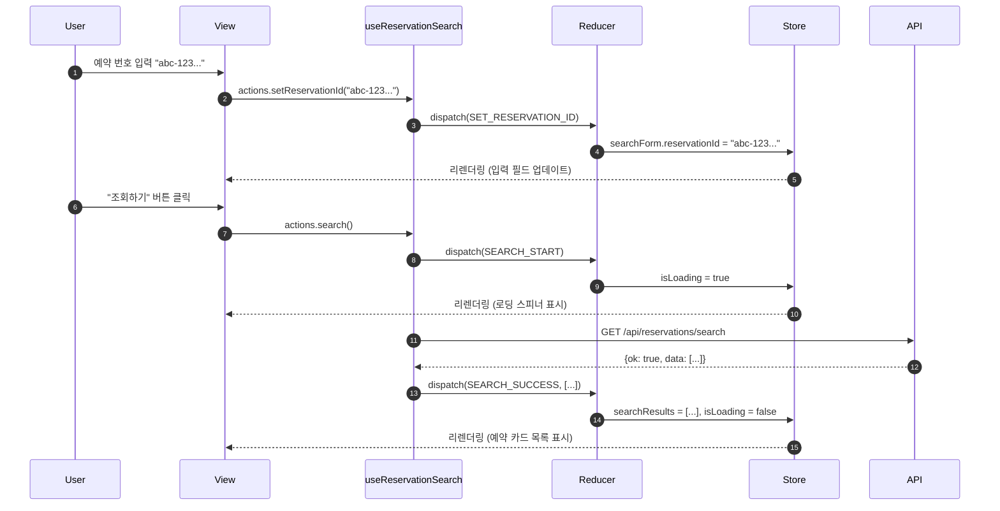

---

### 7.2. 검증 오류 시나리오

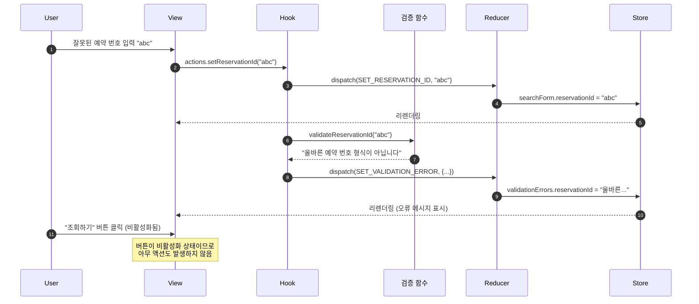

---

### 7.3. 페이지네이션 시나리오

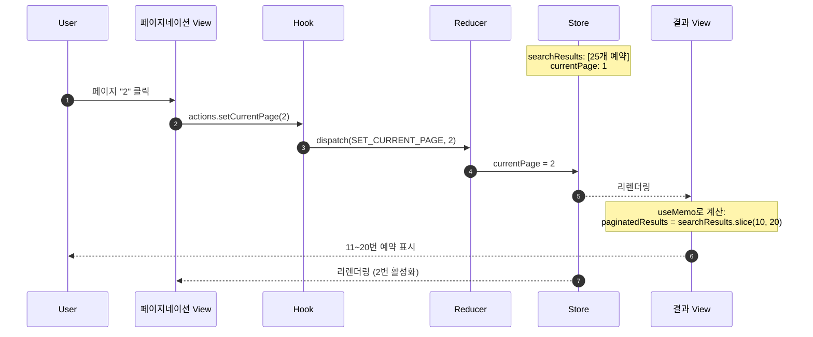

---

## 8. 성능 최적화

### 8.1. useMemo로 파생 데이터 최적화

```typescript
import { useMemo } from 'react';

function useReservationSearchSelectors(state: ReservationSearchState) {
  // 페이지네이션된 결과
  const paginatedResults = useMemo(() => {
    const ITEMS_PER_PAGE = 10;
    const startIndex = (state.currentPage - 1) * ITEMS_PER_PAGE;
    const endIndex = startIndex + ITEMS_PER_PAGE;
    return state.searchResults.slice(startIndex, endIndex);
  }, [state.searchResults, state.currentPage]);
  
  // 전체 페이지 수
  const totalPages = useMemo(() => {
    return Math.ceil(state.searchResults.length / 10);
  }, [state.searchResults.length]);
  
  // 검색 결과 존재 여부
  const hasSearchResults = useMemo(() => {
    return state.searchResults.length > 0;
  }, [state.searchResults.length]);
  
  // 빈 상태 표시 여부
  const showEmptyState = useMemo(() => {
    return !state.isLoading && state.searchResults.length === 0 && !state.error;
  }, [state.isLoading, state.searchResults.length, state.error]);
  
  // 페이지네이션 표시 여부
  const showPagination = useMemo(() => {
    return state.searchResults.length > 10;
  }, [state.searchResults.length]);
  
  // 조회 버튼 비활성화 여부
  const isSearchButtonDisabled = useMemo(() => {
    return (
      state.isLoading ||
      (!state.searchForm.reservationId && !state.searchForm.contact) ||
      state.validationErrors.reservationId !== null ||
      state.validationErrors.contact !== null
    );
  }, [
    state.isLoading,
    state.searchForm.reservationId,
    state.searchForm.contact,
    state.validationErrors.reservationId,
    state.validationErrors.contact,
  ]);
  
  return {
    paginatedResults,
    totalPages,
    hasSearchResults,
    showEmptyState,
    showPagination,
    isSearchButtonDisabled,
  };
}
```

---

### 8.2. useCallback로 액션 최적화

```typescript
// 이미 Custom Hook에서 useCallback 사용
// 자식 컴포넌트에 함수를 props로 전달할 때 불필요한 리렌더링 방지

const actions = {
  setReservationId: useCallback((value: string) => {
    // ...
  }, []), // 의존성 배열 비어있음 - 함수가 재생성되지 않음
  
  search: useCallback(async () => {
    // ...
  }, [state.searchForm]), // searchForm이 바뀔 때만 함수 재생성
};
```

---

## 9. 테스트 전략

### 9.1. Reducer 테스트

```typescript
// reservationSearchReducer.test.ts
describe('reservationSearchReducer', () => {
  it('should handle SET_RESERVATION_ID', () => {
    const action = setReservationId('test-id');
    const newState = reservationSearchReducer(initialState, action);
    
    expect(newState.searchForm.reservationId).toBe('test-id');
  });
  
  it('should handle SEARCH_START', () => {
    const action = searchStart();
    const newState = reservationSearchReducer(initialState, action);
    
    expect(newState.isLoading).toBe(true);
    expect(newState.error).toBe(null);
    expect(newState.currentPage).toBe(1);
  });
  
  it('should handle SEARCH_SUCCESS', () => {
    const mockResults = [{ id: '1', concertTitle: 'Test Concert', /* ... */ }];
    const action = searchSuccess(mockResults);
    const newState = reservationSearchReducer(initialState, action);
    
    expect(newState.isLoading).toBe(false);
    expect(newState.searchResults).toEqual(mockResults);
  });
  
  it('should handle SEARCH_FAILURE', () => {
    const action = searchFailure('Test error');
    const newState = reservationSearchReducer(initialState, action);
    
    expect(newState.isLoading).toBe(false);
    expect(newState.error).toBe('Test error');
  });
});
```

---

### 9.2. Custom Hook 테스트

```typescript
// useReservationSearch.test.ts
import { renderHook, act } from '@testing-library/react';
import { useReservationSearch } from './useReservationSearch';

describe('useReservationSearch', () => {
  it('should update reservation ID', () => {
    const { result } = renderHook(() => useReservationSearch());
    
    act(() => {
      result.current.actions.setReservationId('test-id');
    });
    
    expect(result.current.state.searchForm.reservationId).toBe('test-id');
  });
  
  it('should set validation error for invalid reservation ID', () => {
    const { result } = renderHook(() => useReservationSearch());
    
    act(() => {
      result.current.actions.setReservationId('invalid');
    });
    
    expect(result.current.state.validationErrors.reservationId).toBeTruthy();
  });
  
  it('should handle search flow', async () => {
    const { result } = renderHook(() => useReservationSearch());
    
    // 예약 번호 설정
    act(() => {
      result.current.actions.setReservationId('valid-uuid-...');
    });
    
    // 검색 실행
    await act(async () => {
      await result.current.actions.search();
    });
    
    // 로딩이 완료되었는지 확인
    expect(result.current.state.isLoading).toBe(false);
  });
});
```

---

## 10. 요약

### 10.1. Flux 패턴의 장점

1. **단방향 데이터 흐름**: Action → Reducer → Store → View의 예측 가능한 흐름
2. **상태 관리 중앙화**: 모든 상태가 한 곳에서 관리되어 디버깅이 쉬움
3. **순수 함수 Reducer**: 부수 효과 없이 테스트하기 쉬움
4. **시간 여행 디버깅**: 액션 히스토리를 추적하여 상태 변화 재현 가능
5. **타입 안전성**: TypeScript와 함께 사용하여 컴파일 타임 오류 방지

### 10.2. 핵심 구성 요소

| 요소 | 역할 | 구현 |
|-----|------|------|
| **Action** | 상태 변경 의도 표현 | Action Creator 함수 |
| **Reducer** | 상태 변경 로직 | reservationSearchReducer 함수 |
| **Store** | 상태 저장소 | useReducer 훅 |
| **View** | UI 렌더링 | React 컴포넌트 |

### 10.3. 상태별 Action 매핑

| 상태 | 관련 Actions |
|-----|-------------|
| `searchForm` | SET_RESERVATION_ID, SET_CONTACT, RESET_FORM |
| `validationErrors` | SET_VALIDATION_ERROR, CLEAR_VALIDATION_ERRORS |
| `searchResults` | SEARCH_SUCCESS |
| `isLoading` | SEARCH_START, SEARCH_SUCCESS, SEARCH_FAILURE |
| `error` | SEARCH_FAILURE, SEARCH_START, SEARCH_SUCCESS |
| `currentPage` | SET_CURRENT_PAGE, SEARCH_START |

### 10.4. 구현 체크리스트

- [x] Action Types 정의
- [x] Action Creators 구현
- [x] Action 타입 정의 (TypeScript)
- [x] State 타입 정의
- [x] Initial State 정의
- [x] Reducer 함수 구현
- [x] Custom Hook 구현 (useReservationSearch)
- [x] Selectors 구현 (useMemo)
- [x] 컴포넌트 통합
- [x] 테스트 작성

---

이 Flux 패턴 설계를 기반으로 예약 조회 페이지의 상태 관리를 구현하면, 명확하고 예측 가능하며 유지보수하기 쉬운 코드를 작성할 수 있습니다.

