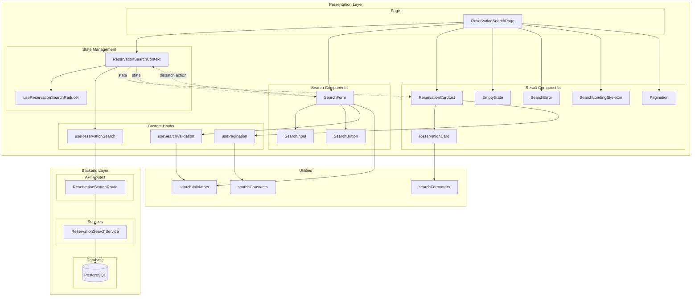

# 유저플로우 007: 예약 조회 페이지 - 예약 검색 구현 계획

## 개요

### 구현 목표
- 예약 번호 또는 연락처(휴대폰/이메일)로 예약을 검색하는 기능 구현
- useReducer 기반 Flux 패턴으로 예측 가능한 상태 관리
- 2초 이내 검색 결과 응답을 위한 최적화된 데이터베이스 쿼리
- 실시간 입력 검증과 명확한 사용자 피드백 제공
- 페이지네이션을 통한 다수 결과 처리

### 모듈 목록

| 모듈명 | 위치 | 타입 | 설명 |
|--------|------|------|------|
| **ReservationSearchPage** | `src/app/reservations/page.tsx` | Page | 예약 조회 페이지 메인 컴포넌트 |
| **SearchForm** | `src/features/reservations/components/search-form.tsx` | Component | 예약 번호/연락처 입력 폼 |
| **SearchInput** | `src/features/reservations/components/search-input.tsx` | Component | 재사용 가능한 검색 입력 필드 |
| **SearchButton** | `src/features/reservations/components/search-button.tsx` | Component | 검색 실행 버튼 |
| **ReservationCardList** | `src/features/reservations/components/reservation-card-list.tsx` | Component | 검색 결과 목록 컨테이너 |
| **ReservationCard** | `src/features/reservations/components/reservation-card.tsx` | Component | 개별 예약 카드 |
| **EmptyState** | `src/features/reservations/components/empty-state.tsx` | Component | 검색 결과 없음 UI |
| **SearchError** | `src/features/reservations/components/search-error.tsx` | Component | 검색 오류 UI |
| **SearchLoadingSkeleton** | `src/features/reservations/components/search-loading-skeleton.tsx` | Component | 로딩 스켈레톤 |
| **Pagination** | `src/features/reservations/components/pagination.tsx` | Component | 페이지네이션 UI |
| **ReservationSearchContext** | `src/features/reservations/context/reservation-search-context.tsx` | Context | 예약 검색 상태 관리 Context |
| **useReservationSearchReducer** | `src/features/reservations/hooks/use-reservation-search-reducer.ts` | Hook | Flux 패턴 Reducer |
| **useReservationSearch** | `src/features/reservations/hooks/use-reservation-search.ts` | Hook | 검색 API 호출 훅 |
| **useSearchValidation** | `src/features/reservations/hooks/use-search-validation.ts` | Hook | 실시간 입력 검증 |
| **usePagination** | `src/features/reservations/hooks/use-pagination.ts` | Hook | 페이지네이션 로직 |
| **ReservationSearchRoute** | `src/features/reservations/backend/route.ts` (수정) | Route | 검색 API 라우트 추가 |
| **ReservationSearchService** | `src/features/reservations/backend/service.ts` (수정) | Service | 검색 비즈니스 로직 추가 |
| **ReservationSearchSchema** | `src/features/reservations/backend/schema.ts` (수정) | Schema | 검색 요청/응답 스키마 추가 |
| **ReservationSearchError** | `src/features/reservations/backend/error.ts` (수정) | Error | 검색 관련 에러 코드 추가 |
| **searchValidators** | `src/features/reservations/lib/validators.ts` | Lib | 검색 조건 유효성 검증 함수 |
| **searchFormatters** | `src/features/reservations/lib/formatters.ts` | Lib | 검색 결과 포맷팅 함수 |
| **searchConstants** | `src/features/reservations/constants/search.ts` | Constant | 검색 관련 상수 |

---

## Diagram



---

## Implementation Plan

### 1. Backend Layer (우선순위: 최고)

#### 1.1 ReservationSearchSchema 추가
**위치**: `src/features/reservations/backend/schema.ts`

**목적**: 예약 검색 API 요청/응답 스키마 정의

**구현 내용**:
```typescript
// 예약 검색 요청 스키마
export const SearchReservationsRequestSchema = z.object({
  reservationId: z.string().uuid().optional(),
  phone: z.string().regex(/^010-\d{4}-\d{4}$/).optional(),
  email: z.string().email().optional(),
  page: z.number().int().min(1).default(1),
  pageSize: z.number().int().min(1).max(100).default(10),
}).refine(
  (data) => data.reservationId || data.phone || data.email,
  { message: '예약 번호 또는 연락처를 입력해주세요' }
);

// 예약 검색 응답 스키마
export const SearchReservationsResponseSchema = z.object({
  reservations: z.array(
    z.object({
      id: z.string().uuid(),
      reservationNumber: z.string(),
      concertTitle: z.string(),
      scheduleDateTime: z.string(),
      customerName: z.string(),
      totalPrice: z.number(),
      seatCount: z.number(),
      seats: z.array(
        z.object({
          seatNumber: z.string(),
          grade: z.string(),
          price: z.number(),
        })
      ),
      status: z.enum(['confirmed', 'cancelled']),
      createdAt: z.string(),
      cancelledAt: z.string().nullable(),
    })
  ),
  totalCount: z.number(),
  page: z.number(),
  pageSize: z.number(),
  totalPages: z.number(),
});

export type SearchReservationsRequest = z.infer<typeof SearchReservationsRequestSchema>;
export type SearchReservationsResponse = z.infer<typeof SearchReservationsResponseSchema>;
```

**Unit Test**:
```typescript
describe('SearchReservationsRequestSchema', () => {
  it('should validate with reservationId only', () => {
    const data = { reservationId: 'uuid-here' };
    expect(SearchReservationsRequestSchema.parse(data)).toBeDefined();
  });
  
  it('should validate with phone only', () => {
    const data = { phone: '010-1234-5678' };
    expect(SearchReservationsRequestSchema.parse(data)).toBeDefined();
  });
  
  it('should fail without any search criteria', () => {
    const data = {};
    expect(() => SearchReservationsRequestSchema.parse(data)).toThrow();
  });
  
  it('should fail with invalid phone format', () => {
    const data = { phone: '010-12345678' };
    expect(() => SearchReservationsRequestSchema.parse(data)).toThrow();
  });
});
```

---

#### 1.2 ReservationSearchService 추가
**위치**: `src/features/reservations/backend/service.ts`

**목적**: 예약 검색 비즈니스 로직 구현

**구현 내용**:
```typescript
export const searchReservations = async (
  client: SupabaseClient,
  request: SearchReservationsRequest
): Promise<
  HandlerResult<SearchReservationsResponse, ReservationServiceError, unknown>
> => {
  try {
    // 기본 쿼리 구성
    let query = client
      .from(RESERVATIONS_TABLE)
      .select(
        `
        id,
        reservation_number,
        schedule_id,
        seat_ids,
        total_price,
        customer_name,
        customer_phone,
        customer_email,
        status,
        created_at,
        cancelled_at,
        schedules (
          date_time,
          concerts (
            title
          )
        )
      `,
        { count: 'exact' }
      );

    // 검색 조건 추가
    if (request.reservationId) {
      query = query.eq('id', request.reservationId);
    } else if (request.phone) {
      query = query.eq('customer_phone', request.phone);
    } else if (request.email) {
      query = query.ilike('customer_email', request.email);
    }

    // 정렬 및 페이지네이션
    const from = (request.page - 1) * request.pageSize;
    const to = from + request.pageSize - 1;
    
    query = query
      .order('created_at', { ascending: false })
      .range(from, to);

    const { data, error, count } = await query;

    if (error) {
      console.error('Reservation search error:', error);
      return failure(
        500,
        reservationErrorCodes.searchError,
        '예약 검색 중 오류가 발생했습니다'
      );
    }

    if (!data || data.length === 0) {
      return success({
        reservations: [],
        totalCount: 0,
        page: request.page,
        pageSize: request.pageSize,
        totalPages: 0,
      });
    }

    // 좌석 정보 조회 (배치)
    const allSeatIds = data.flatMap(r => r.seat_ids);
    const { data: seats, error: seatsError } = await client
      .from(SEATS_TABLE)
      .select('id, seat_number, grade, price')
      .in('id', allSeatIds);

    if (seatsError) {
      console.error('Seat fetch error:', seatsError);
      return failure(
        500,
        reservationErrorCodes.seatFetchError,
        '좌석 정보 조회 중 오류가 발생했습니다'
      );
    }

    // 결과 매핑
    const reservations = data.map(r => {
      const schedules = r.schedules as unknown as {
        date_time: string;
        concerts: { title: string };
      };
      
      const reservationSeats = seats?.filter(s => r.seat_ids.includes(s.id)) || [];

      return {
        id: r.id,
        reservationNumber: r.reservation_number,
        concertTitle: schedules.concerts.title,
        scheduleDateTime: schedules.date_time,
        customerName: r.customer_name,
        totalPrice: r.total_price,
        seatCount: r.seat_ids.length,
        seats: reservationSeats.map(s => ({
          seatNumber: s.seat_number,
          grade: s.grade,
          price: s.price,
        })),
        status: r.status,
        createdAt: r.created_at,
        cancelledAt: r.cancelled_at,
      };
    });

    const totalPages = Math.ceil((count || 0) / request.pageSize);

    return success({
      reservations,
      totalCount: count || 0,
      page: request.page,
      pageSize: request.pageSize,
      totalPages,
    });
  } catch (error) {
    console.error('Reservation search exception:', error);
    return failure(
      500,
      reservationErrorCodes.internalError,
      '서버 내부 오류가 발생했습니다'
    );
  }
};
```

**Unit Test**:
```typescript
describe('searchReservations', () => {
  it('should return reservations by reservationId', async () => {
    // Mock Supabase client
    const result = await searchReservations(mockClient, {
      reservationId: 'test-uuid',
      page: 1,
      pageSize: 10,
    });
    
    expect(result.ok).toBe(true);
    expect(result.data?.reservations).toHaveLength(1);
  });
  
  it('should return empty array when no results found', async () => {
    const result = await searchReservations(mockClient, {
      phone: '010-9999-9999',
      page: 1,
      pageSize: 10,
    });
    
    expect(result.ok).toBe(true);
    expect(result.data?.reservations).toHaveLength(0);
    expect(result.data?.totalCount).toBe(0);
  });
  
  it('should handle pagination correctly', async () => {
    const result = await searchReservations(mockClient, {
      phone: '010-1234-5678',
      page: 2,
      pageSize: 10,
    });
    
    expect(result.ok).toBe(true);
    expect(result.data?.page).toBe(2);
  });
});
```

---

#### 1.3 ReservationSearchRoute 추가
**위치**: `src/features/reservations/backend/route.ts`

**목적**: 예약 검색 API 엔드포인트 추가

**구현 내용**:
```typescript
// 예약 검색
app.get('/api/reservations/search', async (c) => {
  const query = c.req.query();
  
  const parsedQuery = SearchReservationsRequestSchema.safeParse({
    reservationId: query.reservationId,
    phone: query.phone,
    email: query.email,
    page: query.page ? parseInt(query.page) : 1,
    pageSize: query.pageSize ? parseInt(query.pageSize) : 10,
  });

  if (!parsedQuery.success) {
    return respond(
      c,
      failure(
        400,
        reservationErrorCodes.validationError,
        '유효하지 않은 검색 조건입니다',
        parsedQuery.error.format()
      )
    );
  }

  const supabase = getSupabase(c);
  const logger = getLogger(c);

  logger.info(`예약 검색 요청: ${JSON.stringify(parsedQuery.data)}`);

  const result = await searchReservations(supabase, parsedQuery.data);

  if (!result.ok) {
    const errorResult = result as ErrorResult<ReservationServiceError, unknown>;
    logger.error(`예약 검색 실패: ${errorResult.error.code}`, errorResult.error.message);
  } else {
    logger.info(`예약 검색 성공: ${result.data.totalCount}건`);
  }

  return respond(c, result);
});
```

---

#### 1.4 ReservationSearchError 추가
**위치**: `src/features/reservations/backend/error.ts`

**목적**: 검색 관련 에러 코드 추가

**구현 내용**:
```typescript
export const reservationErrorCodes = {
  // ... 기존 에러 코드
  searchError: 'SEARCH_ERROR' as const,
  invalidSearchCriteria: 'INVALID_SEARCH_CRITERIA' as const,
};
```

---

### 2. Frontend State Management (우선순위: 높음)

#### 2.1 searchConstants
**위치**: `src/features/reservations/constants/search.ts`

**목적**: 검색 관련 상수 정의

**구현 내용**:
```typescript
export const SEARCH_CONSTANTS = {
  ITEMS_PER_PAGE: 10,
  MAX_SEARCH_RESULTS: 100,
  DEBOUNCE_DELAY: 300,
} as const;

export const VALIDATION_MESSAGES = {
  INVALID_RESERVATION_ID: '올바른 예약 번호 형식이 아닙니다',
  INVALID_PHONE: '올바른 휴대폰 번호 형식을 입력해주세요 (예: 010-1234-5678)',
  INVALID_EMAIL: '올바른 이메일 형식을 입력해주세요',
  NO_SEARCH_CRITERIA: '예약 번호 또는 연락처를 입력해주세요',
  SEARCH_FAILED: '검색 중 오류가 발생했습니다. 잠시 후 다시 시도해주세요',
} as const;

export const PLACEHOLDERS = {
  RESERVATION_ID: '예약 번호를 입력하세요 (예: a1b2c3d4-...)',
  CONTACT: '휴대폰 번호 또는 이메일을 입력하세요',
} as const;
```

---

#### 2.2 searchValidators
**위치**: `src/features/reservations/lib/validators.ts`

**목적**: 검색 조건 유효성 검증 함수

**구현 내용**:
```typescript
export const isValidUUID = (value: string): boolean => {
  const uuidRegex = /^[0-9a-f]{8}-[0-9a-f]{4}-[0-9a-f]{4}-[0-9a-f]{4}-[0-9a-f]{12}$/i;
  return uuidRegex.test(value);
};

export const isValidPhone = (value: string): boolean => {
  const phoneRegex = /^010-\d{4}-\d{4}$/;
  return phoneRegex.test(value);
};

export const isValidEmail = (value: string): boolean => {
  const emailRegex = /^[^\s@]+@[^\s@]+\.[^\s@]+$/;
  return emailRegex.test(value);
};

export const validateReservationId = (value: string): string | null => {
  if (!value) return null;
  if (!isValidUUID(value)) {
    return VALIDATION_MESSAGES.INVALID_RESERVATION_ID;
  }
  return null;
};

export const validateContact = (value: string): string | null => {
  if (!value) return null;
  if (!isValidPhone(value) && !isValidEmail(value)) {
    return isValidPhone(value.replace(/-/g, ''))
      ? VALIDATION_MESSAGES.INVALID_PHONE
      : VALIDATION_MESSAGES.INVALID_EMAIL;
  }
  return null;
};
```

**Unit Test**:
```typescript
describe('searchValidators', () => {
  describe('isValidUUID', () => {
    it('should return true for valid UUID', () => {
      expect(isValidUUID('123e4567-e89b-12d3-a456-426614174000')).toBe(true);
    });
    
    it('should return false for invalid UUID', () => {
      expect(isValidUUID('invalid-uuid')).toBe(false);
    });
  });
  
  describe('isValidPhone', () => {
    it('should return true for valid phone', () => {
      expect(isValidPhone('010-1234-5678')).toBe(true);
    });
    
    it('should return false for invalid phone', () => {
      expect(isValidPhone('010-12345678')).toBe(false);
    });
  });
  
  describe('validateReservationId', () => {
    it('should return null for valid UUID', () => {
      expect(validateReservationId('123e4567-e89b-12d3-a456-426614174000')).toBeNull();
    });
    
    it('should return error message for invalid UUID', () => {
      expect(validateReservationId('invalid')).toBe(VALIDATION_MESSAGES.INVALID_RESERVATION_ID);
    });
  });
});
```

---

#### 2.3 searchFormatters
**위치**: `src/features/reservations/lib/formatters.ts`

**목적**: 검색 결과 포맷팅 함수

**구현 내용**:
```typescript
import { format } from 'date-fns';
import { ko } from 'date-fns/locale';

export const formatScheduleDateTime = (dateTime: string): string => {
  return format(new Date(dateTime), 'yyyy년 MM월 dd일 HH시', { locale: ko });
};

export const formatSeats = (seats: Array<{ seatNumber: string }>): string => {
  const seatNumbers = seats.map(s => s.seatNumber).join(', ');
  const seatCount = seats.length;
  return `${seatNumbers} (${seatCount}석)`;
};

export const formatPrice = (price: number): string => {
  return new Intl.NumberFormat('ko-KR').format(price) + '원';
};

export const getStatusBadgeProps = (
  status: 'confirmed' | 'cancelled'
): { text: string; bgColor: string; textColor: string } => {
  if (status === 'confirmed') {
    return {
      text: '확정',
      bgColor: 'bg-blue-100',
      textColor: 'text-blue-800',
    };
  }
  return {
    text: '취소됨',
    bgColor: 'bg-gray-100',
    textColor: 'text-gray-600',
  };
};
```

---

#### 2.4 useReservationSearchReducer
**위치**: `src/features/reservations/hooks/use-reservation-search-reducer.ts`

**목적**: Flux 패턴 Reducer 구현

**구현 내용**:
```typescript
import { useReducer, useCallback } from 'react';

type Reservation = {
  id: string;
  reservationNumber: string;
  concertTitle: string;
  scheduleDateTime: string;
  customerName: string;
  totalPrice: number;
  seatCount: number;
  seats: Array<{
    seatNumber: string;
    grade: string;
    price: number;
  }>;
  status: 'confirmed' | 'cancelled';
  createdAt: string;
  cancelledAt: string | null;
};

type State = {
  searchForm: {
    reservationId: string;
    contact: string;
  };
  validationErrors: {
    reservationId: string | null;
    contact: string | null;
  };
  searchResults: Reservation[];
  isLoading: boolean;
  error: string | null;
  currentPage: number;
  totalPages: number;
  totalCount: number;
};

type Action =
  | { type: 'SET_RESERVATION_ID'; payload: string }
  | { type: 'SET_CONTACT'; payload: string }
  | { type: 'SET_VALIDATION_ERROR'; payload: { field: 'reservationId' | 'contact'; error: string | null } }
  | { type: 'CLEAR_VALIDATION_ERRORS' }
  | { type: 'RESET_FORM' }
  | { type: 'SEARCH_START' }
  | { type: 'SEARCH_SUCCESS'; payload: { reservations: Reservation[]; totalCount: number; totalPages: number } }
  | { type: 'SEARCH_FAILURE'; payload: string }
  | { type: 'SET_CURRENT_PAGE'; payload: number }
  | { type: 'RESET_STATE' };

const initialState: State = {
  searchForm: {
    reservationId: '',
    contact: '',
  },
  validationErrors: {
    reservationId: null,
    contact: null,
  },
  searchResults: [],
  isLoading: false,
  error: null,
  currentPage: 1,
  totalPages: 0,
  totalCount: 0,
};

function reservationSearchReducer(state: State, action: Action): State {
  switch (action.type) {
    case 'SET_RESERVATION_ID':
      return {
        ...state,
        searchForm: {
          ...state.searchForm,
          reservationId: action.payload,
        },
      };
    
    case 'SET_CONTACT':
      return {
        ...state,
        searchForm: {
          ...state.searchForm,
          contact: action.payload,
        },
      };
    
    case 'SET_VALIDATION_ERROR':
      return {
        ...state,
        validationErrors: {
          ...state.validationErrors,
          [action.payload.field]: action.payload.error,
        },
      };
    
    case 'CLEAR_VALIDATION_ERRORS':
      return {
        ...state,
        validationErrors: {
          reservationId: null,
          contact: null,
        },
      };
    
    case 'RESET_FORM':
      return {
        ...state,
        searchForm: {
          reservationId: '',
          contact: '',
        },
        validationErrors: {
          reservationId: null,
          contact: null,
        },
      };
    
    case 'SEARCH_START':
      return {
        ...state,
        isLoading: true,
        error: null,
        currentPage: 1,
      };
    
    case 'SEARCH_SUCCESS':
      return {
        ...state,
        isLoading: false,
        searchResults: action.payload.reservations,
        totalCount: action.payload.totalCount,
        totalPages: action.payload.totalPages,
        error: null,
      };
    
    case 'SEARCH_FAILURE':
      return {
        ...state,
        isLoading: false,
        error: action.payload,
      };
    
    case 'SET_CURRENT_PAGE':
      return {
        ...state,
        currentPage: action.payload,
      };
    
    case 'RESET_STATE':
      return initialState;
    
    default:
      return state;
  }
}

export const useReservationSearchReducer = () => {
  return useReducer(reservationSearchReducer, initialState);
};
```

---

#### 2.5 useSearchValidation
**위치**: `src/features/reservations/hooks/use-search-validation.ts`

**목적**: 실시간 입력 검증 훅

**구현 내용**:
```typescript
import { useCallback } from 'react';
import { validateReservationId, validateContact } from '../lib/validators';

export const useSearchValidation = () => {
  const validateReservationIdField = useCallback((value: string) => {
    return validateReservationId(value);
  }, []);

  const validateContactField = useCallback((value: string) => {
    return validateContact(value);
  }, []);

  return {
    validateReservationIdField,
    validateContactField,
  };
};
```

---

#### 2.6 useReservationSearch
**위치**: `src/features/reservations/hooks/use-reservation-search.ts`

**목적**: 검색 API 호출 및 상태 관리 훅

**구현 내용**:
```typescript
import { useCallback } from 'react';
import { apiClient } from '@/lib/remote/api-client';
import type { SearchReservationsRequest, SearchReservationsResponse } from '../backend/schema';

export const useReservationSearch = () => {
  const searchReservations = useCallback(async (params: SearchReservationsRequest) => {
    const queryParams = new URLSearchParams();
    
    if (params.reservationId) {
      queryParams.append('reservationId', params.reservationId);
    }
    if (params.phone) {
      queryParams.append('phone', params.phone);
    }
    if (params.email) {
      queryParams.append('email', params.email);
    }
    queryParams.append('page', params.page.toString());
    queryParams.append('pageSize', params.pageSize.toString());

    const response = await apiClient.get<SearchReservationsResponse>(
      `/api/reservations/search?${queryParams.toString()}`
    );

    return response;
  }, []);

  return { searchReservations };
};
```

---

#### 2.7 usePagination
**위치**: `src/features/reservations/hooks/use-pagination.ts`

**목적**: 페이지네이션 로직

**구현 내용**:
```typescript
import { useMemo } from 'react';
import { SEARCH_CONSTANTS } from '../constants/search';

export const usePagination = (
  currentPage: number,
  totalPages: number,
  totalCount: number
) => {
  const showPagination = useMemo(() => {
    return totalCount > SEARCH_CONSTANTS.ITEMS_PER_PAGE;
  }, [totalCount]);

  const pageNumbers = useMemo(() => {
    const maxVisible = 5;
    const pages: number[] = [];
    
    if (totalPages <= maxVisible) {
      for (let i = 1; i <= totalPages; i++) {
        pages.push(i);
      }
    } else {
      if (currentPage <= 3) {
        for (let i = 1; i <= 5; i++) {
          pages.push(i);
        }
      } else if (currentPage >= totalPages - 2) {
        for (let i = totalPages - 4; i <= totalPages; i++) {
          pages.push(i);
        }
      } else {
        for (let i = currentPage - 2; i <= currentPage + 2; i++) {
          pages.push(i);
        }
      }
    }
    
    return pages;
  }, [currentPage, totalPages]);

  const canGoPrevious = currentPage > 1;
  const canGoNext = currentPage < totalPages;

  return {
    showPagination,
    pageNumbers,
    canGoPrevious,
    canGoNext,
  };
};
```

---

#### 2.8 ReservationSearchContext
**위치**: `src/features/reservations/context/reservation-search-context.tsx`

**목적**: 예약 검색 상태 관리 Context

**구현 내용**:
```typescript
'use client';

import React, { createContext, useContext, useCallback } from 'react';
import { useReservationSearchReducer } from '../hooks/use-reservation-search-reducer';
import { useReservationSearch } from '../hooks/use-reservation-search';
import { useSearchValidation } from '../hooks/use-search-validation';
import { isValidPhone } from '../lib/validators';
import { SEARCH_CONSTANTS } from '../constants/search';

type ReservationSearchContextType = {
  state: ReturnType<typeof useReservationSearchReducer>[0];
  actions: {
    setReservationId: (value: string) => void;
    setContact: (value: string) => void;
    search: () => Promise<void>;
    setCurrentPage: (page: number) => void;
    resetForm: () => void;
    resetState: () => void;
  };
};

const ReservationSearchContext = createContext<ReservationSearchContextType | null>(null);

export const ReservationSearchProvider: React.FC<{ children: React.ReactNode }> = ({ children }) => {
  const [state, dispatch] = useReservationSearchReducer();
  const { searchReservations } = useReservationSearch();
  const { validateReservationIdField, validateContactField } = useSearchValidation();

  const setReservationId = useCallback((value: string) => {
    dispatch({ type: 'SET_RESERVATION_ID', payload: value });
    const error = validateReservationIdField(value);
    dispatch({ type: 'SET_VALIDATION_ERROR', payload: { field: 'reservationId', error } });
  }, [validateReservationIdField]);

  const setContact = useCallback((value: string) => {
    dispatch({ type: 'SET_CONTACT', payload: value });
    const error = validateContactField(value);
    dispatch({ type: 'SET_VALIDATION_ERROR', payload: { field: 'contact', error } });
  }, [validateContactField]);

  const search = useCallback(async () => {
    if (!state.searchForm.reservationId && !state.searchForm.contact) {
      dispatch({
        type: 'SET_VALIDATION_ERROR',
        payload: { field: 'reservationId', error: '예약 번호 또는 연락처를 입력해주세요' },
      });
      return;
    }

    if (state.validationErrors.reservationId || state.validationErrors.contact) {
      return;
    }

    dispatch({ type: 'SEARCH_START' });

    const params = {
      reservationId: state.searchForm.reservationId || undefined,
      phone: isValidPhone(state.searchForm.contact) ? state.searchForm.contact : undefined,
      email: !isValidPhone(state.searchForm.contact) && state.searchForm.contact
        ? state.searchForm.contact
        : undefined,
      page: 1,
      pageSize: SEARCH_CONSTANTS.ITEMS_PER_PAGE,
    };

    const result = await searchReservations(params);

    if (result.ok && result.data) {
      dispatch({
        type: 'SEARCH_SUCCESS',
        payload: {
          reservations: result.data.reservations,
          totalCount: result.data.totalCount,
          totalPages: result.data.totalPages,
        },
      });
    } else {
      dispatch({
        type: 'SEARCH_FAILURE',
        payload: result.error?.message || '검색 중 오류가 발생했습니다',
      });
    }
  }, [state.searchForm, state.validationErrors, searchReservations]);

  const setCurrentPage = useCallback((page: number) => {
    dispatch({ type: 'SET_CURRENT_PAGE', payload: page });
    window.scrollTo({ top: 0, behavior: 'smooth' });
  }, []);

  const resetForm = useCallback(() => {
    dispatch({ type: 'RESET_FORM' });
  }, []);

  const resetState = useCallback(() => {
    dispatch({ type: 'RESET_STATE' });
  }, []);

  const value = {
    state,
    actions: {
      setReservationId,
      setContact,
      search,
      setCurrentPage,
      resetForm,
      resetState,
    },
  };

  return (
    <ReservationSearchContext.Provider value={value}>
      {children}
    </ReservationSearchContext.Provider>
  );
};

export const useReservationSearchContext = () => {
  const context = useContext(ReservationSearchContext);
  if (!context) {
    throw new Error('useReservationSearchContext must be used within ReservationSearchProvider');
  }
  return context;
};
```

---

### 3. Presentation Layer (우선순위: 중간)

#### 3.1 Components

모든 컴포넌트는 `'use client'` 지시어를 사용하고, shadcn/ui 컴포넌트를 활용하여 구현합니다.

**주요 컴포넌트**:
- `SearchForm`: 검색 폼 컨테이너
- `SearchInput`: 입력 필드 (실시간 검증 포함)
- `SearchButton`: 검색 버튼 (로딩 상태 표시)
- `ReservationCardList`: 검색 결과 목록
- `ReservationCard`: 개별 예약 카드 (클릭 시 상세 페이지 이동)
- `EmptyState`: 검색 결과 없음 UI
- `SearchError`: 오류 UI (재시도 버튼 포함)
- `SearchLoadingSkeleton`: 로딩 스켈레톤
- `Pagination`: 페이지네이션 UI

**QA Sheet (Presentation Layer)**:
```markdown
## 검색 폼
- [ ] 예약 번호 입력 필드에 placeholder가 표시되는가?
- [ ] 연락처 입력 필드에 placeholder가 표시되는가?
- [ ] 잘못된 형식 입력 시 실시간 오류 메시지가 표시되는가?
- [ ] 올바른 형식 입력 시 오류 메시지가 제거되는가?
- [ ] 조회 버튼이 조건 미입력 시 비활성화되는가?
- [ ] 조회 버튼 클릭 시 검증 오류가 있으면 제출되지 않는가?

## 검색 결과
- [ ] 로딩 중 스켈레톤 UI가 표시되는가?
- [ ] 검색 결과가 카드 형태로 표시되는가?
- [ ] 각 카드에 콘서트명, 일시, 좌석, 상태, 금액이 표시되는가?
- [ ] 확정 예약과 취소 예약이 시각적으로 구분되는가?
- [ ] 예약 카드 클릭 시 상세 페이지로 이동하는가?
- [ ] 검색 결과 없음 시 빈 상태 UI가 표시되는가?
- [ ] 오류 발생 시 오류 메시지와 재시도 버튼이 표시되는가?

## 페이지네이션
- [ ] 검색 결과가 10개 초과 시 페이지네이션이 표시되는가?
- [ ] 현재 페이지가 하이라이트되는가?
- [ ] 이전/다음 버튼이 올바르게 동작하는가?
- [ ] 페이지 번호 클릭 시 해당 페이지로 이동하는가?
- [ ] 페이지 이동 시 화면 상단으로 스크롤되는가?

## 반응형
- [ ] 모바일 환경에서 입력 필드가 세로로 배치되는가?
- [ ] 태블릿/데스크톱에서 레이아웃이 적절한가?
- [ ] 모든 디바이스에서 터치/클릭이 원활한가?

## 접근성
- [ ] 키보드만으로 모든 기능에 접근 가능한가?
- [ ] 포커스 표시가 명확한가?
- [ ] ARIA 레이블이 적절히 설정되어 있는가?
- [ ] 스크린 리더로 테스트 시 정보가 정확히 전달되는가?
```

---

#### 3.2 ReservationSearchPage
**위치**: `src/app/reservations/page.tsx`

**목적**: 예약 조회 페이지 메인 컴포넌트

**구현 내용**:
```typescript
'use client';

import { ReservationSearchProvider } from '@/features/reservations/context/reservation-search-context';
import SearchForm from '@/features/reservations/components/search-form';
import ReservationCardList from '@/features/reservations/components/reservation-card-list';
import EmptyState from '@/features/reservations/components/empty-state';
import SearchError from '@/features/reservations/components/search-error';
import SearchLoadingSkeleton from '@/features/reservations/components/search-loading-skeleton';
import Pagination from '@/features/reservations/components/pagination';
import { useReservationSearchContext } from '@/features/reservations/context/reservation-search-context';

function ReservationSearchContent() {
  const { state, actions } = useReservationSearchContext();
  
  return (
    <div className="container mx-auto p-4 max-w-4xl">
      <h1 className="text-2xl font-bold mb-6">예약 조회</h1>
      
      <SearchForm />
      
      {state.isLoading && <SearchLoadingSkeleton />}
      
      {state.error && <SearchError error={state.error} onRetry={actions.search} />}
      
      {!state.isLoading && state.searchResults.length > 0 && (
        <>
          <ReservationCardList reservations={state.searchResults} />
          <Pagination />
        </>
      )}
      
      {!state.isLoading && state.searchResults.length === 0 && !state.error && (
        <EmptyState />
      )}
    </div>
  );
}

export default function ReservationSearchPage() {
  return (
    <ReservationSearchProvider>
      <ReservationSearchContent />
    </ReservationSearchProvider>
  );
}
```

---

## 구현 우선순위

### Phase 1: Backend Foundation (1-2일)
1. Schema 정의 (`schema.ts`)
2. Service 로직 구현 (`service.ts`)
3. Route 등록 (`route.ts`)
4. Error 코드 추가 (`error.ts`)

### Phase 2: State Management (2-3일)
1. Constants 정의
2. Validators 구현
3. Formatters 구현
4. Reducer 구현
5. Custom Hooks 구현
6. Context Provider 구현

### Phase 3: UI Components (2-3일)
1. 기본 컴포넌트 (SearchInput, SearchButton)
2. SearchForm 컴포넌트
3. 결과 컴포넌트 (ReservationCard, ReservationCardList)
4. 상태 컴포넌트 (EmptyState, SearchError, LoadingSkeleton)
5. Pagination 컴포넌트
6. 메인 Page 컴포넌트

### Phase 4: Testing & QA (1-2일)
1. Unit Tests 작성 및 실행
2. QA Sheet 기반 테스트
3. 버그 수정 및 최적화

---

## 예상 이슈 및 해결 방안

### 이슈 1: 검색 성능 저하 (다수 예약 존재 시)
**해결**: 
- 데이터베이스 인덱스 활용 (`customer_phone`, `customer_email`)
- 페이지네이션으로 한 번에 10개씩만 조회
- 좌석 정보를 배치로 조회하여 N+1 쿼리 방지

### 이슈 2: 실시간 검증으로 인한 과도한 리렌더링
**해결**:
- `useCallback`으로 검증 함수 메모이제이션
- Debounce 적용 (300ms)

### 이슈 3: 페이지네이션 상태 유실 (뒤로가기 시)
**해결**:
- URL 쿼리 파라미터에 검색 조건 및 페이지 저장 (선택사항)
- 브라우저 세션 스토리지 활용

---

## 참고 자료
- PRD: `/docs/prd.md`
- 유저플로우: `/docs/userflow.md`
- 데이터베이스 설계: `/docs/database.md`
- 상태 관리 설계: `/docs/pages/007/state-management.md`
- Flux 패턴: `/docs/pages/007/flux-pattern.md`
- 요구사항: `/docs/pages/007/requirement.md`
- 유스케이스: `/docs/pages/007/spec.md`

