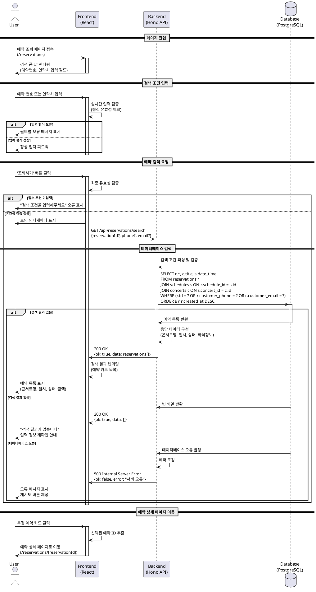

# Use Case Specification: 예약 조회 페이지 - 예약 검색

## Use Case ID
UC-007

## Use Case Name
예약 검색 및 조회

---

## Primary Actor
- 콘서트 예매 사용자 (예약 정보를 확인하려는 일반 고객)

---

## Preconditions
- 사용자가 이전에 예약을 완료한 상태여야 함
- 사용자가 예약 번호 또는 예약 시 입력한 연락처(휴대폰 번호 또는 이메일) 정보를 알고 있어야 함

---

## Trigger
- 사용자가 예약 조회 페이지(`/reservations`)로 직접 접근
- 예약 완료 페이지에서 '예약 조회하기' 버튼 클릭

---

## Main Scenario

### 1. 페이지 진입
- 사용자가 예약 조회 페이지(`/reservations`)에 접속
- 시스템이 검색 폼 UI를 렌더링
- 예약 번호 입력 필드와 연락처 입력 필드를 표시

### 2. 검색 조건 입력
- 사용자가 예약 번호를 입력 (또는)
- 사용자가 휴대폰 번호 또는 이메일을 입력
- 시스템이 실시간으로 입력 형식 유효성을 검증
- 입력 오류 시 필드별 오류 메시지를 즉시 표시

### 3. 예약 검색 요청
- 사용자가 '조회하기' 버튼을 클릭
- 시스템이 입력된 검색 조건의 최종 유효성을 검증
- 로딩 인디케이터를 표시하고 검색 버튼을 비활성화

### 4. 데이터베이스 검색
- 백엔드가 `reservations` 테이블에서 검색 조건에 맞는 예약을 조회
- `concerts`, `schedules` 테이블과 JOIN하여 전체 예약 정보를 구성
- 검색 결과를 최신순(created_at DESC)으로 정렬
- 예약 상태(confirmed/cancelled)와 관계없이 모든 예약을 포함

### 5. 검색 결과 표시
- 시스템이 검색된 예약 목록을 카드 형태로 렌더링
- 각 카드에 다음 정보를 표시:
  - 콘서트 제목
  - 관람 일시 (날짜 및 시간)
  - 예약 상태 (확정/취소)
  - 좌석 정보 요약 (좌석 수)
  - 총 결제 금액
- 로딩 인디케이터를 제거하고 검색 버튼을 활성화

### 6. 예약 상세 페이지 이동
- 사용자가 특정 예약 카드를 클릭
- 시스템이 선택된 예약의 ID를 추출
- 예약 상세 페이지(`/reservations/[reservationId]`)로 이동

---

## Edge Cases

### 1. 입력 검증 오류
- **조건**: 검색 조건이 입력되지 않음
- **처리**: 필수 입력 필드 오류 메시지 표시, 검색 요청 차단

### 2. 잘못된 형식 입력
- **조건**: 예약 번호 형식이 잘못됨 (UUID가 아닌 경우)
- **처리**: "올바른 예약 번호 형식이 아닙니다" 메시지 표시
- **조건**: 휴대폰 번호 형식이 잘못됨 (010-XXXX-XXXX가 아닌 경우)
- **처리**: "올바른 휴대폰 번호 형식을 입력해주세요 (예: 010-1234-5678)" 메시지 표시
- **조건**: 이메일 형식이 잘못됨
- **처리**: "올바른 이메일 형식을 입력해주세요" 메시지 표시

### 3. 검색 결과 없음
- **조건**: 입력한 조건과 일치하는 예약이 데이터베이스에 없음
- **처리**: 
  - "검색 결과가 없습니다" 안내 메시지 표시
  - "예약 번호 또는 예약 시 입력한 연락처를 다시 확인해주세요" 가이드 제공
  - 입력 필드 초기화 옵션 제공

### 4. 다수의 검색 결과
- **조건**: 검색 결과가 10개 이상인 경우
- **처리**: 
  - 페이지네이션 UI를 표시
  - 페이지당 10개씩 표시
  - 다음 페이지로 이동 가능한 네비게이션 제공

### 5. 네트워크 오류
- **조건**: API 요청 중 네트워크 오류 발생
- **처리**: 
  - "검색 중 오류가 발생했습니다. 잠시 후 다시 시도해주세요" 메시지 표시
  - '재시도' 버튼 제공
  - 입력한 검색 조건 데이터 보존

### 6. 서버 오류
- **조건**: 백엔드 서버에서 500 에러 발생
- **처리**: 
  - "일시적인 오류가 발생했습니다" 메시지 표시
  - 재시도 옵션 제공
  - 에러 로그를 서버에 기록

### 7. 취소된 예약 포함
- **조건**: 검색 결과에 취소된 예약이 포함됨
- **처리**: 
  - 예약 상태를 명확히 구분하여 표시
  - 취소된 예약은 회색 배경 또는 "취소됨" 뱃지로 시각적 구분
  - 취소 일시 정보도 함께 표시

### 8. 동시 조회 요청
- **조건**: 사용자가 검색 중 다시 조회 버튼을 클릭
- **처리**: 
  - 첫 번째 요청이 완료될 때까지 추가 요청 차단
  - 검색 버튼 비활성화 유지

---

## Business Rules

### BR-1. 검색 조건
- 예약 번호 OR 연락처(휴대폰 번호 또는 이메일) 중 최소 하나의 조건은 필수 입력
- 예약 번호 입력 시 연락처 입력은 선택사항
- 연락처만으로도 검색 가능

### BR-2. 검색 범위
- 모든 예약 상태(confirmed, cancelled)를 포함하여 검색
- 과거 공연의 예약도 모두 조회 가능
- 검색 결과는 최신 예약순으로 정렬

### BR-3. 개인정보 보호
- 예약 번호만으로 예약을 조회할 수 있음
- 연락처 정보는 예약자 본인 확인 용도로 사용
- 다른 사용자의 예약 정보는 조회 불가능

### BR-4. 결과 표시
- 검색 결과가 없어도 오류가 아닌 정상 응답으로 처리
- 취소된 예약도 검색 결과에 포함하여 이력 확인 가능
- 예약 카드는 클릭 가능하며 상세 페이지로 이동

### BR-5. 성능 요구사항
- 검색 결과는 2초 이내에 표시되어야 함
- 동시 조회 요청 시 이전 요청을 취소하고 최신 요청만 처리
- 검색 조건은 브라우저 세션에 임시 저장하여 뒤로가기 시 복원

---

## Sequence Diagram

---

## Postconditions

### 성공 시
- 사용자가 입력한 조건과 일치하는 예약 목록이 화면에 표시됨
- 각 예약 카드를 클릭하여 상세 페이지로 이동 가능
- 검색 조건이 브라우저 세션에 저장되어 뒤로가기 시 복원 가능

### 실패 시
- 검색 결과가 없는 경우 안내 메시지와 함께 빈 상태 UI 표시
- 오류 발생 시 재시도 옵션이 제공되며 입력 데이터는 보존됨
- 시스템 상태는 검색 이전 상태로 유지됨

---

## Non-Functional Requirements

### 성능
- 검색 결과 응답 시간: 2초 이내
- 동시 검색 요청 처리: 최소 100건/초
- 페이지 초기 로드 시간: 1초 이내

### 보안
- 예약 번호는 추측 불가능한 UUID 형식 사용
- 연락처 정보는 해시 또는 암호화하여 저장 (선택사항)
- SQL Injection 방어를 위한 파라미터화된 쿼리 사용

### 사용성
- 검색 조건 입력 시 실시간 검증 피드백 제공
- 모바일 환경에서도 손쉽게 입력 가능한 UI
- 검색 결과가 없을 때 명확한 안내 메시지 제공

### 접근성
- 스크린 리더 호환 가능한 시맨틱 HTML 사용
- 키보드만으로도 모든 기능 접근 가능
- ARIA 레이블을 활용한 명확한 필드 설명

---

## Related Use Cases
- UC-006: 예약 완료 페이지 - 예약 확인
- UC-008: 예약 상세 페이지 - 예약 취소

---

## Notes
- 예약 번호는 예약 완료 시 자동 생성되는 UUID
- 연락처 정보는 예약 시 입력한 정보와 정확히 일치해야 검색 가능
- 페이지네이션은 검색 결과가 10개를 초과하는 경우에만 표시
- 취소된 예약도 검색 가능하도록 하여 예약 이력 전체를 확인할 수 있음

