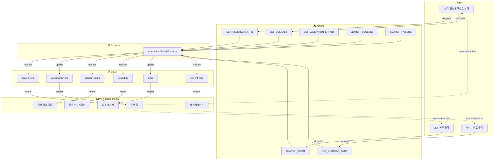
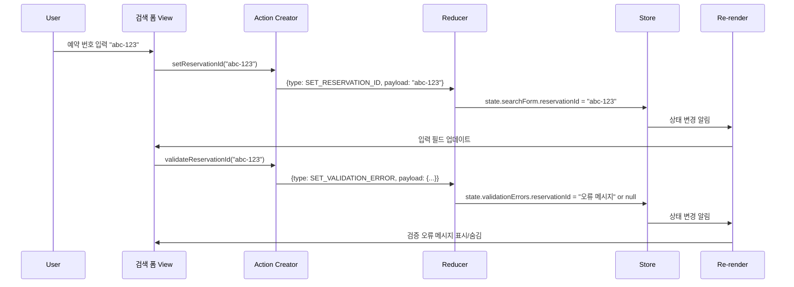
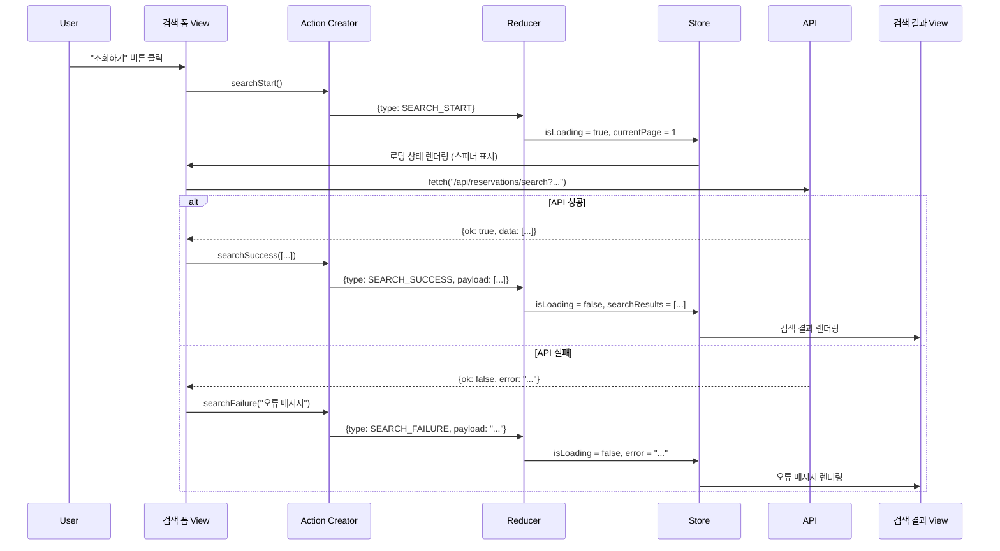
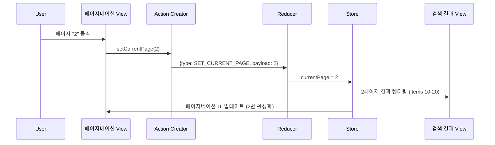
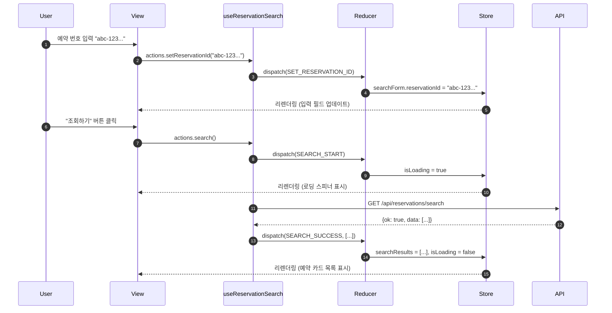

# 상태 관리 설계: 예약 조회 페이지

## 문서 정보
- **기능 ID**: STATE-MGMT-007
- **기능 명**: 예약 조회 페이지 상태 관리 종합 설계
- **관련 문서**: 
  - 요구사항: `/docs/pages/007/requirement.md`
  - 유스케이스: `/docs/pages/007/spec.md`
  - 상태 정의: `/docs/pages/007/state-definition.md`
  - Flux 패턴: `/docs/pages/007/flux-pattern.md`
- **작성일**: 2025-10-15
- **버전**: 1.0

---

## 목차
1. [개요](#1-개요)
2. [상태 정의](#2-상태-정의)
3. [Flux 패턴 아키텍처](#3-flux-패턴-아키텍처)
4. [구현 코드](#4-구현-코드)
5. [데이터 흐름](#5-데이터-흐름)
6. [성능 최적화](#6-성능-최적화)
7. [테스트 전략](#7-테스트-전략)

---

## 1. 개요

### 1.1. 목적
예약 조회 페이지의 상태를 체계적으로 관리하여 예측 가능하고 유지보수하기 쉬운 코드를 작성합니다.

### 1.2. 상태 관리 전략
- **패턴**: Flux 단방향 데이터 흐름
- **구현**: React useReducer 훅
- **최적화**: useMemo, useCallback 활용
- **타입 안전성**: TypeScript 완전 지원

### 1.3. 아키텍처 다이어그램

```
┌──────────────────────────────────────────────────────┐
│                    User Interface                     │
│  (검색 폼, 검색 결과 목록, 페이지네이션, 오류 메시지)   │
└────────────────────┬─────────────────────────────────┘
                     │
                     ▼
┌──────────────────────────────────────────────────────┐
│                  Action Dispatch                      │
│  (setReservationId, search, setCurrentPage, ...)     │
└────────────────────┬─────────────────────────────────┘
                     │
                     ▼
┌──────────────────────────────────────────────────────┐
│                     Reducer                           │
│         (reservationSearchReducer)                    │
│  - 순수 함수: 부수 효과 없음                           │
│  - 불변성 유지: 새 객체 반환                           │
└────────────────────┬─────────────────────────────────┘
                     │
                     ▼
┌──────────────────────────────────────────────────────┐
│                  Central Store                        │
│              (useReducer State)                       │
│  - searchForm                                         │
│  - validationErrors                                   │
│  - searchResults                                      │
│  - isLoading                                          │
│  - error                                              │
│  - currentPage                                        │
└────────────────────┬─────────────────────────────────┘
                     │
                     ▼
┌──────────────────────────────────────────────────────┐
│              Derived Data (Selectors)                 │
│  - paginatedResults                                   │
│  - totalPages                                         │
│  - showEmptyState                                     │
└────────────────────┬─────────────────────────────────┘
                     │
                     ▼
              Re-render View
```

---

## 2. 상태 정의

### 2.1. 관리해야 할 상태 (6개)

#### 2.1.1. searchForm
```typescript
type SearchFormState = {
  reservationId: string;  // 예약 번호 (UUID)
  contact: string;        // 휴대폰 번호 또는 이메일
};
```
- **초기값**: `{ reservationId: "", contact: "" }`
- **용도**: 사용자가 입력한 검색 조건
- **변경 시점**: 입력 필드에 텍스트 입력 시

---

#### 2.1.2. validationErrors
```typescript
type ValidationErrorsState = {
  reservationId: string | null;
  contact: string | null;
};
```
- **초기값**: `{ reservationId: null, contact: null }`
- **용도**: 입력 필드별 유효성 검증 오류 메시지
- **변경 시점**: 실시간 입력 검증 시

---

#### 2.1.3. searchResults
```typescript
type Reservation = {
  id: string;
  concertTitle: string;
  scheduleDateTime: string;
  customerName: string;
  totalPrice: number;
  status: 'confirmed' | 'cancelled';
  seats: Array<{
    seatNumber: string;
    grade: string;
    price: number;
  }>;
  createdAt: string;
  cancelledAt: string | null;
};

type SearchResultsState = Reservation[];
```
- **초기값**: `[]`
- **용도**: 서버에서 받은 예약 검색 결과 목록
- **변경 시점**: API 응답 수신 시

---

#### 2.1.4. isLoading
```typescript
type IsLoadingState = boolean;
```
- **초기값**: `false`
- **용도**: 검색 API 호출 중 여부
- **변경 시점**: API 호출 시작/완료 시

---

#### 2.1.5. error
```typescript
type ErrorState = string | null;
```
- **초기값**: `null`
- **용도**: API 호출 실패 시 오류 메시지
- **변경 시점**: API 오류 발생 또는 성공 시 초기화

---

#### 2.1.6. currentPage
```typescript
type CurrentPageState = number;
```
- **초기값**: `1`
- **용도**: 페이지네이션 현재 페이지 번호
- **변경 시점**: 페이지 번호 클릭 시

---

### 2.2. 전체 상태 타입

```typescript
type ReservationSearchState = {
  searchForm: {
    reservationId: string;
    contact: string;
  };
  validationErrors: {
    reservationId: string | null;
    contact: string | null;
  };
  searchResults: Reservation[];
  isLoading: boolean;
  error: string | null;
  currentPage: number;
};
```

---

### 2.3. 상태가 아닌 것 (파생 데이터)

#### 2.3.1. paginatedResults
```typescript
const paginatedResults = useMemo(() => {
  const ITEMS_PER_PAGE = 10;
  const startIndex = (currentPage - 1) * ITEMS_PER_PAGE;
  const endIndex = startIndex + ITEMS_PER_PAGE;
  return searchResults.slice(startIndex, endIndex);
}, [searchResults, currentPage]);
```

#### 2.3.2. totalPages
```typescript
const totalPages = useMemo(() => {
  return Math.ceil(searchResults.length / 10);
}, [searchResults.length]);
```

#### 2.3.3. showEmptyState
```typescript
const showEmptyState = useMemo(() => {
  return !isLoading && searchResults.length === 0 && !error;
}, [isLoading, searchResults.length, error]);
```

#### 2.3.4. isSearchButtonDisabled
```typescript
const isSearchButtonDisabled = useMemo(() => {
  return (
    isLoading ||
    (!searchForm.reservationId && !searchForm.contact) ||
    validationErrors.reservationId !== null ||
    validationErrors.contact !== null
  );
}, [
  isLoading,
  searchForm.reservationId,
  searchForm.contact,
  validationErrors.reservationId,
  validationErrors.contact,
]);
```

---

### 2.4. 상태 변경 조건 표

| 상태 | 변경 조건 | 이전 값 | 변경 후 값 | 화면 변화 |
|-----|---------|--------|----------|----------|
| **searchForm.reservationId** | 예약 번호 입력 | `""` | `"abc-123..."` | 입력 필드 업데이트, 조회 버튼 활성화 |
| **searchForm.contact** | 연락처 입력 | `""` | `"010-1234-5678"` | 입력 필드 업데이트, 조회 버튼 활성화 |
| **validationErrors.reservationId** | 잘못된 형식 입력 | `null` | `"올바른 예약 번호..."` | 빨간색 오류 메시지 표시 |
| **validationErrors.contact** | 올바른 형식 입력 | `"올바른..."` | `null` | 오류 메시지 제거 |
| **searchResults** | 검색 성공 (결과 있음) | `[]` | `[{...}, ...]` | 예약 카드 목록 렌더링 |
| **searchResults** | 검색 성공 (결과 없음) | `[]` | `[]` | 빈 상태 UI 표시 |
| **isLoading** | API 호출 시작 | `false` | `true` | 스피너 표시, 버튼 비활성화 |
| **isLoading** | API 응답 수신 | `true` | `false` | 스피너 제거, 버튼 활성화 |
| **error** | API 호출 실패 | `null` | `"오류 메시지"` | 오류 박스 + 재시도 버튼 표시 |
| **error** | 검색 성공 | `"오류..."` | `null` | 오류 메시지 제거 |
| **currentPage** | 페이지 2 클릭 | `1` | `2` | 11~20번 항목 표시 |
| **currentPage** | 새 검색 수행 | `3` | `1` | 첫 페이지로 리셋 |

---

## 3. Flux 패턴 아키텍처

### 3.1. Action Types

```typescript
const ActionTypes = {
  // 검색 폼 액션
  SET_RESERVATION_ID: 'SET_RESERVATION_ID',
  SET_CONTACT: 'SET_CONTACT',
  SET_VALIDATION_ERROR: 'SET_VALIDATION_ERROR',
  CLEAR_VALIDATION_ERRORS: 'CLEAR_VALIDATION_ERRORS',
  RESET_FORM: 'RESET_FORM',
  
  // 검색 액션
  SEARCH_START: 'SEARCH_START',
  SEARCH_SUCCESS: 'SEARCH_SUCCESS',
  SEARCH_FAILURE: 'SEARCH_FAILURE',
  
  // 페이지네이션 액션
  SET_CURRENT_PAGE: 'SET_CURRENT_PAGE',
  
  // 전역 액션
  RESET_STATE: 'RESET_STATE',
} as const;
```

---

### 3.2. Action Creators

```typescript
// 검색 폼 액션
export const setReservationId = (value: string) => ({
  type: ActionTypes.SET_RESERVATION_ID,
  payload: value,
});

export const setContact = (value: string) => ({
  type: ActionTypes.SET_CONTACT,
  payload: value,
});

export const setValidationError = (
  field: 'reservationId' | 'contact',
  error: string | null
) => ({
  type: ActionTypes.SET_VALIDATION_ERROR,
  payload: { field, error },
});

export const clearValidationErrors = () => ({
  type: ActionTypes.CLEAR_VALIDATION_ERRORS,
});

export const resetForm = () => ({
  type: ActionTypes.RESET_FORM,
});

// 검색 액션
export const searchStart = () => ({
  type: ActionTypes.SEARCH_START,
});

export const searchSuccess = (results: Reservation[]) => ({
  type: ActionTypes.SEARCH_SUCCESS,
  payload: results,
});

export const searchFailure = (error: string) => ({
  type: ActionTypes.SEARCH_FAILURE,
  payload: error,
});

// 페이지네이션 액션
export const setCurrentPage = (page: number) => ({
  type: ActionTypes.SET_CURRENT_PAGE,
  payload: page,
});

// 전역 액션
export const resetState = () => ({
  type: ActionTypes.RESET_STATE,
});
```

---

### 3.3. Action 타입 정의

```typescript
type ReservationSearchAction =
  | { type: 'SET_RESERVATION_ID'; payload: string }
  | { type: 'SET_CONTACT'; payload: string }
  | { type: 'SET_VALIDATION_ERROR'; payload: { field: 'reservationId' | 'contact'; error: string | null } }
  | { type: 'CLEAR_VALIDATION_ERRORS' }
  | { type: 'RESET_FORM' }
  | { type: 'SEARCH_START' }
  | { type: 'SEARCH_SUCCESS'; payload: Reservation[] }
  | { type: 'SEARCH_FAILURE'; payload: string }
  | { type: 'SET_CURRENT_PAGE'; payload: number }
  | { type: 'RESET_STATE' };
```

---

### 3.4. Flux 패턴 전체 흐름



---

## 4. 구현 코드

### 4.1. 초기 상태

```typescript
const initialState: ReservationSearchState = {
  searchForm: {
    reservationId: '',
    contact: '',
  },
  validationErrors: {
    reservationId: null,
    contact: null,
  },
  searchResults: [],
  isLoading: false,
  error: null,
  currentPage: 1,
};
```

---

### 4.2. Reducer 함수

```typescript
function reservationSearchReducer(
  state: ReservationSearchState,
  action: ReservationSearchAction
): ReservationSearchState {
  switch (action.type) {
    // 검색 폼 액션 처리
    case 'SET_RESERVATION_ID':
      return {
        ...state,
        searchForm: {
          ...state.searchForm,
          reservationId: action.payload,
        },
      };
    
    case 'SET_CONTACT':
      return {
        ...state,
        searchForm: {
          ...state.searchForm,
          contact: action.payload,
        },
      };
    
    case 'SET_VALIDATION_ERROR':
      return {
        ...state,
        validationErrors: {
          ...state.validationErrors,
          [action.payload.field]: action.payload.error,
        },
      };
    
    case 'CLEAR_VALIDATION_ERRORS':
      return {
        ...state,
        validationErrors: {
          reservationId: null,
          contact: null,
        },
      };
    
    case 'RESET_FORM':
      return {
        ...state,
        searchForm: {
          reservationId: '',
          contact: '',
        },
        validationErrors: {
          reservationId: null,
          contact: null,
        },
      };
    
    // 검색 액션 처리
    case 'SEARCH_START':
      return {
        ...state,
        isLoading: true,
        error: null,
        currentPage: 1, // 새 검색 시 페이지 리셋
      };
    
    case 'SEARCH_SUCCESS':
      return {
        ...state,
        isLoading: false,
        searchResults: action.payload,
        error: null,
      };
    
    case 'SEARCH_FAILURE':
      return {
        ...state,
        isLoading: false,
        error: action.payload,
      };
    
    // 페이지네이션 액션 처리
    case 'SET_CURRENT_PAGE':
      return {
        ...state,
        currentPage: action.payload,
      };
    
    // 전역 액션 처리
    case 'RESET_STATE':
      return initialState;
    
    default:
      return state;
  }
}
```

---

### 4.3. 유효성 검증 함수

```typescript
// UUID 형식 검증
const isValidUUID = (value: string): boolean => {
  const uuidRegex = /^[0-9a-f]{8}-[0-9a-f]{4}-[0-9a-f]{4}-[0-9a-f]{4}-[0-9a-f]{12}$/i;
  return uuidRegex.test(value);
};

// 휴대폰 번호 형식 검증
const isValidPhone = (value: string): boolean => {
  const phoneRegex = /^010-\d{4}-\d{4}$/;
  return phoneRegex.test(value);
};

// 이메일 형식 검증
const isValidEmail = (value: string): boolean => {
  const emailRegex = /^[^\s@]+@[^\s@]+\.[^\s@]+$/;
  return emailRegex.test(value);
};

// 예약 번호 검증
const validateReservationId = (value: string): string | null => {
  if (!value) return null; // 빈 값은 허용 (선택적 필드)
  if (!isValidUUID(value)) {
    return '올바른 예약 번호 형식이 아닙니다';
  }
  return null;
};

// 연락처 검증
const validateContact = (value: string): string | null => {
  if (!value) return null; // 빈 값은 허용 (선택적 필드)
  if (!isValidPhone(value) && !isValidEmail(value)) {
    return '올바른 휴대폰 번호 또는 이메일 형식을 입력해주세요';
  }
  return null;
};
```

---

### 4.4. Custom Hook

```typescript
// useReservationSearch.ts
import { useReducer, useCallback, useMemo } from 'react';

export function useReservationSearch() {
  const [state, dispatch] = useReducer(reservationSearchReducer, initialState);
  
  // Action Creators를 래핑한 함수들
  const actions = {
    // 예약 번호 입력 처리
    setReservationId: useCallback((value: string) => {
      dispatch(setReservationId(value));
      
      // 실시간 검증
      const error = validateReservationId(value);
      dispatch(setValidationError('reservationId', error));
    }, []),
    
    // 연락처 입력 처리
    setContact: useCallback((value: string) => {
      dispatch(setContact(value));
      
      // 실시간 검증
      const error = validateContact(value);
      dispatch(setValidationError('contact', error));
    }, []),
    
    // 검색 실행
    search: useCallback(async () => {
      // 최종 검증
      if (!state.searchForm.reservationId && !state.searchForm.contact) {
        dispatch(setValidationError('reservationId', '예약 번호 또는 연락처를 입력해주세요'));
        return;
      }
      
      // 검증 오류 확인
      if (state.validationErrors.reservationId || state.validationErrors.contact) {
        return;
      }
      
      // 검색 시작
      dispatch(searchStart());
      
      try {
        // API 호출
        const params = new URLSearchParams();
        if (state.searchForm.reservationId) {
          params.append('reservationId', state.searchForm.reservationId);
        }
        if (state.searchForm.contact) {
          // 휴대폰 또는 이메일 구분
          if (isValidPhone(state.searchForm.contact)) {
            params.append('phone', state.searchForm.contact);
          } else {
            params.append('email', state.searchForm.contact);
          }
        }
        
        const response = await fetch(`/api/reservations/search?${params.toString()}`);
        const data = await response.json();
        
        if (data.ok) {
          dispatch(searchSuccess(data.data));
        } else {
          dispatch(searchFailure(data.error.message || '검색 중 오류가 발생했습니다'));
        }
      } catch (error) {
        console.error('Search error:', error);
        dispatch(searchFailure('검색 중 오류가 발생했습니다. 잠시 후 다시 시도해주세요'));
      }
    }, [state.searchForm, state.validationErrors]),
    
    // 페이지 변경
    setCurrentPage: useCallback((page: number) => {
      dispatch(setCurrentPage(page));
      // 페이지 상단으로 스크롤
      window.scrollTo({ top: 0, behavior: 'smooth' });
    }, []),
    
    // 폼 초기화
    resetForm: useCallback(() => {
      dispatch(resetForm());
    }, []),
    
    // 전체 상태 초기화
    resetState: useCallback(() => {
      dispatch(resetState());
    }, []),
  };
  
  // Selectors (파생 데이터)
  const selectors = useMemo(() => {
    const ITEMS_PER_PAGE = 10;
    
    // 페이지네이션된 결과
    const paginatedResults = (() => {
      const startIndex = (state.currentPage - 1) * ITEMS_PER_PAGE;
      const endIndex = startIndex + ITEMS_PER_PAGE;
      return state.searchResults.slice(startIndex, endIndex);
    })();
    
    // 전체 페이지 수
    const totalPages = Math.ceil(state.searchResults.length / ITEMS_PER_PAGE);
    
    // 검색 결과 존재 여부
    const hasSearchResults = state.searchResults.length > 0;
    
    // 빈 상태 표시 여부
    const showEmptyState = !state.isLoading && state.searchResults.length === 0 && !state.error;
    
    // 페이지네이션 표시 여부
    const showPagination = state.searchResults.length > ITEMS_PER_PAGE;
    
    // 조회 버튼 비활성화 여부
    const isSearchButtonDisabled = (
      state.isLoading ||
      (!state.searchForm.reservationId && !state.searchForm.contact) ||
      state.validationErrors.reservationId !== null ||
      state.validationErrors.contact !== null
    );
    
    return {
      paginatedResults,
      totalPages,
      hasSearchResults,
      showEmptyState,
      showPagination,
      isSearchButtonDisabled,
    };
  }, [
    state.searchResults,
    state.currentPage,
    state.isLoading,
    state.error,
    state.searchForm.reservationId,
    state.searchForm.contact,
    state.validationErrors.reservationId,
    state.validationErrors.contact,
  ]);
  
  return { state, actions, selectors };
}
```

---

### 4.5. 컴포넌트에서 사용

```typescript
// ReservationSearchPage.tsx
'use client';

import React from 'react';
import { useReservationSearch } from '@/features/reservations/hooks/useReservationSearch';
import { format } from 'date-fns';
import { ko } from 'date-fns/locale';

export default function ReservationSearchPage() {
  const { state, actions, selectors } = useReservationSearch();
  
  // 입력 핸들러
  const handleReservationIdChange = (e: React.ChangeEvent<HTMLInputElement>) => {
    actions.setReservationId(e.target.value);
  };
  
  const handleContactChange = (e: React.ChangeEvent<HTMLInputElement>) => {
    actions.setContact(e.target.value);
  };
  
  // 폼 제출 핸들러
  const handleSubmit = (e: React.FormEvent) => {
    e.preventDefault();
    actions.search();
  };
  
  // 날짜 포맷팅
  const formatScheduleDateTime = (dateTime: string) => {
    return format(new Date(dateTime), 'yyyy년 MM월 dd일 HH시', { locale: ko });
  };
  
  // 좌석 포맷팅
  const formatSeats = (seats: any[]) => {
    const seatNumbers = seats.map(s => s.seatNumber).join(', ');
    const seatCount = seats.length;
    return `${seatNumbers} (${seatCount}석)`;
  };
  
  // 금액 포맷팅
  const formatPrice = (price: number) => {
    return new Intl.NumberFormat('ko-KR').format(price) + '원';
  };
  
  return (
    <div className="container mx-auto p-4 max-w-4xl">
      <h1 className="text-2xl font-bold mb-6">예약 조회</h1>
      
      {/* 검색 폼 */}
      <form onSubmit={handleSubmit} className="bg-white p-6 rounded-lg shadow-md mb-8">
        <div className="mb-4">
          <label htmlFor="reservationId" className="block text-sm font-medium text-gray-700 mb-2">
            예약 번호
          </label>
          <input
            type="text"
            id="reservationId"
            value={state.searchForm.reservationId}
            onChange={handleReservationIdChange}
            placeholder="예약 번호를 입력하세요 (예: a1b2c3d4-...)"
            className={`w-full px-4 py-2 border rounded-md focus:ring-2 focus:ring-blue-500 focus:border-transparent ${
              state.validationErrors.reservationId ? 'border-red-500' : 'border-gray-300'
            }`}
          />
          {state.validationErrors.reservationId && (
            <p className="text-red-500 text-sm mt-1">{state.validationErrors.reservationId}</p>
          )}
        </div>
        
        <div className="mb-4">
          <label htmlFor="contact" className="block text-sm font-medium text-gray-700 mb-2">
            연락처
          </label>
          <input
            type="text"
            id="contact"
            value={state.searchForm.contact}
            onChange={handleContactChange}
            placeholder="휴대폰 번호 또는 이메일을 입력하세요"
            className={`w-full px-4 py-2 border rounded-md focus:ring-2 focus:ring-blue-500 focus:border-transparent ${
              state.validationErrors.contact ? 'border-red-500' : 'border-gray-300'
            }`}
          />
          {state.validationErrors.contact && (
            <p className="text-red-500 text-sm mt-1">{state.validationErrors.contact}</p>
          )}
        </div>
        
        <button
          type="submit"
          disabled={selectors.isSearchButtonDisabled}
          className={`w-full py-2 px-4 rounded-md font-medium transition-colors ${
            selectors.isSearchButtonDisabled
              ? 'bg-gray-300 text-gray-500 cursor-not-allowed'
              : 'bg-blue-500 text-white hover:bg-blue-600'
          }`}
        >
          {state.isLoading ? '조회 중...' : '조회하기'}
        </button>
      </form>
      
      {/* 로딩 상태 */}
      {state.isLoading && (
        <div className="flex justify-center items-center py-12">
          <div className="animate-spin rounded-full h-12 w-12 border-b-2 border-blue-500"></div>
        </div>
      )}
      
      {/* 오류 상태 */}
      {state.error && (
        <div className="bg-red-50 border border-red-200 text-red-800 px-4 py-3 rounded-md mb-8">
          <div className="flex items-start">
            <div className="flex-1">
              <p className="font-medium">오류가 발생했습니다</p>
              <p className="text-sm mt-1">{state.error}</p>
            </div>
            <button
              onClick={actions.search}
              className="ml-4 text-sm font-medium text-red-800 hover:text-red-900"
            >
              다시 시도
            </button>
          </div>
        </div>
      )}
      
      {/* 검색 결과 */}
      {!state.isLoading && selectors.hasSearchResults && (
        <>
          <div className="space-y-4 mb-8">
            {selectors.paginatedResults.map((reservation) => (
              <div
                key={reservation.id}
                className={`p-4 rounded-lg border cursor-pointer transition-all hover:shadow-md ${
                  reservation.status === 'confirmed'
                    ? 'bg-white border-blue-200'
                    : 'bg-gray-50 border-gray-300'
                }`}
                onClick={() => window.location.href = `/reservations/${reservation.id}`}
              >
                <div className="flex justify-between items-start mb-2">
                  <h3 className="text-lg font-semibold">{reservation.concertTitle}</h3>
                  <span
                    className={`px-2 py-1 text-xs font-medium rounded ${
                      reservation.status === 'confirmed'
                        ? 'bg-blue-100 text-blue-800'
                        : 'bg-gray-200 text-gray-600'
                    }`}
                  >
                    {reservation.status === 'confirmed' ? '확정' : '취소됨'}
                  </span>
                </div>
                <p className="text-gray-600 text-sm mb-1">
                  관람 일시: {formatScheduleDateTime(reservation.scheduleDateTime)}
                </p>
                <p className="text-gray-600 text-sm mb-1">
                  좌석: {formatSeats(reservation.seats)}
                </p>
                <p className="text-gray-900 font-medium">
                  총 금액: {formatPrice(reservation.totalPrice)}
                </p>
                {reservation.cancelledAt && (
                  <p className="text-gray-500 text-xs mt-2">
                    취소 일시: {formatScheduleDateTime(reservation.cancelledAt)}
                  </p>
                )}
              </div>
            ))}
          </div>
          
          {/* 페이지네이션 */}
          {selectors.showPagination && (
            <div className="flex justify-center items-center space-x-2">
              <button
                onClick={() => actions.setCurrentPage(state.currentPage - 1)}
                disabled={state.currentPage === 1}
                className={`px-3 py-1 rounded ${
                  state.currentPage === 1
                    ? 'bg-gray-200 text-gray-400 cursor-not-allowed'
                    : 'bg-white border border-gray-300 hover:bg-gray-50'
                }`}
              >
                이전
              </button>
              
              {Array.from({ length: selectors.totalPages }, (_, i) => i + 1).map((page) => (
                <button
                  key={page}
                  onClick={() => actions.setCurrentPage(page)}
                  className={`px-3 py-1 rounded ${
                    state.currentPage === page
                      ? 'bg-blue-500 text-white'
                      : 'bg-white border border-gray-300 hover:bg-gray-50'
                  }`}
                >
                  {page}
                </button>
              ))}
              
              <button
                onClick={() => actions.setCurrentPage(state.currentPage + 1)}
                disabled={state.currentPage === selectors.totalPages}
                className={`px-3 py-1 rounded ${
                  state.currentPage === selectors.totalPages
                    ? 'bg-gray-200 text-gray-400 cursor-not-allowed'
                    : 'bg-white border border-gray-300 hover:bg-gray-50'
                }`}
              >
                다음
              </button>
            </div>
          )}
        </>
      )}
      
      {/* 빈 상태 */}
      {selectors.showEmptyState && (
        <div className="text-center py-12">
          <div className="text-gray-400 mb-4">
            <svg className="mx-auto h-12 w-12" fill="none" viewBox="0 0 24 24" stroke="currentColor">
              <path strokeLinecap="round" strokeLinejoin="round" strokeWidth={2} d="M21 21l-6-6m2-5a7 7 0 11-14 0 7 7 0 0114 0z" />
            </svg>
          </div>
          <h3 className="text-lg font-medium text-gray-900 mb-2">검색 결과가 없습니다</h3>
          <p className="text-gray-500">예약 번호 또는 연락처를 다시 확인해주세요</p>
        </div>
      )}
    </div>
  );
}
```

---

## 5. 데이터 흐름

### 5.1. 검색 폼 입력 흐름



---

### 5.2. 검색 실행 흐름



---

### 5.3. 페이지네이션 흐름



---

### 5.4. 정상 검색 시나리오 전체 흐름



---

## 6. 성능 최적화

### 6.1. useMemo로 파생 데이터 최적화

```typescript
// 불필요한 재계산 방지
const paginatedResults = useMemo(() => {
  const ITEMS_PER_PAGE = 10;
  const startIndex = (state.currentPage - 1) * ITEMS_PER_PAGE;
  const endIndex = startIndex + ITEMS_PER_PAGE;
  return state.searchResults.slice(startIndex, endIndex);
}, [state.searchResults, state.currentPage]);
// ✅ searchResults 또는 currentPage가 변경될 때만 재계산
```

### 6.2. useCallback로 액션 최적화

```typescript
// 함수 재생성 방지
const actions = {
  setReservationId: useCallback((value: string) => {
    dispatch(setReservationId(value));
    const error = validateReservationId(value);
    dispatch(setValidationError('reservationId', error));
  }, []), // ✅ 의존성 없음 - 최초 한 번만 생성
  
  search: useCallback(async () => {
    // ...
  }, [state.searchForm]), // ✅ searchForm이 바뀔 때만 재생성
};
```

### 6.3. React.memo로 컴포넌트 최적화

```typescript
// 자식 컴포넌트 불필요한 리렌더링 방지
const ReservationCard = React.memo(({ reservation, onClick }: Props) => {
  return (
    <div onClick={onClick}>
      {/* ... */}
    </div>
  );
});
// ✅ reservation props가 변경될 때만 리렌더링
```

---

## 7. 테스트 전략

### 7.1. Reducer 테스트

```typescript
// reservationSearchReducer.test.ts
import { describe, it, expect } from 'vitest';

describe('reservationSearchReducer', () => {
  it('should handle SET_RESERVATION_ID', () => {
    const action = setReservationId('test-id');
    const newState = reservationSearchReducer(initialState, action);
    
    expect(newState.searchForm.reservationId).toBe('test-id');
    expect(newState.searchForm.contact).toBe(''); // 다른 필드 불변
  });
  
  it('should handle SEARCH_START', () => {
    const action = searchStart();
    const newState = reservationSearchReducer(initialState, action);
    
    expect(newState.isLoading).toBe(true);
    expect(newState.error).toBe(null);
    expect(newState.currentPage).toBe(1);
  });
  
  it('should handle SEARCH_SUCCESS', () => {
    const mockResults = [
      { id: '1', concertTitle: 'Test Concert', /* ... */ }
    ];
    const action = searchSuccess(mockResults);
    const newState = reservationSearchReducer(initialState, action);
    
    expect(newState.isLoading).toBe(false);
    expect(newState.searchResults).toEqual(mockResults);
    expect(newState.error).toBe(null);
  });
  
  it('should handle SEARCH_FAILURE', () => {
    const action = searchFailure('Test error');
    const newState = reservationSearchReducer(initialState, action);
    
    expect(newState.isLoading).toBe(false);
    expect(newState.error).toBe('Test error');
    expect(newState.searchResults).toEqual([]); // 결과는 유지 또는 초기화
  });
  
  it('should reset page to 1 on new search', () => {
    const stateWithPage3 = { ...initialState, currentPage: 3 };
    const action = searchStart();
    const newState = reservationSearchReducer(stateWithPage3, action);
    
    expect(newState.currentPage).toBe(1);
  });
});
```

---

### 7.2. Custom Hook 테스트

```typescript
// useReservationSearch.test.ts
import { renderHook, act } from '@testing-library/react';
import { useReservationSearch } from './useReservationSearch';

describe('useReservationSearch', () => {
  it('should initialize with default state', () => {
    const { result } = renderHook(() => useReservationSearch());
    
    expect(result.current.state.searchForm.reservationId).toBe('');
    expect(result.current.state.searchForm.contact).toBe('');
    expect(result.current.state.isLoading).toBe(false);
    expect(result.current.state.error).toBe(null);
  });
  
  it('should update reservation ID', () => {
    const { result } = renderHook(() => useReservationSearch());
    
    act(() => {
      result.current.actions.setReservationId('test-id');
    });
    
    expect(result.current.state.searchForm.reservationId).toBe('test-id');
  });
  
  it('should set validation error for invalid reservation ID', () => {
    const { result } = renderHook(() => useReservationSearch());
    
    act(() => {
      result.current.actions.setReservationId('invalid');
    });
    
    expect(result.current.state.validationErrors.reservationId).toBeTruthy();
  });
  
  it('should handle search flow', async () => {
    const { result } = renderHook(() => useReservationSearch());
    
    // Mock fetch
    global.fetch = vi.fn(() =>
      Promise.resolve({
        json: () => Promise.resolve({ ok: true, data: [] }),
      })
    );
    
    // 예약 번호 설정
    act(() => {
      result.current.actions.setReservationId('valid-uuid-...');
    });
    
    // 검색 실행
    await act(async () => {
      await result.current.actions.search();
    });
    
    // 로딩이 완료되었는지 확인
    expect(result.current.state.isLoading).toBe(false);
  });
  
  it('should calculate paginated results correctly', () => {
    const { result } = renderHook(() => useReservationSearch());
    
    // Mock 25개 결과
    const mockResults = Array.from({ length: 25 }, (_, i) => ({
      id: `${i + 1}`,
      concertTitle: `Concert ${i + 1}`,
      /* ... */
    }));
    
    act(() => {
      result.current.actions.search(); // API 호출 시뮬레이션 필요
    });
    
    // 1페이지: 1~10번
    expect(result.current.selectors.paginatedResults).toHaveLength(10);
    expect(result.current.selectors.totalPages).toBe(3);
    
    // 2페이지로 이동
    act(() => {
      result.current.actions.setCurrentPage(2);
    });
    
    // 2페이지: 11~20번
    expect(result.current.state.currentPage).toBe(2);
  });
});
```

---

### 7.3. 컴포넌트 통합 테스트

```typescript
// ReservationSearchPage.test.tsx
import { render, screen, fireEvent, waitFor } from '@testing-library/react';
import ReservationSearchPage from './ReservationSearchPage';

describe('ReservationSearchPage', () => {
  it('should render search form', () => {
    render(<ReservationSearchPage />);
    
    expect(screen.getByLabelText('예약 번호')).toBeInTheDocument();
    expect(screen.getByLabelText('연락처')).toBeInTheDocument();
    expect(screen.getByRole('button', { name: '조회하기' })).toBeInTheDocument();
  });
  
  it('should show validation error for invalid input', async () => {
    render(<ReservationSearchPage />);
    
    const input = screen.getByLabelText('예약 번호');
    fireEvent.change(input, { target: { value: 'invalid' } });
    
    await waitFor(() => {
      expect(screen.getByText('올바른 예약 번호 형식이 아닙니다')).toBeInTheDocument();
    });
  });
  
  it('should display search results', async () => {
    // Mock API
    global.fetch = vi.fn(() =>
      Promise.resolve({
        json: () => Promise.resolve({
          ok: true,
          data: [
            {
              id: '1',
              concertTitle: 'Test Concert',
              scheduleDateTime: '2025-12-25T19:00:00+09:00',
              /* ... */
            }
          ]
        }),
      })
    );
    
    render(<ReservationSearchPage />);
    
    // 예약 번호 입력
    fireEvent.change(screen.getByLabelText('예약 번호'), {
      target: { value: 'valid-uuid...' }
    });
    
    // 조회 버튼 클릭
    fireEvent.click(screen.getByRole('button', { name: '조회하기' }));
    
    // 결과 대기
    await waitFor(() => {
      expect(screen.getByText('Test Concert')).toBeInTheDocument();
    });
  });
  
  it('should show empty state when no results', async () => {
    global.fetch = vi.fn(() =>
      Promise.resolve({
        json: () => Promise.resolve({ ok: true, data: [] }),
      })
    );
    
    render(<ReservationSearchPage />);
    
    fireEvent.change(screen.getByLabelText('예약 번호'), {
      target: { value: 'valid-uuid...' }
    });
    fireEvent.click(screen.getByRole('button', { name: '조회하기' }));
    
    await waitFor(() => {
      expect(screen.getByText('검색 결과가 없습니다')).toBeInTheDocument();
    });
  });
});
```

---

## 8. 디버깅 가이드

### 8.1. React DevTools로 상태 확인

```typescript
// 컴포넌트명: ReservationSearchPage
// State 구조:
{
  searchForm: { reservationId: "...", contact: "..." },
  validationErrors: { reservationId: null, contact: null },
  searchResults: [...],
  isLoading: false,
  error: null,
  currentPage: 1
}
```

### 8.2. Redux DevTools Extension 사용

```typescript
// useReducer와 함께 사용 가능
import { useReducer } from 'react';

const enhancedReducer = (state, action) => {
  console.log('Action:', action);
  console.log('Previous State:', state);
  
  const newState = reservationSearchReducer(state, action);
  
  console.log('New State:', newState);
  return newState;
};

const [state, dispatch] = useReducer(enhancedReducer, initialState);
```

---

## 9. 요약

### 9.1. 핵심 원칙

1. **단방향 데이터 흐름**: Action → Reducer → Store → View
2. **순수 함수 Reducer**: 부수 효과 없음, 예측 가능
3. **불변성 유지**: 상태를 직접 수정하지 않고 새 객체 반환
4. **타입 안전성**: TypeScript로 컴파일 타임 오류 방지
5. **성능 최적화**: useMemo, useCallback 활용

### 9.2. 구현 체크리스트

- [x] 상태 타입 정의 (6개 상태)
- [x] Action Types 정의 (10개 액션)
- [x] Action Creators 구현
- [x] Reducer 함수 구현
- [x] 초기 상태 정의
- [x] 유효성 검증 함수
- [x] Custom Hook (useReservationSearch)
- [x] Selectors (파생 데이터)
- [x] 컴포넌트 통합
- [x] 성능 최적화 (useMemo, useCallback)
- [x] 테스트 코드 작성

### 9.3. 상태별 Action 매핑

| 상태 | 관련 Actions |
|-----|-------------|
| `searchForm` | SET_RESERVATION_ID, SET_CONTACT, RESET_FORM |
| `validationErrors` | SET_VALIDATION_ERROR, CLEAR_VALIDATION_ERRORS |
| `searchResults` | SEARCH_SUCCESS |
| `isLoading` | SEARCH_START, SEARCH_SUCCESS, SEARCH_FAILURE |
| `error` | SEARCH_FAILURE, SEARCH_START, SEARCH_SUCCESS |
| `currentPage` | SET_CURRENT_PAGE, SEARCH_START |

---

## 10. 참고 자료

- [React useReducer 공식 문서](https://react.dev/reference/react/useReducer)
- [Flux 아키텍처](https://facebookarchive.github.io/flux/)
- [Redux Style Guide](https://redux.js.org/style-guide/)
- [TypeScript Best Practices](https://www.typescriptlang.org/docs/handbook/declaration-files/do-s-and-don-ts.html)

---

이 문서를 기반으로 예약 조회 페이지의 상태 관리를 구현하면, 유지보수하기 쉽고 확장 가능한 코드를 작성할 수 있습니다.

