# Flux 패턴 설계: 예약 상세 페이지 - 예약 조회 및 취소

## 문서 정보
- **기능 ID**: FLUX-008
- **기능 명**: 예약 상세 페이지 Flux 아키텍처
- **관련 문서**: 
  - 상태 정의: `/docs/pages/008/state-definition.md`
  - 요구사항: `/docs/pages/008/requirement.md`
- **작성일**: 2025-10-15
- **버전**: 1.0

---

## 1. Flux 패턴 개요

### 1.1. 기본 구조

```
┌──────────┐      ┌──────────┐      ┌───────┐      ┌──────┐
│  Action  │ ───▶ │ Reducer  │ ───▶ │ Store │ ───▶ │ View │
└──────────┘      └──────────┘      └───────┘      └──────┘
     ▲                                                  │
     └──────────────────────────────────────────────────┘
                     (User Interaction)
```

### 1.2. 예약 상세 페이지에서의 적용

- **Action**: 페이지 로드, 취소 버튼 클릭, 다이얼로그 상호작용, API 응답
- **Reducer**: 액션 타입에 따른 상태 변경 로직 (예약 정보, 취소 처리)
- **Store**: useReducer로 관리되는 중앙 상태
- **View**: React 컴포넌트 (예약 정보 표시, 취소 UI)

---

## 2. Action 정의

### 2.1. Action Types

```typescript
// Action 타입 상수 정의
const ActionTypes = {
  // 예약 조회 액션
  LOAD_START: 'LOAD_START',
  LOAD_SUCCESS: 'LOAD_SUCCESS',
  LOAD_FAILURE: 'LOAD_FAILURE',
  
  // 취소 다이얼로그 액션
  OPEN_CANCEL_DIALOG: 'OPEN_CANCEL_DIALOG',
  CLOSE_CANCEL_DIALOG: 'CLOSE_CANCEL_DIALOG',
  
  // 예약 취소 액션
  CANCEL_START: 'CANCEL_START',
  CANCEL_SUCCESS: 'CANCEL_SUCCESS',
  CANCEL_FAILURE: 'CANCEL_FAILURE',
  
  // 토스트 액션
  CLEAR_SUCCESS_MESSAGE: 'CLEAR_SUCCESS_MESSAGE',
  
  // 전역 액션
  RESET_STATE: 'RESET_STATE',
} as const;
```

---

### 2.2. Action Creators

```typescript
// Action 생성자 함수들

// 예약 조회 액션
export const loadStart = () => ({
  type: ActionTypes.LOAD_START,
});

export const loadSuccess = (
  reservation: ReservationDetail,
  canCancel: boolean,
  cancelReason: string | null
) => ({
  type: ActionTypes.LOAD_SUCCESS,
  payload: {
    reservation,
    canCancel,
    cancelReason,
  },
});

export const loadFailure = (error: string) => ({
  type: ActionTypes.LOAD_FAILURE,
  payload: error,
});

// 취소 다이얼로그 액션
export const openCancelDialog = () => ({
  type: ActionTypes.OPEN_CANCEL_DIALOG,
});

export const closeCancelDialog = () => ({
  type: ActionTypes.CLOSE_CANCEL_DIALOG,
});

// 예약 취소 액션
export const cancelStart = () => ({
  type: ActionTypes.CANCEL_START,
});

export const cancelSuccess = (updatedReservation: ReservationDetail) => ({
  type: ActionTypes.CANCEL_SUCCESS,
  payload: updatedReservation,
});

export const cancelFailure = (error: string) => ({
  type: ActionTypes.CANCEL_FAILURE,
  payload: error,
});

// 토스트 액션
export const clearSuccessMessage = () => ({
  type: ActionTypes.CLEAR_SUCCESS_MESSAGE,
});

// 전역 액션
export const resetState = () => ({
  type: ActionTypes.RESET_STATE,
});
```

---

### 2.3. Action 타입 정의

```typescript
// Action 유니온 타입
type ReservationDetailAction =
  | { type: 'LOAD_START' }
  | { 
      type: 'LOAD_SUCCESS'; 
      payload: {
        reservation: ReservationDetail;
        canCancel: boolean;
        cancelReason: string | null;
      };
    }
  | { type: 'LOAD_FAILURE'; payload: string }
  | { type: 'OPEN_CANCEL_DIALOG' }
  | { type: 'CLOSE_CANCEL_DIALOG' }
  | { type: 'CANCEL_START' }
  | { type: 'CANCEL_SUCCESS'; payload: ReservationDetail }
  | { type: 'CANCEL_FAILURE'; payload: string }
  | { type: 'CLEAR_SUCCESS_MESSAGE' }
  | { type: 'RESET_STATE' };
```

---

## 3. State 정의

### 3.1. State 타입

```typescript
// 예약 상세 정보 타입
type ReservationDetail = {
  id: string;
  status: 'confirmed' | 'cancelled';
  customerName: string;
  customerPhone: string;
  customerEmail: string | null;
  totalPrice: number;
  createdAt: string;
  cancelledAt: string | null;
  
  concert: {
    id: string;
    title: string;
    posterImageUrl: string;
    description: string | null;
  };
  
  schedule: {
    id: string;
    dateTime: string;
  };
  
  seats: Array<{
    id: string;
    seatNumber: string;
    grade: string;
    price: number;
    status: 'available' | 'reserved';
  }>;
};

// 전체 상태 타입
type ReservationDetailState = {
  // 예약 정보
  reservation: ReservationDetail | null;
  
  // 취소 가능 여부
  canCancel: boolean;
  cancelReason: string | null;
  
  // UI 상태
  isLoading: boolean;
  error: string | null;
  showCancelDialog: boolean;
  isCancelling: boolean;
  cancelSuccess: boolean;
};
```

---

### 3.2. Initial State

```typescript
// 초기 상태
const initialState: ReservationDetailState = {
  reservation: null,
  canCancel: false,
  cancelReason: null,
  isLoading: true,
  error: null,
  showCancelDialog: false,
  isCancelling: false,
  cancelSuccess: false,
};
```

---

## 4. Reducer 정의

### 4.1. Reducer 함수

```typescript
// Reducer 함수 (상태 변경 로직)
function reservationDetailReducer(
  state: ReservationDetailState,
  action: ReservationDetailAction
): ReservationDetailState {
  switch (action.type) {
    // 예약 조회 액션 처리
    case 'LOAD_START':
      return {
        ...state,
        isLoading: true,
        error: null,
      };
    
    case 'LOAD_SUCCESS':
      return {
        ...state,
        isLoading: false,
        reservation: action.payload.reservation,
        canCancel: action.payload.canCancel,
        cancelReason: action.payload.cancelReason,
        error: null,
      };
    
    case 'LOAD_FAILURE':
      return {
        ...state,
        isLoading: false,
        reservation: null,
        error: action.payload,
      };
    
    // 취소 다이얼로그 액션 처리
    case 'OPEN_CANCEL_DIALOG':
      return {
        ...state,
        showCancelDialog: true,
      };
    
    case 'CLOSE_CANCEL_DIALOG':
      return {
        ...state,
        showCancelDialog: false,
      };
    
    // 예약 취소 액션 처리
    case 'CANCEL_START':
      return {
        ...state,
        isCancelling: true,
        showCancelDialog: false,
      };
    
    case 'CANCEL_SUCCESS':
      return {
        ...state,
        isCancelling: false,
        reservation: action.payload,
        canCancel: false,
        cancelReason: '이미 취소된 예약입니다',
        cancelSuccess: true,
        error: null,
      };
    
    case 'CANCEL_FAILURE':
      return {
        ...state,
        isCancelling: false,
        error: action.payload,
      };
    
    // 토스트 액션 처리
    case 'CLEAR_SUCCESS_MESSAGE':
      return {
        ...state,
        cancelSuccess: false,
      };
    
    // 전역 액션 처리
    case 'RESET_STATE':
      return initialState;
    
    default:
      return state;
  }
}
```

---

## 5. Flux 패턴 시각화 (Mermaid)

### 5.1. 전체 흐름도

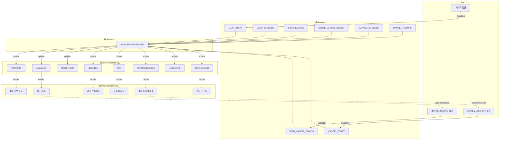

---

### 5.2. 예약 조회 흐름

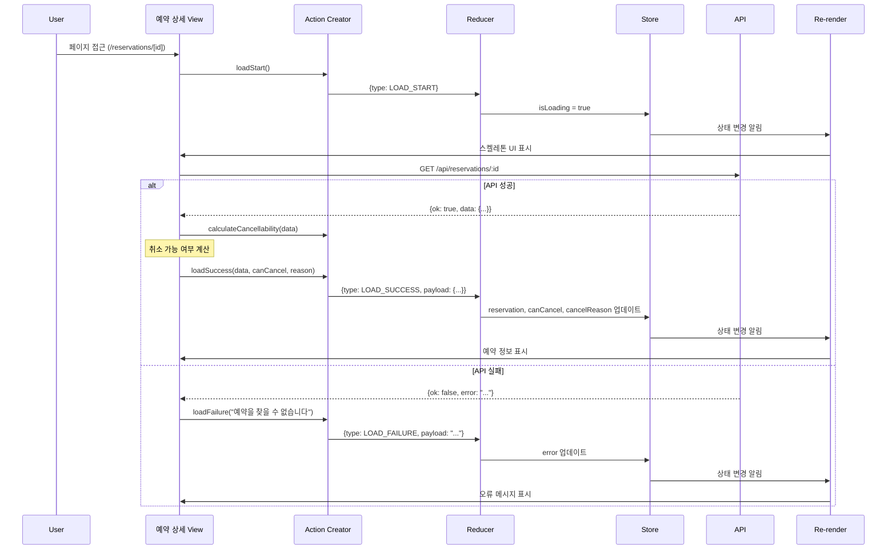

---

### 5.3. 예약 취소 흐름

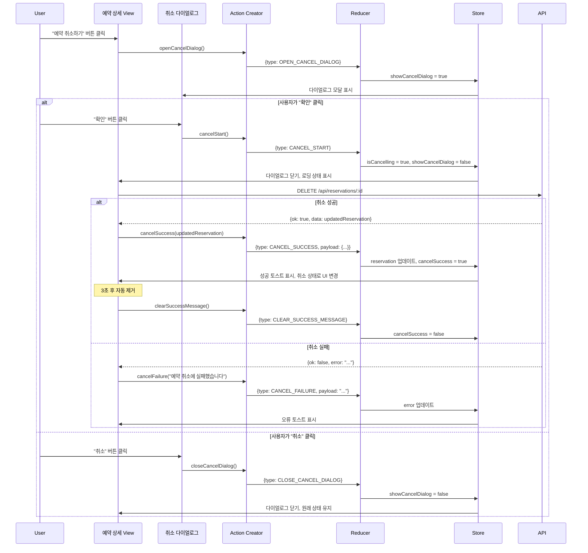

---

### 5.4. 상태별 Flux 흐름 다이어그램

#### 5.4.1. reservation 상태 흐름

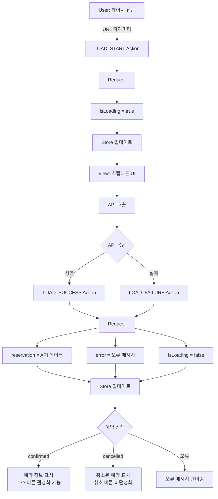

---

#### 5.4.2. canCancel & cancelReason 상태 흐름

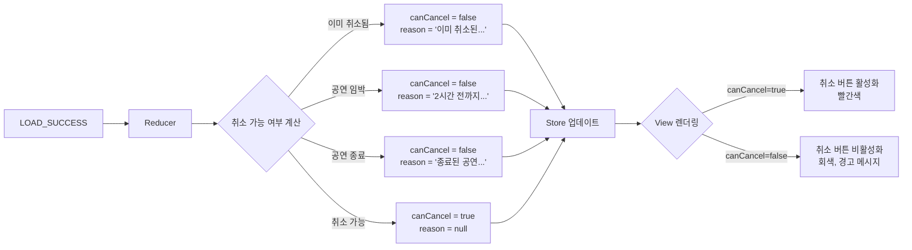

---

#### 5.4.3. showCancelDialog 상태 흐름

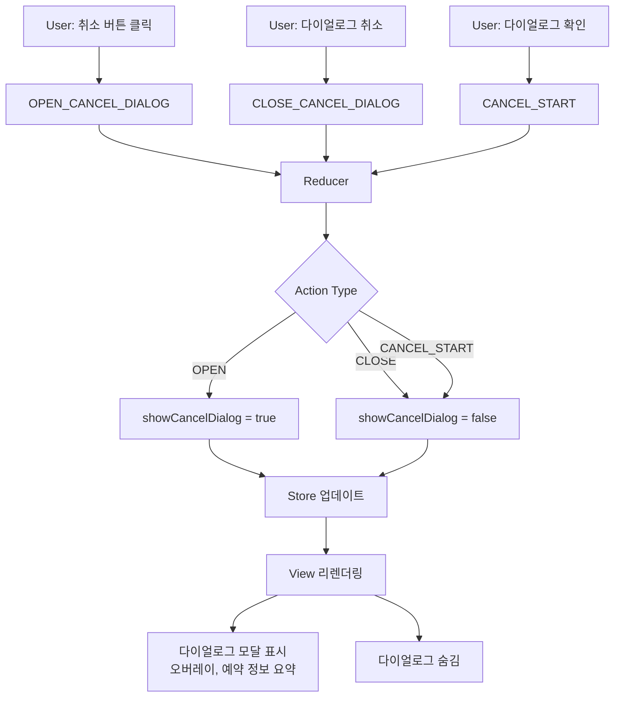

---

#### 5.4.4. isCancelling 상태 흐름

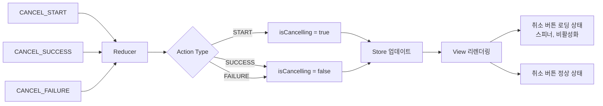

---

#### 5.4.5. cancelSuccess 상태 흐름

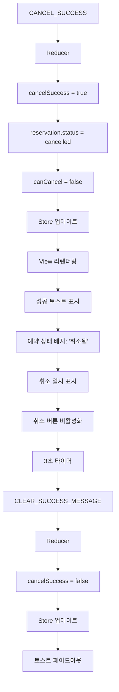

---

#### 5.4.6. isLoading 상태 흐름

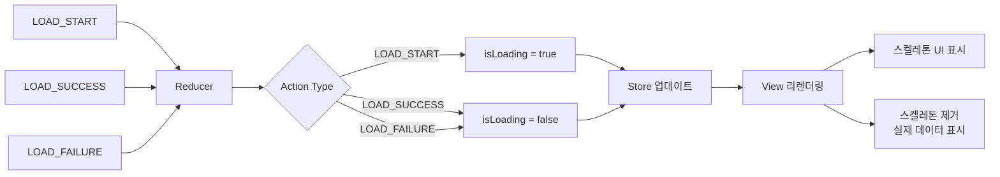

---

#### 5.4.7. error 상태 흐름

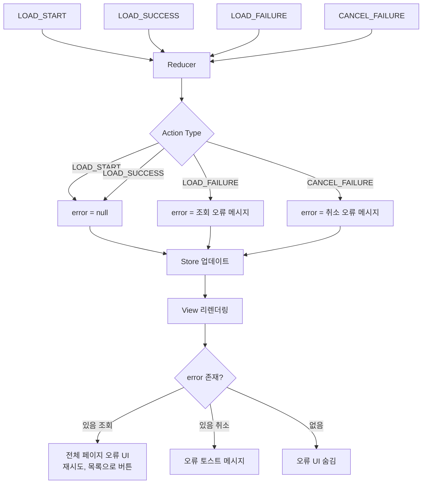

---

## 6. 컴포넌트에서 사용 예시

### 6.1. Custom Hook

```typescript
// useReservationDetail.ts
import { useReducer, useCallback, useEffect } from 'react';

// 취소 가능 여부 계산 함수
function calculateCancellability(
  reservation: ReservationDetail | null
): { canCancel: boolean; cancelReason: string | null } {
  if (!reservation) {
    return { canCancel: false, cancelReason: null };
  }
  
  if (reservation.status === 'cancelled') {
    return {
      canCancel: false,
      cancelReason: '이미 취소된 예약입니다',
    };
  }
  
  const scheduleDateTime = new Date(reservation.schedule.dateTime);
  const now = new Date();
  const hoursUntilShow = (scheduleDateTime.getTime() - now.getTime()) / (1000 * 60 * 60);
  
  if (scheduleDateTime < now) {
    return {
      canCancel: false,
      cancelReason: '종료된 공연입니다',
    };
  }
  
  if (hoursUntilShow < 2) {
    return {
      canCancel: false,
      cancelReason: '공연 시작 2시간 전까지만 취소 가능합니다',
    };
  }
  
  return { canCancel: true, cancelReason: null };
}

export function useReservationDetail(reservationId: string) {
  const [state, dispatch] = useReducer(reservationDetailReducer, initialState);
  
  // 예약 조회
  const loadReservation = useCallback(async () => {
    dispatch(loadStart());
    
    try {
      const response = await fetch(`/api/reservations/${reservationId}`);
      const data = await response.json();
      
      if (data.ok) {
        const { canCancel, cancelReason } = calculateCancellability(data.data);
        dispatch(loadSuccess(data.data, canCancel, cancelReason));
      } else {
        dispatch(loadFailure(data.error.message || '예약을 찾을 수 없습니다'));
      }
    } catch (error) {
      dispatch(loadFailure('예약 정보를 불러오는 중 오류가 발생했습니다'));
    }
  }, [reservationId]);
  
  // 페이지 마운트 시 자동 조회
  useEffect(() => {
    loadReservation();
  }, [loadReservation]);
  
  // Action Creators를 래핑한 함수들
  const actions = {
    // 취소 다이얼로그 열기
    openCancelDialog: useCallback(() => {
      if (!state.canCancel) return;
      dispatch(openCancelDialog());
    }, [state.canCancel]),
    
    // 취소 다이얼로그 닫기
    closeCancelDialog: useCallback(() => {
      dispatch(closeCancelDialog());
    }, []),
    
    // 예약 취소 실행
    cancelReservation: useCallback(async () => {
      dispatch(cancelStart());
      
      try {
        const response = await fetch(`/api/reservations/${reservationId}`, {
          method: 'DELETE',
        });
        const data = await response.json();
        
        if (data.ok) {
          dispatch(cancelSuccess(data.data));
          
          // 3초 후 성공 메시지 제거
          setTimeout(() => {
            dispatch(clearSuccessMessage());
          }, 3000);
        } else {
          dispatch(cancelFailure(data.error.message || '예약 취소에 실패했습니다'));
        }
      } catch (error) {
        dispatch(cancelFailure('예약 취소 중 오류가 발생했습니다'));
      }
    }, [reservationId]),
    
    // 재시도
    retry: useCallback(() => {
      loadReservation();
    }, [loadReservation]),
  };
  
  return { state, actions };
}
```

---

### 6.2. 컴포넌트에서 사용

```typescript
// ReservationDetailPage.tsx
'use client';

import { use } from 'react';
import { useReservationDetail } from '@/features/reservations/hooks/useReservationDetail';
import { ReservationInfo } from '@/features/reservations/components/ReservationInfo';
import { CancelDialog } from '@/features/reservations/components/CancelDialog';
import { ErrorView } from '@/features/reservations/components/ErrorView';
import { LoadingSkeleton } from '@/features/reservations/components/LoadingSkeleton';
import { SuccessToast } from '@/components/ui/toast-notification';

export default function ReservationDetailPage({ 
  params 
}: { 
  params: Promise<{ id: string }> 
}) {
  const resolvedParams = use(params);
  const reservationId = resolvedParams.id;
  
  const { state, actions } = useReservationDetail(reservationId);
  
  // 로딩 상태
  if (state.isLoading) {
    return <LoadingSkeleton />;
  }
  
  // 오류 상태
  if (state.error) {
    return (
      <ErrorView
        error={state.error}
        onRetry={actions.retry}
        onBackToList={() => router.push('/reservations')}
      />
    );
  }
  
  // 예약 정보가 없는 경우
  if (!state.reservation) {
    return <ErrorView error="예약을 찾을 수 없습니다" />;
  }
  
  return (
    <div className="container mx-auto p-4">
      {/* 성공 토스트 */}
      {state.cancelSuccess && (
        <SuccessToast message="예약이 성공적으로 취소되었습니다" />
      )}
      
      {/* 예약 정보 */}
      <ReservationInfo
        reservation={state.reservation}
        canCancel={state.canCancel}
        cancelReason={state.cancelReason}
        isCancelling={state.isCancelling}
        onCancelClick={actions.openCancelDialog}
      />
      
      {/* 취소 확인 다이얼로그 */}
      <CancelDialog
        open={state.showCancelDialog}
        reservation={state.reservation}
        onConfirm={actions.cancelReservation}
        onCancel={actions.closeCancelDialog}
      />
    </div>
  );
}
```

---

### 6.3. 자식 컴포넌트 예시

```typescript
// ReservationInfo.tsx
'use client';

interface ReservationInfoProps {
  reservation: ReservationDetail;
  canCancel: boolean;
  cancelReason: string | null;
  isCancelling: boolean;
  onCancelClick: () => void;
}

export function ReservationInfo({
  reservation,
  canCancel,
  cancelReason,
  isCancelling,
  onCancelClick,
}: ReservationInfoProps) {
  const isCancelled = reservation.status === 'cancelled';
  
  return (
    <div className="max-w-2xl mx-auto">
      {/* 예약 번호 및 상태 */}
      <div className="mb-4 p-4 bg-white rounded-lg shadow">
        <div className="flex justify-between items-center">
          <div>
            <p className="text-sm text-gray-500">예약번호</p>
            <p className="font-mono text-sm">{reservation.id}</p>
          </div>
          <Badge variant={isCancelled ? 'default' : 'success'}>
            {isCancelled ? '취소됨' : '확정'}
          </Badge>
        </div>
      </div>
      
      {/* 콘서트 정보 */}
      <div className="mb-4">
        
        <h1 className="text-2xl font-bold mt-4">{reservation.concert.title}</h1>
      </div>
      
      {/* 예약자 정보 */}
      <section className="mb-6 p-4 bg-white rounded-lg shadow">
        <h2 className="text-lg font-semibold mb-3">예약자 정보</h2>
        <dl className="space-y-2">
          <div>
            <dt className="text-sm text-gray-500">이름</dt>
            <dd>{reservation.customerName}</dd>
          </div>
          <div>
            <dt className="text-sm text-gray-500">연락처</dt>
            <dd>{reservation.customerPhone}</dd>
          </div>
          {reservation.customerEmail && (
            <div>
              <dt className="text-sm text-gray-500">이메일</dt>
              <dd>{reservation.customerEmail}</dd>
            </div>
          )}
        </dl>
      </section>
      
      {/* 관람 정보 */}
      <section className="mb-6 p-4 bg-white rounded-lg shadow">
        <h2 className="text-lg font-semibold mb-3">관람 정보</h2>
        <dl className="space-y-2">
          <div>
            <dt className="text-sm text-gray-500">일시</dt>
            <dd>{formatScheduleDateTime(reservation.schedule.dateTime)}</dd>
          </div>
        </dl>
      </section>
      
      {/* 좌석 정보 */}
      <section className="mb-6 p-4 bg-white rounded-lg shadow">
        <h2 className="text-lg font-semibold mb-3">좌석 정보</h2>
        <div className="space-y-2">
          {reservation.seats.map((seat) => (
            <div key={seat.id} className="flex justify-between">
              <span>{seat.seatNumber} ({seat.grade}석)</span>
              <span>{formatPrice(seat.price)}</span>
            </div>
          ))}
        </div>
      </section>
      
      {/* 결제 정보 */}
      <section className="mb-6 p-4 bg-white rounded-lg shadow">
        <h2 className="text-lg font-semibold mb-3">결제 정보</h2>
        <dl className="space-y-2">
          <div className="flex justify-between text-lg font-bold">
            <dt>총 금액</dt>
            <dd>{formatPrice(reservation.totalPrice)}</dd>
          </div>
          <div>
            <dt className="text-sm text-gray-500">예약 일시</dt>
            <dd>{formatDateTime(reservation.createdAt)}</dd>
          </div>
          {reservation.cancelledAt && (
            <div>
              <dt className="text-sm text-gray-500">취소 일시</dt>
              <dd>{formatDateTime(reservation.cancelledAt)}</dd>
            </div>
          )}
        </dl>
      </section>
      
      {/* 취소 불가 경고 메시지 */}
      {!canCancel && cancelReason && (
        <Alert variant={isCancelled ? 'default' : 'warning'} className="mb-4">
          <AlertTriangle className="h-4 w-4" />
          <AlertTitle>취소 불가</AlertTitle>
          <AlertDescription>
            {cancelReason}
            {cancelReason.includes('2시간') && (
              <p className="mt-2">긴급 문의: 고객센터 1234-5678</p>
            )}
          </AlertDescription>
        </Alert>
      )}
      
      {/* 취소 버튼 */}
      <Button
        variant="destructive"
        size="lg"
        className="w-full"
        disabled={!canCancel || isCancelling}
        onClick={onCancelClick}
      >
        {isCancelling ? (
          <>
            <Loader2 className="mr-2 h-4 w-4 animate-spin" />
            취소 중...
          </>
        ) : (
          '예약 취소하기'
        )}
      </Button>
      
      {/* 목록으로 버튼 */}
      <Button
        variant="outline"
        size="lg"
        className="w-full mt-2"
        onClick={() => router.push('/reservations')}
      >
        목록으로 돌아가기
      </Button>
    </div>
  );
}
```

---

## 7. 데이터 흐름 추적

### 7.1. 정상 조회 및 취소 시나리오

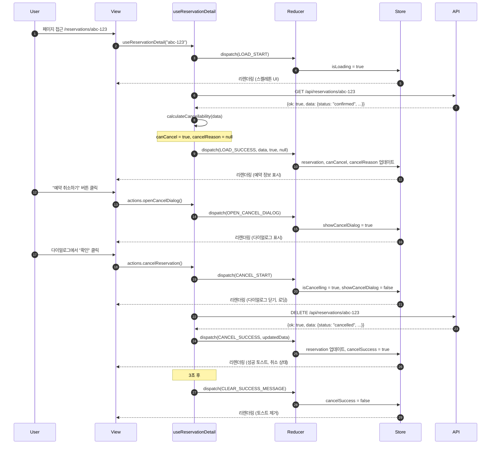

---

### 7.2. 취소 불가능 (공연 임박) 시나리오

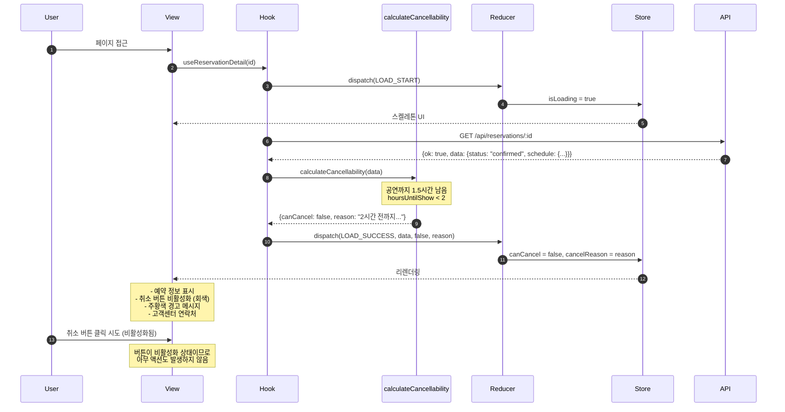

---

### 7.3. 오류 처리 및 재시도 시나리오

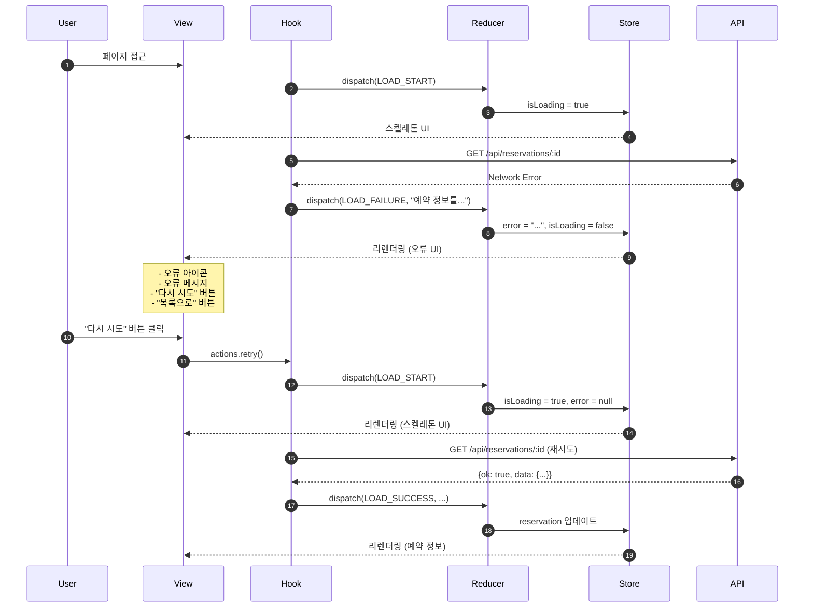

---

## 8. 성능 최적화

### 8.1. useMemo로 파생 데이터 최적화

```typescript
import { useMemo } from 'react';

function useReservationSelectors(state: ReservationDetailState) {
  // 취소 여부
  const isCancelled = useMemo(() => {
    return state.reservation?.status === 'cancelled';
  }, [state.reservation?.status]);
  
  // 확정 여부
  const isConfirmed = useMemo(() => {
    return state.reservation?.status === 'confirmed';
  }, [state.reservation?.status]);
  
  // 취소 버튼 표시 여부
  const showCancelButton = useMemo(() => {
    return !state.isLoading && 
           !state.error && 
           state.reservation !== null &&
           !state.isCancelling;
  }, [state.isLoading, state.error, state.reservation, state.isCancelling]);
  
  // 취소 버튼 비활성화 여부
  const isCancelButtonDisabled = useMemo(() => {
    return !state.canCancel || isCancelled || state.isCancelling;
  }, [state.canCancel, isCancelled, state.isCancelling]);
  
  // 성공 토스트 표시 여부
  const showSuccessToast = useMemo(() => {
    return state.cancelSuccess && !state.isCancelling;
  }, [state.cancelSuccess, state.isCancelling]);
  
  // 형식화된 데이터
  const formattedData = useMemo(() => {
    if (!state.reservation) return null;
    
    return {
      scheduleDateTime: format(
        new Date(state.reservation.schedule.dateTime),
        'yyyy년 MM월 dd일 (eee) HH:mm',
        { locale: ko }
      ),
      createdAt: format(
        new Date(state.reservation.createdAt),
        'yyyy년 MM월 dd일 HH:mm',
        { locale: ko }
      ),
      cancelledAt: state.reservation.cancelledAt
        ? format(new Date(state.reservation.cancelledAt), 'yyyy년 MM월 dd일 HH:mm', { locale: ko })
        : null,
      totalPrice: new Intl.NumberFormat('ko-KR').format(state.reservation.totalPrice) + '원',
      seatsSummary: `${state.reservation.seats.map(s => s.seatNumber).join(', ')} (${state.reservation.seats.length}석)`,
    };
  }, [state.reservation]);
  
  return {
    isCancelled,
    isConfirmed,
    showCancelButton,
    isCancelButtonDisabled,
    showSuccessToast,
    formattedData,
  };
}
```

---

### 8.2. useCallback로 액션 최적화

```typescript
// 이미 Custom Hook에서 useCallback 사용
// 자식 컴포넌트에 함수를 props로 전달할 때 불필요한 리렌더링 방지

const actions = {
  openCancelDialog: useCallback(() => {
    if (!state.canCancel) return;
    dispatch(openCancelDialog());
  }, [state.canCancel]),
  
  cancelReservation: useCallback(async () => {
    // ...
  }, [reservationId]), // reservationId가 바뀔 때만 함수 재생성
};
```

---

## 9. 테스트 전략

### 9.1. Reducer 테스트

```typescript
// reservationDetailReducer.test.ts
describe('reservationDetailReducer', () => {
  it('should handle LOAD_START', () => {
    const action = loadStart();
    const newState = reservationDetailReducer(initialState, action);
    
    expect(newState.isLoading).toBe(true);
    expect(newState.error).toBe(null);
  });
  
  it('should handle LOAD_SUCCESS', () => {
    const mockReservation = {
      id: 'test-id',
      status: 'confirmed',
      // ...
    } as ReservationDetail;
    
    const action = loadSuccess(mockReservation, true, null);
    const newState = reservationDetailReducer(initialState, action);
    
    expect(newState.isLoading).toBe(false);
    expect(newState.reservation).toEqual(mockReservation);
    expect(newState.canCancel).toBe(true);
    expect(newState.cancelReason).toBe(null);
  });
  
  it('should handle CANCEL_SUCCESS', () => {
    const stateWithReservation = {
      ...initialState,
      reservation: { status: 'confirmed' } as ReservationDetail,
      canCancel: true,
    };
    
    const updatedReservation = {
      ...stateWithReservation.reservation,
      status: 'cancelled' as const,
      cancelledAt: '2025-10-15T14:20:00+09:00',
    };
    
    const action = cancelSuccess(updatedReservation);
    const newState = reservationDetailReducer(stateWithReservation, action);
    
    expect(newState.isCancelling).toBe(false);
    expect(newState.reservation?.status).toBe('cancelled');
    expect(newState.canCancel).toBe(false);
    expect(newState.cancelSuccess).toBe(true);
  });
});
```

---

### 9.2. Custom Hook 테스트

```typescript
// useReservationDetail.test.ts
import { renderHook, act, waitFor } from '@testing-library/react';
import { useReservationDetail } from './useReservationDetail';

global.fetch = jest.fn();

describe('useReservationDetail', () => {
  beforeEach(() => {
    jest.clearAllMocks();
  });
  
  it('should load reservation on mount', async () => {
    const mockReservation = {
      id: 'test-id',
      status: 'confirmed',
      // ...
    };
    
    (global.fetch as jest.Mock).mockResolvedValueOnce({
      json: async () => ({ ok: true, data: mockReservation }),
    });
    
    const { result } = renderHook(() => useReservationDetail('test-id'));
    
    expect(result.current.state.isLoading).toBe(true);
    
    await waitFor(() => {
      expect(result.current.state.isLoading).toBe(false);
    });
    
    expect(result.current.state.reservation).toEqual(mockReservation);
  });
  
  it('should handle cancel reservation flow', async () => {
    const mockReservation = {
      id: 'test-id',
      status: 'confirmed',
      // ...
    };
    
    (global.fetch as jest.Mock)
      .mockResolvedValueOnce({
        json: async () => ({ ok: true, data: mockReservation }),
      })
      .mockResolvedValueOnce({
        json: async () => ({
          ok: true,
          data: { ...mockReservation, status: 'cancelled' },
        }),
      });
    
    const { result } = renderHook(() => useReservationDetail('test-id'));
    
    await waitFor(() => {
      expect(result.current.state.isLoading).toBe(false);
    });
    
    // 다이얼로그 열기
    act(() => {
      result.current.actions.openCancelDialog();
    });
    
    expect(result.current.state.showCancelDialog).toBe(true);
    
    // 예약 취소
    await act(async () => {
      await result.current.actions.cancelReservation();
    });
    
    expect(result.current.state.isCancelling).toBe(false);
    expect(result.current.state.reservation?.status).toBe('cancelled');
    expect(result.current.state.cancelSuccess).toBe(true);
  });
});
```

---

## 10. 요약

### 10.1. Flux 패턴의 장점

1. **단방향 데이터 흐름**: Action → Reducer → Store → View의 예측 가능한 흐름
2. **상태 관리 중앙화**: 모든 상태가 한 곳에서 관리되어 디버깅이 쉬움
3. **순수 함수 Reducer**: 부수 효과 없이 테스트하기 쉬움
4. **시간 여행 디버깅**: 액션 히스토리를 추적하여 상태 변화 재현 가능
5. **타입 안전성**: TypeScript와 함께 사용하여 컴파일 타임 오류 방지

### 10.2. 핵심 구성 요소

| 요소 | 역할 | 구현 |
|-----|------|------|
| **Action** | 상태 변경 의도 표현 | Action Creator 함수 (10개) |
| **Reducer** | 상태 변경 로직 | reservationDetailReducer 함수 |
| **Store** | 상태 저장소 | useReducer 훅 (8개 상태) |
| **View** | UI 렌더링 | React 컴포넌트 |

### 10.3. 상태별 Action 매핑

| 상태 | 관련 Actions |
|-----|-------------|
| `reservation` | LOAD_SUCCESS, CANCEL_SUCCESS |
| `canCancel` | LOAD_SUCCESS, CANCEL_SUCCESS |
| `cancelReason` | LOAD_SUCCESS, CANCEL_SUCCESS |
| `isLoading` | LOAD_START, LOAD_SUCCESS, LOAD_FAILURE |
| `error` | LOAD_FAILURE, CANCEL_FAILURE, LOAD_START, LOAD_SUCCESS |
| `showCancelDialog` | OPEN_CANCEL_DIALOG, CLOSE_CANCEL_DIALOG, CANCEL_START |
| `isCancelling` | CANCEL_START, CANCEL_SUCCESS, CANCEL_FAILURE |
| `cancelSuccess` | CANCEL_SUCCESS, CLEAR_SUCCESS_MESSAGE |

### 10.4. 구현 체크리스트

- [x] Action Types 정의 (10개)
- [x] Action Creators 구현
- [x] Action 타입 정의 (TypeScript Union Type)
- [x] State 타입 정의 (8개 상태)
- [x] Initial State 정의
- [x] Reducer 함수 구현 (10개 케이스)
- [x] Custom Hook 구현 (useReservationDetail)
- [x] 취소 가능 여부 계산 함수
- [x] Selectors 구현 (useMemo)
- [x] 컴포넌트 통합
- [x] 테스트 작성

---

이 Flux 패턴 설계를 기반으로 예약 상세 페이지의 상태 관리를 구현하면, 명확하고 예측 가능하며 유지보수하기 쉬운 코드를 작성할 수 있습니다. 특히 예약 취소와 같은 복잡한 사용자 상호작용과 비동기 처리를 효과적으로 관리할 수 있습니다.

