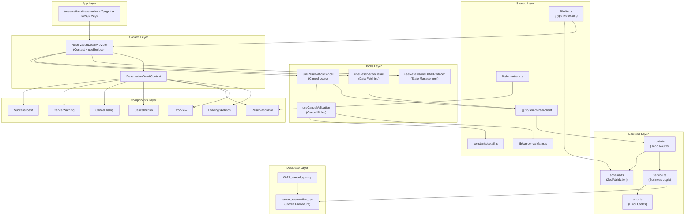
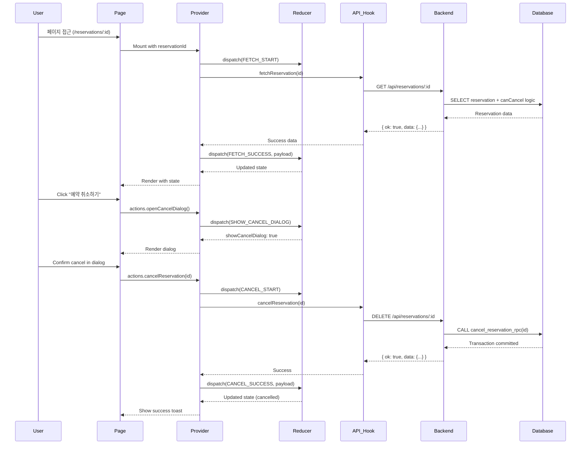
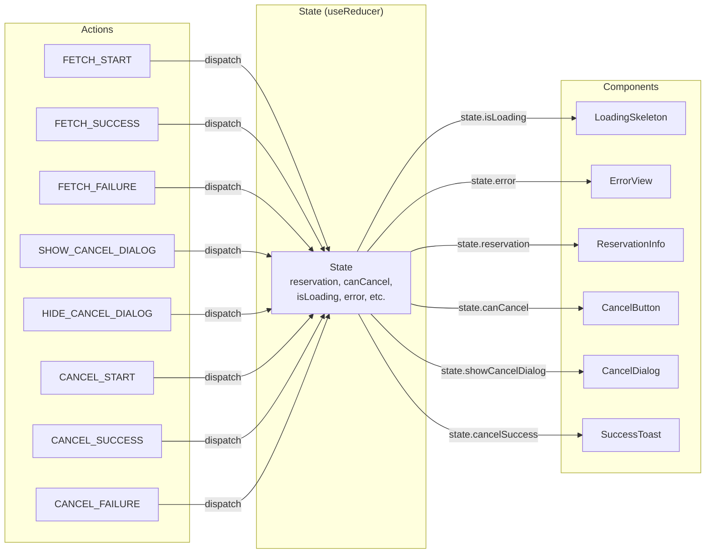

# 구현 계획: 예약 상세 페이지 (User Flow #008)

> **기능**: 예약 상세 조회 및 예약 취소
> 
> **라우트**: `/reservations/[reservationId]`
> 
> **문서 참조**:
> - [PRD](../../prd.md)
> - [Database](../../database.md)
> - [User Flow](../../userflow.md)
> - [Spec](./spec.md)
> - [Requirement](./requirement.md)
> - [State Definition](./state-definition.md)
> - [Flux Pattern](./flux-pattern.md)
> - [State Management](./state-management.md)

---

## 1. 개요

이 문서는 예약 상세 페이지 (User Flow #008)의 구현을 위한 세부 계획을 제공합니다. 기존 예약 조회 기능(User Flow #007)의 패턴을 따르며, Context + useReducer 기반의 상태 관리를 사용합니다.

### 1.1. 핵심 기능

- ✅ 예약 상세 정보 조회 (API 연동)
- ✅ 예약 취소 가능 여부 판단 (공연 시작 2시간 전까지)
- ✅ 예약 취소 처리 (트랜잭션 기반)
- ✅ 취소 확인 다이얼로그
- ✅ 로딩, 에러, 성공 상태 처리

### 1.2. 모듈 구조 요약

| 모듈 | 경로 | 타입 | 설명 |
|-----|------|------|------|
| **Page** | `src/app/reservations/[reservationId]/page.tsx` | Presentation | Next.js 동적 라우트 페이지 |
| **Context Provider** | `src/features/reservations/context/reservation-detail-context.tsx` | State Management | Context + useReducer 상태 관리 |
| **Reducer Hook** | `src/features/reservations/hooks/use-reservation-detail-reducer.ts` | State Management | Reducer 로직 분리 |
| **API Hook** | `src/features/reservations/hooks/use-reservation-detail.ts` | Data Fetching | API 호출 로직 |
| **Cancellation Hook** | `src/features/reservations/hooks/use-reservation-cancel.ts` | Business Logic | 예약 취소 로직 |
| **Components** | `src/features/reservations/components/detail/*` | Presentation | UI 컴포넌트들 |
| **Backend Route** | `src/features/reservations/backend/route.ts` | API | 취소 엔드포인트 추가 |
| **Backend Service** | `src/features/reservations/backend/service.ts` | Business Logic | 취소 서비스 로직 추가 |
| **Backend Schema** | `src/features/reservations/backend/schema.ts` | Validation | 취소 요청/응답 스키마 |
| **Backend Error** | `src/features/reservations/backend/error.ts` | Error Handling | 취소 관련 에러 코드 |
| **Migration** | `supabase/migrations/0017_create_cancel_reservation_rpc.sql` | Database | 취소 RPC 함수 |
| **Constants** | `src/features/reservations/constants/detail.ts` | Configuration | 상수 정의 |
| **Utilities** | `src/features/reservations/lib/cancel-validator.ts` | Business Logic | 취소 가능 여부 검증 |

---

## 2. 모듈 다이어그램

### 2.1. 전체 아키텍처



---

### 2.2. 데이터 흐름



---

### 2.3. 상태 관리 흐름 (Context + Reducer)



---

## 3. Implementation Plan

### 3.1. Phase 1: Database & Backend API (Backend)

#### 3.1.1. 📄 Migration: `supabase/migrations/0017_create_cancel_reservation_rpc.sql`

**목적**: 예약 취소를 위한 트랜잭션 기반 RPC 함수 생성

**구현 내용**:
```sql
-- 예약 취소 RPC 함수 생성
CREATE OR REPLACE FUNCTION cancel_reservation_rpc(
  p_reservation_id UUID
)
RETURNS JSON
LANGUAGE plpgsql
AS $$
DECLARE
  v_reservation RECORD;
  v_schedule_datetime TIMESTAMPTZ;
  v_time_until_concert INTERVAL;
BEGIN
  -- 1. 예약 정보 조회 및 락 획득
  SELECT r.*, s.date_time
  INTO v_reservation
  FROM reservations r
  INNER JOIN schedules s ON r.schedule_id = s.id
  WHERE r.id = p_reservation_id
  FOR UPDATE;
  
  IF NOT FOUND THEN
    RAISE EXCEPTION 'RESERVATION_NOT_FOUND'
      USING HINT = 'The specified reservation does not exist';
  END IF;
  
  -- 2. 이미 취소된 예약 확인
  IF v_reservation.status = 'cancelled' THEN
    RAISE EXCEPTION 'ALREADY_CANCELLED'
      USING HINT = 'This reservation has already been cancelled';
  END IF;
  
  -- 3. 취소 가능 여부 검증 (공연 시작 2시간 전까지)
  v_time_until_concert := v_reservation.date_time - NOW();
  
  IF v_time_until_concert < INTERVAL '2 hours' THEN
    RAISE EXCEPTION 'CANNOT_CANCEL_TOO_CLOSE'
      USING HINT = 'Cannot cancel within 2 hours of concert start';
  END IF;
  
  -- 4. 예약 상태 업데이트
  UPDATE reservations
  SET status = 'cancelled',
      cancelled_at = NOW(),
      updated_at = NOW()
  WHERE id = p_reservation_id;
  
  -- 5. 좌석 상태 복원
  UPDATE seats
  SET status = 'available',
      updated_at = NOW()
  WHERE id = ANY(v_reservation.seat_ids);
  
  -- 6. 결과 반환
  RETURN json_build_object(
    'reservation_id', p_reservation_id,
    'cancelled_at', NOW(),
    'success', true
  );
  
EXCEPTION
  WHEN OTHERS THEN
    RAISE;
END;
$$;

-- 권한 부여
GRANT EXECUTE ON FUNCTION cancel_reservation_rpc TO authenticated, anon;

COMMENT ON FUNCTION cancel_reservation_rpc IS '예약 취소 RPC 함수 (트랜잭션 기반)';
```

**테스트 쿼리**:
```sql
-- 정상 취소
SELECT cancel_reservation_rpc('existing-reservation-id'::UUID);

-- 존재하지 않는 예약
SELECT cancel_reservation_rpc('non-existent-id'::UUID); -- Error: RESERVATION_NOT_FOUND

-- 이미 취소된 예약
SELECT cancel_reservation_rpc('already-cancelled-id'::UUID); -- Error: ALREADY_CANCELLED

-- 공연 임박 (2시간 이내)
SELECT cancel_reservation_rpc('near-concert-id'::UUID); -- Error: CANNOT_CANCEL_TOO_CLOSE
```

**검증 항목**:
- [ ] RPC 함수 생성 성공
- [ ] 트랜잭션 롤백 동작 확인
- [ ] 예약 상태 업데이트 확인
- [ ] 좌석 상태 복원 확인
- [ ] 시간 검증 로직 확인
- [ ] 에러 핸들링 확인

---

#### 3.1.2. 📄 Backend Error: `src/features/reservations/backend/error.ts`

**목적**: 취소 관련 에러 코드 추가

**구현 내용**:
```typescript
// 기존 에러 코드에 추가
export const reservationErrorCodes = {
  // ... 기존 코드 ...
  
  // 취소 관련 에러 추가
  alreadyCancelled: 'ALREADY_CANCELLED',
  cannotCancelTooClose: 'CANNOT_CANCEL_TOO_CLOSE',
  cannotCancelPastEvent: 'CANNOT_CANCEL_PAST_EVENT',
  cancellationFailed: 'CANCELLATION_FAILED',
} as const;

// HTTP 상태 코드 매핑 업데이트
export const getReservationErrorHttpStatus = (
  errorCode: ReservationServiceError
): number => {
  switch (errorCode) {
    // ... 기존 케이스 ...
    
    case reservationErrorCodes.alreadyCancelled:
    case reservationErrorCodes.cannotCancelTooClose:
    case reservationErrorCodes.cannotCancelPastEvent:
      return 400;
    case reservationErrorCodes.cancellationFailed:
      return 500;
    default:
      return 500;
  }
};
```

**Unit Test** (개념):
```typescript
describe('reservationErrorCodes', () => {
  it('should have cancel-related error codes', () => {
    expect(reservationErrorCodes.alreadyCancelled).toBe('ALREADY_CANCELLED');
    expect(reservationErrorCodes.cannotCancelTooClose).toBe('CANNOT_CANCEL_TOO_CLOSE');
  });
  
  it('should return correct HTTP status for cancel errors', () => {
    expect(getReservationErrorHttpStatus('ALREADY_CANCELLED')).toBe(400);
    expect(getReservationErrorHttpStatus('CANCELLATION_FAILED')).toBe(500);
  });
});
```

---

#### 3.1.3. 📄 Backend Schema: `src/features/reservations/backend/schema.ts`

**목적**: 예약 취소 요청/응답 스키마 정의

**구현 내용**:
```typescript
import { z } from 'zod';

// 예약 취소 응답 스키마
export const CancelReservationResponseSchema = z.object({
  reservationId: z.string().uuid(),
  reservationNumber: z.string(),
  status: z.literal('cancelled'),
  cancelledAt: z.string(), // ISO 8601
  message: z.string().optional(),
});

// 예약 상세 응답 스키마 확장 (cancelled_at 포함)
export const ReservationDetailResponseSchema = z.object({
  reservationId: z.string().uuid(),
  reservationNumber: z.string(),
  customerName: z.string(),
  customerPhone: z.string(),
  customerEmail: z.string().nullable(),
  totalPrice: z.number(),
  seatCount: z.number(),
  concertTitle: z.string(),
  concertId: z.string().uuid(),
  scheduleDateTime: z.string(),
  scheduleId: z.string().uuid(),
  seatNumbers: z.array(z.string()),
  seats: z.array(
    z.object({
      id: z.string().uuid(),
      seatNumber: z.string(),
      grade: z.string(),
      price: z.number(),
    })
  ),
  status: z.enum(['confirmed', 'cancelled']),
  createdAt: z.string(),
  cancelledAt: z.string().nullable(), // 취소 일시 추가
});

// 취소 가능 여부 응답 스키마 (선택적: 별도 엔드포인트 필요 시)
export const CancelEligibilityResponseSchema = z.object({
  canCancel: z.boolean(),
  reason: z.string().nullable(),
});

// 타입 추론
export type CancelReservationResponse = z.infer<typeof CancelReservationResponseSchema>;
export type ReservationDetailResponse = z.infer<typeof ReservationDetailResponseSchema>;
export type CancelEligibilityResponse = z.infer<typeof CancelEligibilityResponseSchema>;
```

**Unit Test** (개념):
```typescript
describe('CancelReservationResponseSchema', () => {
  it('should validate valid cancel response', () => {
    const validData = {
      reservationId: 'uuid-here',
      reservationNumber: 'R2501150001',
      status: 'cancelled',
      cancelledAt: '2025-01-15T10:00:00Z',
    };
    
    expect(CancelReservationResponseSchema.safeParse(validData).success).toBe(true);
  });
  
  it('should reject invalid status', () => {
    const invalidData = {
      reservationId: 'uuid-here',
      reservationNumber: 'R2501150001',
      status: 'confirmed', // Should be 'cancelled'
      cancelledAt: '2025-01-15T10:00:00Z',
    };
    
    expect(CancelReservationResponseSchema.safeParse(invalidData).success).toBe(false);
  });
});
```

---

#### 3.1.4. 📄 Backend Service: `src/features/reservations/backend/service.ts`

**목적**: 예약 취소 비즈니스 로직 추가

**구현 내용**:
```typescript
import type { SupabaseClient } from '@supabase/supabase-js';
import {
  failure,
  success,
  type HandlerResult,
} from '@/backend/http/response';
import {
  reservationErrorCodes,
  type ReservationServiceError,
} from './error';
import type { CancelReservationResponse } from './schema';

/**
 * 예약 취소
 */
export const cancelReservation = async (
  client: SupabaseClient,
  reservationId: string
): Promise<
  HandlerResult<CancelReservationResponse, ReservationServiceError, unknown>
> => {
  try {
    // RPC 함수 호출 (트랜잭션 기반)
    const { data: result, error: rpcError } = await client.rpc(
      'cancel_reservation_rpc',
      {
        p_reservation_id: reservationId,
      }
    );

    if (rpcError) {
      console.error('Reservation cancellation error:', rpcError);

      // 에러 메시지 파싱
      if (rpcError.message?.includes('RESERVATION_NOT_FOUND')) {
        return failure(
          404,
          reservationErrorCodes.reservationNotFound,
          '예약을 찾을 수 없습니다'
        );
      }

      if (rpcError.message?.includes('ALREADY_CANCELLED')) {
        return failure(
          400,
          reservationErrorCodes.alreadyCancelled,
          '이미 취소된 예약입니다'
        );
      }

      if (rpcError.message?.includes('CANNOT_CANCEL_TOO_CLOSE')) {
        return failure(
          400,
          reservationErrorCodes.cannotCancelTooClose,
          '공연 시작 2시간 전까지만 취소할 수 있습니다'
        );
      }

      return failure(
        500,
        reservationErrorCodes.cancellationFailed,
        '예약 취소 중 오류가 발생했습니다'
      );
    }

    // 취소된 예약 정보 재조회
    const { data: reservation, error: fetchError } = await client
      .from('reservations')
      .select('id, reservation_number, status, cancelled_at')
      .eq('id', reservationId)
      .single();

    if (fetchError || !reservation) {
      console.error('Fetch cancelled reservation error:', fetchError);
      return failure(
        500,
        reservationErrorCodes.internalError,
        '취소된 예약 정보 조회 중 오류가 발생했습니다'
      );
    }

    return success({
      reservationId: reservation.id,
      reservationNumber: reservation.reservation_number,
      status: 'cancelled' as const,
      cancelledAt: reservation.cancelled_at,
    });
  } catch (error) {
    console.error('Reservation cancellation exception:', error);
    return failure(
      500,
      reservationErrorCodes.internalError,
      '서버 내부 오류가 발생했습니다'
    );
  }
};

/**
 * 예약 상세 조회 (수정: cancelledAt 및 취소 가능 여부 포함)
 */
export const getReservationDetail = async (
  client: SupabaseClient,
  reservationId: string
): Promise<
  HandlerResult<ReservationDetailResponse, ReservationServiceError, unknown>
> => {
  try {
    const { data, error } = await client
      .from('reservations')
      .select(
        `
        id,
        reservation_number,
        concert_id,
        schedule_id,
        seat_ids,
        total_price,
        customer_name,
        customer_phone,
        customer_email,
        status,
        created_at,
        cancelled_at,
        schedules (
          date_time,
          concerts (
            id,
            title
          )
        )
      `
      )
      .eq('id', reservationId)
      .single();

    if (error || !data) {
      console.error('Reservation fetch error:', error);
      return failure(
        404,
        reservationErrorCodes.reservationNotFound,
        '예약을 찾을 수 없습니다'
      );
    }

    // 좌석 정보 조회 (id 포함)
    const { data: seats, error: seatsError } = await client
      .from('seats')
      .select('id, seat_number, grade, price')
      .in('id', data.seat_ids);

    if (seatsError) {
      console.error('Seat fetch error:', seatsError);
      return failure(
        500,
        reservationErrorCodes.seatFetchError,
        '좌석 정보 조회 중 오류가 발생했습니다'
      );
    }

    // 타입 단언
    const schedules = data.schedules as unknown as {
      date_time: string;
      concerts: { id: string; title: string };
    };

    return success({
      reservationId: data.id,
      reservationNumber: data.reservation_number,
      customerName: data.customer_name,
      customerPhone: data.customer_phone,
      customerEmail: data.customer_email,
      totalPrice: data.total_price,
      seatCount: data.seat_ids.length,
      concertTitle: schedules.concerts.title,
      concertId: schedules.concerts.id,
      scheduleDateTime: schedules.date_time,
      scheduleId: data.schedule_id,
      seatNumbers: seats?.map((s) => s.seat_number) || [],
      seats:
        seats?.map((s) => ({
          id: s.id,
          seatNumber: s.seat_number,
          grade: s.grade,
          price: s.price,
        })) || [],
      status: data.status,
      createdAt: data.created_at,
      cancelledAt: data.cancelled_at,
    });
  } catch (error) {
    console.error('Reservation detail fetch exception:', error);
    return failure(
      500,
      reservationErrorCodes.internalError,
      '서버 내부 오류가 발생했습니다'
    );
  }
};
```

**Unit Test** (개념):
```typescript
describe('cancelReservation', () => {
  it('should cancel reservation successfully', async () => {
    const mockClient = createMockSupabaseClient({
      rpc: { success: true },
      from: { data: { id: 'uuid', status: 'cancelled' } },
    });
    
    const result = await cancelReservation(mockClient, 'uuid');
    
    expect(result.ok).toBe(true);
    expect(result.data?.status).toBe('cancelled');
  });
  
  it('should return error for already cancelled reservation', async () => {
    const mockClient = createMockSupabaseClient({
      rpc: { error: { message: 'ALREADY_CANCELLED' } },
    });
    
    const result = await cancelReservation(mockClient, 'uuid');
    
    expect(result.ok).toBe(false);
    expect(result.error?.code).toBe('ALREADY_CANCELLED');
  });
  
  it('should return error for too close to concert', async () => {
    const mockClient = createMockSupabaseClient({
      rpc: { error: { message: 'CANNOT_CANCEL_TOO_CLOSE' } },
    });
    
    const result = await cancelReservation(mockClient, 'uuid');
    
    expect(result.ok).toBe(false);
    expect(result.error?.code).toBe('CANNOT_CANCEL_TOO_CLOSE');
  });
});
```

---

#### 3.1.5. 📄 Backend Route: `src/features/reservations/backend/route.ts`

**목적**: 예약 취소 API 엔드포인트 추가

**구현 내용**:
```typescript
import type { Hono } from 'hono';
import {
  failure,
  respond,
  type ErrorResult,
} from '@/backend/http/response';
import {
  getLogger,
  getSupabase,
  type AppEnv,
} from '@/backend/hono/context';
import { cancelReservation } from './service';
import {
  reservationErrorCodes,
  type ReservationServiceError,
} from './error';

export const registerReservationRoutes = (app: Hono<AppEnv>) => {
  // ... 기존 라우트 ...

  // 예약 취소 엔드포인트 추가
  app.delete('/api/reservations/:reservationId', async (c) => {
    const reservationId = c.req.param('reservationId');

    // UUID 형식 검증
    const uuidRegex = /^[0-9a-f]{8}-[0-9a-f]{4}-[0-9a-f]{4}-[0-9a-f]{4}-[0-9a-f]{12}$/i;
    if (!uuidRegex.test(reservationId)) {
      return respond(
        c,
        failure(
          400,
          reservationErrorCodes.validationError,
          '유효하지 않은 예약 ID 형식입니다'
        )
      );
    }

    const supabase = getSupabase(c);
    const logger = getLogger(c);

    logger.info(`예약 취소 요청: reservationId=${reservationId}`);

    const result = await cancelReservation(supabase, reservationId);

    if (!result.ok) {
      const errorResult = result as ErrorResult<ReservationServiceError, unknown>;
      logger.error(`예약 취소 실패: ${errorResult.error.code}`, errorResult.error.message);
    } else {
      logger.info(`예약 취소 성공: ${result.data.reservationNumber}`);
    }

    return respond(c, result);
  });
};
```

**API Test** (수동 테스트):
```bash
# 정상 취소
curl -X DELETE http://localhost:3000/api/reservations/valid-uuid

# 존재하지 않는 예약
curl -X DELETE http://localhost:3000/api/reservations/non-existent-uuid

# 잘못된 UUID 형식
curl -X DELETE http://localhost:3000/api/reservations/invalid-id

# 이미 취소된 예약
curl -X DELETE http://localhost:3000/api/reservations/cancelled-uuid

# 공연 임박 (2시간 이내)
curl -X DELETE http://localhost:3000/api/reservations/near-concert-uuid
```

---

### 3.2. Phase 2: Shared Utilities & Constants (Shared Layer)

#### 3.2.1. 📄 Constants: `src/features/reservations/constants/detail.ts`

**목적**: 예약 상세 및 취소 관련 상수 정의

**구현 내용**:
```typescript
// 취소 가능 시간 (공연 시작 전 최소 시간, 분 단위)
export const CANCEL_THRESHOLD_MINUTES = 120; // 2시간

// 취소 불가 사유 메시지
export const CANCEL_REASON_MESSAGES = {
  ALREADY_CANCELLED: '이미 취소된 예약입니다',
  TOO_CLOSE_TO_CONCERT: '공연 시작 2시간 전까지만 취소할 수 있습니다',
  PAST_EVENT: '이미 종료된 공연입니다',
} as const;

// 로딩 메시지
export const LOADING_MESSAGES = {
  FETCHING_RESERVATION: '예약 정보를 불러오는 중...',
  CANCELLING_RESERVATION: '예약을 취소하는 중...',
} as const;

// 성공 메시지
export const SUCCESS_MESSAGES = {
  RESERVATION_CANCELLED: '예약이 성공적으로 취소되었습니다',
} as const;

// 에러 메시지
export const ERROR_MESSAGES = {
  FETCH_FAILED: '예약 정보를 불러오는 중 오류가 발생했습니다',
  CANCEL_FAILED: '예약 취소 중 오류가 발생했습니다',
  RESERVATION_NOT_FOUND: '예약을 찾을 수 없습니다',
  NETWORK_ERROR: '네트워크 오류가 발생했습니다',
  UNKNOWN_ERROR: '알 수 없는 오류가 발생했습니다',
} as const;

// 다이얼로그 메시지
export const DIALOG_MESSAGES = {
  CANCEL_TITLE: '예약을 취소하시겠습니까?',
  CANCEL_DESCRIPTION: '이 작업은 되돌릴 수 없습니다.',
  CANCEL_CONFIRM: '확인',
  CANCEL_CANCEL: '취소',
} as const;

// 스켈레톤 로딩 개수
export const SKELETON_COUNTS = {
  INFO_ROWS: 8,
  SEAT_ITEMS: 3,
} as const;
```

---

#### 3.2.2. 📄 Utilities: `src/features/reservations/lib/cancel-validator.ts`

**목적**: 취소 가능 여부 검증 로직 (클라이언트 측)

**구현 내용**:
```typescript
import { differenceInMinutes, isPast } from 'date-fns';
import { CANCEL_THRESHOLD_MINUTES, CANCEL_REASON_MESSAGES } from '../constants/detail';

export type CancelValidationResult = {
  canCancel: boolean;
  reason: string | null;
};

/**
 * 예약 취소 가능 여부 검증
 */
export const validateCancellation = (
  status: 'confirmed' | 'cancelled',
  scheduleDateTime: string // ISO 8601 형식
): CancelValidationResult => {
  // 1. 이미 취소된 예약
  if (status === 'cancelled') {
    return {
      canCancel: false,
      reason: CANCEL_REASON_MESSAGES.ALREADY_CANCELLED,
    };
  }

  const concertDate = new Date(scheduleDateTime);

  // 2. 이미 지난 공연
  if (isPast(concertDate)) {
    return {
      canCancel: false,
      reason: CANCEL_REASON_MESSAGES.PAST_EVENT,
    };
  }

  // 3. 공연 시작 2시간 이내
  const minutesUntilConcert = differenceInMinutes(concertDate, new Date());
  if (minutesUntilConcert < CANCEL_THRESHOLD_MINUTES) {
    return {
      canCancel: false,
      reason: CANCEL_REASON_MESSAGES.TOO_CLOSE_TO_CONCERT,
    };
  }

  // 취소 가능
  return {
    canCancel: true,
    reason: null,
  };
};
```

**Unit Test**:
```typescript
import { validateCancellation } from './cancel-validator';
import { add, sub } from 'date-fns';

describe('validateCancellation', () => {
  const now = new Date();
  
  it('should return canCancel: false for already cancelled reservation', () => {
    const futureDate = add(now, { hours: 5 }).toISOString();
    const result = validateCancellation('cancelled', futureDate);
    
    expect(result.canCancel).toBe(false);
    expect(result.reason).toBe('이미 취소된 예약입니다');
  });
  
  it('should return canCancel: false for past event', () => {
    const pastDate = sub(now, { days: 1 }).toISOString();
    const result = validateCancellation('confirmed', pastDate);
    
    expect(result.canCancel).toBe(false);
    expect(result.reason).toBe('이미 종료된 공연입니다');
  });
  
  it('should return canCancel: false within 2 hours of concert', () => {
    const nearDate = add(now, { hours: 1 }).toISOString();
    const result = validateCancellation('confirmed', nearDate);
    
    expect(result.canCancel).toBe(false);
    expect(result.reason).toContain('2시간 전까지만');
  });
  
  it('should return canCancel: true for valid cancellation', () => {
    const validDate = add(now, { hours: 3 }).toISOString();
    const result = validateCancellation('confirmed', validDate);
    
    expect(result.canCancel).toBe(true);
    expect(result.reason).toBeNull();
  });
});
```

---

#### 3.2.3. 📄 Formatters: `src/features/reservations/lib/formatters.ts`

**목적**: 포맷팅 함수 추가 (취소 일시 등)

**구현 내용**:
```typescript
import { format } from 'date-fns';
import { ko } from 'date-fns/locale';

// ... 기존 함수들 ...

/**
 * 취소 일시 포맷팅
 */
export const formatCancelledAt = (cancelledAt: string | null): string | null => {
  if (!cancelledAt) return null;
  return format(new Date(cancelledAt), 'yyyy년 MM월 dd일 HH시 mm분', { locale: ko });
};

/**
 * 좌석 요약 (다이얼로그용)
 */
export const formatSeatsSummary = (
  seats: Array<{ seatNumber: string; grade: string }>
): string => {
  const seatNumbers = seats.map((s) => s.seatNumber).join(', ');
  const seatCount = seats.length;
  return `${seatNumbers} (총 ${seatCount}석)`;
};
```

---

### 3.3. Phase 3: State Management (Hooks & Context Layer)

#### 3.3.1. 📄 Reducer Hook: `src/features/reservations/hooks/use-reservation-detail-reducer.ts`

**목적**: Context에서 사용할 Reducer 정의

**구현 내용**:
```typescript
import { useReducer } from 'react';
import type { ReservationDetailResponse } from '../lib/dto';

export type ReservationDetailState = {
  reservation: ReservationDetailResponse | null;
  canCancel: boolean;
  cancelReason: string | null;
  isLoading: boolean;
  error: string | null;
  showCancelDialog: boolean;
  isCancelling: boolean;
  cancelSuccess: boolean;
};

export type ReservationDetailAction =
  | { type: 'FETCH_RESERVATION_START' }
  | {
      type: 'FETCH_RESERVATION_SUCCESS';
      payload: {
        reservation: ReservationDetailResponse;
        canCancel: boolean;
        cancelReason: string | null;
      };
    }
  | { type: 'FETCH_RESERVATION_FAILURE'; payload: string }
  | { type: 'SHOW_CANCEL_DIALOG' }
  | { type: 'HIDE_CANCEL_DIALOG' }
  | { type: 'CANCEL_RESERVATION_START' }
  | { type: 'CANCEL_RESERVATION_SUCCESS'; payload: ReservationDetailResponse }
  | { type: 'CANCEL_RESERVATION_FAILURE'; payload: string }
  | { type: 'RESET_CANCEL_SUCCESS' }
  | { type: 'RESET_STATE' };

export const initialState: ReservationDetailState = {
  reservation: null,
  canCancel: false,
  cancelReason: null,
  isLoading: true,
  error: null,
  showCancelDialog: false,
  isCancelling: false,
  cancelSuccess: false,
};

function reservationDetailReducer(
  state: ReservationDetailState,
  action: ReservationDetailAction
): ReservationDetailState {
  switch (action.type) {
    case 'FETCH_RESERVATION_START':
      return {
        ...initialState,
        isLoading: true,
        error: null,
      };

    case 'FETCH_RESERVATION_SUCCESS':
      return {
        ...state,
        isLoading: false,
        error: null,
        reservation: action.payload.reservation,
        canCancel: action.payload.canCancel,
        cancelReason: action.payload.cancelReason,
      };

    case 'FETCH_RESERVATION_FAILURE':
      return {
        ...state,
        isLoading: false,
        error: action.payload,
        reservation: null,
      };

    case 'SHOW_CANCEL_DIALOG':
      return {
        ...state,
        showCancelDialog: true,
      };

    case 'HIDE_CANCEL_DIALOG':
      return {
        ...state,
        showCancelDialog: false,
      };

    case 'CANCEL_RESERVATION_START':
      return {
        ...state,
        isCancelling: true,
        error: null,
      };

    case 'CANCEL_RESERVATION_SUCCESS':
      return {
        ...state,
        isCancelling: false,
        cancelSuccess: true,
        showCancelDialog: false,
        reservation: action.payload, // 업데이트된 예약 (status: cancelled)
        canCancel: false,
        cancelReason: '이미 취소된 예약입니다',
      };

    case 'CANCEL_RESERVATION_FAILURE':
      return {
        ...state,
        isCancelling: false,
        error: action.payload,
      };

    case 'RESET_CANCEL_SUCCESS':
      return {
        ...state,
        cancelSuccess: false,
      };

    case 'RESET_STATE':
      return initialState;

    default:
      return state;
  }
}

export const useReservationDetailReducer = () => {
  return useReducer(reservationDetailReducer, initialState);
};
```

**Unit Test**:
```typescript
import { reservationDetailReducer, initialState } from './use-reservation-detail-reducer';

describe('reservationDetailReducer', () => {
  it('should handle FETCH_RESERVATION_START', () => {
    const action = { type: 'FETCH_RESERVATION_START' as const };
    const newState = reservationDetailReducer(initialState, action);
    
    expect(newState.isLoading).toBe(true);
    expect(newState.error).toBeNull();
  });
  
  it('should handle FETCH_RESERVATION_SUCCESS', () => {
    const mockReservation = { id: 'uuid', status: 'confirmed' };
    const action = {
      type: 'FETCH_RESERVATION_SUCCESS' as const,
      payload: {
        reservation: mockReservation,
        canCancel: true,
        cancelReason: null,
      },
    };
    const newState = reservationDetailReducer(initialState, action);
    
    expect(newState.isLoading).toBe(false);
    expect(newState.reservation).toEqual(mockReservation);
    expect(newState.canCancel).toBe(true);
  });
  
  it('should handle CANCEL_RESERVATION_SUCCESS', () => {
    const currentState = {
      ...initialState,
      reservation: { id: 'uuid', status: 'confirmed' },
      canCancel: true,
    };
    const cancelledReservation = { id: 'uuid', status: 'cancelled' };
    const action = {
      type: 'CANCEL_RESERVATION_SUCCESS' as const,
      payload: cancelledReservation,
    };
    const newState = reservationDetailReducer(currentState, action);
    
    expect(newState.isCancelling).toBe(false);
    expect(newState.cancelSuccess).toBe(true);
    expect(newState.canCancel).toBe(false);
    expect(newState.reservation?.status).toBe('cancelled');
  });
});
```

---

#### 3.3.2. 📄 API Hook: `src/features/reservations/hooks/use-reservation-detail.ts`

**목적**: 예약 상세 조회 API 호출 로직

**구현 내용**:
```typescript
'use client';

import { useCallback } from 'react';
import { apiClient, extractApiErrorMessage } from '@/lib/remote/api-client';
import type { ReservationDetailResponse } from '../lib/dto';
import { ERROR_MESSAGES } from '../constants/detail';

type ApiResponse<T> = {
  ok: boolean;
  data?: T;
  error?: {
    code: string;
    message: string;
  };
};

export const useReservationDetailApi = () => {
  const fetchReservationDetail = useCallback(
    async (reservationId: string): Promise<ReservationDetailResponse> => {
      const response = await apiClient.get<ApiResponse<ReservationDetailResponse>>(
        `/api/reservations/${reservationId}`
      );

      if (!response.data?.ok || !response.data.data) {
        const errorMessage = response.data?.error?.message || ERROR_MESSAGES.FETCH_FAILED;
        throw new Error(errorMessage);
      }

      return response.data.data;
    },
    []
  );

  return { fetchReservationDetail };
};
```

---

#### 3.3.3. 📄 Cancel Hook: `src/features/reservations/hooks/use-reservation-cancel.ts`

**목적**: 예약 취소 API 호출 로직

**구현 내용**:
```typescript
'use client';

import { useCallback } from 'react';
import { apiClient, extractApiErrorMessage } from '@/lib/remote/api-client';
import type { CancelReservationResponse, ReservationDetailResponse } from '../lib/dto';
import { ERROR_MESSAGES } from '../constants/detail';

type ApiResponse<T> = {
  ok: boolean;
  data?: T;
  error?: {
    code: string;
    message: string;
  };
};

export const useReservationCancelApi = () => {
  const cancelReservation = useCallback(
    async (reservationId: string): Promise<CancelReservationResponse> => {
      const response = await apiClient.delete<ApiResponse<CancelReservationResponse>>(
        `/api/reservations/${reservationId}`
      );

      if (!response.data?.ok || !response.data.data) {
        const errorMessage = response.data?.error?.message || ERROR_MESSAGES.CANCEL_FAILED;
        throw new Error(errorMessage);
      }

      return response.data.data;
    },
    []
  );

  return { cancelReservation };
};
```

---

#### 3.3.4. 📄 Context Provider: `src/features/reservations/context/reservation-detail-context.tsx`

**목적**: Context + useReducer 기반 상태 관리

**구현 내용**:
```typescript
'use client';

import React, { createContext, useContext, useCallback, useEffect, useMemo } from 'react';
import { useReservationDetailReducer } from '../hooks/use-reservation-detail-reducer';
import type { ReservationDetailState, ReservationDetailAction } from '../hooks/use-reservation-detail-reducer';
import { useReservationDetailApi } from '../hooks/use-reservation-detail';
import { useReservationCancelApi } from '../hooks/use-reservation-cancel';
import { validateCancellation } from '../lib/cancel-validator';
import { formatScheduleDateTime, formatPrice, formatSeats, formatCancelledAt, formatSeatsSummary } from '../lib/formatters';
import { SUCCESS_MESSAGES } from '../constants/detail';

type ReservationDetailContextType = {
  state: ReservationDetailState;
  actions: {
    openCancelDialog: () => void;
    closeCancelDialog: () => void;
    cancelReservation: () => Promise<void>;
    retry: () => void;
  };
  derived: {
    isCancelled: boolean;
    isConfirmed: boolean;
    showCancelButton: boolean;
    isCancelButtonDisabled: boolean;
    showSuccessToast: boolean;
    formattedData: {
      concertDateTime: string | null;
      totalSeats: string | null;
      seatNumbers: string | null;
      totalPriceFormatted: string | null;
      reservationStatusText: string | null;
      cancelledAt: string | null;
      seatsSummary: string | null;
    };
  };
};

const ReservationDetailContext = createContext<ReservationDetailContextType | undefined>(
  undefined
);

export const ReservationDetailProvider: React.FC<{
  children: React.ReactNode;
  reservationId: string;
}> = ({ children, reservationId }) => {
  const [state, dispatch] = useReservationDetailReducer();
  const { fetchReservationDetail } = useReservationDetailApi();
  const { cancelReservation: cancelReservationApi } = useReservationCancelApi();

  // 예약 정보 조회
  const fetchReservation = useCallback(() => {
    dispatch({ type: 'FETCH_RESERVATION_START' });

    fetchReservationDetail(reservationId)
      .then((reservation) => {
        const validation = validateCancellation(
          reservation.status,
          reservation.scheduleDateTime
        );

        dispatch({
          type: 'FETCH_RESERVATION_SUCCESS',
          payload: {
            reservation,
            canCancel: validation.canCancel,
            cancelReason: validation.reason,
          },
        });
      })
      .catch((error) => {
        const errorMessage =
          error instanceof Error ? error.message : '예약 정보를 불러오는 중 오류가 발생했습니다';
        dispatch({ type: 'FETCH_RESERVATION_FAILURE', payload: errorMessage });
      });
  }, [reservationId, fetchReservationDetail]);

  // 초기 로드
  useEffect(() => {
    fetchReservation();
  }, [fetchReservation]);

  // 취소 성공 토스트 자동 닫기
  useEffect(() => {
    if (state.cancelSuccess) {
      const timer = setTimeout(() => {
        dispatch({ type: 'RESET_CANCEL_SUCCESS' });
      }, 3000);
      return () => clearTimeout(timer);
    }
  }, [state.cancelSuccess]);

  // Actions
  const openCancelDialog = useCallback(() => {
    dispatch({ type: 'SHOW_CANCEL_DIALOG' });
  }, []);

  const closeCancelDialog = useCallback(() => {
    dispatch({ type: 'HIDE_CANCEL_DIALOG' });
  }, []);

  const cancelReservation = useCallback(() => {
    dispatch({ type: 'CANCEL_RESERVATION_START' });

    return cancelReservationApi(reservationId)
      .then((cancelledData) => {
        // 전체 예약 정보 재조회
        return fetchReservationDetail(reservationId);
      })
      .then((updatedReservation) => {
        dispatch({
          type: 'CANCEL_RESERVATION_SUCCESS',
          payload: updatedReservation,
        });
      })
      .catch((error) => {
        const errorMessage =
          error instanceof Error ? error.message : '예약 취소 중 오류가 발생했습니다';
        dispatch({ type: 'CANCEL_RESERVATION_FAILURE', payload: errorMessage });
      });
  }, [reservationId, cancelReservationApi, fetchReservationDetail]);

  const retry = useCallback(() => {
    fetchReservation();
  }, [fetchReservation]);

  // Derived data
  const derived = useMemo(() => {
    const reservation = state.reservation;

    return {
      isCancelled: reservation?.status === 'cancelled',
      isConfirmed: reservation?.status === 'confirmed',
      showCancelButton: state.canCancel && !state.isCancelling,
      isCancelButtonDisabled: !state.canCancel || state.isCancelling,
      showSuccessToast: state.cancelSuccess,
      formattedData: {
        concertDateTime: reservation ? formatScheduleDateTime(reservation.scheduleDateTime) : null,
        totalSeats: reservation ? `${reservation.seatCount}석` : null,
        seatNumbers: reservation ? formatSeats(reservation.seats) : null,
        totalPriceFormatted: reservation ? formatPrice(reservation.totalPrice) : null,
        reservationStatusText: reservation?.status === 'confirmed' ? '예약 확정' : '예약 취소됨',
        cancelledAt: reservation?.cancelledAt ? formatCancelledAt(reservation.cancelledAt) : null,
        seatsSummary: reservation ? formatSeatsSummary(reservation.seats) : null,
      },
    };
  }, [state.reservation, state.canCancel, state.isCancelling, state.cancelSuccess]);

  const value = useMemo(
    () => ({
      state,
      actions: {
        openCancelDialog,
        closeCancelDialog,
        cancelReservation,
        retry,
      },
      derived,
    }),
    [state, openCancelDialog, closeCancelDialog, cancelReservation, retry, derived]
  );

  return (
    <ReservationDetailContext.Provider value={value}>
      {children}
    </ReservationDetailContext.Provider>
  );
};

export const useReservationDetailContext = () => {
  const context = useContext(ReservationDetailContext);
  if (!context) {
    throw new Error('useReservationDetailContext must be used within ReservationDetailProvider');
  }
  return context;
};
```

---

### 3.4. Phase 4: UI Components (Presentation Layer)

#### 3.4.1. 📁 Components Directory Structure

```
src/features/reservations/components/detail/
├── loading-skeleton.tsx         # 로딩 스켈레톤
├── error-view.tsx               # 에러 화면
├── reservation-info.tsx         # 예약 정보 표시
├── cancel-button.tsx            # 취소 버튼
├── cancel-dialog.tsx            # 취소 확인 다이얼로그
├── cancel-warning.tsx           # 취소 불가 안내
├── success-toast.tsx            # 성공 토스트
└── index.ts                     # 컴포넌트 re-export
```

---

#### 3.4.2. 📄 Component: `loading-skeleton.tsx`

**구현 내용**:
```typescript
'use client';

import React from 'react';
import { Card } from '@/components/ui/card';

export default function LoadingSkeleton() {
  return (
    <div className="container mx-auto p-4 max-w-4xl">
      <div className="mb-6">
        <div className="h-8 w-48 bg-gray-200 animate-pulse rounded" />
      </div>

      <Card className="p-6">
        <div className="space-y-4">
          {Array.from({ length: 8 }).map((_, idx) => (
            <div key={idx} className="flex items-center space-x-4">
              <div className="h-5 w-24 bg-gray-200 animate-pulse rounded" />
              <div className="h-5 flex-1 bg-gray-200 animate-pulse rounded" />
            </div>
          ))}
        </div>

        <div className="mt-6 flex space-x-4">
          <div className="h-10 w-32 bg-gray-200 animate-pulse rounded" />
          <div className="h-10 w-32 bg-gray-200 animate-pulse rounded" />
        </div>
      </Card>
    </div>
  );
}
```

**QA Sheet**:
- [ ] 스켈레톤이 적절한 수(8개 행)로 표시되는가?
- [ ] 애니메이션이 부드럽게 작동하는가?
- [ ] 모바일/데스크톱에서 레이아웃이 깨지지 않는가?

---

#### 3.4.3. 📄 Component: `error-view.tsx`

**구현 내용**:
```typescript
'use client';

import React from 'react';
import { Card } from '@/components/ui/card';
import { Button } from '@/components/ui/button';
import { AlertCircle } from 'lucide-react';
import { useRouter } from 'next/navigation';

type ErrorViewProps = {
  error: string;
  onRetry: () => void;
};

export default function ErrorView({ error, onRetry }: ErrorViewProps) {
  const router = useRouter();

  const handleBackToList = () => {
    router.push('/reservations');
  };

  return (
    <div className="container mx-auto p-4 max-w-4xl">
      <Card className="p-12 text-center">
        <AlertCircle className="w-16 h-16 text-red-500 mx-auto mb-4" />
        <h2 className="text-2xl font-bold mb-2 text-gray-800">오류가 발생했습니다</h2>
        <p className="text-gray-600 mb-6">{error}</p>

        <div className="flex justify-center space-x-4">
          <Button variant="outline" onClick={handleBackToList}>
            목록으로 돌아가기
          </Button>
          <Button onClick={onRetry}>다시 시도</Button>
        </div>
      </Card>
    </div>
  );
}
```

**QA Sheet**:
- [ ] 에러 메시지가 명확하게 표시되는가?
- [ ] "다시 시도" 버튼이 정상 작동하는가?
- [ ] "목록으로 돌아가기" 버튼이 `/reservations` 로 이동하는가?
- [ ] 아이콘이 적절한 크기와 색상으로 표시되는가?

---

#### 3.4.4. 📄 Component: `reservation-info.tsx`

**구현 내용**:
```typescript
'use client';

import React from 'react';
import { Card } from '@/components/ui/card';
import { Badge } from '@/components/ui/badge';
import type { ReservationDetailResponse } from '../../lib/dto';

type ReservationInfoProps = {
  reservation: ReservationDetailResponse;
  formattedData: {
    concertDateTime: string | null;
    totalPriceFormatted: string | null;
    seatNumbers: string | null;
    reservationStatusText: string | null;
    cancelledAt: string | null;
  };
};

export default function ReservationInfo({ reservation, formattedData }: ReservationInfoProps) {
  const statusBadgeVariant = reservation.status === 'confirmed' ? 'default' : 'secondary';

  return (
    <Card className="p-6">
      <div className="flex items-center justify-between mb-6">
        <h2 className="text-2xl font-bold">예약 상세 정보</h2>
        <Badge variant={statusBadgeVariant}>{formattedData.reservationStatusText}</Badge>
      </div>

      <div className="space-y-4">
        <InfoRow label="예약 번호" value={reservation.reservationNumber} />
        <InfoRow label="콘서트" value={reservation.concertTitle} />
        <InfoRow label="공연 일시" value={formattedData.concertDateTime || '-'} />
        <InfoRow label="예약자 이름" value={reservation.customerName} />
        <InfoRow label="연락처" value={reservation.customerPhone} />
        {reservation.customerEmail && (
          <InfoRow label="이메일" value={reservation.customerEmail} />
        )}
        <InfoRow label="좌석" value={formattedData.seatNumbers || '-'} />
        <InfoRow label="총 결제 금액" value={formattedData.totalPriceFormatted || '-'} bold />
        <InfoRow label="예약 일시" value={formattedData.concertDateTime || '-'} />
        {reservation.cancelledAt && (
          <InfoRow label="취소 일시" value={formattedData.cancelledAt || '-'} />
        )}
      </div>
    </Card>
  );
}

function InfoRow({
  label,
  value,
  bold = false,
}: {
  label: string;
  value: string;
  bold?: boolean;
}) {
  return (
    <div className="flex items-center border-b pb-3">
      <span className="text-gray-600 w-32">{label}</span>
      <span className={`flex-1 ${bold ? 'font-bold text-lg' : ''}`}>{value}</span>
    </div>
  );
}
```

**QA Sheet**:
- [ ] 예약 정보가 모두 정확하게 표시되는가?
- [ ] 상태 뱃지가 적절한 색상으로 표시되는가? (확정: 파란색, 취소: 회색)
- [ ] 취소된 예약의 경우 취소 일시가 표시되는가?
- [ ] 이메일이 없는 경우 해당 행이 표시되지 않는가?
- [ ] 총 결제 금액이 굵게 강조되는가?

---

#### 3.4.5. 📄 Component: `cancel-button.tsx`

**구현 내용**:
```typescript
'use client';

import React from 'react';
import { Button } from '@/components/ui/button';
import { Loader2 } from 'lucide-react';

type CancelButtonProps = {
  disabled: boolean;
  isLoading: boolean;
  onClick: () => void;
};

export default function CancelButton({ disabled, isLoading, onClick }: CancelButtonProps) {
  return (
    <Button
      variant="destructive"
      onClick={onClick}
      disabled={disabled}
      className="w-full sm:w-auto"
    >
      {isLoading && <Loader2 className="mr-2 h-4 w-4 animate-spin" />}
      {isLoading ? '취소 처리 중...' : '예약 취소하기'}
    </Button>
  );
}
```

**QA Sheet**:
- [ ] 버튼이 비활성화 상태일 때 클릭이 불가능한가?
- [ ] 로딩 중일 때 스피너가 표시되는가?
- [ ] 버튼 색상이 빨간색(destructive)인가?
- [ ] 모바일에서 전체 너비, 데스크톱에서 자동 너비인가?

---

#### 3.4.6. 📄 Component: `cancel-dialog.tsx`

**구현 내용**:
```typescript
'use client';

import React from 'react';
import { Card } from '@/components/ui/card';
import { Button } from '@/components/ui/button';
import { AlertTriangle } from 'lucide-react';
import type { ReservationDetailResponse } from '../../lib/dto';
import { DIALOG_MESSAGES } from '../../constants/detail';

type CancelDialogProps = {
  open: boolean;
  reservation: ReservationDetailResponse | null;
  seatsSummary: string | null;
  onConfirm: () => void;
  onCancel: () => void;
};

export default function CancelDialog({
  open,
  reservation,
  seatsSummary,
  onConfirm,
  onCancel,
}: CancelDialogProps) {
  if (!open || !reservation) return null;

  return (
    <div className="fixed inset-0 z-50 flex items-center justify-center bg-black bg-opacity-50">
      <Card className="max-w-md w-full mx-4 p-6">
        <div className="flex items-center space-x-3 mb-4">
          <AlertTriangle className="w-6 h-6 text-yellow-500" />
          <h3 className="text-xl font-bold">{DIALOG_MESSAGES.CANCEL_TITLE}</h3>
        </div>

        <div className="mb-4 space-y-2 text-gray-700">
          <p>
            <strong>콘서트:</strong> {reservation.concertTitle}
          </p>
          <p>
            <strong>좌석:</strong> {seatsSummary}
          </p>
        </div>

        <p className="text-sm text-red-600 mb-6">{DIALOG_MESSAGES.CANCEL_DESCRIPTION}</p>

        <div className="flex space-x-4">
          <Button variant="outline" onClick={onCancel} className="flex-1">
            {DIALOG_MESSAGES.CANCEL_CANCEL}
          </Button>
          <Button variant="destructive" onClick={onConfirm} className="flex-1">
            {DIALOG_MESSAGES.CANCEL_CONFIRM}
          </Button>
        </div>
      </Card>
    </div>
  );
}
```

**QA Sheet**:
- [ ] 다이얼로그가 화면 중앙에 표시되는가?
- [ ] 배경이 반투명 어둡게 처리되는가?
- [ ] 예약 정보 요약이 정확하게 표시되는가?
- [ ] "취소" 버튼 클릭 시 다이얼로그가 닫히는가?
- [ ] "확인" 버튼 클릭 시 취소 프로세스가 시작되는가?
- [ ] 배경 클릭 시 다이얼로그가 닫히는가? (선택사항)

---

#### 3.4.7. 📄 Component: `cancel-warning.tsx`

**구현 내용**:
```typescript
'use client';

import React from 'react';
import { Card } from '@/components/ui/card';
import { AlertTriangle } from 'lucide-react';

type CancelWarningProps = {
  reason: string;
};

export default function CancelWarning({ reason }: CancelWarningProps) {
  return (
    <Card className="p-4 bg-yellow-50 border-yellow-200">
      <div className="flex items-start space-x-3">
        <AlertTriangle className="w-5 h-5 text-yellow-600 mt-0.5" />
        <div>
          <h4 className="font-semibold text-yellow-800 mb-1">예약 취소 불가</h4>
          <p className="text-sm text-yellow-700">{reason}</p>
        </div>
      </div>
    </Card>
  );
}
```

**QA Sheet**:
- [ ] 경고 메시지가 노란색 배경으로 표시되는가?
- [ ] 아이콘이 적절하게 표시되는가?
- [ ] 취소 불가 사유가 명확하게 표시되는가?

---

#### 3.4.8. 📄 Component: `success-toast.tsx`

**구현 내용**:
```typescript
'use client';

import React, { useEffect, useState } from 'react';
import { CheckCircle } from 'lucide-react';

type SuccessToastProps = {
  message: string;
  show: boolean;
};

export default function SuccessToast({ message, show }: SuccessToastProps) {
  const [visible, setVisible] = useState(false);

  useEffect(() => {
    if (show) {
      setVisible(true);
    } else {
      setVisible(false);
    }
  }, [show]);

  if (!visible) return null;

  return (
    <div className="fixed top-4 right-4 z-50 animate-slide-in">
      <div className="bg-green-500 text-white px-6 py-3 rounded-lg shadow-lg flex items-center space-x-3">
        <CheckCircle className="w-5 h-5" />
        <span className="font-medium">{message}</span>
      </div>
    </div>
  );
}
```

**QA Sheet**:
- [ ] 토스트가 화면 우상단에 표시되는가?
- [ ] 슬라이드인 애니메이션이 부드러운가?
- [ ] 3초 후 자동으로 사라지는가?
- [ ] 성공 아이콘이 표시되는가?

---

### 3.5. Phase 5: Page Integration (App Layer)

#### 3.5.1. 📄 Page: `src/app/reservations/[reservationId]/page.tsx`

**구현 내용**:
```typescript
'use client';

import React, { use } from 'react';
import { useRouter } from 'next/navigation';
import { Button } from '@/components/ui/button';
import { ReservationDetailProvider, useReservationDetailContext } from '@/features/reservations/context/reservation-detail-context';
import LoadingSkeleton from '@/features/reservations/components/detail/loading-skeleton';
import ErrorView from '@/features/reservations/components/detail/error-view';
import ReservationInfo from '@/features/reservations/components/detail/reservation-info';
import CancelButton from '@/features/reservations/components/detail/cancel-button';
import CancelDialog from '@/features/reservations/components/detail/cancel-dialog';
import CancelWarning from '@/features/reservations/components/detail/cancel-warning';
import SuccessToast from '@/features/reservations/components/detail/success-toast';
import { SUCCESS_MESSAGES } from '@/features/reservations/constants/detail';

function ReservationDetailContent() {
  const { state, actions, derived } = useReservationDetailContext();
  const router = useRouter();

  const handleBackToList = () => {
    router.push('/reservations');
  };

  if (state.isLoading) {
    return <LoadingSkeleton />;
  }

  if (state.error) {
    return <ErrorView error={state.error} onRetry={actions.retry} />;
  }

  if (!state.reservation) {
    return <ErrorView error="예약 정보를 찾을 수 없습니다" onRetry={actions.retry} />;
  }

  return (
    <div className="container mx-auto p-4 max-w-4xl">
      <h1 className="text-3xl font-bold mb-6">예약 상세</h1>

      <ReservationInfo reservation={state.reservation} formattedData={derived.formattedData} />

      {!state.canCancel && state.cancelReason && (
        <div className="mt-4">
          <CancelWarning reason={state.cancelReason} />
        </div>
      )}

      <div className="mt-6 flex space-x-4">
        <Button variant="outline" onClick={handleBackToList}>
          목록으로 돌아가기
        </Button>

        {state.canCancel && (
          <CancelButton
            disabled={derived.isCancelButtonDisabled}
            isLoading={state.isCancelling}
            onClick={actions.openCancelDialog}
          />
        )}
      </div>

      <CancelDialog
        open={state.showCancelDialog}
        reservation={state.reservation}
        seatsSummary={derived.formattedData.seatsSummary}
        onConfirm={actions.cancelReservation}
        onCancel={actions.closeCancelDialog}
      />

      <SuccessToast message={SUCCESS_MESSAGES.RESERVATION_CANCELLED} show={derived.showSuccessToast} />
    </div>
  );
}

export default function ReservationDetailPage({
  params,
}: {
  params: Promise<{ reservationId: string }>;
}) {
  const { reservationId } = use(params);

  return (
    <ReservationDetailProvider reservationId={reservationId}>
      <ReservationDetailContent />
    </ReservationDetailProvider>
  );
}
```

**QA Sheet**:
- [ ] URL에서 `reservationId` 파라미터가 정확하게 추출되는가?
- [ ] 로딩 중일 때 스켈레톤이 표시되는가?
- [ ] 에러 발생 시 에러 화면이 표시되는가?
- [ ] 예약 정보가 정확하게 표시되는가?
- [ ] 취소 가능한 예약의 경우 취소 버튼이 표시되는가?
- [ ] 취소 불가능한 예약의 경우 경고 메시지가 표시되는가?
- [ ] 취소 버튼 클릭 시 다이얼로그가 표시되는가?
- [ ] 다이얼로그에서 확인 클릭 시 취소가 진행되는가?
- [ ] 취소 성공 시 토스트가 표시되는가?
- [ ] "목록으로 돌아가기" 버튼이 `/reservations`로 이동하는가?

---

## 4. 추가 고려사항

### 4.1. 성능 최적화

- ✅ `useMemo`, `useCallback` 사용으로 불필요한 리렌더링 방지
- ✅ Context 분리 (필요 시 state/actions/derived 분리 고려)
- ✅ `React.memo` 적용 (필요 시 컴포넌트별)

### 4.2. 에러 핸들링

- ✅ 네트워크 에러 처리
- ✅ 유효하지 않은 UUID 처리
- ✅ 동시성 충돌 처리 (RPC 함수 내 트랜잭션)
- ✅ 사용자 친화적 에러 메시지

### 4.3. 보안

- ✅ SQL Injection 방지 (Supabase 클라이언트 사용)
- ✅ UUID 검증
- ✅ 서버 측 취소 가능 여부 재검증

### 4.4. 접근성

- ✅ 키보드 네비게이션
- ✅ ARIA 레이블 (필요 시)
- ✅ 색상 대비 (WCAG AA 준수)

### 4.5. 테스트

- ✅ Unit Test: Reducer, Validators, Formatters
- ✅ Integration Test: API 호출 흐름
- ✅ E2E Test: 전체 사용자 플로우

---

## 5. 구현 체크리스트

### 5.1. Backend & Database
- [ ] Migration 파일 작성 (`0017_create_cancel_reservation_rpc.sql`)
- [ ] RPC 함수 테스트 (정상, 에러 케이스)
- [ ] Backend error 코드 추가
- [ ] Backend schema 추가 (취소 응답)
- [ ] Backend service 함수 추가 (`cancelReservation`)
- [ ] Backend route 추가 (`DELETE /api/reservations/:id`)
- [ ] API 엔드포인트 수동 테스트

### 5.2. Shared Utilities
- [ ] Constants 파일 작성 (`detail.ts`)
- [ ] Validator 작성 (`cancel-validator.ts`)
- [ ] Validator unit test
- [ ] Formatters 확장 (`formatCancelledAt`, `formatSeatsSummary`)

### 5.3. State Management
- [ ] Reducer 작성 (`use-reservation-detail-reducer.ts`)
- [ ] Reducer unit test
- [ ] API Hook 작성 (`use-reservation-detail.ts`)
- [ ] Cancel Hook 작성 (`use-reservation-cancel.ts`)
- [ ] Context Provider 작성 (`reservation-detail-context.tsx`)

### 5.4. UI Components
- [ ] LoadingSkeleton 컴포넌트
- [ ] ErrorView 컴포넌트
- [ ] ReservationInfo 컴포넌트
- [ ] CancelButton 컴포넌트
- [ ] CancelDialog 컴포넌트
- [ ] CancelWarning 컴포넌트
- [ ] SuccessToast 컴포넌트
- [ ] 각 컴포넌트 QA 테스트

### 5.5. Page Integration
- [ ] 동적 라우트 페이지 작성 (`[reservationId]/page.tsx`)
- [ ] 전체 플로우 E2E 테스트
- [ ] 모바일 반응형 테스트
- [ ] 브라우저 호환성 테스트

### 5.6. Documentation
- [ ] README 업데이트 (새 기능 설명)
- [ ] API 문서 업데이트
- [ ] 컴포넌트 Storybook (선택사항)

---

## 6. 예상 작업 시간

| Phase | 작업 내용 | 예상 시간 |
|-------|---------|---------|
| Phase 1 | Backend & Database | 3-4 hours |
| Phase 2 | Shared Utilities | 1-2 hours |
| Phase 3 | State Management | 2-3 hours |
| Phase 4 | UI Components | 4-5 hours |
| Phase 5 | Page Integration | 1-2 hours |
| Testing | Unit, Integration, E2E | 2-3 hours |
| QA & Bug Fix | 전체 QA 및 버그 수정 | 2-3 hours |
| **Total** | | **15-22 hours** |

---

## 7. 우선순위

1. **P0 (필수)**: Phase 1, 3, 4, 5 (핵심 기능)
2. **P1 (중요)**: Phase 2, Testing (품질 보증)
3. **P2 (선택)**: 성능 최적화, Storybook, 추가 테스트

---

## 8. 리스크 및 완화 전략

| 리스크 | 완화 전략 |
|--------|---------|
| RPC 함수 트랜잭션 롤백 실패 | Supabase 트랜잭션 로직 철저히 테스트, 에러 핸들링 |
| 동시 취소 요청 충돌 | `FOR UPDATE` 락 사용, 중복 클릭 방지 (버튼 비활성화) |
| 클라이언트-서버 시간 불일치 | 서버 측 검증을 최종 권한으로, 클라이언트 검증은 UX 개선용 |
| 네트워크 타임아웃 | axios timeout 설정, 재시도 메커니즘 |

---

## 9. 마무리

이 계획서는 예약 상세 페이지 (User Flow #008)의 전체 구현을 위한 청사진을 제공합니다. 기존 코드베이스의 패턴을 따르며, Context + useReducer 기반의 깔끔한 상태 관리를 구현합니다. 모든 모듈은 테스트 가능하고 유지보수 가능하도록 설계되었습니다.

**핵심 원칙**:
- ✅ Separation of Concerns (관심사 분리)
- ✅ Single Responsibility (단일 책임)
- ✅ DRY (Don't Repeat Yourself)
- ✅ Testability (테스트 가능성)
- ✅ Type Safety (타입 안전성)

구현 시 이 문서를 참조하며 단계별로 진행하시기 바랍니다. 🚀

