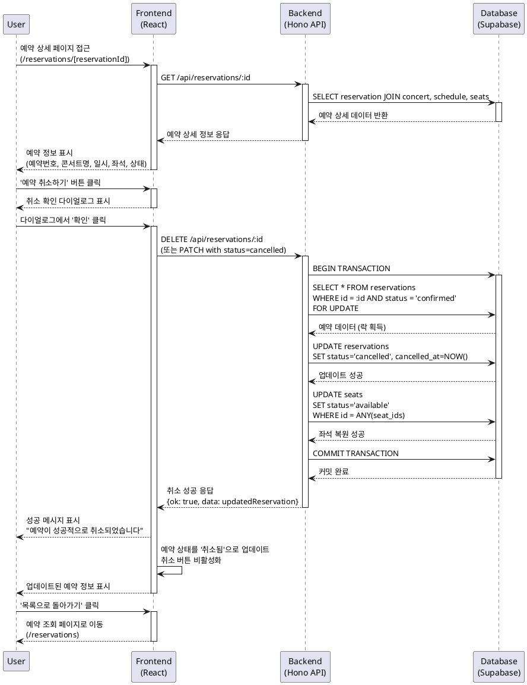

# 유스케이스 명세 #008: 예약 상세 페이지 - 예약 취소

## 1. 개요

### 유스케이스 ID
UC-008

### 유스케이스 명
예약 상세 조회 및 취소 처리

### 설명
사용자가 자신의 예약 상세 정보를 조회하고, 취소 정책에 따라 예약을 취소할 수 있는 기능입니다. 예약 취소 시 좌석 상태가 자동으로 복원되어 다른 사용자가 예매할 수 있도록 합니다.

### Primary Actor
콘서트 예매 사용자

### Precondition
- 사용자가 예약 조회 페이지에서 특정 예약을 선택했거나, 예약 상세 페이지 URL로 직접 접근
- 유효한 reservationId가 URL 파라미터로 제공됨
- 예약이 데이터베이스에 존재함

### Trigger
- 사용자가 예약 조회 페이지에서 특정 예약 카드 클릭
- 또는 예약 상세 페이지 URL로 직접 접근 (/reservations/[reservationId])

---

## 2. Main Scenario

### 시나리오: 예약 상세 조회 및 취소

#### Step 1: 예약 상세 페이지 진입
1. 사용자가 예약 상세 페이지에 접근
2. 시스템이 URL에서 reservationId 추출 및 유효성 검증
3. 데이터베이스에서 예약 정보 조회 (Reservation, Concert, Schedule, Seat 테이블 JOIN)
4. 예약 상태 확인 (confirmed/cancelled)
5. 취소 가능 여부 판단 (공연 시간 기준, 취소 정책 적용)

#### Step 2: 예약 정보 표시
1. 시스템이 예약 상세 정보 화면에 표시:
   - 예약 번호 (UUID)
   - 예약자 이름 및 연락처
   - 콘서트 정보 (제목, 포스터 이미지)
   - 관람 일시 (날짜, 시간)
   - 선택한 좌석 목록 (좌석번호, 등급, 가격)
   - 총 결제 금액
   - 예약 상태 (확정/취소)
   - 예약 생성 시간
   - 취소 시간 (취소된 경우)

2. 취소 가능 여부에 따라 UI 표시:
   - 취소 가능: '예약 취소하기' 버튼 활성화
   - 취소 불가: 취소 불가 사유 표시 및 버튼 비활성화

#### Step 3: 예약 취소 요청
1. 사용자가 '예약 취소하기' 버튼 클릭
2. 시스템이 취소 확인 다이얼로그 표시:
   - 취소 안내 메시지
   - 좌석 정보 요약
   - '확인' 및 '취소' 버튼

3. 사용자가 다이얼로그에서 선택:
   - **'확인' 선택 시**: Step 4로 진행
   - **'취소' 선택 시**: 다이얼로그 닫기, 원래 상태 유지

#### Step 4: 예약 취소 처리
1. 시스템이 최종 취소 가능 여부 재검증:
   - 예약 상태가 'confirmed'인지 확인
   - 공연 시간과 현재 시간 비교 (취소 가능 시간 내인지)

2. 트랜잭션 시작:
   ```sql
   BEGIN;
   -- Reservation 테이블 업데이트
   UPDATE reservations 
   SET status = 'cancelled', 
       cancelled_at = NOW(), 
       updated_at = NOW()
   WHERE id = $reservationId 
     AND status = 'confirmed';
   
   -- Seat 테이블 상태 복원
   UPDATE seats 
   SET status = 'available', 
       updated_at = NOW()
   WHERE id = ANY($seatIds);
   
   COMMIT;
   ```

3. 트랜잭션 커밋 성공 시:
   - 성공 메시지 표시 ("예약이 성공적으로 취소되었습니다.")
   - 예약 상태를 '취소됨'으로 화면 업데이트
   - '예약 취소하기' 버튼 비활성화
   - 취소 시간 표시

#### Step 5: 후속 액션
1. 사용자가 선택 가능한 액션:
   - '목록으로 돌아가기' 버튼 클릭 → 예약 조회 페이지로 이동
   - 브라우저 뒤로가기 → 이전 페이지로 이동

---

## 3. Edge Cases

### EC-1: 유효하지 않은 예약 ID
- **상황**: URL의 reservationId가 존재하지 않거나 잘못된 형식
- **처리**: 404 에러 페이지로 리다이렉트, "예약을 찾을 수 없습니다" 메시지 표시

### EC-2: 이미 취소된 예약
- **상황**: 사용자가 이미 취소된 예약의 상세 페이지에 접근
- **처리**: 
  - 예약 상태를 '취소됨'으로 명확히 표시
  - '예약 취소하기' 버튼 비활성화
  - 취소 시간 표시
  - "이미 취소된 예약입니다" 안내 메시지

### EC-3: 취소 불가능한 시간 (공연 임박)
- **상황**: 공연 시작 2시간 이내 취소 시도
- **처리**: 
  - '예약 취소하기' 버튼 비활성화
  - "공연 시작 2시간 전까지만 취소 가능합니다" 안내 메시지
  - 고객센터 연락처 제공

### EC-4: 동시 취소 요청 충돌
- **상황**: 동일 예약에 대해 여러 브라우저/탭에서 동시 취소 시도
- **처리**: 
  - 트랜잭션 격리로 하나의 요청만 성공 처리
  - 나머지 요청은 "이미 처리된 예약입니다" 메시지 표시
  - 페이지 자동 새로고침으로 최신 상태 반영

### EC-5: 네트워크 오류로 취소 처리 실패
- **상황**: 서버 통신 오류 또는 타임아웃 발생
- **처리**: 
  - "예약 취소 처리 중 오류가 발생했습니다" 메시지 표시
  - '다시 시도' 버튼 제공
  - 처리 상태 불명확 시 "처리 상태를 확인 중입니다" 메시지 표시
  - 자동 상태 재조회 수행

### EC-6: 데이터 로드 실패
- **상황**: 예약 정보 조회 중 데이터베이스 오류
- **처리**: 
  - 스켈레톤 UI에서 오류 메시지로 전환
  - "예약 정보를 불러오는 중 오류가 발생했습니다" 안내
  - '다시 시도' 및 '목록으로 돌아가기' 버튼 제공

### EC-7: 이미 지난 공연의 예약
- **상황**: 공연이 이미 종료된 예약 조회
- **처리**: 
  - 예약 정보 정상 표시
  - '예약 취소하기' 버튼 비활성화
  - "종료된 공연입니다" 안내 메시지

### EC-8: 트랜잭션 실패 (부분 업데이트)
- **상황**: 예약 취소 트랜잭션 중 일부 실패 (예: Seat 복원 실패)
- **처리**: 
  - 트랜잭션 ROLLBACK으로 원자성 보장
  - "예약 취소에 실패했습니다. 잠시 후 다시 시도해주세요" 메시지
  - 로그 기록 및 관리자 알림

---

## 4. Business Rules

### BR-1: 취소 가능 시간 제한
- 공연 시작 2시간 전까지만 예약 취소 가능
- 계산 로직: `schedule.date_time - NOW() >= INTERVAL '2 hours'`

### BR-2: 취소 가능 상태
- 예약 상태가 'confirmed'인 경우만 취소 가능
- 이미 취소된 예약('cancelled')은 재취소 불가

### BR-3: 좌석 상태 복원
- 예약 취소 시 관련된 모든 좌석의 상태를 'available'로 복원
- 좌석 복원은 예약 취소와 동일 트랜잭션 내에서 원자적으로 처리

### BR-4: 데이터 일관성 보장
- 예약 취소는 트랜잭션으로 처리되어 부분 실패 방지
- 취소 시간(cancelled_at) 자동 기록

### BR-5: 취소 내역 보존
- 취소된 예약은 삭제하지 않고 상태만 변경
- 취소 이력 추적을 위해 cancelled_at 필드 활용

### BR-6: 동시성 제어
- 동일 예약에 대한 동시 취소 요청 시 첫 번째 요청만 처리
- 낙관적 락 또는 비관적 락을 활용한 동시성 제어

---

## 5. Sequence Diagram



---

## 6. Alternative Flows

### AF-1: 취소 확인 다이얼로그에서 '취소' 선택
1. 사용자가 '예약 취소하기' 버튼 클릭
2. 취소 확인 다이얼로그 표시
3. 사용자가 '취소' 버튼 클릭
4. 다이얼로그 닫기, 원래 상태 유지 (Step 3로 복귀)

### AF-2: 이미 취소된 예약 접근
1. 페이지 로드 시 예약 상태가 'cancelled'임을 확인
2. 취소된 상태로 정보 표시
3. '예약 취소하기' 버튼 비활성화 및 회색 처리
4. "이미 취소된 예약입니다" 배지 표시
5. 취소 시간 정보 표시

### AF-3: 취소 불가능 시간대 (공연 임박)
1. 페이지 로드 시 취소 가능 여부 검증
2. 공연 시작까지 2시간 미만 남음을 확인
3. '예약 취소하기' 버튼 비활성화
4. "공연 시작 2시간 전까지만 취소 가능합니다" 안내 메시지
5. "긴급 문의: 고객센터 1234-5678" 연락처 정보 제공

---

## 7. UI/UX 고려사항

### 7.1 정보 계층 구조
1. **최상단**: 예약 번호 및 상태 배지
2. **콘서트 정보**: 포스터 이미지, 제목
3. **예약 상세**: 관람 일시, 좌석 정보, 예약자 정보
4. **액션 버튼**: 취소하기, 목록으로

### 7.2 상태별 시각적 구분
- **확정 상태**: 초록색 배지, 활성화된 취소 버튼
- **취소 상태**: 회색 배지, 비활성화된 버튼, 취소 시간 표시
- **취소 불가**: 주황색 경고 메시지, 비활성화된 버튼

### 7.3 반응형 디자인
- 모바일: 단일 컬럼, 풀스크린 다이얼로그
- 데스크톱: 중앙 정렬 카드, 센터 모달 다이얼로그

### 7.4 로딩 및 에러 상태
- 로딩 중: 스켈레톤 UI로 레이아웃 구조 유지
- 에러 발생: 명확한 에러 메시지 및 복구 옵션
- 취소 처리 중: 버튼 로딩 인디케이터, 전체 페이지 비활성화

---

## 8. 성능 요구사항

### 8.1 응답 시간
- 예약 상세 조회: 500ms 이내
- 예약 취소 처리: 1초 이내
- 트랜잭션 완료: 2초 이내

### 8.2 동시성 처리
- 동일 예약에 대한 동시 취소 요청 처리 가능
- 트랜잭션 격리 수준: READ COMMITTED 이상

### 8.3 오류 복구
- 트랜잭션 실패 시 자동 ROLLBACK
- 네트워크 오류 시 자동 재시도 (최대 3회)
- 부분 실패 방지를 위한 원자적 처리

---

## 9. 데이터 검증

### 9.1 입력 검증
- reservationId: UUID 형식 검증
- 예약 존재 여부 확인
- 예약 상태 확인 (confirmed 여부)

### 9.2 비즈니스 로직 검증
- 취소 가능 시간 검증 (공연 2시간 전)
- 예약 소유권 검증 (선택사항: 인증된 사용자의 경우)
- 좌석 상태 일관성 검증

### 9.3 출력 검증
- 모든 JOIN 데이터 존재 여부 확인
- NULL 체크 및 기본값 처리
- 날짜/시간 형식 변환 검증

---

## 10. 보안 고려사항

### 10.1 권한 제어
- 예약 번호만으로 접근 가능 (현재 인증 없음)
- 추후 인증 구현 시: 예약 소유자만 취소 가능

### 10.2 입력 검증
- SQL Injection 방지: Prepared Statement 사용
- XSS 방지: 사용자 입력 데이터 이스케이핑

### 10.3 동시성 공격 방지
- Rate Limiting: 동일 IP에서 과도한 취소 요청 제한
- CSRF 토큰: 폼 제출 시 CSRF 검증

---

## 11. 테스트 시나리오

### TS-1: 정상 취소 플로우
1. 유효한 예약 ID로 페이지 접근
2. 예약 정보 정상 표시 확인
3. '예약 취소하기' 버튼 클릭
4. 확인 다이얼로그에서 '확인' 클릭
5. 취소 성공 메시지 확인
6. 예약 상태가 '취소됨'으로 변경 확인
7. 데이터베이스에서 좌석 상태 'available' 복원 확인

### TS-2: 이미 취소된 예약
1. 취소된 예약 ID로 페이지 접근
2. 상태 배지 '취소됨' 표시 확인
3. '예약 취소하기' 버튼 비활성화 확인
4. 취소 시간 표시 확인

### TS-3: 취소 불가능 시간 (공연 임박)
1. 공연 시작 1시간 전 예약으로 페이지 접근
2. '예약 취소하기' 버튼 비활성화 확인
3. 취소 불가 안내 메시지 표시 확인
4. 고객센터 연락처 표시 확인

### TS-4: 동시 취소 요청
1. 동일 예약 ID로 두 개의 브라우저 탭에서 동시 접근
2. 두 탭에서 동시에 취소 버튼 클릭
3. 하나의 요청만 성공 확인
4. 다른 요청은 "이미 처리된 예약" 메시지 확인

### TS-5: 네트워크 오류 처리
1. 네트워크 차단 상태에서 취소 시도
2. 오류 메시지 표시 확인
3. '다시 시도' 버튼 확인
4. 네트워크 복구 후 재시도 성공 확인

---

## 12. 개선 사항 (추후 고려)

### 12.1 환불 정책 통합
- 취소 시점에 따른 환불 금액 자동 계산
- 환불 예정 금액 사전 안내

### 12.2 취소 사유 수집
- 선택형 취소 사유 입력 (선택사항)
- 취소 패턴 분석을 위한 데이터 수집

### 12.3 알림 시스템
- 이메일/SMS를 통한 취소 확인 알림
- 좌석 복원 시 대기자에게 알림

### 12.4 부분 취소 기능
- 여러 좌석 중 일부만 취소 가능
- 차액 환불 처리

### 12.5 취소 내역 조회
- 사용자의 전체 취소 내역 조회
- 취소 패턴 분석 및 통계

