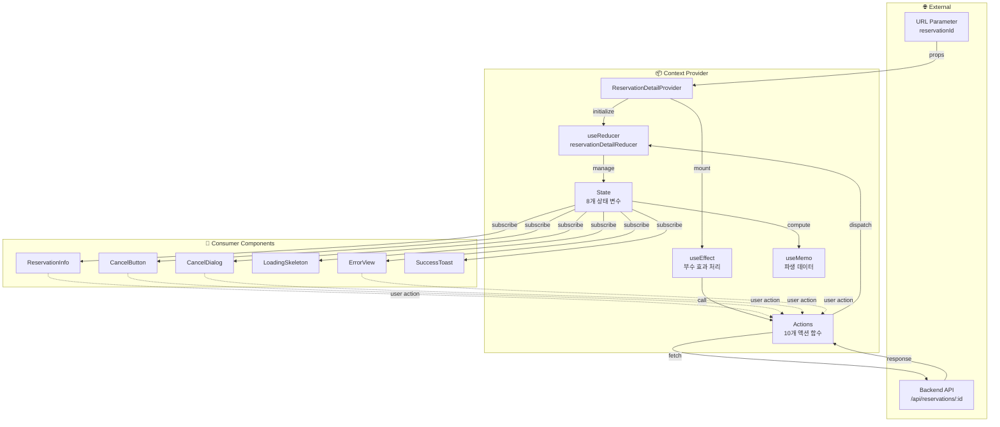
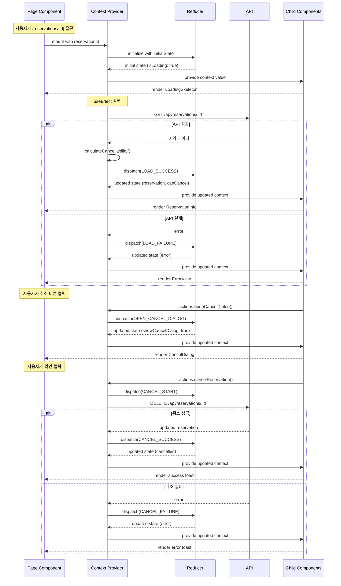
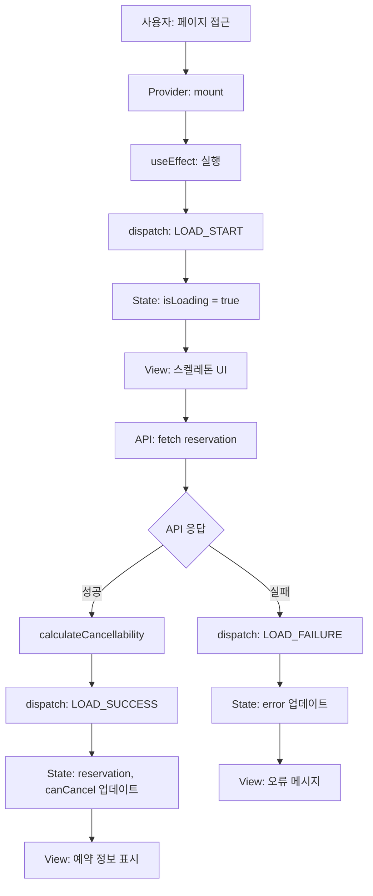
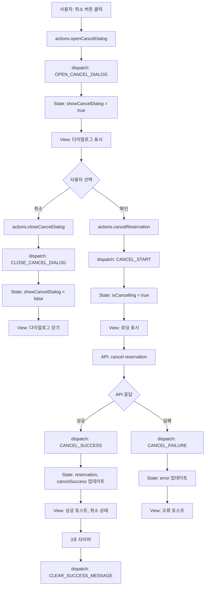
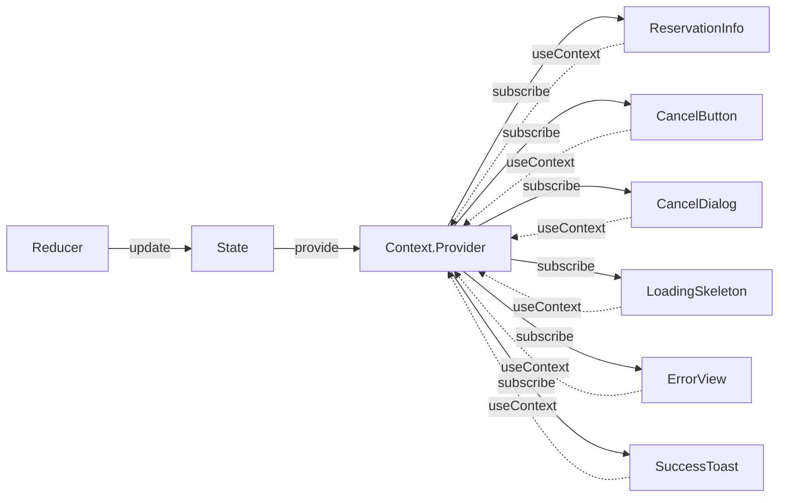

# 상태 관리 설계: 예약 상세 페이지 - Context + useReducer

## 문서 정보
- **기능 ID**: STATE-MGMT-008
- **기능 명**: 예약 상세 페이지 상태 관리 종합 설계
- **관련 문서**: 
  - 요구사항: `/docs/pages/008/requirement.md`
  - 유스케이스: `/docs/pages/008/spec.md`
  - 상태 정의: `/docs/pages/008/state-definition.md`
  - Flux 패턴: `/docs/pages/008/flux-pattern.md`
- **작성일**: 2025-10-15
- **버전**: 1.0

---

## 목차
1. [개요](#1-개요)
2. [Context 아키텍처](#2-context-아키텍처)
3. [상태 정의](#3-상태-정의)
4. [데이터 흐름](#4-데이터-흐름)
5. [Context API 인터페이스](#5-context-api-인터페이스)
6. [하위 컴포넌트 구조](#6-하위-컴포넌트-구조)
7. [성능 최적화](#7-성능-최적화)

---

## 1. 개요

### 1.1. 목적
예약 상세 페이지의 상태를 Context + useReducer 패턴으로 관리하여 예측 가능하고 유지보수하기 쉬운 코드를 작성합니다.

### 1.2. 상태 관리 전략
- **패턴**: Context API + Flux 단방향 데이터 흐름
- **구현**: React Context + useReducer 훅
- **최적화**: useMemo, useCallback 활용
- **타입 안전성**: TypeScript 완전 지원

### 1.3. 설계 원칙
1. **단일 Context**: 모든 예약 상세 상태를 하나의 Context에서 관리
2. **중앙집중식 상태**: useReducer로 모든 상태 변경을 한 곳에서 처리
3. **명확한 인터페이스**: 하위 컴포넌트에 노출할 API를 명확히 정의
4. **성능 최적화**: 불필요한 리렌더링 방지
5. **테스트 용이성**: Context를 독립적으로 테스트 가능

---

## 2. Context 아키텍처

### 2.1. 전체 아키텍처 다이어그램

```
┌──────────────────────────────────────────────────────────────┐
│                     Page Component                            │
│                  (/reservations/[id])                         │
└─────────────────────────┬────────────────────────────────────┘
                          │
                          ▼
┌──────────────────────────────────────────────────────────────┐
│              ReservationDetailProvider                        │
│                  (Context Provider)                           │
│                                                               │
│  ┌─────────────────────────────────────────────────────┐    │
│  │              useReducer                              │    │
│  │  - State: ReservationDetailState (8개 상태)          │    │
│  │  - Reducer: reservationDetailReducer                 │    │
│  │  - Actions: 10개 액션 타입                           │    │
│  └─────────────────────────────────────────────────────┘    │
│                                                               │
│  ┌─────────────────────────────────────────────────────┐    │
│  │          API 호출 및 비즈니스 로직                    │    │
│  │  - loadReservation()                                 │    │
│  │  - cancelReservation()                               │    │
│  │  - calculateCancellability()                         │    │
│  └─────────────────────────────────────────────────────┘    │
│                                                               │
│  ┌─────────────────────────────────────────────────────┐    │
│  │          노출 API (Context Value)                     │    │
│  │  - state: 전체 상태 객체                             │    │
│  │  - actions: 액션 함수들                              │    │
│  │  - derived: 파생 데이터                              │    │
│  └─────────────────────────────────────────────────────┘    │
└────────────────────────┬─────────────────────────────────────┘
                         │
                         ▼
┌──────────────────────────────────────────────────────────────┐
│                  Child Components                             │
│  - ReservationInfo                                            │
│  - CancelButton                                               │
│  - CancelDialog                                               │
│  - LoadingSkeleton                                            │
│  - ErrorView                                                  │
│  - SuccessToast                                               │
└──────────────────────────────────────────────────────────────┘
```

---

### 2.2. Context 데이터 흐름 시각화



---

### 2.3. Context 생명주기



---

## 3. 상태 정의

### 3.1. 전체 상태 구조

```typescript
type ReservationDetailState = {
  // 예약 정보
  reservation: ReservationDetail | null;
  
  // 취소 가능 여부
  canCancel: boolean;
  cancelReason: string | null;
  
  // UI 상태
  isLoading: boolean;
  error: string | null;
  showCancelDialog: boolean;
  isCancelling: boolean;
  cancelSuccess: boolean;
};
```

### 3.2. 상태별 설명

| 상태 | 타입 | 초기값 | 설명 |
|-----|------|-------|------|
| `reservation` | `ReservationDetail \| null` | `null` | 예약 상세 정보 (콘서트, 일정, 좌석) |
| `canCancel` | `boolean` | `false` | 취소 가능 여부 (계산됨) |
| `cancelReason` | `string \| null` | `null` | 취소 불가 사유 |
| `isLoading` | `boolean` | `true` | 조회 로딩 상태 |
| `error` | `string \| null` | `null` | 조회/취소 오류 메시지 |
| `showCancelDialog` | `boolean` | `false` | 취소 다이얼로그 표시 여부 |
| `isCancelling` | `boolean` | `false` | 취소 처리 중 여부 |
| `cancelSuccess` | `boolean` | `false` | 취소 성공 여부 (토스트용) |

---

## 4. 데이터 흐름

### 4.1. 예약 조회 흐름



---

### 4.2. 예약 취소 흐름



---

### 4.3. 상태 전파 흐름



---

## 5. Context API 인터페이스

### 5.1. Provider Props

```typescript
interface ReservationDetailProviderProps {
  children: React.ReactNode;
  reservationId: string;
}
```

---

### 5.2. Context Value 구조

```typescript
interface ReservationDetailContextValue {
  // 상태
  state: ReservationDetailState;
  
  // 액션 함수
  actions: {
    openCancelDialog: () => void;
    closeCancelDialog: () => void;
    cancelReservation: () => Promise<void>;
    retry: () => void;
  };
  
  // 파생 데이터
  derived: {
    isCancelled: boolean;
    isConfirmed: boolean;
    showCancelButton: boolean;
    isCancelButtonDisabled: boolean;
    showSuccessToast: boolean;
    formattedData: {
      scheduleDateTime: string;
      createdAt: string;
      cancelledAt: string | null;
      totalPrice: string;
      seatsSummary: string;
    } | null;
  };
}
```

---

### 5.3. 노출 변수 목록

#### 5.3.1. state (8개)

| 변수 | 타입 | 설명 |
|-----|------|------|
| `state.reservation` | `ReservationDetail \| null` | 예약 상세 정보 |
| `state.canCancel` | `boolean` | 취소 가능 여부 |
| `state.cancelReason` | `string \| null` | 취소 불가 사유 |
| `state.isLoading` | `boolean` | 조회 로딩 상태 |
| `state.error` | `string \| null` | 오류 메시지 |
| `state.showCancelDialog` | `boolean` | 다이얼로그 표시 |
| `state.isCancelling` | `boolean` | 취소 처리 중 |
| `state.cancelSuccess` | `boolean` | 취소 성공 여부 |

---

#### 5.3.2. actions (4개)

| 함수 | 시그니처 | 설명 |
|-----|---------|------|
| `actions.openCancelDialog` | `() => void` | 취소 다이얼로그 열기 |
| `actions.closeCancelDialog` | `() => void` | 취소 다이얼로그 닫기 |
| `actions.cancelReservation` | `() => Promise<void>` | 예약 취소 실행 |
| `actions.retry` | `() => void` | 예약 조회 재시도 |

---

#### 5.3.3. derived (6개 + formattedData)

| 변수 | 타입 | 설명 |
|-----|------|------|
| `derived.isCancelled` | `boolean` | 취소된 예약 여부 |
| `derived.isConfirmed` | `boolean` | 확정된 예약 여부 |
| `derived.showCancelButton` | `boolean` | 취소 버튼 표시 여부 |
| `derived.isCancelButtonDisabled` | `boolean` | 취소 버튼 비활성화 |
| `derived.showSuccessToast` | `boolean` | 성공 토스트 표시 |
| `derived.formattedData` | `object \| null` | 형식화된 표시 데이터 |

**formattedData 상세**
- `scheduleDateTime`: 형식화된 공연 일시
- `createdAt`: 형식화된 예약 일시
- `cancelledAt`: 형식화된 취소 일시
- `totalPrice`: 형식화된 총 금액
- `seatsSummary`: 좌석 요약 (예: "A01, A02 (2석)")

---

### 5.4. Context 사용 Hook

```typescript
function useReservationDetail(): ReservationDetailContextValue {
  const context = useContext(ReservationDetailContext);
  
  if (!context) {
    throw new Error(
      'useReservationDetail must be used within ReservationDetailProvider'
    );
  }
  
  return context;
}
```

---

## 6. 하위 컴포넌트 구조

### 6.1. 컴포넌트 트리

```
ReservationDetailPage
  └─ ReservationDetailProvider
      ├─ LoadingSkeleton (state.isLoading === true)
      ├─ ErrorView (state.error !== null)
      └─ ReservationContent (정상 상태)
          ├─ SuccessToast (derived.showSuccessToast === true)
          ├─ ReservationHeader
          │   ├─ ReservationId
          │   └─ StatusBadge
          ├─ ConcertSection
          │   ├─ PosterImage
          │   └─ ConcertTitle
          ├─ CustomerInfoSection
          │   ├─ CustomerName
          │   ├─ CustomerPhone
          │   └─ CustomerEmail
          ├─ ScheduleInfoSection
          │   └─ ScheduleDateTime
          ├─ SeatsSection
          │   └─ SeatList
          │       └─ SeatItem (여러 개)
          ├─ PaymentSection
          │   ├─ TotalPrice
          │   ├─ CreatedAt
          │   └─ CancelledAt (취소된 경우만)
          ├─ CancelWarning (state.cancelReason !== null)
          ├─ CancelButton
          └─ CancelDialog (state.showCancelDialog === true)
```

---

### 6.2. 컴포넌트별 사용 API

#### 6.2.1. LoadingSkeleton
```typescript
// 사용하는 상태
const { state } = useReservationDetail();
// - state.isLoading

// 렌더링 조건
if (state.isLoading) return <LoadingSkeleton />;
```

---

#### 6.2.2. ErrorView
```typescript
// 사용하는 상태 및 액션
const { state, actions } = useReservationDetail();
// - state.error
// - actions.retry

// 렌더링 조건
if (state.error) return <ErrorView />;

// 사용 예시
<ErrorView
  error={state.error}
  onRetry={actions.retry}
/>
```

---

#### 6.2.3. ReservationHeader
```typescript
// 사용하는 상태 및 파생 데이터
const { state, derived } = useReservationDetail();
// - state.reservation.id
// - state.reservation.status
// - derived.isCancelled

// 사용 예시
<ReservationHeader
  reservationId={state.reservation.id}
  status={state.reservation.status}
  isCancelled={derived.isCancelled}
/>
```

---

#### 6.2.4. ConcertSection
```typescript
// 사용하는 상태
const { state } = useReservationDetail();
// - state.reservation.concert.posterImageUrl
// - state.reservation.concert.title

// 사용 예시
<ConcertSection
  posterUrl={state.reservation.concert.posterImageUrl}
  title={state.reservation.concert.title}
/>
```

---

#### 6.2.5. CustomerInfoSection
```typescript
// 사용하는 상태
const { state } = useReservationDetail();
// - state.reservation.customerName
// - state.reservation.customerPhone
// - state.reservation.customerEmail

// 사용 예시
<CustomerInfoSection
  name={state.reservation.customerName}
  phone={state.reservation.customerPhone}
  email={state.reservation.customerEmail}
/>
```

---

#### 6.2.6. ScheduleInfoSection
```typescript
// 사용하는 파생 데이터
const { derived } = useReservationDetail();
// - derived.formattedData.scheduleDateTime

// 사용 예시
<ScheduleInfoSection
  dateTime={derived.formattedData.scheduleDateTime}
/>
```

---

#### 6.2.7. SeatsSection
```typescript
// 사용하는 상태 및 파생 데이터
const { state, derived } = useReservationDetail();
// - state.reservation.seats
// - derived.formattedData.seatsSummary

// 사용 예시
<SeatsSection
  seats={state.reservation.seats}
  summary={derived.formattedData.seatsSummary}
/>
```

---

#### 6.2.8. PaymentSection
```typescript
// 사용하는 파생 데이터
const { derived } = useReservationDetail();
// - derived.formattedData.totalPrice
// - derived.formattedData.createdAt
// - derived.formattedData.cancelledAt

// 사용 예시
<PaymentSection
  totalPrice={derived.formattedData.totalPrice}
  createdAt={derived.formattedData.createdAt}
  cancelledAt={derived.formattedData.cancelledAt}
/>
```

---

#### 6.2.9. CancelWarning
```typescript
// 사용하는 상태
const { state } = useReservationDetail();
// - state.canCancel
// - state.cancelReason

// 렌더링 조건
if (!state.canCancel && state.cancelReason) {
  return <CancelWarning reason={state.cancelReason} />;
}
```

---

#### 6.2.10. CancelButton
```typescript
// 사용하는 상태, 액션, 파생 데이터
const { state, actions, derived } = useReservationDetail();
// - state.canCancel
// - state.isCancelling
// - derived.isCancelButtonDisabled
// - actions.openCancelDialog

// 사용 예시
<CancelButton
  disabled={derived.isCancelButtonDisabled}
  isLoading={state.isCancelling}
  onClick={actions.openCancelDialog}
/>
```

---

#### 6.2.11. CancelDialog
```typescript
// 사용하는 상태 및 액션
const { state, actions, derived } = useReservationDetail();
// - state.showCancelDialog
// - state.reservation
// - derived.formattedData.seatsSummary
// - actions.cancelReservation
// - actions.closeCancelDialog

// 사용 예시
<CancelDialog
  open={state.showCancelDialog}
  reservation={state.reservation}
  seatsSummary={derived.formattedData.seatsSummary}
  onConfirm={actions.cancelReservation}
  onCancel={actions.closeCancelDialog}
/>
```

---

#### 6.2.12. SuccessToast
```typescript
// 사용하는 파생 데이터
const { derived } = useReservationDetail();
// - derived.showSuccessToast

// 렌더링 조건
if (derived.showSuccessToast) {
  return <SuccessToast message="예약이 성공적으로 취소되었습니다" />;
}
```

---

### 6.3. 컴포넌트별 책임 분리

| 컴포넌트 | 책임 | Context 의존도 |
|---------|------|--------------|
| **ReservationDetailPage** | Provider 래핑, 라우팅 | 없음 |
| **ReservationDetailProvider** | 상태 관리, API 호출 | Context 제공자 |
| **LoadingSkeleton** | 로딩 UI | 최소 (isLoading만) |
| **ErrorView** | 오류 UI | 최소 (error, retry만) |
| **ReservationHeader** | 예약 번호, 상태 표시 | 최소 |
| **ConcertSection** | 콘서트 정보 표시 | 최소 |
| **CustomerInfoSection** | 예약자 정보 표시 | 최소 |
| **ScheduleInfoSection** | 공연 일정 표시 | 최소 |
| **SeatsSection** | 좌석 정보 표시 | 최소 |
| **PaymentSection** | 결제 정보 표시 | 최소 |
| **CancelWarning** | 취소 불가 경고 | 최소 |
| **CancelButton** | 취소 버튼 UI | 중간 (상태 + 액션) |
| **CancelDialog** | 취소 확인 다이얼로그 | 중간 (상태 + 액션) |
| **SuccessToast** | 성공 메시지 표시 | 최소 |

---

## 7. 성능 최적화

### 7.1. Context 분리 전략

현재 설계는 단일 Context를 사용하지만, 필요시 다음과 같이 분리 가능:

```typescript
// Option 1: 단일 Context (현재 설계)
ReservationDetailContext
  - state, actions, derived 모두 포함
  - 장점: 간단한 구조, 관리 용이
  - 단점: 일부 상태 변경 시 모든 consumer 리렌더링

// Option 2: Context 분리 (성능 최적화 필요 시)
ReservationStateContext      // 읽기 전용 상태
ReservationActionsContext    // 액션 함수
ReservationDerivedContext    // 파생 데이터
```

---

### 7.2. 리렌더링 최적화

#### 7.2.1. useMemo로 파생 데이터 캐싱

```typescript
// Provider 내부
const derived = useMemo(() => ({
  isCancelled: state.reservation?.status === 'cancelled',
  isConfirmed: state.reservation?.status === 'confirmed',
  // ...
}), [
  state.reservation?.status,
  // 의존성 배열을 최소화
]);
```

---

#### 7.2.2. useCallback으로 액션 함수 캐싱

```typescript
// Provider 내부
const actions = useMemo(() => ({
  openCancelDialog: () => {
    if (!state.canCancel) return;
    dispatch(openCancelDialog());
  },
  
  closeCancelDialog: () => {
    dispatch(closeCancelDialog());
  },
  
  cancelReservation: async () => {
    // ...
  },
  
  retry: () => {
    loadReservation();
  },
}), [
  state.canCancel,
  reservationId,
  // 필요한 의존성만
]);
```

---

#### 7.2.3. Context Value 메모이제이션

```typescript
// Provider 내부
const contextValue = useMemo(() => ({
  state,
  actions,
  derived,
}), [state, actions, derived]);

return (
  <ReservationDetailContext.Provider value={contextValue}>
    {children}
  </ReservationDetailContext.Provider>
);
```

---

### 7.3. 컴포넌트 최적화

#### 7.3.1. React.memo 사용

```typescript
// 불필요한 리렌더링 방지
export const ReservationHeader = React.memo(({ 
  reservationId, 
  status, 
  isCancelled 
}) => {
  // ...
});

// 비교 함수 커스터마이징 (필요시)
export const SeatsSection = React.memo(
  ({ seats, summary }) => {
    // ...
  },
  (prevProps, nextProps) => {
    // seats 배열 길이만 비교 (내용은 무시)
    return prevProps.seats.length === nextProps.seats.length;
  }
);
```

---

#### 7.3.2. 선택적 Context 구독

```typescript
// 특정 값만 구독하는 custom hook
function useReservationStatus() {
  const { state } = useReservationDetail();
  return useMemo(() => ({
    status: state.reservation?.status,
    isCancelled: state.reservation?.status === 'cancelled',
  }), [state.reservation?.status]);
}

// 사용
function StatusBadge() {
  const { status, isCancelled } = useReservationStatus();
  // reservation의 다른 필드 변경 시 리렌더링 안됨
}
```

---

### 7.4. 성능 모니터링

```typescript
// Provider 내부에 성능 로깅 추가 (개발 환경)
useEffect(() => {
  if (process.env.NODE_ENV === 'development') {
    console.log('🔄 ReservationDetail State Changed:', {
      timestamp: new Date().toISOString(),
      state: {
        hasReservation: !!state.reservation,
        isLoading: state.isLoading,
        error: state.error,
        canCancel: state.canCancel,
      },
    });
  }
}, [state]);
```

---

## 8. 타입 정의 요약

### 8.1. State 타입

```typescript
type ReservationDetail = {
  id: string;
  status: 'confirmed' | 'cancelled';
  customerName: string;
  customerPhone: string;
  customerEmail: string | null;
  totalPrice: number;
  createdAt: string;
  cancelledAt: string | null;
  concert: {
    id: string;
    title: string;
    posterImageUrl: string;
    description: string | null;
  };
  schedule: {
    id: string;
    dateTime: string;
  };
  seats: Array<{
    id: string;
    seatNumber: string;
    grade: string;
    price: number;
    status: 'available' | 'reserved';
  }>;
};

type ReservationDetailState = {
  reservation: ReservationDetail | null;
  canCancel: boolean;
  cancelReason: string | null;
  isLoading: boolean;
  error: string | null;
  showCancelDialog: boolean;
  isCancelling: boolean;
  cancelSuccess: boolean;
};
```

---

### 8.2. Action 타입

```typescript
type ReservationDetailAction =
  | { type: 'LOAD_START' }
  | { 
      type: 'LOAD_SUCCESS'; 
      payload: {
        reservation: ReservationDetail;
        canCancel: boolean;
        cancelReason: string | null;
      };
    }
  | { type: 'LOAD_FAILURE'; payload: string }
  | { type: 'OPEN_CANCEL_DIALOG' }
  | { type: 'CLOSE_CANCEL_DIALOG' }
  | { type: 'CANCEL_START' }
  | { type: 'CANCEL_SUCCESS'; payload: ReservationDetail }
  | { type: 'CANCEL_FAILURE'; payload: string }
  | { type: 'CLEAR_SUCCESS_MESSAGE' }
  | { type: 'RESET_STATE' };
```

---

### 8.3. Context 타입

```typescript
interface ReservationDetailContextValue {
  state: ReservationDetailState;
  
  actions: {
    openCancelDialog: () => void;
    closeCancelDialog: () => void;
    cancelReservation: () => Promise<void>;
    retry: () => void;
  };
  
  derived: {
    isCancelled: boolean;
    isConfirmed: boolean;
    showCancelButton: boolean;
    isCancelButtonDisabled: boolean;
    showSuccessToast: boolean;
    formattedData: {
      scheduleDateTime: string;
      createdAt: string;
      cancelledAt: string | null;
      totalPrice: string;
      seatsSummary: string;
    } | null;
  };
}
```

---

## 9. 구현 체크리스트

### 9.1. Context 구현
- [ ] ReservationDetailContext 생성
- [ ] ReservationDetailProvider 구현
- [ ] useReservationDetail Hook 구현
- [ ] Initial State 정의
- [ ] Reducer 함수 구현 (10개 케이스)
- [ ] Action Creators 구현

### 9.2. 비즈니스 로직
- [ ] loadReservation 함수 (API 호출)
- [ ] cancelReservation 함수 (API 호출)
- [ ] calculateCancellability 함수 (취소 가능 여부)
- [ ] useEffect로 자동 조회 구현

### 9.3. 파생 데이터
- [ ] useMemo로 derived 계산
- [ ] 날짜/시간 포맷팅 함수
- [ ] 가격 포맷팅 함수
- [ ] 좌석 요약 생성 함수

### 9.4. 컴포넌트 통합
- [ ] Page Component에서 Provider 래핑
- [ ] 12개 하위 컴포넌트 구현
- [ ] 각 컴포넌트에서 useReservationDetail 사용
- [ ] Props 타입 정의

### 9.5. 성능 최적화
- [ ] Context Value 메모이제이션
- [ ] Actions 메모이제이션
- [ ] Derived 메모이제이션
- [ ] React.memo 적용 (필요한 컴포넌트)

### 9.6. 테스트
- [ ] Reducer 단위 테스트
- [ ] Provider 통합 테스트
- [ ] Hook 테스트
- [ ] 컴포넌트 렌더링 테스트

---

## 10. 요약

### 10.1. 핵심 설계 원칙

1. **단일 Context**: 모든 상태를 ReservationDetailContext에서 관리
2. **명확한 인터페이스**: state, actions, derived로 구분
3. **최소 의존성**: 각 컴포넌트는 필요한 데이터만 구독
4. **성능 최적화**: useMemo, useCallback으로 불필요한 리렌더링 방지
5. **타입 안전성**: TypeScript로 모든 인터페이스 정의

### 10.2. Context API 요약

| 카테고리 | 개수 | 내용 |
|---------|-----|------|
| **State** | 8개 | reservation, canCancel, cancelReason, isLoading, error, showCancelDialog, isCancelling, cancelSuccess |
| **Actions** | 4개 | openCancelDialog, closeCancelDialog, cancelReservation, retry |
| **Derived** | 6개 + 1개 객체 | isCancelled, isConfirmed, showCancelButton, isCancelButtonDisabled, showSuccessToast, formattedData |
| **Components** | 12개 | LoadingSkeleton, ErrorView, ReservationHeader, ConcertSection, CustomerInfoSection, ScheduleInfoSection, SeatsSection, PaymentSection, CancelWarning, CancelButton, CancelDialog, SuccessToast |

### 10.3. 데이터 흐름 요약

```
URL Parameter (reservationId)
  ↓
Provider Mount
  ↓
useEffect → API Call
  ↓
Reducer → State Update
  ↓
Context Value Update
  ↓
Consumer Components Re-render
  ↓
User Interaction
  ↓
Actions Dispatch
  ↓
Reducer → State Update
  ↓
(순환)
```

---

이 설계를 기반으로 Context + useReducer 패턴을 구현하면, 예약 상세 페이지의 복잡한 상태와 비즈니스 로직을 효과적으로 관리할 수 있습니다.

