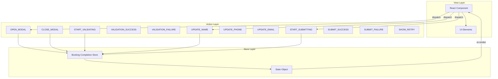
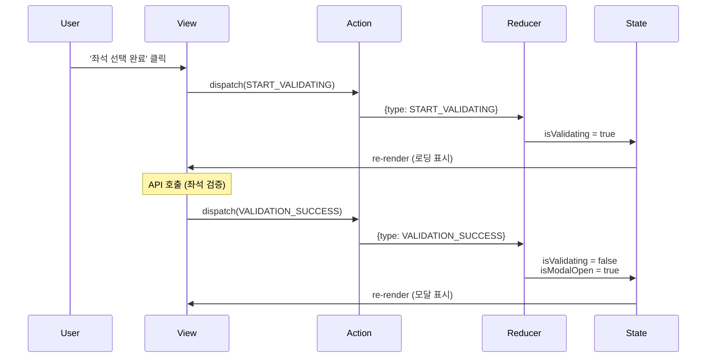
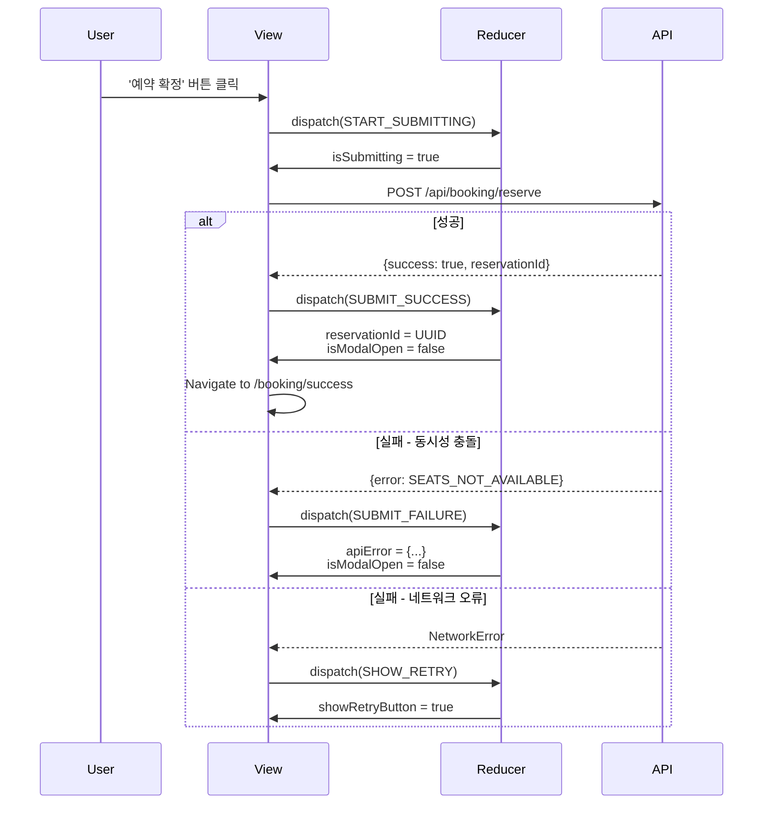
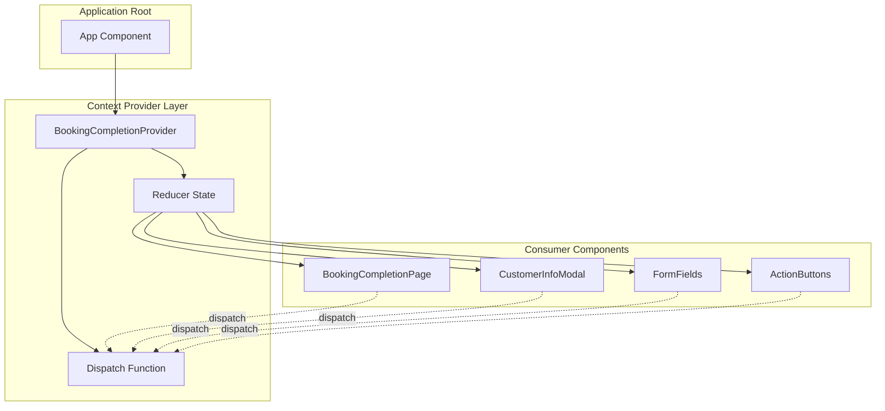
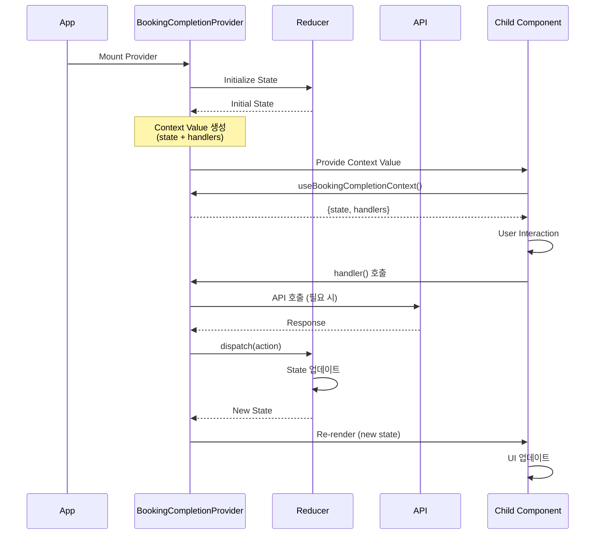
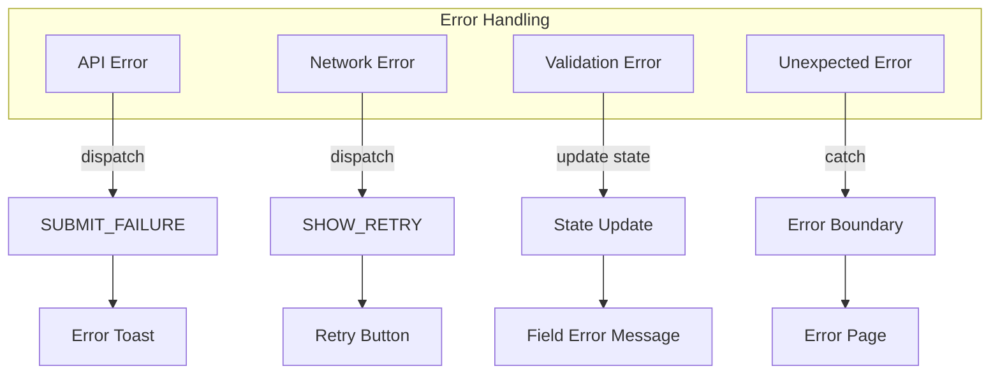

# 콘서트 예매 시스템 상태 관리 설계

## 📑 목차

1. [개요](#1-개요)
2. [상태 정의](#2-상태-정의)
3. [Flux 패턴 설계](#3-flux-패턴-설계)
4. [Context + useReducer 설계](#4-context--usereducer-설계)
5. [구현 가이드](#5-구현-가이드)

---

## 1. 개요

### 1.1. 목적

본 문서는 콘서트 예매 시스템의 **유저플로우 #5: 예약 완료 처리 (고객 정보 입력 및 예약 확정)** 기능에 대한 전체 상태 관리 설계를 정의합니다.

### 1.2. 아키텍처 선택

- **패턴**: Flux 패턴 (단방향 데이터 흐름)
- **구현**: Context API + useReducer
- **타입 시스템**: TypeScript

### 1.3. 설계 원칙

1. **예측 가능성**: 모든 상태 변경은 명시적 Action을 통해서만 발생
2. **테스트 가능성**: 순수 함수 Reducer로 테스트 용이
3. **확장 가능성**: 새로운 상태/액션 추가 용이
4. **성능**: 불필요한 리렌더링 최소화
5. **타입 안정성**: 모든 상태와 액션에 TypeScript 타입 적용

---

## 2. 상태 정의

### 2.1. 관리해야 할 상태 데이터 목록 (총 16개)

#### 2.1.1. UI 상태 (UI State) - 4개

| 상태 이름 | 타입 | 초기값 | 설명 |
|----------|------|--------|------|
| `isModalOpen` | boolean | false | 고객 정보 입력 모달 표시 여부 |
| `isValidating` | boolean | false | 좌석 유효성 검증 진행 중 여부 |
| `isSubmitting` | boolean | false | 예약 확정 처리 진행 중 여부 |
| `showRetryButton` | boolean | false | 네트워크 오류 시 재시도 버튼 표시 여부 |

#### 2.1.2. 폼 입력 상태 (Form Input State) - 3개

| 상태 이름 | 타입 | 초기값 | 설명 |
|----------|------|--------|------|
| `customerName` | string | "" | 예약자 이름 입력값 |
| `phoneNumber` | string | "" | 예약자 휴대폰 번호 입력값 (010-XXXX-XXXX) |
| `email` | string | "" | 예약자 이메일 입력값 (선택) |

#### 2.1.3. 폼 검증 상태 (Form Validation State) - 6개

| 상태 이름 | 타입 | 초기값 | 설명 |
|----------|------|--------|------|
| `nameError` | string \| null | null | 이름 필드 오류 메시지 |
| `phoneError` | string \| null | null | 휴대폰 번호 필드 오류 메시지 |
| `emailError` | string \| null | null | 이메일 필드 오류 메시지 |
| `isNameValid` | boolean | false | 이름 유효성 검증 통과 여부 |
| `isPhoneValid` | boolean | false | 휴대폰 번호 유효성 검증 통과 여부 |
| `isEmailValid` | boolean | true | 이메일 유효성 검증 통과 여부 (선택이므로 기본 true) |

#### 2.1.4. 오류 상태 (Error State) - 2개

| 상태 이름 | 타입 | 초기값 | 설명 |
|----------|------|--------|------|
| `apiError` | object \| null | null | API 오류 정보 `{ code, message }` |
| `validationError` | string \| null | null | 좌석 유효성 검증 오류 메시지 |

#### 2.1.5. 예약 결과 상태 (Reservation Result State) - 1개

| 상태 이름 | 타입 | 초기값 | 설명 |
|----------|------|--------|------|
| `reservationId` | string \| null | null | 생성된 예약 ID (UUID) |

### 2.2. 파생 데이터 (Derived Data)

화면에 보여지지만 다른 상태로부터 **계산되는 값**들로, 별도의 상태로 관리하지 않습니다.

| 데이터 이름 | 계산 방법 | 설명 |
|------------|----------|------|
| `selectedSeats` | context/props로부터 전달 | 이전 단계에서 선택된 좌석 목록 |
| `totalPrice` | `selectedSeats.reduce((sum, seat) => sum + seat.price, 0)` | 선택된 좌석 가격의 합계 |
| `seatCount` | `selectedSeats.length` | 선택된 좌석 개수 |
| `isCompleteButtonEnabled` | `seatCount > 0` | '좌석 선택 완료' 버튼 활성화 여부 |
| `isReserveButtonEnabled` | `isNameValid && isPhoneValid && isEmailValid && !isSubmitting` | '예약 확정' 버튼 활성화 여부 |
| `formattedPhoneNumber` | `phoneNumber.replace(/(\d{3})(\d{4})(\d{4})/, '$1-$2-$3')` | 자동 포맷팅된 휴대폰 번호 |

### 2.3. State Interface (TypeScript)

```typescript
/**
 * 예약 완료 처리의 전체 상태를 정의하는 인터페이스
 */
interface BookingCompletionState {
  // UI 상태
  isModalOpen: boolean;
  isValidating: boolean;
  isSubmitting: boolean;
  showRetryButton: boolean;
  
  // 폼 입력 상태
  customerName: string;
  phoneNumber: string;
  email: string;
  
  // 폼 검증 상태
  nameError: string | null;
  phoneError: string | null;
  emailError: string | null;
  isNameValid: boolean;
  isPhoneValid: boolean;
  isEmailValid: boolean;
  
  // 오류 상태
  apiError: { code: string; message: string } | null;
  validationError: string | null;
  
  // 예약 결과
  reservationId: string | null;
}

// 초기 상태
const initialState: BookingCompletionState = {
  isModalOpen: false,
  isValidating: false,
  isSubmitting: false,
  showRetryButton: false,
  customerName: '',
  phoneNumber: '',
  email: '',
  nameError: null,
  phoneError: null,
  emailError: null,
  isNameValid: false,
  isPhoneValid: false,
  isEmailValid: true,
  apiError: null,
  validationError: null,
  reservationId: null,
};
```

---

## 3. Flux 패턴 설계

### 3.1. Flux 패턴 개요

```
Action → Dispatcher (Reducer) → Store (State) → View → Action (순환)
```

### 3.2. 전체 상태 흐름



### 3.3. Action Types (16개)

```typescript
const ActionTypes = {
  // 모달 관련 (2개)
  OPEN_MODAL: 'OPEN_MODAL',
  CLOSE_MODAL: 'CLOSE_MODAL',
  
  // 좌석 검증 관련 (3개)
  START_VALIDATING: 'START_VALIDATING',
  VALIDATION_SUCCESS: 'VALIDATION_SUCCESS',
  VALIDATION_FAILURE: 'VALIDATION_FAILURE',
  
  // 폼 입력 관련 (3개)
  UPDATE_NAME: 'UPDATE_NAME',
  UPDATE_PHONE: 'UPDATE_PHONE',
  UPDATE_EMAIL: 'UPDATE_EMAIL',
  
  // 폼 검증 관련 (3개)
  VALIDATE_NAME: 'VALIDATE_NAME',
  VALIDATE_PHONE: 'VALIDATE_PHONE',
  VALIDATE_EMAIL: 'VALIDATE_EMAIL',
  
  // 예약 확정 관련 (3개)
  START_SUBMITTING: 'START_SUBMITTING',
  SUBMIT_SUCCESS: 'SUBMIT_SUCCESS',
  SUBMIT_FAILURE: 'SUBMIT_FAILURE',
  
  // 오류 처리 관련 (2개)
  SHOW_RETRY: 'SHOW_RETRY',
  CLEAR_ERROR: 'CLEAR_ERROR',
  
  // 폼 초기화 (1개)
  RESET_FORM: 'RESET_FORM',
} as const;
```

### 3.4. 주요 시퀀스 다이어그램

#### 3.4.1. 모달 열기/닫기 흐름



#### 3.4.2. 예약 확정 흐름



### 3.5. Reducer 구현 개요

```typescript
function bookingCompletionReducer(
  state: BookingCompletionState,
  action: BookingCompletionAction
): BookingCompletionState {
  switch (action.type) {
    case ActionTypes.OPEN_MODAL:
      return { ...state, isModalOpen: true };
    
    case ActionTypes.CLOSE_MODAL:
      return { ...initialState }; // 전체 초기화
    
    case ActionTypes.START_VALIDATING:
      return { ...state, isValidating: true, validationError: null };
    
    case ActionTypes.VALIDATION_SUCCESS:
      return { ...state, isValidating: false, isModalOpen: true };
    
    case ActionTypes.UPDATE_NAME: {
      const { value } = action.payload;
      const validation = validators.validateName(value);
      return {
        ...state,
        customerName: value,
        nameError: validation.error,
        isNameValid: validation.isValid,
      };
    }
    
    case ActionTypes.UPDATE_PHONE: {
      const { value } = action.payload;
      const formattedValue = validators.formatPhone(value);
      const validation = validators.validatePhone(formattedValue);
      return {
        ...state,
        phoneNumber: formattedValue,
        phoneError: validation.error,
        isPhoneValid: validation.isValid,
      };
    }
    
    case ActionTypes.START_SUBMITTING:
      return { ...state, isSubmitting: true, apiError: null };
    
    case ActionTypes.SUBMIT_SUCCESS:
      return {
        ...state,
        isSubmitting: false,
        reservationId: action.payload.reservationId,
        isModalOpen: false,
      };
    
    case ActionTypes.SUBMIT_FAILURE:
      return {
        ...state,
        isSubmitting: false,
        apiError: action.payload.error,
        isModalOpen: action.payload.error.code === 'SEATS_NOT_AVAILABLE' 
          ? false 
          : state.isModalOpen,
      };
    
    case ActionTypes.SHOW_RETRY:
      return {
        ...state,
        isSubmitting: false,
        showRetryButton: true,
        apiError: {
          code: 'NETWORK_ERROR',
          message: '예약 처리 중 오류가 발생했습니다. 다시 시도해주세요',
        },
      };
    
    default:
      return state;
  }
}
```

---

## 4. Context + useReducer 설계

### 4.1. 아키텍처 개요

```
Context Provider (데이터 소유)
    ↓ (provides)
Reducer (상태 변경 로직)
    ↓ (exposes)
Consumer Components (UI 렌더링)
```

### 4.2. Context Provider 계층 구조



### 4.3. 데이터 불러오기 및 관리 흐름



### 4.4. Context Value Interface

```typescript
/**
 * Context를 통해 하위 컴포넌트에 노출되는 값의 인터페이스
 */
interface BookingCompletionContextValue {
  // 상태 (읽기 전용)
  state: BookingCompletionState;
  
  // 파생 값 (Computed Values)
  isReserveButtonEnabled: boolean;
  isCompleteButtonEnabled: (seatCount: number) => boolean;
  
  // 모달 제어
  openModal: () => void;
  closeModal: () => void;
  
  // 좌석 검증
  handleCompleteSelection: (
    scheduleId: string,
    seatIds: string[]
  ) => Promise<void>;
  
  // 폼 입력 핸들러
  handleNameChange: (value: string) => void;
  handlePhoneChange: (value: string) => void;
  handleEmailChange: (value: string) => void;
  
  // 예약 확정
  handleReserve: (
    scheduleId: string,
    seatIds: string[]
  ) => Promise<void>;
  handleRetry: (
    scheduleId: string,
    seatIds: string[]
  ) => Promise<void>;
  
  // 유틸리티
  clearError: () => void;
  resetForm: () => void;
}
```

### 4.5. 노출되는 변수 및 함수 목록

#### 4.5.1. 상태 변수 (16개)

**UI 상태 (4개)**:
- `state.isModalOpen`, `state.isValidating`, `state.isSubmitting`, `state.showRetryButton`

**폼 입력 상태 (3개)**:
- `state.customerName`, `state.phoneNumber`, `state.email`

**폼 검증 상태 (6개)**:
- `state.nameError`, `state.phoneError`, `state.emailError`
- `state.isNameValid`, `state.isPhoneValid`, `state.isEmailValid`

**오류 상태 (2개)**:
- `state.apiError`, `state.validationError`

**예약 결과 (1개)**:
- `state.reservationId`

#### 4.5.2. 파생 값 (2개)

- `isReserveButtonEnabled`: `isNameValid && isPhoneValid && isEmailValid && !isSubmitting`
- `isCompleteButtonEnabled`: `(seatCount) => seatCount > 0`

#### 4.5.3. 핸들러 함수 (10개)

| 함수명 | 시그니처 | 설명 |
|--------|---------|------|
| `openModal` | `() => void` | 모달 열기 |
| `closeModal` | `() => void` | 모달 닫기 |
| `handleCompleteSelection` | `(scheduleId, seatIds) => Promise<void>` | 좌석 선택 완료 (검증) |
| `handleNameChange` | `(value: string) => void` | 이름 입력 |
| `handlePhoneChange` | `(value: string) => void` | 휴대폰 번호 입력 |
| `handleEmailChange` | `(value: string) => void` | 이메일 입력 |
| `handleReserve` | `(scheduleId, seatIds) => Promise<void>` | 예약 확정 |
| `handleRetry` | `(scheduleId, seatIds) => Promise<void>` | 재시도 |
| `clearError` | `() => void` | 오류 클리어 |
| `resetForm` | `() => void` | 폼 초기화 |

### 4.6. Provider 위치 (권장)

```typescript
// app/booking/layout.tsx (권장 위치)
function BookingLayout({ children }: { children: React.ReactNode }) {
  return (
    <BookingCompletionProvider>
      {children}
    </BookingCompletionProvider>
  );
}
```

**권장 이유**:
- 예약 플로우에만 제한적으로 제공
- 불필요한 전역 상태 방지
- 페이지 이동 시 상태 자동 초기화

### 4.7. Consumer Hook 사용법

```typescript
/**
 * Context를 사용하는 Custom Hook
 */
function useBookingCompletionContext(): BookingCompletionContextValue {
  const context = useContext(BookingCompletionContext);
  
  if (!context) {
    throw new Error(
      'useBookingCompletionContext must be used within BookingCompletionProvider'
    );
  }
  
  return context;
}
```

---

## 5. 구현 가이드

### 5.1. 컴포넌트별 사용 예시

#### 5.1.1. BookingInfoSection (예매 정보 섹션)

```typescript
function BookingInfoSection({ selectedSeats, scheduleId }) {
  const { 
    state, 
    handleCompleteSelection, 
    isCompleteButtonEnabled 
  } = useBookingCompletionContext();
  
  const seatIds = selectedSeats.map(s => s.id);
  const seatCount = selectedSeats.length;
  
  return (
    <div>
      {/* 좌석 목록 */}
      <button
        onClick={() => handleCompleteSelection(scheduleId, seatIds)}
        disabled={!isCompleteButtonEnabled(seatCount) || state.isValidating}
      >
        {state.isValidating ? '좌석 확인 중...' : '좌석 선택 완료'}
      </button>
    </div>
  );
}
```

#### 5.1.2. CustomerInfoModal (고객 정보 입력 모달)

```typescript
function CustomerInfoModal({ selectedSeats, scheduleId }) {
  const { 
    state, 
    closeModal, 
    handleReserve, 
    handleRetry,
    isReserveButtonEnabled 
  } = useBookingCompletionContext();
  
  const seatIds = selectedSeats.map(s => s.id);
  
  return (
    <Modal open={state.isModalOpen} onClose={closeModal}>
      {/* 폼 필드들 */}
      <button
        onClick={() => handleReserve(scheduleId, seatIds)}
        disabled={!isReserveButtonEnabled}
      >
        {state.isSubmitting ? '처리 중...' : '예약 확정'}
      </button>
      
      {state.showRetryButton && (
        <button onClick={() => handleRetry(scheduleId, seatIds)}>
          재시도
        </button>
      )}
    </Modal>
  );
}
```

#### 5.1.3. FormFields (입력 필드)

```typescript
function NameField() {
  const { 
    state, 
    handleNameChange 
  } = useBookingCompletionContext();
  
  return (
    <div>
      <input
        value={state.customerName}
        onChange={(e) => handleNameChange(e.target.value)}
        disabled={state.isSubmitting}
        className={
          state.nameError ? 'error' : 
          state.isNameValid ? 'success' : ''
        }
      />
      {state.nameError && (
        <span className="error-message">{state.nameError}</span>
      )}
      {state.isNameValid && <CheckIcon />}
    </div>
  );
}
```

### 5.2. 검증 유틸리티 함수

```typescript
const validators = {
  // 이름 검증 (2-50자, 한글/영문/공백만)
  validateName: (name: string): { isValid: boolean; error: string | null } => {
    if (name.length < 2) {
      return { isValid: false, error: '이름은 최소 2자 이상 입력해주세요' };
    }
    if (name.length > 50) {
      return { isValid: false, error: '이름은 최대 50자까지 입력 가능합니다' };
    }
    if (!/^[가-힣a-zA-Z\s]+$/.test(name)) {
      return { isValid: false, error: '이름은 한글, 영문, 공백만 입력 가능합니다' };
    }
    return { isValid: true, error: null };
  },
  
  // 휴대폰 번호 검증 (010-XXXX-XXXX)
  validatePhone: (phone: string): { isValid: boolean; error: string | null } => {
    if (!/^010-\d{4}-\d{4}$/.test(phone)) {
      return { isValid: false, error: '휴대폰 번호는 010-1234-5678 형식으로 입력해주세요' };
    }
    return { isValid: true, error: null };
  },
  
  // 이메일 검증
  validateEmail: (email: string): { isValid: boolean; error: string | null } => {
    if (email === '') {
      return { isValid: true, error: null }; // 선택 입력
    }
    if (!/^[^\s@]+@[^\s@]+\.[^\s@]+$/.test(email)) {
      return { isValid: false, error: '올바른 이메일 형식이 아닙니다' };
    }
    return { isValid: true, error: null };
  },
  
  // 휴대폰 번호 자동 포맷팅
  formatPhone: (value: string): string => {
    const numbers = value.replace(/\D/g, '');
    if (numbers.length <= 3) return numbers;
    if (numbers.length <= 7) return `${numbers.slice(0, 3)}-${numbers.slice(3)}`;
    return `${numbers.slice(0, 3)}-${numbers.slice(3, 7)}-${numbers.slice(7, 11)}`;
  },
};
```

### 5.3. 상태 초기화 전략

| 시점 | 대상 | 방법 |
|------|------|------|
| **모달 닫기** | 모든 폼 데이터 | `dispatch(CLOSE_MODAL)` → `initialState` |
| **예약 성공** | 모든 상태 | 자동 초기화 후 페이지 이동 |
| **Provider Unmount** | 모든 상태 | 자동 정리 |
| **페이지 이동** | 모든 상태 | Provider 재마운트로 자동 초기화 |

### 5.4. 성능 최적화

```typescript
// Context Value 메모이제이션
const contextValue = useMemo(
  () => ({
    state,
    isReserveButtonEnabled,
    isCompleteButtonEnabled,
    ...handlers,
  }),
  [state, isReserveButtonEnabled, handlers]
);

// Handler 메모이제이션
const handleNameChange = useCallback((value: string) => {
  dispatch(actionCreators.updateName(value));
}, []);
```

### 5.5. 에러 처리 전략



### 5.6. 테스트 가이드

#### 5.6.1. Reducer 단위 테스트

```typescript
describe('bookingCompletionReducer', () => {
  it('should update name and validate', () => {
    const state = initialState;
    const action = actionCreators.updateName('홍길동');
    const newState = bookingCompletionReducer(state, action);
    
    expect(newState.customerName).toBe('홍길동');
    expect(newState.isNameValid).toBe(true);
    expect(newState.nameError).toBeNull();
  });
});
```

#### 5.6.2. Context 통합 테스트

```typescript
describe('BookingCompletionProvider', () => {
  it('should provide context value', () => {
    const wrapper = ({ children }) => (
      <BookingCompletionProvider>{children}</BookingCompletionProvider>
    );
    
    const { result } = renderHook(
      () => useBookingCompletionContext(), 
      { wrapper }
    );
    
    expect(result.current.state).toBeDefined();
    expect(result.current.handleReserve).toBeDefined();
  });
});
```

---

## 6. 참고 자료

### 6.1. 관련 문서

- [요구사항 명세서](/docs/requirement.md)
- [유스케이스 명세](/docs/pages/005/spec.md)
- [유저플로우](/docs/userflow.md)
- [데이터베이스 설계](/docs/database.md)

### 6.2. 상세 설계 문서

- [상태 정의](/docs/pages/005/state-definition.md)
- [Flux 패턴](/docs/pages/005/flux-pattern.md)
- [Context 설계](/docs/pages/005/context-design.md)

### 6.3. 기술 문서

- [React useReducer](https://react.dev/reference/react/useReducer)
- [React Context](https://react.dev/reference/react/createContext)
- [TypeScript Handbook](https://www.typescriptlang.org/docs/)

---

## 부록: 빠른 참조

### A. Action Types 전체 목록

1. `OPEN_MODAL` - 모달 열기
2. `CLOSE_MODAL` - 모달 닫기
3. `START_VALIDATING` - 좌석 검증 시작
4. `VALIDATION_SUCCESS` - 좌석 검증 성공
5. `VALIDATION_FAILURE` - 좌석 검증 실패
6. `UPDATE_NAME` - 이름 입력
7. `UPDATE_PHONE` - 휴대폰 번호 입력
8. `UPDATE_EMAIL` - 이메일 입력
9. `VALIDATE_NAME` - 이름 검증
10. `VALIDATE_PHONE` - 휴대폰 번호 검증
11. `VALIDATE_EMAIL` - 이메일 검증
12. `START_SUBMITTING` - 예약 확정 시작
13. `SUBMIT_SUCCESS` - 예약 확정 성공
14. `SUBMIT_FAILURE` - 예약 확정 실패
15. `SHOW_RETRY` - 재시도 버튼 표시
16. `CLEAR_ERROR` - 오류 클리어
17. `RESET_FORM` - 폼 초기화

### B. 주요 검증 규칙

- **이름**: 2-50자, 한글/영문/공백만
- **휴대폰**: 010-XXXX-XXXX 형식
- **이메일**: 표준 이메일 형식 (선택)
- **좌석**: 최소 1석, 최대 4석

### C. 오류 코드

- `SEATS_NOT_AVAILABLE`: 좌석 예약 불가 (동시성 충돌)
- `DUPLICATE_RESERVATION`: 중복 예약
- `INVALID_INPUT`: 입력 오류
- `NETWORK_ERROR`: 네트워크 오류
- `INTERNAL_SERVER_ERROR`: 서버 오류

---

**문서 버전**: 1.0  
**최종 업데이트**: 2024-12-25  
**작성자**: Development Team
