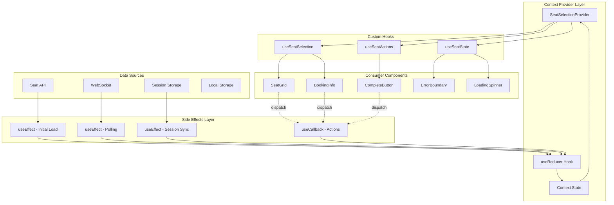
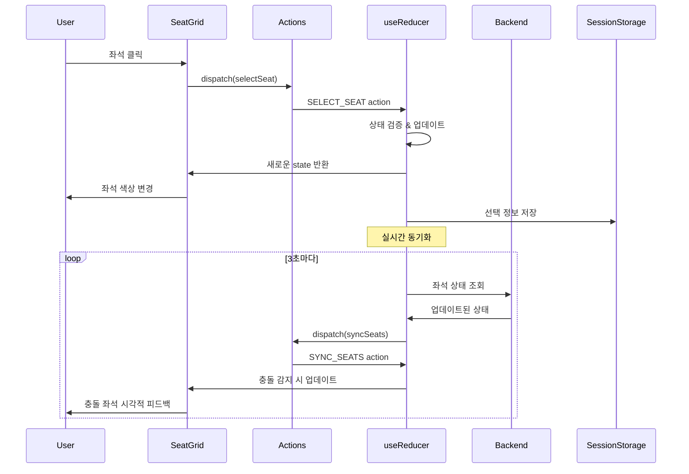
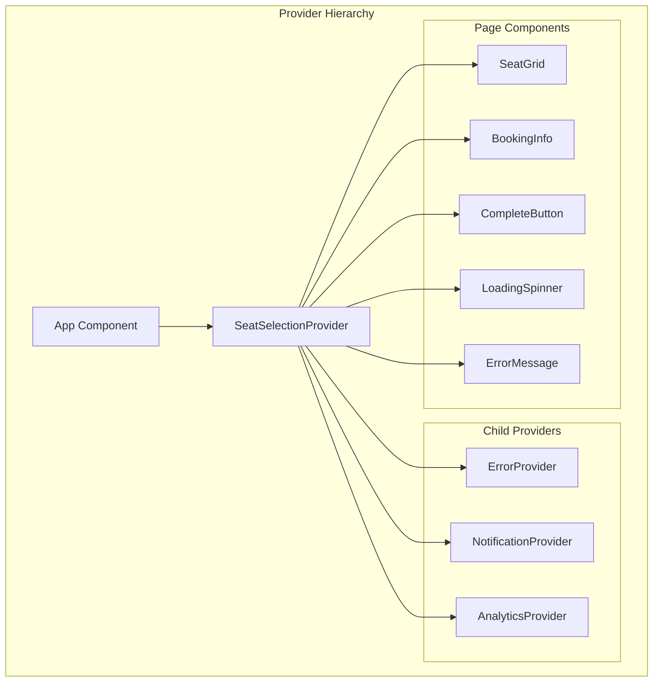
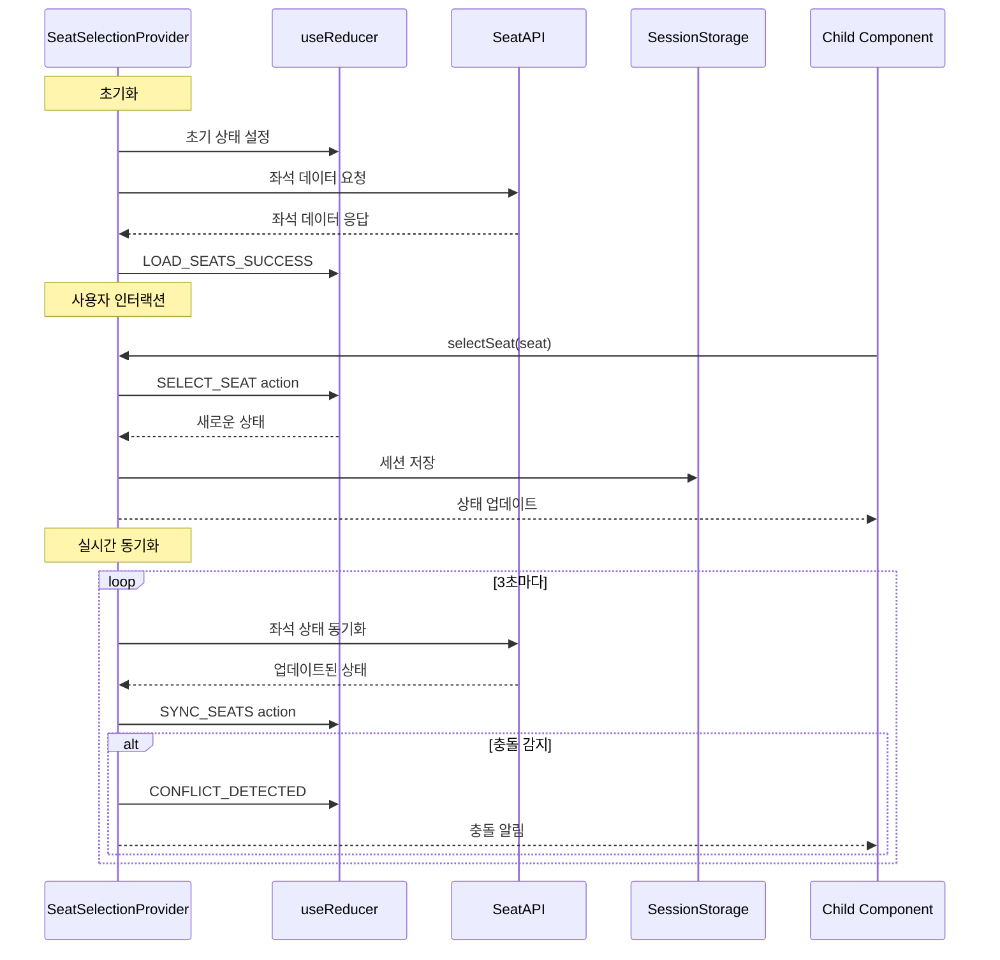

# 콘서트 예매 시스템 상태 관리 설계

## 개요

본 문서는 VMC3 콘서트 예매 시스템의 유저플로우 #4 "예약 페이지 - 좌석 선택" 기능에 대한 상태 관리 설계를 정의합니다. Context + useReducer 패턴을 사용하여 복잡한 좌석 선택 로직을 체계적으로 관리합니다.

---

## 🎯 **핵심 설계 원칙**

### **1. 단방향 데이터 플로우 (Flux Pattern)**
- Action → Reducer → State → View → Action 순환
- 예측 가능한 상태 변화
- 디버깅과 테스트 용이성

### **2. 관심사 분리 (Separation of Concerns)**
- Core State: 비즈니스 로직 관련 상태
- UI State: 사용자 인터페이스 관련 상태  
- Sync State: 실시간 동기화 관련 상태
- Session State: 세션 및 영속성 관련 상태

### **3. 선택적 구독 (Selective Subscription)**
- 컴포넌트별 필요한 상태만 구독
- 불필요한 리렌더링 방지
- 성능 최적화

---

## 📊 **관리해야 할 상태 데이터**

### **1. 핵심 상태 (Core State)**
| 상태 | 타입 | 설명 | 초기값 |
|------|------|------|--------|
| `selectedSeats` | `Seat[]` | 현재 사용자가 선택한 좌석 목록 | `[]` |
| `seatLayoutData` | `Seat[]` | 전체 좌석 배치도 데이터 | `[]` |
| `scheduleId` | `string` | 선택된 회차 ID | `""` |
| `isLoading` | `boolean` | 데이터 로딩 상태 | `false` |
| `error` | `string \| null` | 오류 상태 및 메시지 | `null` |

### **2. UI 상태 (UI State)**
| 상태 | 타입 | 설명 | 초기값 |
|------|------|------|--------|
| `focusedSeatId` | `string \| null` | 현재 포커스된 좌석 ID (접근성) | `null` |
| `showTooltip` | `TooltipState \| null` | 툴팁 표시 상태 및 내용 | `null` |
| `showAlert` | `AlertState \| null` | 경고 메시지 표시 상태 | `null` |
| `isCompleteButtonEnabled` | `boolean` | 좌석 선택 완료 버튼 활성화 상태 | `false` |
| `viewMode` | `'grid' \| 'list'` | 좌석 표시 모드 | `'grid'` |

### **3. 실시간 동기화 상태 (Sync State)**
| 상태 | 타입 | 설명 | 초기값 |
|------|------|------|--------|
| `pollingActive` | `boolean` | 실시간 폴링 활성화 상태 | `false` |
| `lastSyncTime` | `number \| null` | 마지막 동기화 시간 | `null` |
| `conflictSeats` | `string[]` | 충돌 발생한 좌석 목록 | `[]` |
| `connectionStatus` | `ConnectionStatus` | 연결 상태 | `'disconnected'` |
| `retryCount` | `number` | 재시도 횟수 | `0` |

### **4. 세션 상태 (Session State)**
| 상태 | 타입 | 설명 | 초기값 |
|------|------|------|--------|
| `holdExpiry` | `number \| null` | 홀드 만료 시간 | `null` |
| `sessionId` | `string` | 세션 ID | `""` |
| `lastActivity` | `number` | 마지막 활동 시간 | `Date.now()` |
| `autoSaveEnabled` | `boolean` | 자동 저장 활성화 여부 | `true` |

---

## 📋 **화면상 보여지는 데이터 중 상태가 아닌 것**

### **1. 정적 데이터 (Static Data)**
- **좌석 번호** (`seat_number`) - DB에서 조회한 고정 값
- **좌석 등급** (`grade`) - R/S/A 등급 정보
- **좌석 위치** (`x_position`, `y_position`) - 배치도 좌표
- **등급별 가격** (`price`) - 좌석 등급에 따른 고정 가격

### **2. 계산된 데이터 (Computed Data)**
- **총 결제 금액** - `selectedSeats`의 가격 합계로 계산
- **선택된 좌석 수** - `selectedSeats.length`로 계산
- **좌석 상태별 개수** - `seatLayoutData`에서 필터링하여 계산
- **완료 버튼 텍스트** - 선택 좌석 수에 따라 동적 생성

### **3. 서버 동기화 데이터 (Server-synced Data)**
- **다른 사용자의 좌석 상태** - 서버에서 실시간 동기화
- **좌석별 예약 상태** (`status`) - available/reserved/held

---

## 🔄 **상태 변경 조건 및 화면 변화**

| **상태** | **변경 조건** | **화면 변화** | **연관 상태** |
|---------|-------------|-------------|-------------|
| **`selectedSeats`** | 사용자가 available 좌석 클릭 | • 해당 좌석 색상 변경 (#5C6BFF)<br>• 예매 정보 패널에 좌석 추가<br>• 총 금액 업데이트 | `isCompleteButtonEnabled` |
| **`selectedSeats`** | 사용자가 선택된 좌석 재클릭 | • 해당 좌석 색상 복원 (#F3F4FF)<br>• 예매 정보 패널에서 좌석 제거<br>• 총 금액 재계산 | `isCompleteButtonEnabled` |
| **`selectedSeats`** | 실시간 동기화로 충돌 감지 | • 충돌 좌석 자동 선택 해제<br>• 충돌 안내 메시지 표시<br>• 총 금액 재계산 | `conflictSeats` |
| **`seatLayoutData`** | 페이지 진입 시 API 호출 | • 좌석 배치도 SVG 렌더링<br>• 등급별 범례 표시<br>• 로딩 스피너 → 배치도 전환 | `isLoading` |
| **`seatLayoutData`** | 실시간 폴링으로 상태 업데이트 | • 변경된 좌석 색상 업데이트<br>• reserved 좌석 비활성화<br>• held 좌석 반투명 처리 | `lastSyncTime` |
| **`isLoading`** | API 호출 시작 | • 스켈레톤 UI 표시<br>• 사용자 인터랙션 비활성화 | - |
| **`isLoading`** | API 응답 완료 | • 실제 데이터로 UI 전환<br>• 사용자 인터랙션 활성화 | `seatLayoutData` |
| **`error`** | API 호출 실패 | • 오류 메시지 표시<br>• 재시도 버튼 활성화<br>• 좌석 배치도 숨김 | `isLoading` |
| **`error`** | 재시도 성공 | • 오류 메시지 숨김<br>• 정상 UI로 복원 | `seatLayoutData` |
| **`isCompleteButtonEnabled`** | `selectedSeats.length > 0 && <= 4` | • "좌석 선택 완료" 버튼 활성화<br>• 버튼 색상 변경 (#5C6BFF) | - |
| **`isCompleteButtonEnabled`** | `selectedSeats.length === 0` | • 버튼 비활성화 (회색)<br>• 클릭 이벤트 무시 | - |
| **`pollingActive`** | 좌석 배치도 로드 완료 | • 3초마다 상태 동기화 시작<br>• 네트워크 상태 모니터링 | `lastSyncTime` |
| **`pollingActive`** | 페이지 이탈 또는 오류 | • 폴링 중단<br>• 리소스 정리 | - |
| **`lastSyncTime`** | 폴링 성공 시마다 업데이트 | • 동기화 상태 인디케이터 업데이트<br>• 디버그 정보 표시 (개발 모드) | - |
| **`conflictSeats`** | 실시간 동기화에서 충돌 감지 | • 충돌 좌석 빨간 테두리 표시<br>• 흔들림 애니메이션 (300ms)<br>• 충돌 안내 토스트 메시지 | `selectedSeats` |
| **`conflictSeats`** | 3초 후 자동 클리어 | • 시각적 효과 제거<br>• 정상 상태로 복원 | - |
| **`focusedSeatId`** | 키보드 네비게이션 (Tab/방향키) | • 포커스된 좌석에 테두리 표시<br>• 스크린 리더 안내 | - |
| **`showTooltip`** | 선택 불가 좌석 클릭 | • 해당 좌석 위에 툴팁 표시<br>• 2초 후 자동 사라짐 | - |
| **`showAlert`** | 4석 초과 선택 시도 | • 상단에 경고 메시지 표시<br>• 추가 선택 방지 | - |
| **`sessionData`** | 좌석 선택/해제 시마다 | • 브라우저 세션에 자동 저장<br>• 페이지 새로고침 시 복원 | `selectedSeats` |
| **`holdExpiry`** | "좌석 선택 완료" 버튼 클릭 | • 5분 카운트다운 타이머 표시<br>• 홀드 만료 경고 표시 | - |

---

## 🏗️ **Context + useReducer 아키텍처**

### **1. Context 데이터 플로우**



### **2. Flux 패턴 시각화**



---

## 📋 **인터페이스 설계**

### **1. 상태 인터페이스**

```typescript
// types/seatSelection.ts
export interface SeatSelectionState {
  core: {
    selectedSeats: Seat[];
    seatLayoutData: Seat[];
    scheduleId: string;
    isLoading: boolean;
    error: string | null;
  };
  
  ui: {
    focusedSeatId: string | null;
    showTooltip: TooltipState | null;
    showAlert: AlertState | null;
    isCompleteButtonEnabled: boolean;
    viewMode: 'grid' | 'list';
  };
  
  sync: {
    pollingActive: boolean;
    lastSyncTime: number | null;
    conflictSeats: string[];
    connectionStatus: 'connected' | 'disconnected' | 'error';
    retryCount: number;
  };
  
  session: {
    holdExpiry: number | null;
    sessionId: string;
    lastActivity: number;
    autoSaveEnabled: boolean;
  };
}

export interface Seat {
  id: string;
  seatNumber: string;
  rowName: string;
  seatIndex: number;
  grade: 'R' | 'S' | 'A';
  price: number;
  status: 'available' | 'reserved' | 'selected' | 'held';
  xPosition: number;
  yPosition: number;
  metadata?: {
    isAccessible?: boolean;
    hasObstruction?: boolean;
    sightlineRating?: number;
  };
}

export interface TooltipState {
  seatId: string;
  message: string;
  type: 'info' | 'warning' | 'error';
  position: { x: number; y: number };
}

export interface AlertState {
  message: string;
  type: 'info' | 'warning' | 'error' | 'success';
  duration?: number;
  actionable?: boolean;
}
```

### **2. Action 인터페이스**

```typescript
// types/actions.ts
export type SeatSelectionAction =
  // Core Actions
  | { type: 'LOAD_SEATS_START'; payload: { scheduleId: string } }
  | { type: 'LOAD_SEATS_SUCCESS'; payload: { seats: Seat[] } }
  | { type: 'LOAD_SEATS_ERROR'; payload: { error: string } }
  | { type: 'SELECT_SEAT'; payload: { seat: Seat } }
  | { type: 'DESELECT_SEAT'; payload: { seatId: string } }
  | { type: 'CLEAR_SELECTION' }
  
  // Sync Actions
  | { type: 'SYNC_SEATS_START' }
  | { type: 'SYNC_SEATS_SUCCESS'; payload: { seats: Seat[]; timestamp: number } }
  | { type: 'SYNC_SEATS_ERROR'; payload: { error: string } }
  | { type: 'CONFLICT_DETECTED'; payload: { conflictSeats: string[] } }
  | { type: 'CLEAR_CONFLICTS' }
  | { type: 'CONNECTION_STATUS_CHANGED'; payload: { status: 'connected' | 'disconnected' | 'error' } }
  | { type: 'START_POLLING' }
  | { type: 'STOP_POLLING' }
  
  // UI Actions
  | { type: 'SET_FOCUS'; payload: { seatId: string | null } }
  | { type: 'SHOW_TOOLTIP'; payload: TooltipState }
  | { type: 'HIDE_TOOLTIP' }
  | { type: 'SHOW_ALERT'; payload: AlertState }
  | { type: 'HIDE_ALERT' }
  | { type: 'CLEAR_NOTIFICATIONS' }
  | { type: 'SET_VIEW_MODE'; payload: { mode: 'grid' | 'list' } }
  
  // Session Actions
  | { type: 'SET_HOLD_EXPIRY'; payload: { expiry: number } }
  | { type: 'CLEAR_HOLD_EXPIRY' }
  | { type: 'UPDATE_ACTIVITY'; payload: { timestamp: number } }
  | { type: 'RESTORE_SESSION'; payload: { sessionData: Partial<SeatSelectionState> } }
  | { type: 'TOGGLE_AUTO_SAVE'; payload: { enabled: boolean } }
  
  // Error Actions
  | { type: 'SET_ERROR'; payload: { error: string; context?: string } }
  | { type: 'CLEAR_ERROR' }
  | { type: 'RETRY_LAST_ACTION' };
```

### **3. Context 인터페이스**

```typescript
// types/context.ts
export interface SeatSelectionContextValue {
  // State
  state: SeatSelectionState;
  
  // Core Actions
  actions: {
    loadSeats: (scheduleId: string) => Promise<void>;
    selectSeat: (seat: Seat) => void;
    deselectSeat: (seatId: string) => void;
    clearSelection: () => void;
    toggleSeatSelection: (seat: Seat) => void;
  };
  
  // Sync Actions
  syncActions: {
    startPolling: () => void;
    stopPolling: () => void;
    forcSync: () => Promise<void>;
    handleConflict: (conflictSeats: string[]) => void;
  };
  
  // UI Actions
  uiActions: {
    setFocus: (seatId: string | null) => void;
    showTooltip: (tooltip: TooltipState) => void;
    hideTooltip: () => void;
    showAlert: (alert: AlertState) => void;
    hideAlert: () => void;
    clearNotifications: () => void;
    setViewMode: (mode: 'grid' | 'list') => void;
  };
  
  // Session Actions
  sessionActions: {
    setHoldExpiry: (expiry: number) => void;
    clearHoldExpiry: () => void;
    updateActivity: () => void;
    restoreSession: () => void;
    saveSession: () => void;
    toggleAutoSave: (enabled: boolean) => void;
  };
  
  // Selectors (Computed Values)
  selectors: {
    totalPrice: number;
    selectedSeatCount: number;
    availableSeatCount: number;
    isMaxSeatsSelected: boolean;
    canCompleteSelection: boolean;
    conflictSeatNumbers: string[];
    holdTimeRemaining: number | null;
  };
  
  // Utils
  utils: {
    getSeatById: (seatId: string) => Seat | undefined;
    getSeatsByGrade: (grade: 'R' | 'S' | 'A') => Seat[];
    getSelectedSeatsByGrade: () => Record<string, Seat[]>;
    validateSeatSelection: (seat: Seat) => { valid: boolean; reason?: string };
    formatPrice: (price: number) => string;
    formatSeatNumber: (seat: Seat) => string;
  };
}
```

---

## 🔄 **하위 컴포넌트 노출 인터페이스**

### **1. SeatGrid 컴포넌트용**

```typescript
// hooks/useSeatGrid.ts
export interface SeatGridHookReturn {
  // State
  seats: Seat[];
  selectedSeats: Seat[];
  conflictSeats: string[];
  focusedSeatId: string | null;
  isLoading: boolean;
  
  // Actions
  onSeatClick: (seat: Seat) => void;
  onSeatHover: (seat: Seat | null) => void;
  onSeatFocus: (seatId: string | null) => void;
  onSeatKeyDown: (event: KeyboardEvent, seat: Seat) => void;
  
  // Computed
  seatStatusMap: Record<string, 'available' | 'reserved' | 'selected' | 'held'>;
  gradeColorMap: Record<string, string>;
  
  // Utils
  getSeatAriaLabel: (seat: Seat) => string;
  getSeatClassName: (seat: Seat) => string;
  isSeatSelectable: (seat: Seat) => boolean;
}
```

### **2. BookingInfo 컴포넌트용**

```typescript
// hooks/useBookingInfo.ts
export interface BookingInfoHookReturn {
  // State
  selectedSeats: Seat[];
  totalPrice: number;
  selectedSeatCount: number;
  
  // Computed
  seatsByGrade: Record<string, Seat[]>;
  priceBreakdown: Array<{
    grade: string;
    count: number;
    unitPrice: number;
    totalPrice: number;
  }>;
  
  // Actions
  removeSeat: (seatId: string) => void;
  clearAllSeats: () => void;
  
  // Utils
  formatPrice: (price: number) => string;
  formatSeatList: (seats: Seat[]) => string;
}
```

### **3. CompleteButton 컴포넌트용**

```typescript
// hooks/useCompleteButton.ts
export interface CompleteButtonHookReturn {
  // State
  isEnabled: boolean;
  isLoading: boolean;
  selectedSeatCount: number;
  
  // Actions
  onComplete: () => Promise<void>;
  
  // Computed
  buttonText: string;
  buttonDisabledReason: string | null;
  
  // Utils
  canProceed: () => boolean;
  getValidationErrors: () => string[];
}
```

### **4. 실시간 동기화용**

```typescript
// hooks/useSeatSync.ts
export interface SeatSyncHookReturn {
  // State
  isPollingActive: boolean;
  lastSyncTime: number | null;
  connectionStatus: 'connected' | 'disconnected' | 'error';
  conflictSeats: string[];
  
  // Actions
  startPolling: () => void;
  stopPolling: () => void;
  forceSync: () => Promise<void>;
  
  // Events
  onConflictDetected: (callback: (seats: string[]) => void) => void;
  onConnectionChange: (callback: (status: string) => void) => void;
  
  // Utils
  getTimeSinceLastSync: () => number | null;
  isConnected: () => boolean;
}
```

---

## 🎯 **Provider 설정**

### **1. Provider 구조**



### **2. Provider 설정 인터페이스**

```typescript
// types/provider.ts
export interface SeatSelectionProviderProps {
  children: React.ReactNode;
  scheduleId: string;
  config?: {
    maxSeats?: number;
    pollingInterval?: number;
    autoSave?: boolean;
    enableWebSocket?: boolean;
    enableAnalytics?: boolean;
  };
  onError?: (error: Error) => void;
  onSelectionComplete?: (seats: Seat[]) => void;
  onConflictDetected?: (conflictSeats: string[]) => void;
}

export interface SeatSelectionConfig {
  maxSeats: number;
  pollingInterval: number;
  autoSave: boolean;
  enableWebSocket: boolean;
  enableAnalytics: boolean;
  retryAttempts: number;
  sessionTimeout: number;
}
```

---

## 📊 **상태 흐름 다이어그램**



---

## 🔄 **상태 간 의존성 관계**

### **1. 주요 의존성 체인**
```
seatLayoutData → selectedSeats → isCompleteButtonEnabled
                ↓
            totalPrice (computed)
```

### **2. 실시간 동기화 체인**
```
pollingActive → lastSyncTime → seatLayoutData → conflictSeats → selectedSeats
```

### **3. 오류 처리 체인**
```
isLoading → error → showAlert/showTooltip
```

---

## 🎯 **상태 관리 전략**

### **1. 상태 저장소 분리**
- **로컬 상태**: UI 관련 (loading, error, tooltip)
- **전역 상태**: 비즈니스 로직 (selectedSeats, seatLayoutData)
- **세션 저장소**: 영속성 필요 (sessionData, holdExpiry)

### **2. 상태 업데이트 우선순위**
1. **즉시 반영**: 사용자 클릭 (selectedSeats)
2. **지연 반영**: 서버 동기화 (seatLayoutData)
3. **조건부 반영**: 충돌 처리 (conflictSeats)

### **3. 성능 최적화**
- **메모이제이션**: 계산된 값 (총 금액, 좌석 수)
- **디바운싱**: 연속 클릭 방지
- **배치 업데이트**: 실시간 동기화 시 여러 좌석 한 번에 처리

---

## 📈 **성공 지표**

### **1. 성능 지표**
- **상태 업데이트 응답 시간**: 100ms 이내
- **메모리 사용량**: 1000석 기준 50MB 이하
- **리렌더링 횟수**: 불필요한 리렌더링 5% 이하

### **2. 사용성 지표**
- **상태 동기화 정확도**: 99.9% 이상
- **충돌 해결 성공률**: 95% 이상
- **세션 복원 성공률**: 98% 이상

### **3. 개발 효율성**
- **상태 디버깅 시간**: 기존 대비 50% 단축
- **테스트 커버리지**: 90% 이상
- **코드 재사용성**: 80% 이상

이 상태 관리 설계는 90초 내 예매 완료 목표를 달성하기 위한 직관적이고 안정적인 좌석 선택 기능을 구현하는 데 필요한 모든 상태 관리 요소를 포함합니다.