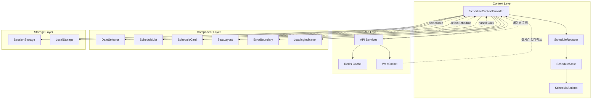
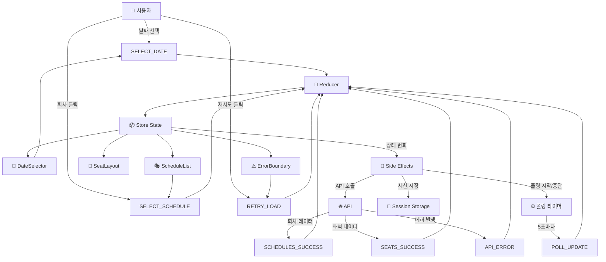
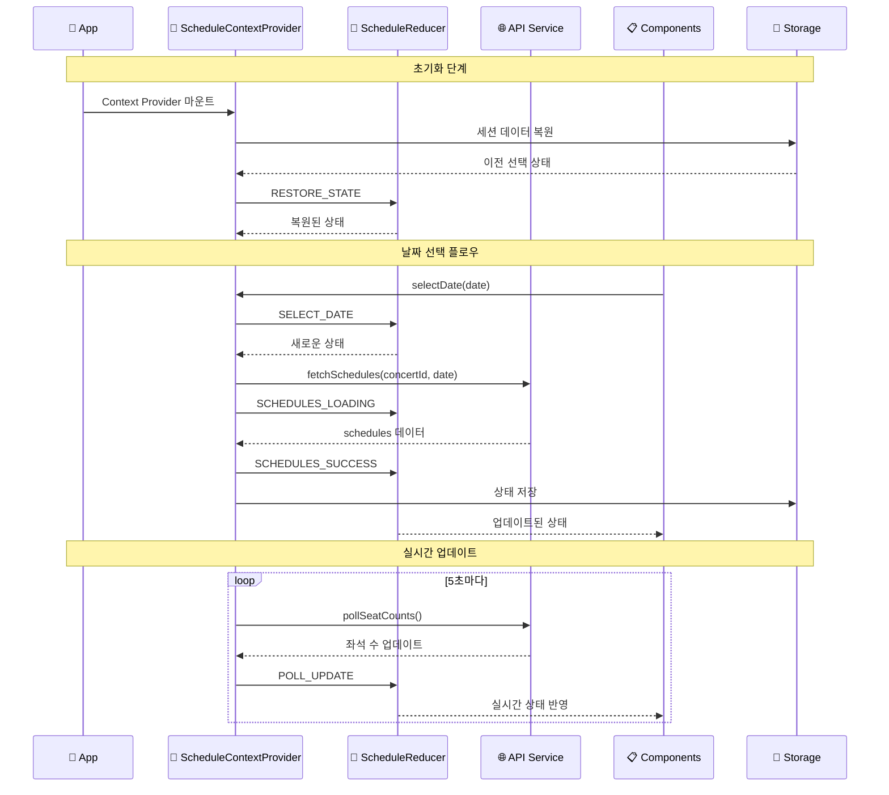

# 콘서트 예매 시스템 상태 관리 설계

## 개요

본 문서는 VMC3 콘서트 예매 시스템의 **유저플로우 #3 "회차 선택"** 기능에 대한 상태 관리 설계를 정의합니다. Context + useReducer 패턴을 활용하여 복잡한 상태 로직을 체계적으로 관리하며, 90초 내 예매 완료 목표를 달성하기 위한 최적화된 아키텍처를 제공합니다.

---

## 🏗️ **전체 아키텍처**

### **1. 시스템 아키텍처 다이어그램**



### **2. Flux 패턴 데이터 플로우**



### **3. Context 데이터 플로우**



---

## 📊 **상태 관리 분석**

### **1. 관리해야 할 상태 데이터**

#### **🎯 핵심 상태 (Core State)**
| 상태명 | 타입 | 설명 | 초기값 |
|--------|------|------|--------|
| `selectedDate` | `string \| null` | 선택된 날짜 | `null` |
| `selectedScheduleId` | `string \| null` | 선택된 회차 ID | `null` |
| `schedules` | `Schedule[] \| null` | 회차 목록 데이터 | `null` |
| `isSchedulesLoading` | `boolean` | 회차 목록 로딩 상태 | `false` |
| `isSeatsLoading` | `boolean` | 좌석 데이터 로딩 상태 | `false` |
| `schedulesError` | `ApiError \| null` | 회차 로딩 에러 상태 | `null` |
| `seatsError` | `ApiError \| null` | 좌석 로딩 에러 상태 | `null` |

#### **🔄 실시간 업데이트 상태**
| 상태명 | 타입 | 설명 | 초기값 |
|--------|------|------|--------|
| `pollingInterval` | `NodeJS.Timeout \| null` | 폴링 타이머 ID | `null` |
| `lastUpdated` | `Date \| null` | 마지막 업데이트 시간 | `null` |
| `isPollingActive` | `boolean` | 폴링 활성화 여부 | `false` |

#### **⚠️ 예외 처리 상태**
| 상태명 | 타입 | 설명 | 초기값 |
|--------|------|------|--------|
| `retryCount` | `number` | API 재시도 횟수 | `0` |
| `isOffline` | `boolean` | 오프라인 상태 | `false` |
| `tooltip` | `TooltipState` | 툴팁 표시 상태 | `{show: false, message: ""}` |

### **2. 화면에 보이지만 상태가 아닌 데이터**

#### **🎨 파생 데이터 (Derived Data)**
- 회차 카드 스타일 (CSS 클래스)
- 잔여 좌석 표시 텍스트
- 회차 상태 뱃지 ("예매 가능/임박/매진")
- 시간 포맷팅 ("HH:MM" 형식)
- 로딩 스피너 애니메이션

#### **🔧 계산된 값 (Computed Values)**
- 선택 가능한 회차 개수
- 전체 매진 여부
- 다음 단계 활성화 여부
- 에러 메시지 텍스트
- 재시도 버튼 표시 여부

### **3. 상태 변경 조건 및 화면 변화**

| 상태 | 변경 조건 | 변경 후 값 | 화면 변화 |
|------|-----------|------------|-----------|
| **`selectedDate`** | 사용자가 날짜 선택 | `"2024-12-25"` | 회차 섹션 활성화, 회차 목록 로딩 시작 |
| **`schedules`** | 날짜 선택 후 API 응답 성공 | `Schedule[]` | 회차 카드들이 시간순으로 렌더링 |
| **`isSchedulesLoading`** | API 호출 시작 | `true` | 로딩 스피너 표시, 회차 섹션 비활성화 |
| **`isSchedulesLoading`** | API 응답 완료 | `false` | 로딩 스피너 숨김, 회차 목록 표시 |
| **`selectedScheduleId`** | 사용자가 회차 클릭 | `"uuid-string"` | 선택된 회차 하이라이트, 좌석 로딩 시작 |
| **`isSeatsLoading`** | 회차 선택 후 좌석 API 호출 | `true` | 좌석 섹션에 로딩 표시 |
| **`isSeatsLoading`** | 좌석 API 응답 완료 | `false` | 좌석 배치도 렌더링 |
| **`schedulesError`** | API 호출 실패 | `Error` | 에러 메시지 및 재시도 버튼 표시 |
| **`schedulesError`** | 재시도 성공 | `null` | 에러 메시지 숨김, 정상 UI 복원 |
| **`pollingInterval`** | 회차 선택 완료 시 | `setInterval ID` | 5초마다 좌석 수 업데이트 시작 |
| **`pollingInterval`** | 페이지 이탈 시 | `null` | 폴링 중단 |
| **`lastUpdated`** | 폴링으로 데이터 갱신 | `new Date()` | 좌석 수 애니메이션과 함께 업데이트 |
| **`isPollingActive`** | 회차 선택 시 | `true` | 실시간 업데이트 아이콘 표시 |
| **`isPollingActive`** | 네트워크 오류 시 | `false` | 실시간 업데이트 중단 안내 |
| **`retryCount`** | API 실패 시 | `+1` | 재시도 버튼 텍스트 변경 ("재시도 (2/3)") |
| **`retryCount`** | 3회 실패 후 | `3` | 재시도 버튼 숨김, 고객센터 연락처 표시 |
| **`isOffline`** | 네트워크 연결 끊김 | `true` | 오프라인 배너 표시, 모든 버튼 비활성화 |
| **`isOffline`** | 네트워크 연결 복구 | `false` | 오프라인 배너 숨김, 자동 데이터 재로드 |
| **`showTooltip`** | 매진 회차 클릭 시 | `{show: true, message: "매진된 회차입니다"}` | 해당 회차 위에 툴팁 표시 |
| **`showTooltip`** | 3초 후 또는 다른 곳 클릭 | `{show: false, message: ""}` | 툴팁 페이드아웃 |

---

## 🔧 **Context + useReducer 설계**

### **1. 타입 정의**

```typescript
// types/schedule.ts
export interface Schedule {
  id: string;
  dateTime: string;
  availableSeats: number;
  totalSeats: number;
}

export interface SeatData {
  scheduleId: string;
  seats: Seat[];
  layout: SeatLayout;
}

export interface TooltipState {
  show: boolean;
  message: string;
  scheduleId?: string;
}

export interface ApiError {
  code: string;
  message: string;
  details?: any;
}

export interface PerformanceMetrics {
  apiCallCount: number;
  averageApiResponseTime: number;
  apiErrorRate: number;
  userActionCount: number;
  averageSelectionTime: number;
  renderCount: number;
  averageRenderTime: number;
  stateSize: number;
  cacheHitRate: number;
}
```

### **2. Context 상태 인터페이스**

```typescript
// contexts/ScheduleContext/types.ts

/**
 * 스케줄 컨텍스트에서 관리하는 핵심 상태
 */
export interface ScheduleContextState {
  // 🎯 선택 상태
  selectedDate: string | null;
  selectedScheduleId: string | null;
  selectedSchedule: Schedule | null; // 파생 상태
  
  // 📊 데이터 상태
  schedules: Schedule[] | null;
  seatLayout: SeatData | null;
  
  // ⏳ 로딩 상태
  isSchedulesLoading: boolean;
  isSeatsLoading: boolean;
  isPollingActive: boolean;
  
  // ⚠️ 에러 상태
  schedulesError: ApiError | null;
  seatsError: ApiError | null;
  
  // 🔄 메타 상태
  lastUpdated: Date | null;
  retryCount: number;
  isOffline: boolean;
  
  // 🎨 UI 상태
  tooltip: TooltipState;
  loadingProgress: number; // 0-100
}

/**
 * 컨텍스트에서 제공하는 액션 함수들
 */
export interface ScheduleContextActions {
  // 🎯 선택 액션
  selectDate: (date: string) => Promise<void>;
  selectSchedule: (scheduleId: string) => Promise<void>;
  clearSelection: () => void;
  
  // 🔄 데이터 액션
  refreshSchedules: () => Promise<void>;
  refreshSeats: () => Promise<void>;
  
  // ⚠️ 에러 처리 액션
  retryLoad: () => Promise<void>;
  clearError: (errorType: 'schedules' | 'seats') => void;
  
  // 🎨 UI 액션
  showTooltip: (message: string, scheduleId?: string) => void;
  hideTooltip: () => void;
  
  // 🔧 유틸리티 액션
  resetState: () => void;
  exportState: () => ScheduleContextState;
}

/**
 * 컨텍스트에서 제공하는 파생 데이터 (computed values)
 */
export interface ScheduleContextComputed {
  // 📊 통계 데이터
  availableSchedulesCount: number;
  soldOutSchedulesCount: number;
  totalSeatsCount: number;
  availableSeatsCount: number;
  
  // 🎯 상태 체크
  hasSelectedDate: boolean;
  hasSelectedSchedule: boolean;
  canProceedToSeats: boolean;
  
  // ⚠️ 에러 상태 체크
  hasAnyError: boolean;
  isRetryable: boolean;
  
  // 🔄 로딩 상태 체크
  isAnyLoading: boolean;
  loadingMessage: string | null;
}

/**
 * 전체 컨텍스트 값
 */
export interface ScheduleContextValue {
  // 상태
  state: ScheduleContextState;
  
  // 액션
  actions: ScheduleContextActions;
  
  // 파생 데이터
  computed: ScheduleContextComputed;
  
  // 메타 정보
  meta: {
    contextVersion: string;
    lastStateChange: Date;
    performanceMetrics: PerformanceMetrics;
  };
}
```

### **3. Reducer 액션 타입**

```typescript
// contexts/ScheduleContext/actions.ts

export type ScheduleAction =
  | { type: 'SELECT_DATE'; payload: string }
  | { type: 'SELECT_SCHEDULE'; payload: string }
  | { type: 'SCHEDULES_LOADING' }
  | { type: 'SCHEDULES_SUCCESS'; payload: Schedule[] }
  | { type: 'SCHEDULES_ERROR'; payload: ApiError }
  | { type: 'SEATS_LOADING' }
  | { type: 'SEATS_SUCCESS'; payload: SeatData }
  | { type: 'SEATS_ERROR'; payload: ApiError }
  | { type: 'POLL_UPDATE'; payload: { scheduleId: string; availableSeats: number } }
  | { type: 'START_POLLING' }
  | { type: 'STOP_POLLING' }
  | { type: 'RETRY_LOAD' }
  | { type: 'SET_OFFLINE'; payload: boolean }
  | { type: 'SHOW_TOOLTIP'; payload: { message: string; scheduleId?: string } }
  | { type: 'HIDE_TOOLTIP' }
  | { type: 'RESET_STATE' }
  | { type: 'RESTORE_STATE'; payload: Partial<ScheduleContextState> }
  | { type: 'UPDATE_PERFORMANCE'; payload: Partial<PerformanceMetrics> };
```

---

## 📋 **컴포넌트 인터페이스 설계**

### **1. DateSelector 컴포넌트**

```typescript
export interface DateSelectorProps {
  // 상태
  selectedDate: string | null;
  isLoading: boolean;
  error: ApiError | null;
  
  // 액션
  onDateSelect: (date: string) => void;
  onRetry: () => void;
  
  // 설정
  minDate?: string;
  maxDate?: string;
  disabledDates?: string[];
}
```

### **2. ScheduleList 컴포넌트**

```typescript
export interface ScheduleListProps {
  // 상태
  schedules: Schedule[] | null;
  selectedScheduleId: string | null;
  isLoading: boolean;
  error: ApiError | null;
  lastUpdated: Date | null;
  
  // 액션
  onScheduleSelect: (scheduleId: string) => void;
  onRefresh: () => void;
  
  // UI 상태
  tooltip: TooltipState;
  onTooltipShow: (message: string, scheduleId: string) => void;
  onTooltipHide: () => void;
  
  // 설정
  layout?: 'grid' | 'list';
  showRealTimeUpdates?: boolean;
}
```

### **3. ScheduleCard 컴포넌트**

```typescript
export interface ScheduleCardProps {
  // 데이터
  schedule: Schedule;
  isSelected: boolean;
  isDisabled: boolean;
  
  // 상태
  isUpdating: boolean;
  showTooltip: boolean;
  tooltipMessage: string;
  
  // 액션
  onClick: (scheduleId: string) => void;
  onHover: (scheduleId: string) => void;
  onLeave: () => void;
  
  // 스타일
  variant?: 'default' | 'compact' | 'detailed';
  showSeatCount?: boolean;
  showPrice?: boolean;
}
```

### **4. SeatLayout 컴포넌트**

```typescript
export interface SeatLayoutProps {
  // 상태
  selectedSchedule: Schedule | null;
  seatData: SeatData | null;
  isLoading: boolean;
  error: ApiError | null;
  
  // 액션
  onSeatSelect: (seatId: string) => void;
  onRefresh: () => void;
  
  // 실시간 업데이트
  isPollingActive: boolean;
  lastUpdated: Date | null;
  
  // 설정
  maxSelectableSeats?: number;
  showPriceInfo?: boolean;
}
```

---

## 🔄 **Context Provider 설계**

### **1. Provider 설정**

```typescript
// contexts/ScheduleContext/provider.ts

export interface ScheduleProviderProps {
  children: React.ReactNode;
  
  // 설정
  concertId: string;
  config?: {
    pollingInterval?: number; // 기본 5000ms
    maxRetryCount?: number;   // 기본 3회
    cacheTimeout?: number;    // 기본 5분
    enableRealTime?: boolean; // 기본 true
  };
  
  // 초기 상태 (선택사항)
  initialState?: Partial<ScheduleContextState>;
  
  // 이벤트 핸들러
  onStateChange?: (state: ScheduleContextState) => void;
  onError?: (error: ApiError) => void;
  onSuccess?: (action: string, data: any) => void;
}

export interface ScheduleProviderConfig {
  // API 설정
  apiBaseUrl: string;
  apiTimeout: number;
  
  // 캐싱 설정
  enableCache: boolean;
  cachePrefix: string;
  
  // 실시간 업데이트 설정
  pollingInterval: number;
  enableWebSocket: boolean;
  
  // 에러 처리 설정
  maxRetryCount: number;
  retryDelay: number;
  
  // 성능 설정
  enablePerformanceTracking: boolean;
  logLevel: 'debug' | 'info' | 'warn' | 'error';
}
```

### **2. 커스텀 훅 설계**

```typescript
// hooks/useScheduleContext.ts

/**
 * 기본 컨텍스트 훅 - 전체 상태와 액션에 접근
 */
export function useScheduleContext(): ScheduleContextValue;

/**
 * 선택적 상태 훅 - 필요한 상태만 구독
 */
export function useScheduleState<T>(
  selector: (state: ScheduleContextState) => T
): T;

/**
 * 액션 전용 훅 - 상태 변화에 반응하지 않음
 */
export function useScheduleActions(): ScheduleContextActions;

/**
 * 파생 데이터 훅 - 계산된 값들만 구독
 */
export function useScheduleComputed(): ScheduleContextComputed;

/**
 * 특정 기능별 훅들
 */
export function useDateSelection(): {
  selectedDate: string | null;
  selectDate: (date: string) => void;
  clearDate: () => void;
};

export function useScheduleSelection(): {
  selectedSchedule: Schedule | null;
  selectSchedule: (id: string) => void;
  clearSchedule: () => void;
};

export function useSchedulePolling(): {
  isPollingActive: boolean;
  lastUpdated: Date | null;
  startPolling: () => void;
  stopPolling: () => void;
};
```

---

## ⚠️ **에러 처리 및 복구 전략**

### **1. 에러 분류 및 복구 전략**

```typescript
// contexts/ScheduleContext/errorHandling.ts

export interface ErrorRecoveryStrategy {
  // 에러 분류
  errorType: 'network' | 'api' | 'validation' | 'system';
  
  // 복구 액션
  recoveryActions: {
    retry: boolean;
    fallback: boolean;
    notify: boolean;
    redirect: boolean;
  };
  
  // 복구 설정
  maxRetryCount: number;
  retryDelay: number;
  fallbackData?: any;
  
  // 사용자 알림
  userMessage: string;
  showRetryButton: boolean;
  showFallbackOption: boolean;
}

export interface ScheduleContextErrorBoundary {
  // 에러 상태
  hasError: boolean;
  error: Error | null;
  errorInfo: React.ErrorInfo | null;
  
  // 복구 액션
  retry: () => void;
  reset: () => void;
  reportError: (error: Error, errorInfo: React.ErrorInfo) => void;
  
  // 에러 분석
  getErrorSeverity: () => 'low' | 'medium' | 'high' | 'critical';
  getRecoveryStrategy: () => ErrorRecoveryStrategy;
}
```

### **2. 에러 처리 매트릭스**

| 에러 타입 | 복구 전략 | 사용자 메시지 | 재시도 | 폴백 |
|-----------|-----------|---------------|--------|------|
| **네트워크 연결 실패** | 자동 재시도 + 오프라인 모드 | "인터넷 연결을 확인해주세요" | 3회 | 캐시된 데이터 |
| **API 서버 오류** | 지수 백오프 재시도 | "일시적인 오류가 발생했습니다" | 3회 | 에러 페이지 |
| **데이터 검증 실패** | 데이터 정제 + 재요청 | "데이터를 다시 불러오는 중입니다" | 1회 | 기본값 |
| **권한 오류** | 로그인 페이지 리다이렉트 | "로그인이 필요합니다" | 0회 | 로그인 페이지 |
| **매진/선택 불가** | 대안 제시 | "선택하신 회차가 매진되었습니다" | 0회 | 다른 회차 추천 |

---

## 📊 **성능 최적화 전략**

### **1. 상태 최적화**

#### **메모이제이션 전략**
- `schedules` 배열의 정렬 및 필터링 결과 캐싱
- 파생 데이터 계산 결과 메모이제이션
- 컴포넌트 렌더링 최적화를 위한 React.memo 활용

#### **상태 분할**
- 자주 변경되는 상태와 안정적인 상태 분리
- UI 상태와 비즈니스 로직 상태 분리
- 지역 상태와 전역 상태의 적절한 분배

### **2. 네트워크 최적화**

#### **데이터 페칭 전략**
- 필요한 데이터만 선택적 로딩
- 백그라운드에서 다음 단계 데이터 프리페칭
- 중복 API 호출 방지를 위한 디바운싱

#### **캐싱 전략**
- Redis를 통한 서버 사이드 캐싱 (5분)
- 브라우저 캐시를 활용한 정적 데이터 캐싱
- 실시간 데이터의 적절한 캐시 무효화

### **3. 실시간 업데이트 최적화**

#### **폴링 최적화**
- 탭 비활성화 시 폴링 중단
- 네트워크 상태에 따른 폴링 주기 조절
- 변화가 없는 경우 폴링 주기 증가

#### **WebSocket 활용 (선택사항)**
- 실시간 좌석 상태 업데이트
- 연결 상태 모니터링 및 자동 재연결
- 폴링과 WebSocket의 하이브리드 전략

---

## 🔍 **디버깅 및 모니터링**

### **1. 상태 변화 추적**

```typescript
// contexts/ScheduleContext/tracking.ts

export interface StateChangeEvent {
  timestamp: Date;
  action: string;
  previousState: Partial<ScheduleContextState>;
  nextState: Partial<ScheduleContextState>;
  duration: number; // ms
  source: 'user' | 'api' | 'polling' | 'system';
}

export interface ScheduleContextDebug {
  // 상태 히스토리
  stateHistory: StateChangeEvent[];
  
  // 성능 메트릭
  performance: PerformanceMetrics;
  
  // 디버그 정보
  debugInfo: {
    contextVersion: string;
    mountTime: Date;
    lastError: ApiError | null;
    configSnapshot: ScheduleProviderConfig;
  };
  
  // 디버그 액션
  exportDebugData: () => object;
  clearHistory: () => void;
  logPerformance: () => void;
}
```

### **2. 성능 메트릭**

#### **측정 지표**
- API 호출 횟수 및 평균 응답 시간
- 사용자 액션 수 및 평균 선택 시간
- 컴포넌트 렌더링 횟수 및 시간
- 메모리 사용량 및 캐시 히트율

#### **모니터링 대시보드**
- 실시간 성능 지표 표시
- 에러 발생률 및 복구 성공률
- 사용자 행동 패턴 분석
- 시스템 리소스 사용량 모니터링

---

## 🚀 **구현 가이드라인**

### **1. 개발 단계**

#### **Phase 1: 기본 상태 관리**
1. 기본 Context 및 Reducer 구현
2. 핵심 상태 및 액션 정의
3. 기본 컴포넌트 연동

#### **Phase 2: 고급 기능**
1. 실시간 업데이트 구현
2. 에러 처리 및 복구 로직
3. 성능 최적화 적용

#### **Phase 3: 모니터링 및 최적화**
1. 디버깅 도구 구현
2. 성능 메트릭 수집
3. 사용자 경험 개선

### **2. 테스트 전략**

#### **단위 테스트**
- Reducer 로직 테스트
- 액션 생성자 테스트
- 파생 데이터 계산 테스트

#### **통합 테스트**
- Context Provider 테스트
- 컴포넌트 상호작용 테스트
- API 연동 테스트

#### **E2E 테스트**
- 전체 사용자 플로우 테스트
- 에러 시나리오 테스트
- 성능 기준 검증

---

## 📈 **성공 지표**

### **1. 성능 지표**
- **상태 업데이트 지연시간**: 50ms 이내
- **API 응답 시간**: 1초 이내 (회차 목록), 2초 이내 (좌석 데이터)
- **실시간 업데이트 정확도**: 95% 이상
- **메모리 사용량**: 10MB 이하

### **2. 사용성 지표**
- **회차 선택 완료율**: 95% 이상
- **평균 선택 시간**: 10초 이내
- **에러 발생률**: 1% 이하
- **사용자 만족도**: 4.5/5.0 이상

### **3. 비즈니스 지표**
- **예매 전환율**: 90% 이상 (회차 선택 → 좌석 선택)
- **이탈률**: 5% 이하 (회차 선택 단계)
- **90초 목표 달성률**: 80% 이상

---

이 상태 관리 설계는 Context + useReducer 패턴을 활용하여 복잡한 회차 선택 로직을 체계적으로 관리하면서도, 90초 내 예매 완료 목표를 달성하기 위한 성능 최적화와 사용자 경험 개선을 모두 고려한 포괄적인 아키텍처입니다.