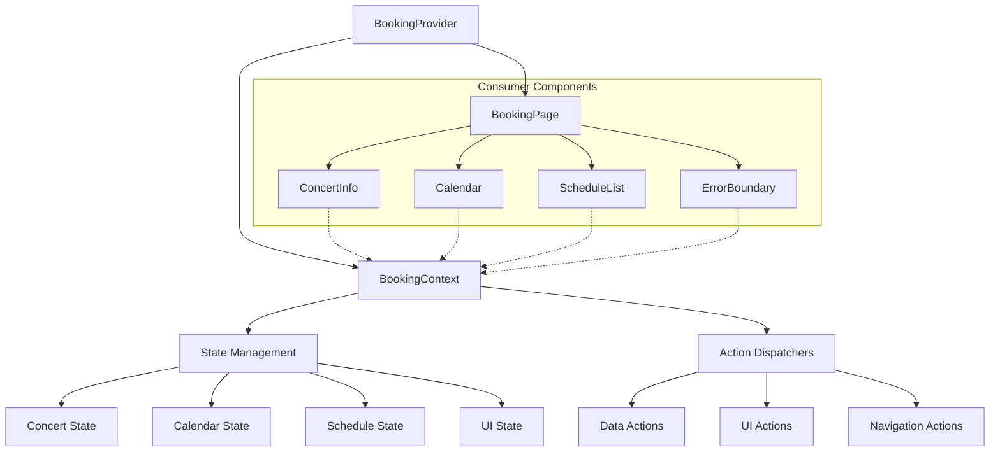
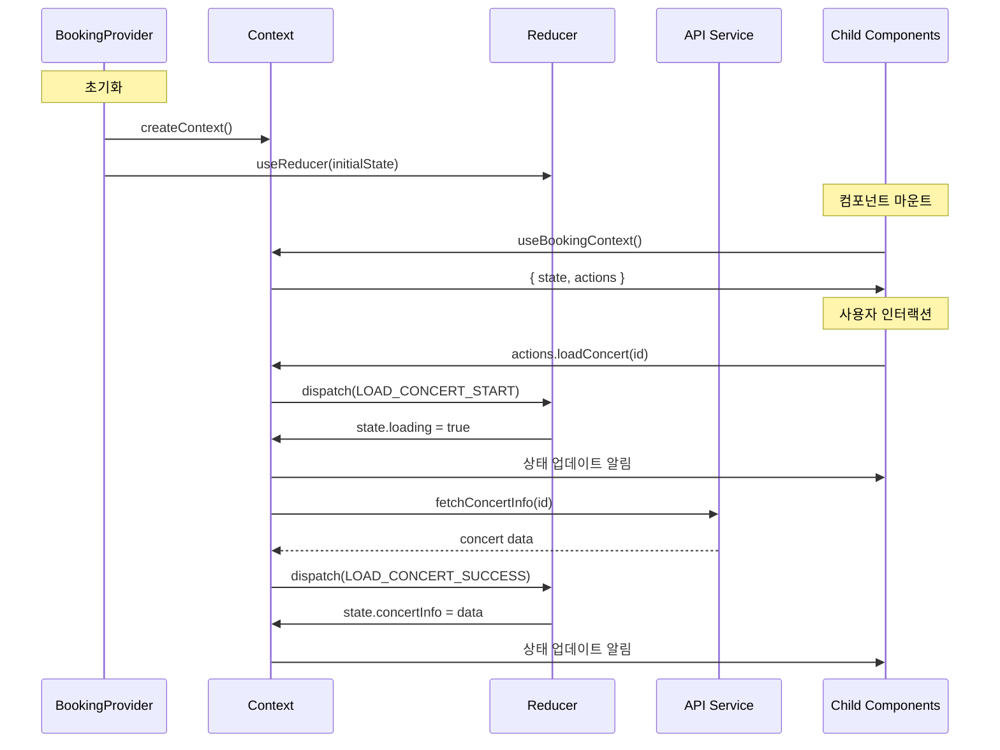
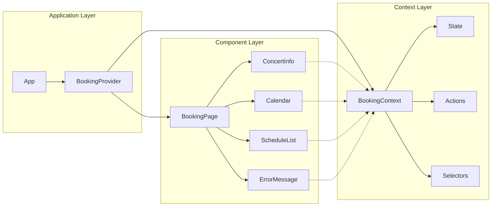
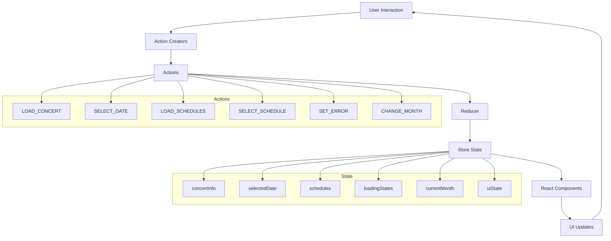
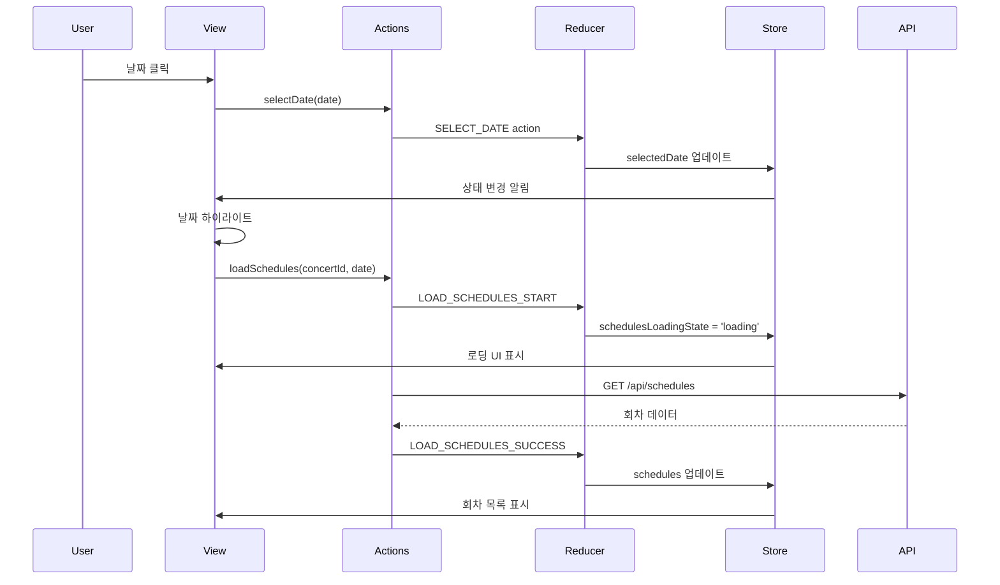
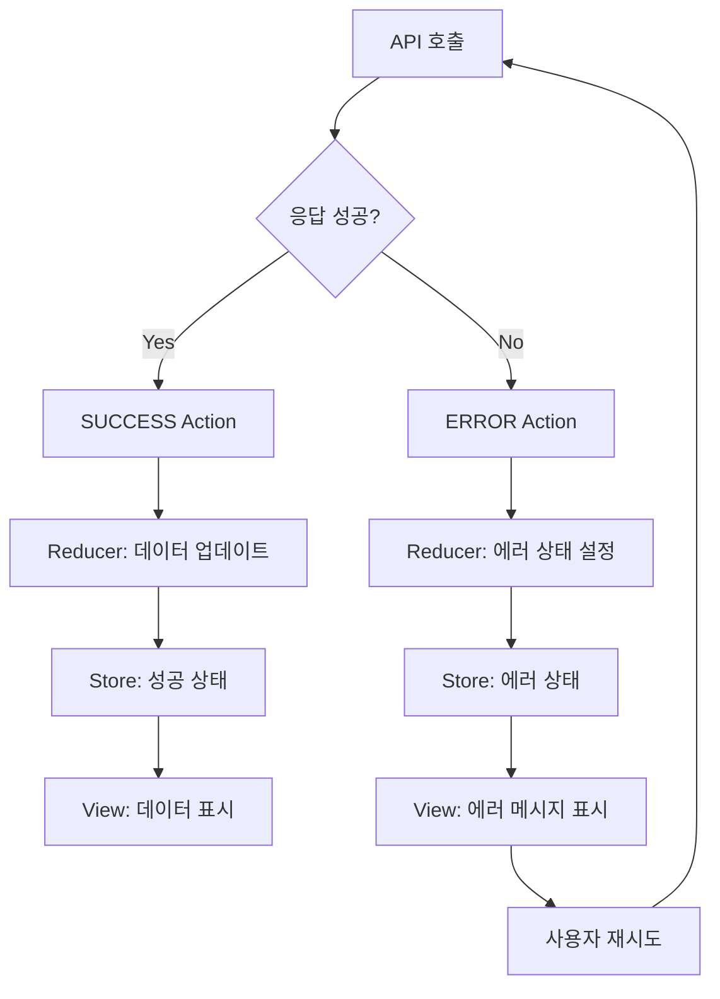

# 콘서트 예매 시스템 상태 관리 설계서

## 개요

본 문서는 VMC3 콘서트 예매 시스템의 **유저플로우 #2 "예약 페이지 - 날짜 선택"** 기능에 대한 상태 관리 설계를 정의합니다. Context + useReducer 패턴을 사용하여 90초 내 예매 완료 목표를 달성하기 위한 효율적이고 예측 가능한 상태 관리를 구현합니다.

---

## 🏗️ **Context 아키텍처 설계**

### **1. Context 구조 시각화**



### **2. 데이터 플로우 시각화**



### **3. Context 계층 구조**



---

## 📊 **상태 데이터 분석**

### **1. 관리해야 할 상태 데이터**

#### **페이지 레벨 상태**
- `pageLoadingState`: 'loading' | 'loaded' | 'error'
- `concertId`: string (URL 파라미터)
- `errorMessage`: string | null

#### **콘서트 정보 상태**
- `concertInfo`: { id, title, description, posterImageUrl } | null
- `concertLoadingState`: 'loading' | 'loaded' | 'error'

#### **캘린더 상태**
- `currentMonth`: Date (현재 표시 중인 월)
- `availableDates`: Date[] (예매 가능한 날짜 목록)
- `selectedDate`: Date | null (사용자가 선택한 날짜)
- `calendarLoadingState`: 'loading' | 'loaded' | 'error'

#### **회차 선택 상태**
- `schedules`: Array<{ id, dateTime, availableSeats, totalSeats }> | null
- `selectedSchedule`: { id, dateTime } | null
- `schedulesLoadingState`: 'loading' | 'loaded' | 'error' | 'idle'

#### **UI 상태**
- `isScheduleSectionVisible`: boolean (회차 선택 섹션 표시 여부)
- `tooltipMessage`: string | null (툴팁 메시지)
- `showTooltip`: boolean

### **2. 화면에 보이지만 상태가 아닌 데이터**

#### **계산된/파생된 데이터**
- 캘린더의 날짜 셀 스타일 (availableDates 기반으로 계산)
- 회차별 매진 여부 (availableSeats === 0으로 계산)
- 현재 월의 날짜 배열 (currentMonth 기반으로 계산)
- 이전/다음 월 버튼 활성화 여부 (currentMonth 기반으로 계산)

#### **정적 UI 요소**
- 콘서트 포스터 이미지 (concertInfo에서 가져오지만 상태 변경 없음)
- 캘린더 헤더 (월/년 표시)
- 스켈레톤 UI 컴포넌트
- 에러 메시지 템플릿

#### **상수 데이터**
- 캘린더 표시 범위 (6개월)
- 요일 라벨 ('일', '월', '화', ...)
- 색상 코드 (#5C6BFF, #4854FF 등)

---

## 📋 **상태 변경 조건 및 화면 변화**

| 상태 | 변경 조건 | 변경 후 값 | 화면 변화 |
|------|-----------|------------|-----------|
| **pageLoadingState** | 페이지 진입 시 | 'loading' | 전체 페이지 로딩 스피너 표시 |
| | 콘서트 정보 로드 완료 시 | 'loaded' | 로딩 스피너 제거, 콘텐츠 표시 |
| | API 오류 발생 시 | 'error' | 에러 페이지 표시 |
| **concertInfo** | 콘서트 API 응답 성공 시 | 콘서트 객체 | 제목, 포스터, 설명 표시 |
| | API 오류 시 | null | 스켈레톤 UI 유지 또는 에러 표시 |
| **currentMonth** | 이전 월 버튼 클릭 시 | 현재월 - 1 | 캘린더 날짜 재렌더링 |
| | 다음 월 버튼 클릭 시 | 현재월 + 1 | 캘린더 날짜 재렌더링 |
| **availableDates** | 일정 API 응답 성공 시 | Date 배열 | 캘린더에서 해당 날짜들 활성화 |
| | API 오류 시 | [] | 모든 날짜 비활성화 |
| **selectedDate** | 유효한 날짜 클릭 시 | 클릭한 Date | 해당 날짜 하이라이트, 회차 API 호출 |
| | 다른 날짜 클릭 시 | 새로운 Date | 이전 날짜 하이라이트 해제, 새 날짜 하이라이트 |
| | 페이지 초기화 시 | null | 선택된 날짜 없음 |
| **calendarLoadingState** | 일정 API 호출 시작 시 | 'loading' | 캘린더 로딩 인디케이터 표시 |
| | API 응답 성공 시 | 'loaded' | 로딩 인디케이터 제거, 활성 날짜 표시 |
| | API 오류 시 | 'error' | 에러 메시지 표시 |
| **schedules** | 회차 API 응답 성공 시 | 회차 배열 | 회차 목록 표시 |
| | API 오류 시 | null | 회차 섹션 숨김 또는 에러 표시 |
| | 날짜 미선택 시 | null | 회차 섹션 비활성화 |
| **selectedSchedule** | 회차 클릭 시 | 선택한 회차 객체 | 해당 회차 하이라이트, 다음 단계 활성화 |
| | 다른 회차 클릭 시 | 새로운 회차 객체 | 이전 회차 하이라이트 해제, 새 회차 하이라이트 |
| **schedulesLoadingState** | 페이지 초기 로드 시 | 'idle' | 회차 섹션 숨김 |
| | 날짜 선택 후 API 호출 시 | 'loading' | 회차 섹션 로딩 스피너 표시 |
| | 회차 API 응답 성공 시 | 'loaded' | 로딩 스피너 제거, 회차 목록 표시 |
| | API 오류 시 | 'error' | 에러 메시지 표시 |
| **isScheduleSectionVisible** | selectedDate가 null이 아닐 때 | true | 회차 선택 섹션 표시 |
| | selectedDate가 null일 때 | false | 회차 선택 섹션 숨김 |
| **tooltipMessage** | 과거 날짜 클릭 시 | "선택할 수 없는 날짜입니다" | 툴팁 메시지 설정 |
| | 비활성 날짜 클릭 시 | "해당 날짜는 예매가 불가능합니다" | 툴팁 메시지 설정 |
| | 툴팁 자동 숨김 시 | null | 툴팁 메시지 제거 |
| **showTooltip** | 잘못된 날짜 클릭 시 | true | 툴팁 표시 |
| | 3초 후 또는 다른 액션 시 | false | 툴팁 숨김 |

---

## 🔄 **Flux 패턴 시각화**

### **1. 전체 아키텍처 흐름**



### **2. 날짜 선택 플로우**



### **3. 에러 처리 플로우**



---

## 📋 **Context 인터페이스 설계**

### **1. State 인터페이스**

```typescript
interface BookingState {
  // 메타 상태
  meta: {
    concertId: string | null;
    isInitialized: boolean;
    lastUpdated: number;
  };
  
  // 로딩 상태
  loading: {
    page: boolean;
    concert: boolean;
    calendar: boolean;
    schedules: boolean;
  };
  
  // 에러 상태
  errors: {
    concert: string | null;
    calendar: string | null;
    schedules: string | null;
    network: string | null;
  };
  
  // 데이터 상태
  data: {
    concertInfo: ConcertInfo | null;
    availableDates: Date[];
    schedules: Schedule[];
  };
  
  // 선택 상태
  selection: {
    currentMonth: Date;
    selectedDate: Date | null;
    selectedSchedule: Schedule | null;
  };
  
  // UI 상태
  ui: {
    isScheduleSectionVisible: boolean;
    tooltip: {
      message: string | null;
      isVisible: boolean;
    };
    calendar: {
      isNavigating: boolean;
      animationDirection: 'prev' | 'next' | null;
    };
  };
}
```

### **2. Actions 인터페이스**

```typescript
interface BookingActions {
  // 초기화 액션
  initialize: (concertId: string) => void;
  reset: () => void;
  
  // 데이터 로딩 액션
  loadConcert: (concertId: string) => Promise<void>;
  loadAvailableDates: (concertId: string) => Promise<void>;
  loadSchedules: (concertId: string, date: Date) => Promise<void>;
  
  // 선택 액션
  selectDate: (date: Date) => void;
  selectSchedule: (schedule: Schedule) => void;
  changeMonth: (month: Date) => void;
  
  // UI 액션
  showTooltip: (message: string) => void;
  hideTooltip: () => void;
  toggleScheduleSection: (visible: boolean) => void;
  
  // 에러 처리 액션
  clearError: (errorType: keyof BookingState['errors']) => void;
  clearAllErrors: () => void;
  
  // 유틸리티 액션
  retry: (actionType: 'concert' | 'calendar' | 'schedules') => void;
  refresh: () => void;
}
```

### **3. Selectors 인터페이스**

```typescript
interface BookingSelectors {
  // 상태 선택자
  isLoading: (type?: 'page' | 'concert' | 'calendar' | 'schedules') => boolean;
  hasError: (type?: keyof BookingState['errors']) => boolean;
  isInitialized: () => boolean;
  
  // 데이터 선택자
  getConcertInfo: () => ConcertInfo | null;
  getAvailableDates: () => Date[];
  getSchedules: () => Schedule[];
  getSelectedDate: () => Date | null;
  getSelectedSchedule: () => Schedule | null;
  getCurrentMonth: () => Date;
  
  // 계산된 값 선택자
  getAvailableDatesForMonth: (month: Date) => Date[];
  getSchedulesForSelectedDate: () => Schedule[];
  isDateAvailable: (date: Date) => boolean;
  isDateSelected: (date: Date) => boolean;
  getScheduleById: (id: string) => Schedule | null;
  
  // UI 상태 선택자
  isScheduleSectionVisible: () => boolean;
  getTooltipState: () => { message: string | null; isVisible: boolean };
  canNavigateToPrevMonth: () => boolean;
  canNavigateToNextMonth: () => boolean;
  
  // 유효성 검사 선택자
  canSelectDate: (date: Date) => boolean;
  canSelectSchedule: (schedule: Schedule) => boolean;
  isReadyForNextStep: () => boolean;
}
```

### **4. Context Provider 인터페이스**

```typescript
interface BookingContextValue {
  // 상태
  state: BookingState;
  
  // 액션
  actions: BookingActions;
  
  // 선택자
  selectors: BookingSelectors;
  
  // 메타 정보
  meta: {
    version: string;
    lastAction: string | null;
    actionHistory: string[];
  };
}

interface BookingProviderProps {
  children: React.ReactNode;
  concertId?: string;
  onError?: (error: Error) => void;
  onStateChange?: (state: BookingState) => void;
}
```

---

## 🔄 **하위 컴포넌트 노출 인터페이스**

### **1. ConcertInfo 컴포넌트용**

```typescript
interface ConcertInfoContextProps {
  // 데이터
  concertInfo: ConcertInfo | null;
  
  // 상태
  isLoading: boolean;
  error: string | null;
  
  // 액션
  retry: () => void;
  clearError: () => void;
}
```

### **2. Calendar 컴포넌트용**

```typescript
interface CalendarContextProps {
  // 데이터
  currentMonth: Date;
  availableDates: Date[];
  selectedDate: Date | null;
  
  // 상태
  isLoading: boolean;
  error: string | null;
  isNavigating: boolean;
  
  // 액션
  selectDate: (date: Date) => void;
  changeMonth: (month: Date) => void;
  showTooltip: (message: string) => void;
  
  // 유틸리티
  isDateAvailable: (date: Date) => boolean;
  isDateSelected: (date: Date) => boolean;
  canNavigateToPrevMonth: () => boolean;
  canNavigateToNextMonth: () => boolean;
}
```

### **3. ScheduleList 컴포넌트용**

```typescript
interface ScheduleListContextProps {
  // 데이터
  schedules: Schedule[];
  selectedSchedule: Schedule | null;
  selectedDate: Date | null;
  
  // 상태
  isVisible: boolean;
  isLoading: boolean;
  error: string | null;
  
  // 액션
  selectSchedule: (schedule: Schedule) => void;
  retry: () => void;
  clearError: () => void;
  
  // 유틸리티
  canSelectSchedule: (schedule: Schedule) => boolean;
  isScheduleSelected: (schedule: Schedule) => boolean;
  getScheduleById: (id: string) => Schedule | null;
}
```

### **4. ErrorBoundary 컴포넌트용**

```typescript
interface ErrorBoundaryContextProps {
  // 에러 상태
  errors: {
    concert: string | null;
    calendar: string | null;
    schedules: string | null;
    network: string | null;
  };
  
  // 액션
  clearError: (type: keyof BookingState['errors']) => void;
  clearAllErrors: () => void;
  retry: (type: 'concert' | 'calendar' | 'schedules') => void;
  refresh: () => void;
  
  // 유틸리티
  hasAnyError: () => boolean;
  getErrorMessage: (type: keyof BookingState['errors']) => string | null;
}
```

---

## 📊 **Context 데이터 관리 플로우**

### **1. 초기화 플로우**

```mermaid
flowchart TD
    A[BookingProvider 마운트] --> B{concertId 존재?}
    B -->|Yes| C[actions.initialize(concertId)]
    B -->|No| D[대기 상태]
    
    C --> E[INIT_BOOKING action]
    E --> F[state.meta.concertId 설정]
    F --> G[병렬 데이터 로딩]
    
    G --> H[loadConcert()]
    G --> I[loadAvailableDates()]
    
    H --> J[LOAD_CONCERT_SUCCESS]
    I --> K[LOAD_AVAILABLE_DATES_SUCCESS]
    
    J --> L[state.data.concertInfo 업데이트]
    K --> M[state.data.availableDates 업데이트]
    
    L --> N[컴포넌트 리렌더링]
    M --> N
```

### **2. 사용자 인터랙션 플로우**

```mermaid
flowchart TD
    A[사용자 날짜 클릭] --> B[Calendar 컴포넌트]
    B --> C[actions.selectDate(date)]
    C --> D[SELECT_DATE action]
    D --> E[state.selection.selectedDate 업데이트]
    E --> F[state.ui.isScheduleSectionVisible = true]
    F --> G[actions.loadSchedules() 자동 호출]
    G --> H[LOAD_SCHEDULES_START]
    H --> I[API 호출]
    I --> J[LOAD_SCHEDULES_SUCCESS]
    J --> K[state.data.schedules 업데이트]
    K --> L[ScheduleList 컴포넌트 리렌더링]
```

### **3. 에러 처리 플로우**

```mermaid
flowchart TD
    A[API 호출 실패] --> B[ERROR action dispatch]
    B --> C[state.errors 업데이트]
    C --> D[state.loading = false]
    D --> E[ErrorBoundary 컴포넌트 활성화]
    E --> F[사용자에게 에러 표시]
    F --> G[재시도 버튼 제공]
    G --> H[actions.retry() 호출]
    H --> I[해당 액션 재실행]
```

---

## 🎯 **Context 최적화 전략**

### **1. 성능 최적화**

```typescript
interface OptimizationConfig {
  // 메모이제이션
  memoization: {
    selectors: boolean;
    actions: boolean;
    computedValues: boolean;
  };
  
  // 배칭
  batching: {
    stateUpdates: boolean;
    apiCalls: boolean;
    rerenders: boolean;
  };
  
  // 캐싱
  caching: {
    apiResponses: boolean;
    computedSelectors: boolean;
    componentProps: boolean;
  };
}
```

### **2. 개발자 경험**

```typescript
interface DevExperienceConfig {
  // 디버깅
  debugging: {
    actionLogging: boolean;
    stateSnapshots: boolean;
    performanceMetrics: boolean;
  };
  
  // 타입 안전성
  typeSafety: {
    strictActions: boolean;
    strictSelectors: boolean;
    runtimeValidation: boolean;
  };
  
  // 테스팅
  testing: {
    mockProvider: boolean;
    stateInspector: boolean;
    actionRecorder: boolean;
  };
}
```

---

## 🔄 **상태 간 의존성**

### **연쇄 반응 패턴**
1. **concertId 변경** → concertInfo, availableDates 초기화 → 전체 UI 리렌더링
2. **selectedDate 변경** → schedules 초기화 → schedulesLoadingState 'loading' → API 호출
3. **currentMonth 변경** → 캘린더 날짜 계산 → 활성/비활성 날짜 재계산
4. **availableDates 로드** → 캘린더 활성 날짜 업데이트 → 선택 가능한 날짜 시각화

### **조건부 렌더링**
- `pageLoadingState === 'loading'` → 전체 로딩 화면
- `selectedDate !== null` → 회차 선택 섹션 표시
- `schedulesLoadingState === 'loading'` → 회차 로딩 스피너
- `schedules?.length === 0` → "해당 날짜에 회차가 없습니다" 메시지

---

## 🚀 **구현 가이드라인**

### **1. Context Provider 구현 원칙**
- **단일 책임**: 각 Context는 하나의 도메인만 관리
- **불변성**: 모든 상태 업데이트는 불변성을 유지
- **타입 안전성**: TypeScript를 활용한 엄격한 타입 체크
- **성능 최적화**: 불필요한 리렌더링 방지를 위한 메모이제이션

### **2. Action 설계 원칙**
- **명확한 의도**: 각 액션은 하나의 명확한 의도를 가짐
- **예측 가능성**: 동일한 입력에 대해 항상 동일한 결과
- **부작용 분리**: 순수 함수와 부작용이 있는 함수 분리
- **에러 처리**: 모든 비동기 액션에 대한 에러 처리

### **3. Selector 설계 원칙**
- **계산 최적화**: 메모이제이션을 통한 불필요한 재계산 방지
- **조합 가능성**: 작은 selector들을 조합하여 복잡한 로직 구성
- **테스트 용이성**: 순수 함수로 구현하여 테스트 용이성 확보
- **재사용성**: 여러 컴포넌트에서 재사용 가능한 구조

---

## 📈 **성공 지표**

### **1. 성능 지표**
- **초기 로드 시간**: 3초 이내
- **상태 업데이트 응답 시간**: 100ms 이내
- **메모리 사용량**: 기준 대비 20% 이내
- **리렌더링 횟수**: 최소화

### **2. 개발 경험 지표**
- **타입 에러**: 컴파일 타임에 100% 감지
- **디버깅 시간**: 기존 대비 50% 단축
- **테스트 커버리지**: 90% 이상
- **코드 재사용률**: 80% 이상

### **3. 사용자 경험 지표**
- **상태 동기화 정확도**: 99.9% 이상
- **에러 복구 시간**: 3초 이내
- **UI 응답성**: 60fps 유지
- **데이터 일관성**: 100% 보장

이 상태 관리 설계는 Context + useReducer 패턴을 사용하여 복잡한 예매 상태를 체계적으로 관리하며, 90초 내 예매 완료 목표를 달성하기 위한 성능 최적화와 사용자 경험 개선을 모두 고려한 설계입니다.